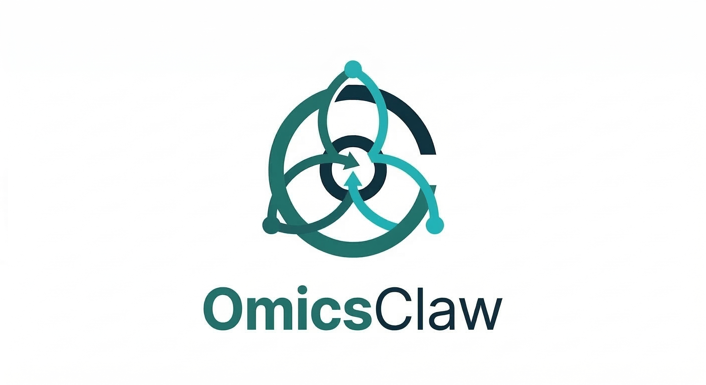
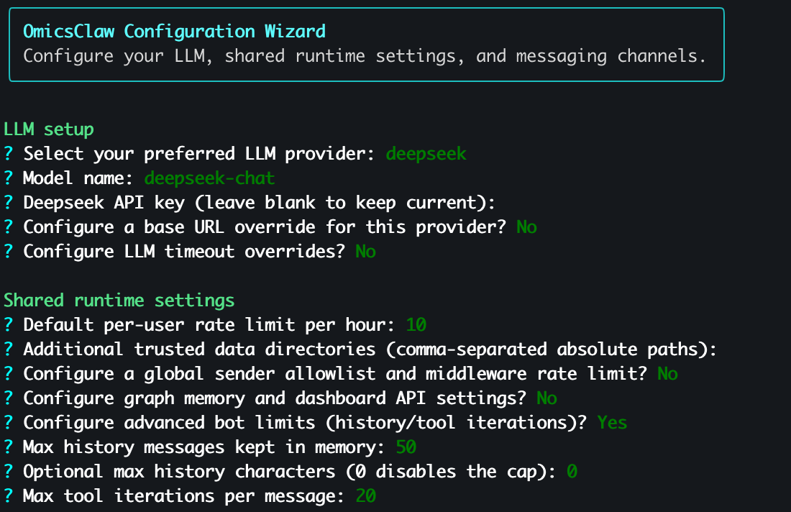

<a id="top"></a>

<div align="center">
  

  <h2>🧬 OmicsClaw</h2>
  <p><strong>Local-first AI research partner for multi-omics analysis</strong></p>
  <p>Chat with your workflows · run reproducible skills · keep data local · resume with memory</p>

  <p>
    <a href="README.md"><b>English</b></a> ·
    <a href="README_zh-CN.md"><b>简体中文</b></a> ·
    <a href="#-why-omicsclaw"><b>Why</b></a> ·
    <a href="#-quick-start"><b>Quick Start</b></a> ·
    <a href="#-capabilities"><b>Capabilities</b></a> ·
    <a href="#-domains"><b>Domains</b></a> ·
    <a href="https://TianGzlab.github.io/OmicsClaw/"><b>Docs Site</b></a>
  </p>
</div>

# OmicsClaw

[](https://www.python.org/downloads/)
[](https://opensource.org/licenses/Apache-2.0)
[](https://github.com/psf/black)
[](https://github.com/TianGzlab/OmicsClaw/actions)
[](https://TianGzlab.github.io/OmicsClaw/)

> [!NOTE]
> 🚀 **v0.1.1** ships the unified `oc` CLI, graph memory, app backend, remote execution, bot frontends, and **89 generated skills**.

OmicsClaw turns local multi-omics tools into AI-callable skills. The LLM plans and operates; Python/R/CLI tools process data in your local or remote runtime.

## 🖥️ App Workspace

<p align="center">
  
</p>

<p align="center">
  <b>One workspace for chat, datasets, skills, execution, memory, and analysis outputs.</b>
</p>

## 💡 Why OmicsClaw?

| Common pain | OmicsClaw answer |
|---|---|
| Analyses restart from zero | Persistent workspace, sessions, and graph memory |
| Python, R, and CLI tools are scattered | Unified skill runner plus natural-language routing |
| Large data lives on servers | Local UI with remote Linux execution over SSH |
| Reports, artifacts, and parameters drift | Standard skill output contracts and reproducible demos |

## ✨ Capabilities

| | | | |
|---|---|---|---|
| 🧠 **Memory**<br/>Sessions, preferences, lineage | 🔒 **Local-first**<br/>Raw data stays in your runtime | 🧰 **89 skills**<br/>Generated catalog + demos | 🧭 **Smart routing**<br/>Natural language to tools |
| 🖥️ **CLI / TUI**<br/>`oc interactive`, `oc tui` | 🌐 **App backend**<br/>FastAPI for desktop/web | 🔌 **MCP-ready**<br/>Attach external tools | 📡 **Remote mode**<br/>SSH tunnel to Linux servers |

> **Desktop backend health:** `oc app-server` includes an optional
> `launch_id` in `/health` when started with `OMICSCLAW_DESKTOP_LAUNCH_ID`.
> OmicsClaw Desktop uses this process handshake to avoid mistaking a stale
> backend already listening on port 8765 for the newly launched backend.
>
> **Desktop context compaction:** automatic and reactive chat compaction now
> rebuild the persisted transcript with a wrapped summary plus the retained
> tail, matching `/compact` semantics. The Desktop `context_compressed`
> notification therefore reflects durable backend state instead of a
> one-request prompt trim. If a compaction stage only trims prompt context and
> summarizes no older messages, the status payload uses trimmed-context wording
> instead of reporting `0` summarized messages.
>
> **Desktop chat usage cost:** app-server token usage events price the actual
> requested chat model, including per-request model overrides, before emitting
> `cost_usd`. Current DeepSeek v4 model aliases are covered so Desktop message
> footers and usage statistics can show per-turn cost when pricing is known.
>
> **GraphST + App timeout note:** for `spatial-domain-identification`, the
> backend now forwards chat/app epoch overrides to the actual `--epochs`
> skill flag, and GraphST resolves Slide-seq-style inputs to the upstream
> `datatype='Slide'` path instead of falling back to the default `10X`
> branch. Slide/Stereo graph setup now keeps GraphST's spatial adjacency and
> readout mask sparse, avoiding previous dense `n_obs x n_obs` allocations
> on high-resolution Slide-seqV2 files. Very large GraphST runs still spend
> time in preprocessing and clustering outside the requested GPU epoch loop,
> so `epochs=1` is a pipeline smoke test rather than an instant analysis.
>
> **Desktop workspace outputs:** when OmicsClaw-App syncs a workspace or sends
> a chat request with `workspace`, the app backend now uses
> `<workspace>/output` as `OMICSCLAW_OUTPUT_DIR`. Analysis runs, `/outputs/latest`,
> and dashboard figures therefore follow the selected Desktop project instead
> of the backend source checkout's `output/` directory.
>
> **Single-cell preflight confirmations:** when a Desktop-triggered single-cell
> skill stops for confirmation-only preflight guidance, the app backend now keeps
> that pending state for the chat session. An affirmative user reply replays the
> original skill call with an explicit confirmation flag, while a new request
> such as running QC first clears the pending action and is handled normally.
>
> **Desktop remote file tree + stale runs:** remote runtimes now expose
> `/files/tree` for the App's right-panel file tree, returning files and
> directories instead of the folder-picker-only `/files/browse` directory list.
> `/outputs/latest` treats output directories without `result.json` as live only
> while files are still changing; if an incomplete directory has no updates for
> 30 minutes, it is reported as `failed` so interrupted analyses leave the live
> task count automatically.
> Remote Desktop clients can also fetch trusted backend-host file bytes through
> `/files/serve`, which is constrained to the active workspace, trusted data
> directories, and output directory. Chat output hints preserve the actual
> nested artifact paths, such as `figures/*.png`, so desktop inline previews
> request files that exist under the generated run directory.
> Desktop chat streams also consume the same per-session `pending_media` queue
> used by messaging channels, translating queued analysis figures into
> `tool_result.media` blocks. Requests such as "show the spatial domain plot"
> therefore render images inline instead of only reporting that files are being
> delivered automatically.

## ⚡ Quick Start

```bash
git clone https://github.com/TianGzlab/OmicsClaw.git
cd OmicsClaw
bash 0_setup_env.sh
conda activate OmicsClaw
oc list
oc run spatial-preprocess --demo --output /tmp/omicsclaw_demo
```

Configure chat and runtime settings:

```bash
oc onboard
oc interactive
```

If `oc` is not on `PATH`, use `python omicsclaw.py <command>`.

<p align="center">
  
</p>

## 🧭 Interfaces

| Surface | Entry point | Use it for |
|---|---|---|
| 🧪 Skill runner | `oc run <skill> --demo` | Reproducible analysis |
| 💬 Interactive CLI | `oc interactive` | Natural-language workflows |
| 🖥️ Full-screen TUI | `oc tui` | Terminal workspace sessions |
| 🌐 App backend | `oc app-server` | Desktop/web frontends |
| 📡 Remote server | `oc app-server` over SSH | Server-side data and jobs |
| 🤖 Bots | `python -m bot.run --channels ...` | Telegram, Feishu, and more |
| 🔌 MCP | `oc mcp add ...` | External tool integration |

Remote mode uses `127.0.0.1`, SSH tunneling, and `OMICSCLAW_REMOTE_AUTH_TOKEN`. See [remote execution](docs/engineering/remote-execution.mdx) and the [legacy remote guide](docs/_legacy/remote-connection-guide.md).

## 📦 Installation

| Path | Best for | Command |
|---|---|---|
| 🥇 **Full conda** | Real analysis with Python + R + bioinformatics CLIs | `bash 0_setup_env.sh` |
| 🪶 **Lightweight venv** | Chat, routing, dev, Python-only skills | `pip install -e ".[interactive]"` |
| 🖥️ **Desktop/web backend** | OmicsClaw-App or browser frontends | `oc app-server --host 127.0.0.1 --port 8765` |
| 🧠 **Memory API** | Inspect graph memory over HTTP | `pip install -e ".[memory]"` then `oc memory-server` |

📖 Details: [installation guide](docs/_legacy/INSTALLATION.md), [quickstart](docs/introduction/quickstart.mdx).

**Dependency sources:** Python in [pyproject.toml](pyproject.toml), conda/R/CLIs in [environment.yml](environment.yml), GitHub-only R packages in [0_setup_env.sh](0_setup_env.sh). No root `requirements.txt` is used as the primary entrypoint.

## 🧬 Domains

`skills/catalog.json` is generated by `scripts/generate_catalog.py` and currently lists **89 skills**.

| Domain | Examples | Docs |
|---|---|---|
| 🧫 Spatial transcriptomics | QC, domains, annotation, deconvolution, CNV, trajectory | [spatial](docs/domains/spatial.mdx) |
| 🔬 Single-cell omics | QC, clustering, annotation, doublets, velocity, GRN | [singlecell](docs/domains/singlecell.mdx) |
| 🧬 Genomics | QC, alignment, variants, CNV, assembly, epigenomics | [genomics](docs/domains/genomics.mdx) |
| 🧪 Proteomics | DIA/DDA, PTM, networks, biomarkers | [proteomics](docs/domains/proteomics.mdx) |
| ⚗️ Metabolomics | Peaks, normalization, annotation, pathways | [metabolomics](docs/domains/metabolomics.mdx) |
| 📈 Bulk RNA-seq | DE, enrichment, co-expression, deconvolution, survival | [bulkrna](docs/domains/bulkrna.mdx) |
| 🧠 Orchestration | Routing, planning, literature support | [orchestrator](docs/domains/orchestrator.mdx) |

Run `oc list` for the current CLI catalog.

## ❓ FAQ

<details>
<summary><b>Does OmicsClaw upload my raw data?</b></summary>

No. Skills run in the configured local or remote runtime; LLM calls should receive context and tool results, not raw omics matrices.

</details>

<details>
<summary><b>Which installation path should I use?</b></summary>

Use `bash 0_setup_env.sh` for real analysis. Use the lightweight venv only for chat, routing, development, or Python-only skills.

</details>

<details>
<summary><b>Can the desktop App run jobs on a server?</b></summary>

Yes. Run `oc app-server` on the remote Linux host, keep it bound to `127.0.0.1`, and connect through the App's SSH tunnel runtime.

</details>

<details>
<summary><b>🛠️ Developer Notes</b></summary>

Before complex repository work, read [README.md](README.md), [AGENTS.md](AGENTS.md), [SPEC.md](SPEC.md), and the relevant code/docs.

```bash
python -m pytest -v
make test
python scripts/generate_catalog.py
```

Use a brief plan, targeted tests, and verification evidence for non-trivial repository changes. New skills should follow [CONTRIBUTING.md](CONTRIBUTING.md) and [templates/SKILL-TEMPLATE.md](templates/SKILL-TEMPLATE.md).

</details>

## ⚠️ Safety

| Rule | Meaning |
|---|---|
| 🔒 Local-first | Raw data processing happens in your local or remote runtime |
| 🧪 Research use only | Not a medical device; no clinical diagnosis |
| 👩‍🔬 Expert review | Validate scientific outputs before decisions |
| 🔐 Remote caution | Use localhost binding, SSH tunnels, and tokens |

See [data privacy](docs/safety/data-privacy.mdx) and [rules/disclaimer](docs/safety/rules-and-disclaimer.mdx).

## 👥 Community

Maintainers: Luyi Tian (Principal Investigator), Weige Zhou (Lead Developer), Liying Chen (Developer), and Pengfei Yin (Developer).

🐛 [Issues](https://github.com/TianGzlab/OmicsClaw/issues) · 💬 [Discussions](https://github.com/TianGzlab/OmicsClaw/discussions) · 📖 [Docs](https://TianGzlab.github.io/OmicsClaw/)

## 🙏 Acknowledgments

Inspired by [ClawBio](https://github.com/ClawBio/ClawBio) and [Nocturne Memory](https://github.com/Dataojitori/nocturne_memory).

## 📜 License

Apache-2.0. See [LICENSE](LICENSE).

## 📝 Citation

```bibtex
@software{omicsclaw2026,
  title = {OmicsClaw: A Memory-Enabled AI Agent for Multi-Omics Analysis},
  author = {Zhou, Weige and Chen, Liying and Yin, Pengfei and Tian, Luyi},
  year = {2026},
  url = {https://github.com/TianGzlab/OmicsClaw}
}
```

[⬆ Back to top](#top)
