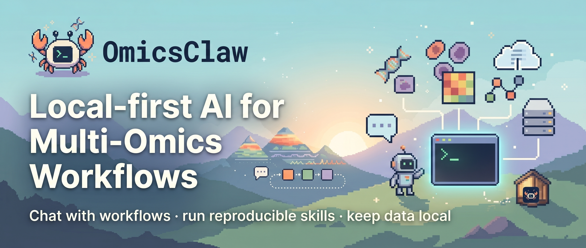
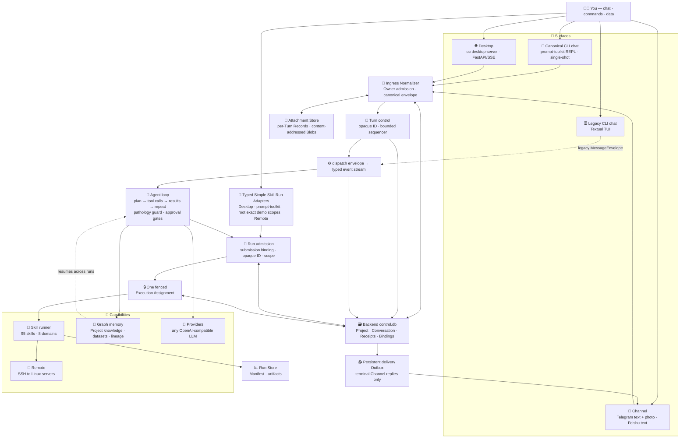

<a id="top"></a>

<div align="center">

<a href="https://github.com/TianGzlab/OmicsClaw">
  
</a>

<h3>Local-first AI research partner for multi-omics analysis</h3>

<p>Chat with your workflows · run reproducible skills · keep data local · resume with memory</p>

<p>
  <b>English</b> ·
  <a href="README_zh-CN.md"><b>简体中文</b></a> ·
  <a href="#-whats-new"><b>What's New</b></a> ·
  <a href="#-quick-start"><b>Quick Start</b></a> ·
  <a href="#-architecture"><b>Architecture</b></a> ·
  <a href="#-domains"><b>Domains</b></a> ·
  <a href="https://TianGzlab.github.io/OmicsClaw/"><b>Docs Site</b></a>
</p>

[](https://www.python.org/downloads/)
[](https://opensource.org/licenses/Apache-2.0)
[](https://github.com/psf/black)
[](https://github.com/TianGzlab/OmicsClaw/actions/workflows/pr-ci.yml)
[](https://TianGzlab.github.io/OmicsClaw/)
[](https://github.com/TianGzlab/OmicsClaw/releases/latest)
[](https://github.com/TianGzlab/OmicsClaw/releases)
[](https://github.com/TianGzlab/OmicsClaw/releases/latest)

</div>

> **OmicsClaw turns local multi-omics tools into AI-callable skills.** The LLM plans and operates; Python, R, and CLI tools process your data in a local or remote runtime — raw matrices never leave your machine. One agent loop powers the cut-over CLI and Desktop paths plus production-enabled Owner-only Telegram (text + one photo) and Feishu (text-only) Channels; the other Channel Adapters remain gated pending equivalent control-plane cutover.

## 📢 What's New

- **🤝 Consensus runtime** — multi-method consensus is now a declarative workflow runtime. Fan out N spatial-clustering or single-cell methods, then merge them with verified typed operators or an exploratory LLM synthesis. Triggered by the `consensus-domains` and `sc-consensus-clustering` skills.
- **🧠 Autonomous Analysis Path** — an Analysis Router can parameterize an exact skill from your data, or run a generated-code analysis with approval-gated workspace writes and bounded LLM repair.
- **⚡ Prompt-prefix caching** — automatic provider cache hits across turns to cut latency and token spend.
- **🖥️ Desktop upgrades** — a live to-do task list with planning guidance, an interactive `ask_user` choice tool, and LLM-generated session titles.

<details>
<summary><b>Earlier highlights</b></summary>

- **Providers** — live Ollama model discovery with tool-capability tagging, plus `qwen3.7-max` on DashScope.
- **Surfaces umbrella** — CLI, Desktop, and Channels unified behind one dispatch + typed event stream.
- **Loop health** — ping-pong / repeated-failure pathology detection with soft self-correction.

</details>

## 🖥️ App Workspace

<p align="center">
  
</p>

<p align="center">
  <b>One workspace for chat, datasets, skills, execution, memory, and analysis outputs.</b>
</p>

<p align="center">
  <a href="https://github.com/TianGzlab/OmicsClaw/releases/latest"><b>📥 Download the OmicsClaw Desktop App</b></a>
  &nbsp;·&nbsp;
  <a href="https://github.com/TianGzlab/OmicsClaw/releases"><b>All releases</b></a>
  &nbsp;·&nbsp;
  <a href="https://github.com/TianGzlab/OmicsClaw/releases/latest/download/SHA256SUMS.txt"><b>SHA256SUMS</b></a>
</p>

The **[Releases](https://github.com/TianGzlab/OmicsClaw/releases)** tab hosts the prebuilt desktop installers — the same `oc desktop-server` the CLI ships, wrapped in a chat-ready Electron UI. Pick the asset for your platform:

| Platform | Installer |
|---|---|
| <picture><source media="(prefers-color-scheme: dark)" srcset="https://api.iconify.design/simple-icons:apple.svg?color=%23ffffff"></picture> **macOS — Apple Silicon** (M1 / M2 / M3 / M4) | [`OmicsClaw-<ver>-arm64.dmg`](https://github.com/TianGzlab/OmicsClaw/releases/latest) |
| <picture><source media="(prefers-color-scheme: dark)" srcset="https://api.iconify.design/simple-icons:apple.svg?color=%23ffffff"></picture> **macOS — Intel** | [`OmicsClaw-<ver>-x64.dmg`](https://github.com/TianGzlab/OmicsClaw/releases/latest) |
| <picture><source media="(prefers-color-scheme: dark)" srcset="https://api.iconify.design/simple-icons:windows.svg?color=%23ffffff"></picture> **Windows — x64 / ARM64** | [`OmicsClaw.Setup.<ver>-x64.exe`](https://github.com/TianGzlab/OmicsClaw/releases/latest) · [`OmicsClaw.Setup.<ver>-arm64.exe`](https://github.com/TianGzlab/OmicsClaw/releases/latest) |
| <picture><source media="(prefers-color-scheme: dark)" srcset="https://api.iconify.design/simple-icons:linux.svg?color=%23ffffff"></picture> **Linux — x64** | [`.AppImage`](https://github.com/TianGzlab/OmicsClaw/releases/latest) · [`.deb`](https://github.com/TianGzlab/OmicsClaw/releases/latest) · [`.rpm`](https://github.com/TianGzlab/OmicsClaw/releases/latest) |
| <picture><source media="(prefers-color-scheme: dark)" srcset="https://api.iconify.design/simple-icons:linux.svg?color=%23ffffff"></picture> **Linux — ARM64** | [`.AppImage`](https://github.com/TianGzlab/OmicsClaw/releases/latest) |

> Verify each download against `SHA256SUMS.txt` published alongside the installers. The desktop client and the CLI talk to the same backend — analyses, memory, and remote runtimes stay portable across both.

## 💡 Why OmicsClaw?

| Common pain | OmicsClaw answer |
|---|---|
| Analyses restart from zero | Persistent workspace, sessions, and graph memory |
| Python, R, and CLI tools are scattered | Unified skill runner plus natural-language routing |
| Large data lives on servers | Local UI with remote Linux execution over SSH |
| Reports, artifacts, and parameters drift | Standard skill output contracts and reproducible demos |

## ✨ Capabilities

| | | | |
|---|---|---|---|
| 🧠 **Memory**<br/>Sessions, preferences, lineage | 🔒 **Local-first**<br/>Raw data stays in your runtime | 🧰 **95 skills**<br/>Generated catalog + demos | 🧭 **Smart routing**<br/>Natural language to tools |
| 💬 **CLI Surface**<br/>`oc interactive`, `oc tui` | 🌐 **Desktop Surface**<br/>FastAPI for desktop/web | 📨 **Channel Surface**<br/>Telegram text + photo, Feishu text; others gated | 📡 **Remote mode**<br/>SSH tunnel to Linux servers |
| 🤝 **Consensus**<br/>Multi-method merge | 🤖 **Autonomous path**<br/>Router + assisted params | 🔌 **Any LLM**<br/>OpenAI-compatible providers | 📊 **Reproducible**<br/>Figures + data + report |

<details>
<summary><b>Autonomous Analysis Path — how routing works</b></summary>

OmicsClaw prefers a matching built-in skill, but ships a first-class autonomous path for everything else. Routing is **always on and assistive** — there is no mode switch:

- **Exact skill match** gets **data-grounded assisted parameterization**: the skill choice stays deterministic while the outer LLM recommends the method and parameters *within* it — grounded in the matched `SKILL.md` method menu and an `inspect_data` schema — asking a focused question only on consequential ambiguity.
- **Partial / No skill match** is delegated to the autonomous code path.

Generated-code analysis runs in the single autonomous engine — the **Autonomous Code Mini-Agent** (`omicsclaw/autonomous/`): a bounded, tiered-isolation Jupyter-kernel agent that drives vetted skills through a curated `oc` handle and gates acceptance on a replay rerun.

Design note: [ADR 0032](docs/adr/0032-autonomous-code-mini-agent.md) defines this fallback's architecture — a bounded autonomous code mini-agent with curated skill handles, a persistent Jupyter kernel under **tiered isolation** (bubblewrap OS envelope when available, in-kernel guard otherwise), and replay validation. As of the 2026-06-22 single-engine consolidation it is the **only** autonomous engine — always on, no flag, no legacy one-shot runner. The earlier `off`/`assist`/`auto` router-mode selector (`OMICSCLAW_ANALYSIS_ROUTER_MODE`) was removed in the same consolidation.

</details>

## 🏗️ Architecture

Three Surfaces, **one agent loop**. Conversational input from the prompt-toolkit REPL and single-shot CLI, Desktop text/multipart-image paths, Owner-only Telegram text/single-photo ingress, and Owner-only Feishu text-only ingress enters that loop through the production `ControlRuntime`: `RawInboundV1` is durably normalized into an opaque Conversation/Turn, serialized by a bounded whole-Turn FIFO, executed through an internal Agent Worker Adapter, and terminalized against `control.db` plus independent canonical `transcripts.db` and `attachments.db` stores. Terminal publication follows `Transcript candidate -> Receipt + immutable Transcript ref -> candidate promotion -> Event`; a bounded process-local Event Hub lets observers detach or reconnect without owning or canceling the Turn. Desktop's compatibility `/chat/stream` remains text-only, while `POST /v1/turns` accepts one strict multipart request document plus 1–8 JPEG/PNG/GIF/WebP parts, requires a full declared SHA-256 and `Idempotency-Key`, and returns after durable acceptance (`202` novel, `200` matching duplicate). Raw request bytes are counted before multipart spooling; strict UTF-8, bounded JSON depth, a 60-second read deadline, complete-boundary proof and two pessimistic in-flight slots bound malformed/slow transports. Duplicate/conflict lookup precedes any `UploadFile` source read or Attachment Store write, while post-accept live-port or runner-wake failure becomes one canonical failed Receipt rather than a stranded queued Turn. The new Adapter never calls legacy `.uploads`, `received_files`, path or Base64 helpers. Telegram derives a stable `chat_id:message_id` ingress key, admits only configured Owner identities, accepts text or one ordinary photo with optional caption, and sends terminal text only through the persistent Delivery Outbox. Feishu admits configured Owner text, requires proof of a configured Bot mention in groups, and uses the same persistent text Delivery path. Desktop File References, legacy JSON `files`, non-image uploads, requested execution options and App UI adoption; Telegram albums/documents/audio/video; Feishu attachments/rich post/cards; outbound media; Textual TUI; and all remaining Channel Adapters remain fail-closed or explicit later cutovers.

The prompt-toolkit REPL's exact `/run <canonical-skill> --demo` command and the root exact-demo command family are separate typed non-chat Run Adapters. Root accepts only `oc run <canonical-skill> --demo`, the fixed-order `--demo --project <32-lowercase-hex-id>` form, or `--demo --no-project`. Each explicit command creates one fresh 32-hex Submission ID, freezes Backend-resolved static resources, submits through the same `RunRuntime` as Desktop, and waits through a bounded pure terminal-result Interface without opening `control.db`, the Run Manifest or Run Store internals in the CLI. The REPL Adapter uses explicit `UnassignedScope`. For root, only the omitted selector reads the legacy current-Project pointer as a bounded, side-effect-free navigation hint; explicit Project freezes `ProjectScope` and lets novel Runtime admission require that Project to exist and remain active without downgrade, while explicit `--no-project` freezes `UnassignedScope` without reading the pointer. Every root request containing `--demo` belongs to this canonical boundary: aliases fail Registry admission, and every non-exact, conflicting, duplicate, reordered, abbreviated, attached-value or command-shifted form fails closed without reaching the legacy runner. Run closes before Control; an unconfirmed execution owner keeps Control held and cannot be projected as success or an ordinary clean interrupt. The Desktop-hosted Remote compatibility `POST /jobs` supplies another canonical Simple Skill Adapter with explicit Unassigned Scope and HTTP idempotency. Root non-demo and unsupported option-bearing forms, Control-backed root Project lifecycle/navigation commands, Textual TUI, `/interpret`, non-demo and option-bearing prompt-toolkit forms, arbitrary Remote datasets/parameters, Remote Project Scope and distributed Workers remain outside these slices.

The accepted control-plane target first normalizes every conversational input, with provider authenticity checked by the Adapter but Owner admission and Workspace policy owned by the Backend, then durably maps retryable submissions to one canonical Turn, gives each accepted Turn an opaque ID plus a minimal non-replayable receipt, and serializes whole Turns through a bounded FIFO per Conversation; different Conversations remain concurrent. Authoritative Control Plane State alone establishes Project, Conversation, active-binding, Turn/Run-receipt, ingress-idempotency, Run-submission-binding, Execution-Assignment, Projection-Intent and Outbound-Delivery facts and is physically persisted by one Backend-exclusive local SQLite `control.db` under a lifetime single-process lock. Project Memory, Transcript, Desktop App data and `project_meta.json` remain separate knowledge, content, UI-cache and output stores. The specialized Attachment Store retains each enabled upload as an immutable per-Turn Record backed by a content-addressed Blob; duplicate detection precedes staging, and Envelopes/Transcripts carry structured Attachment References rather than paths, Base64 or provider handles. A Project is `active` or reversibly `archived`; archive retains its identity, Conversations and scientific content but rejects novel Turns, Runs and scientific Memory mutation until restore, while a previously frozen digest-bound Projection Intent may finish already accepted work. Workspace owns observations of pre-existing local datasets, uploads retain Attachment identity, and Projects cite either through Dataset References rather than transport-derived Memory partitions. Permanent cross-store purge is outside v1. Every top-level Run action carries a caller-generated opaque Run Submission ID whose durable Binding returns the same control-generated Run ID on transport retry. Novel admission freezes either a validated `ProjectScope(project_id)` or `UnassignedScope` and persists a minimal non-replayable Run Receipt before granting that Run at most one Assignment-ID-fenced executor start. Run storage separately owns its scientific Manifest and artifacts; directory names, remote Job IDs and PIDs are not Run identity. v1 has no renewable Execution Lease, heartbeat reassignment or automatic replay; process-local Resource Leases account only for capacity. The compatibility `output/default/` grouping is not a Project, and completed Runs cannot be moved or retagged into another scope. Scheme 1 includes the canonical Transcript Store, terminal candidate/ref/promotion ordering, bounded live Event Hub, prompt-toolkit CLI and Desktop text cutover, and the profile-driven `plan/apply/verify` legacy Transcript importer. Scheme 2 adds durable text Delivery and Telegram cutover. Scheme 3 adds the independent Attachment Store, opaque Control binding and atomic per-Turn commitments, publish-before-control recovery, structured Transcript References, per-call-bounded ephemeral image rendering and Owner-only Telegram single-photo input. Scheme 4 adds the strict Desktop multipart image Adapter and the non-blocking durable `ControlRuntime.submit()` Interface without reviving legacy upload state. The subsequent Desktop observation closure adds one transactionally consistent Receipt/Conversation-Project/Transcript-ref read, a verified ControlRuntime snapshot Interface, one-based timestamped EventFrameV1, snapshot-first typed SSE, atomic replay/gap-to-live observation and one versioned idempotent cancel result across versioned and compatibility routes. Textual TUI, CLI attachments, Desktop/CLI File References, Desktop JSON submission/options/project commands and OmicsClaw-App adoption, Interaction resolution, strict retained-Event byte accounting, Telegram albums/documents/audio/video and outbound media, other Channel adapters, tool/Run attachment consumption, the Channel/Desktop resend-and-repair UI over the implemented resend/retry operations, attachment migration/purge, Surface-wide Run Dispatcher convergence, Memory projector, CLI `sessions.db`, Desktop App export and the broader Run migration inventory remain incomplete. Desktop `POST /v1/runs`, exact prompt-toolkit `/run <canonical-skill> --demo`, exact root `oc run <canonical-skill> --demo`, and Remote compatibility exact-demo `POST /jobs` are the first four Run Dispatcher submission Adapters; these slices are not a claim that ADR 0042–0070 are fully implemented.

The Desktop observation boundary is hardened as part of that closure: it registers the live Event seam before reading the durable snapshot, binds Hub authority to the Turn producer event loop, bounds observers and their queues per Turn, wakes blocked readers on close, and releases the observer on every ASGI exit. V1 Event JSON normalizes non-finite built-in floats, redacts credential-shaped keys, and never invokes arbitrary object stringification. Retained Event bytes remain an explicit unfinished quota. The Desktop server now also refuses empty, wildcard, external-address, or non-loopback hostname binds unless `OMICSCLAW_REMOTE_AUTH_TOKEN` is configured; token-free startup is limited to loopback.

Terminal Channel text delivery is independent from Turn execution. The Turn's terminal transaction creates one persistent Outbound Delivery whose ordered text Items reference canonical Transcript content and receive a monotonic sequence at the immutable Reply Target. The in-process Delivery Pump runs at most one provider call per target while different targets remain concurrent; a failed/unknown prefix suppresses its unattempted suffix before the next target sequence proceeds. Inbound redelivery and provider failure never rerun the Turn, while Desktop/CLI remain observation Surfaces rather than Outbox consumers. An over-long reply now collapses to one bounded fallback Item instead of failing terminalization, and an Owner can inspect Deliveries, expedite a safe `retry_delivery`, or `resend_delivery` a new `purpose=resend` copy of the frozen reply that reruns no Turn or tool. Outbound media Items (and attaching the full over-long reply as a durable artifact) plus the remaining Channel Adapters remain future slices.

Run dispatch and compute admission are likewise separate. Desktop `POST /v1/runs`, exact prompt-toolkit `/run <canonical-skill> --demo`, the three root exact-demo Scope wires, and Remote exact-demo `POST /jobs` enter one canonical Simple Skill Runtime backed by a bounded process-local strict-FIFO Run Dispatcher, obtain first-unit capacity before the sole Execution Assignment, and execute through the shared Skill runner. Remote detail/list/SSE/artifact are bounded pure observations: SSE is snapshot-first and Receipt-revision based, disconnect only releases observation, cancel delegates to `RunRuntime`, canonical retry cannot clone a payload, and canonical artifact download verifies Receipt, Assignment, completed Manifest and full inventory before streaming from the same verified file descriptor. Historical active scientific Jobs close as `interrupted/legacy_execution_unrecoverable` at startup and are never replayed. One shared strict-FIFO Execution Resource Scheduler accounts process slots, CPU, memory, GPU, threads and temporary disk for that Runtime and Candidate plans. The Assignment atomically persists a write-once Linux user-systemd scope reference before launch; a parent-death-bound launcher and bubblewrap PID/cgroup namespace keep descendants inside that owner, and recovery accepts stop only after the unit is absent or its cgroup reports `populated=0`. Unsupported hosts reject novel canonical Runs; unconfirmed ownership or completion evidence preserves the nonterminal Receipt and quarantines global scientific admission while duplicate and observation Interfaces remain available. Root Ctrl-C explicitly requests canonical cancel, observes terminal closure, then closes Run before Control; it reports only verified paths or closed codes. The accepted target requires every other top-level Run and scientific executor path to converge on the same Interfaces; Workflow, Autonomous, root non-demo and unsupported option-bearing forms, Textual TUI, other prompt-toolkit Run forms, Agent/Bench, broader Remote inputs/scopes, and dynamic governed-envelope paths have not done so. Neither Dispatcher nor Scheduler persists executable work or authorizes restart replay; a Resource Lease is capacity accounting, not Run ownership.

The Desktop Backend now has one immutable **Active Workspace** per lifespan. Its composition root resolves one existing absolute path before starting `ControlRuntime` and `RunRuntime`, and every Remote compatibility Adapter that requires Workspace state—including Jobs, Artifacts, Datasets and Env—consumes only that frozen binding rather than re-reading mutable environment state. Bearer-policy-gated `GET /workspace` reports the active root; `PUT` authenticates before reading a bounded strict JSON body, same-root confirmation is idempotent, and every different absolute root returns `409 workspace_change_requires_backend_restart` without changing environment variables, trusted directories, output roots, persistent configuration or either Runtime. Legacy Remote Chat Job submission/binding is retired; historical active Chat rows are read-only interrupted projections rather than executable work. Session resume is retained only as a fixed `resumed=false / legacy_session_resume_retired` response and cannot inspect Job JSON, discover Runs or touch execution. Remote Linux compatibility-state mutation uses held no-follow directory handles through commit and fails closed when those primitives are unavailable; imported Dataset source paths may deliberately live outside the Workspace, so the binding is not filesystem confinement. Operators must configure `OMICSCLAW_WORKSPACE` before an explicit restart to select another root; automatic restart and OmicsClaw-App restart UX are separate work.

Run integrity evidence is now durable rather than log-only. Migration 9 adds an append-only, content-free ledger for Assignment fence violations, conflicting terminal reports, Manifest/Receipt drift, unconfirmed execution owners and failed recovery terminal commits. The same fact is idempotently deduplicated by a versioned digest built only from closed lifecycle fields; raw exceptions, paths, parameters, logs, credentials, Manifest content and Execution References never enter the row or digest. `GET /v1/run-integrity-incidents` is bounded pure observation, remains available during recovery quarantine, and cannot inspect Run Store content, enqueue, lease, assign, replay or repair work. Startup audits already-terminal assigned tracer Runs without changing either Receipt or Manifest.

ADR 0072 is implemented as a two-repository **local candidate**, not yet a release verdict. Backend Migration 12 gives each `control.db` one immutable 64-lowercase-hex `control_authority_id`; AutoAgent recovery may re-attest a changed process epoch only against that exact Control database, while legacy bindings without the ID are quarantined content-free. OmicsClaw-App reserves each novel Session and private creation receipt together with an untouched pending-cancel guard in one SQLite transaction; the `/start` deadline covers response headers for 10 seconds and the guard becomes due at 12 seconds, so duplicate reservation, explicit Stop, unknown outcome, reconciler claim, or App death cannot erase cancellation authority. Only exact matching SSE/status terminal envelopes close a binding; `/results`, EOF, malformed/oversized input and HTTP/transport failure never do. A receipt-confirmed SSE is only a detachable observer: disconnect or iterator cancellation releases observation, while explicit abort Interfaces alone own lifecycle cancellation. Backend bounds raw start input, worker IPC and SSE, runs production AutoAgent only under a Linux user-systemd plus bubblewrap owner, proves the exact tree stopped and persists owner-stop evidence before committing terminal state, and never persists or replays executable payloads. If the stopped owner's SQLite terminal commit fails, that same process-local worker retains one bounded terminal intent and retries on a wakeable 0.25–5 second backoff while novel admission remains quarantined; only a durable terminal commit or shutdown reconciliation releases that responsibility. Backend owns Control identity, lifecycle, provider resolution, execution, result/promotion/save and scientific policy; OmicsClaw-App owns only non-secret routing, private receipt retention, retry scheduling, thin proxies and UI projection. Post-repair local gates pass across Backend AutoAgent/Desktop/Control/contracts and the complete App unit, TypeScript, Electron, and Next production-build surfaces; the mandatory independent review remains pending. macOS/Windows governed-owner smoke, calibrated resource quotas, same-UID isolation and the wider Skill-audit-system gaps are not claimed closed.



Beyond the single chat turn, two independent subsystems run longer jobs: a **multi-agent research pipeline** (`omicsclaw/agents/`, intake → plan → research → execute → analyze → write → review) and an **AutoAgent** experiment/optimization loop. Full breakdown in [`docs/architecture/`](docs/architecture/).

## ⚡ Quick Start

```bash
git clone https://github.com/TianGzlab/OmicsClaw.git
cd OmicsClaw
bash 0_setup_env.sh
conda activate OmicsClaw
oc list
oc run spatial-preprocess --demo
```

Configure chat and runtime settings:

```bash
oc onboard
oc interactive
```

If `oc` is not on `PATH`, use `python omicsclaw.py <command>`.

<p align="center">
  
</p>

## 🧭 Interfaces

Pick the entry point that fits your workflow — they all reach the same backend.

| Surface | Entry point | Use it for |
|---|---|---|
| 💬 **CLI Surface** | `oc interactive` / `oc tui` | Natural-language workflows in the terminal (REPL + full-screen TUI) |
| 🌐 **Desktop Surface** | `oc desktop-server` | FastAPI backend; authoritative text plus bounded `/v1/turns` multipart image ingress |
| 📨 **Channel Surface** | `python -m omicsclaw.surfaces.channels --channels telegram`<br/>`python -m omicsclaw.surfaces.channels --channels feishu` | Owner-only Telegram text + one photo/caption and Feishu text-only; other media and adapters fail closed |
| 🧪 Skill runner (non-Surface) | `oc run <skill> --demo` | Reproducible one-shot analysis |
| 🔌 MCP (non-Surface) | `oc mcp add ...` | External tool integration |
| 📡 Remote mode | `oc desktop-server` over SSH | Server-side data and jobs |

Remote mode uses `127.0.0.1`, SSH tunneling, and `OMICSCLAW_REMOTE_AUTH_TOKEN`. See [remote execution](docs/engineering/remote-execution.mdx) and the [legacy remote guide](docs/_legacy/remote-connection-guide.md).

The production Channel scope is the shared runner and `ControlRuntime`:
Owner-only Telegram text plus one ordinary photo, and Owner-only Feishu
text-only. Install both authoritative SDKs with `pip install -e ".[channels]"`.
For Feishu, `FEISHU_ALLOWED_SENDERS` and `FEISHU_BOT_OPEN_ID` are mandatory;
the latter is the identity used to prove a group message mentioned this Bot.
The other Channel Adapters remain gated. Outbound media remains incomplete and
fail-closed; this milestone is not full ADR or media completion.

## 📦 Installation

| Path | Best for | Command |
|---|---|---|
| 🥇 **Full conda** | Real analysis with Python + R + bioinformatics CLIs | `bash 0_setup_env.sh` |
| 🪶 **Lightweight venv** | Chat, routing, dev, Python-only skills | `pip install -e ".[interactive]"` |
| 📨 **Telegram + Feishu Channels** | Production Owner-only Channel inputs | `pip install -e ".[channels]"` |
| 🖥️ **Desktop/web backend** | OmicsClaw-App or browser frontends | `oc desktop-server --host 127.0.0.1 --port 8765` |
| 🧠 **Memory API** | Inspect graph memory over HTTP | `pip install -e ".[memory]"` then `oc memory-server` |

📖 Details: [installation guide](docs/_legacy/INSTALLATION.md), [quickstart](docs/introduction/quickstart.mdx). Dependencies live in [`pyproject.toml`](pyproject.toml), [`environment.yml`](environment.yml), and [`0_setup_env.sh`](0_setup_env.sh).

## 🧬 Domains

`oc list` and `skills/catalog.json` currently agree on **95 registered skills** across **8 domains**.

| Domain | Skills | Examples | Docs |
|---|---|---|---|
| 🧫 Spatial transcriptomics | 19 | QC, domains, annotation, deconvolution, CNV, trajectory | [spatial](docs/domains/spatial.mdx) |
| 🔬 Single-cell omics | 34 | QC, clustering, annotation, doublets, velocity, GRN | [singlecell](docs/domains/singlecell.mdx) |
| 🧬 Genomics | 10 | QC, alignment, variants, CNV, assembly, epigenomics | [genomics](docs/domains/genomics.mdx) |
| 🧪 Proteomics | 8 | DIA/DDA, PTM, networks, biomarkers | [proteomics](docs/domains/proteomics.mdx) |
| ⚗️ Metabolomics | 8 | Peaks, normalization, annotation, pathways | [metabolomics](docs/domains/metabolomics.mdx) |
| 📈 Bulk RNA-seq | 13 | DE, enrichment, co-expression, deconvolution, survival | [bulkrna](docs/domains/bulkrna.mdx) |
| 🧠 Orchestration | 2 | Routing, planning, literature support | [orchestrator](docs/domains/orchestrator.mdx) |
| 📚 Literature | 1 | PDF/DOI/PubMed/GEO parsing and dataset handoff | — |

Run `oc list` for the current CLI catalog.

## 🧠 Memory

Graph-backed memory at `omicsclaw/memory/` carries your sessions, datasets, analyses, preferences, and insights across runs — chat history and lineage come back when you reopen any surface. Each surface stays isolated so state never leaks across users or workspaces.

| Surface | Memory scope |
|---|---|
| CLI / TUI | Per workspace path |
| Desktop app | Per launch (or per signed-in user) |
| Telegram / Feishu bot | Per platform user |

A reserved `__shared__` pool (core agent identity, knowledge handbook guards, glossary) is the one thing every surface reads back automatically. Full vocabulary and architecture in [`docs/CONTEXT.md`](docs/CONTEXT.md).

## 📚 Documentation

| Topic | Where |
|---|---|
| 🚀 Quickstart & onboarding | [introduction/quickstart](docs/introduction/quickstart.mdx) |
| 🏗️ Architecture | [`docs/architecture/`](docs/architecture/) |
| 🧬 Domain guides | [spatial](docs/domains/spatial.mdx) · [singlecell](docs/domains/singlecell.mdx) · [genomics](docs/domains/genomics.mdx) · [proteomics](docs/domains/proteomics.mdx) · [metabolomics](docs/domains/metabolomics.mdx) · [bulkrna](docs/domains/bulkrna.mdx) |
| 🧠 Domain language & memory | [`docs/CONTEXT.md`](docs/CONTEXT.md) |
| 📡 Remote execution | [engineering/remote-execution](docs/engineering/remote-execution.mdx) |
| 🔒 Safety & data privacy | [data privacy](docs/safety/data-privacy.mdx) · [rules & disclaimer](docs/safety/rules-and-disclaimer.mdx) |
| 🛠️ Building skills | [CONTRIBUTING.md](CONTRIBUTING.md) · [`templates/skill/`](templates/skill/) |
| 🤖 Repo / agent contracts | [AGENTS.md](AGENTS.md) |

Hosted docs site: **<https://TianGzlab.github.io/OmicsClaw/>**

## ❓ FAQ

<details>
<summary><b>Does OmicsClaw upload my raw data?</b></summary>

No. Skills run in the configured local or remote runtime; LLM calls should receive context and tool results, not raw omics matrices.

</details>

<details>
<summary><b>Which installation path should I use?</b></summary>

Use `bash 0_setup_env.sh` for real analysis. Use the lightweight venv only for chat, routing, development, or Python-only skills.

</details>

<details>
<summary><b>Can the desktop App run jobs on a server?</b></summary>

Yes. Run `oc desktop-server` on the remote Linux host, keep it bound to `127.0.0.1`, and connect through the App's SSH tunnel runtime.

</details>

## ⚠️ Safety

| Rule | Meaning |
|---|---|
| 🔒 Local-first | Raw data processing happens in your local or remote runtime |
| 🧪 Research use only | Not a medical device; no clinical diagnosis |
| 👩‍🔬 Expert review | Validate scientific outputs before decisions |
| 🔐 Remote caution | Use localhost binding, SSH tunnels, and tokens |

> OmicsClaw is a research and educational tool for multi-omics analysis. It is not a medical device and does not provide clinical diagnoses. Consult a domain expert before making decisions based on these results.

See [data privacy](docs/safety/data-privacy.mdx) and [rules/disclaimer](docs/safety/rules-and-disclaimer.mdx).

## 👥 Community

Maintainers: Luyi Tian (Principal Investigator), Weige Zhou (Lead Developer), Liying Chen (Developer), and Pengfei Yin (Developer).

🐛 [Issues](https://github.com/TianGzlab/OmicsClaw/issues) · 💬 [Discussions](https://github.com/TianGzlab/OmicsClaw/discussions) · 📖 [Docs](https://TianGzlab.github.io/OmicsClaw/)

<table>
  <tr>
    <td align="center" width="30%">
      
      <br/>
      <b>WeChat group</b>
      <br/>
      <sub>Scan to join</sub>
    </td>
    <td valign="middle" width="70%">
      Scan to join our WeChat group to share analysis tips, report issues, and discuss multi-omics AI workflows.
    </td>
  </tr>
</table>

<a href="https://github.com/TianGzlab/OmicsClaw/graphs/contributors">
  
</a>

## 🙏 Acknowledgments

Architecture, skill design, and local-first philosophy are inspired by **[ClawBio](https://github.com/ClawBio/ClawBio)**, an early bioinformatics-native AI agent skill library. Memory and session-continuity patterns are inspired by [Nocturne Memory](https://github.com/Dataojitori/nocturne_memory).

## 🛠️ Contributing

- **New skills**: see [CONTRIBUTING.md](CONTRIBUTING.md) and the v2 scaffold under [`templates/skill/`](templates/skill/).
- **Repository / agent work**: see [AGENTS.md](AGENTS.md) — covers contract tests, provider contracts, skill runner, and architecture references.

## 📜 License

Apache-2.0. See [LICENSE](LICENSE).

## 📝 Citation

```bibtex
@software{omicsclaw2026,
  title = {OmicsClaw: A Memory-Enabled AI Agent for Multi-Omics Analysis},
  author = {Zhou, Weige and Chen, Liying and Yin, Pengfei and Tian, Luyi},
  year = {2026},
  url = {https://github.com/TianGzlab/OmicsClaw}
}
```

[⬆ Back to top](#top)

## 项目进展（Dream 自动维护）
<!-- DREAM:START -->
### 当前状态
- OmicsClaw 的 autonomous analysis 已收敛为**单一引擎**（Autonomous Code Mini-Agent）
- ADR 0032 (Autonomous Code Mini-Agent) 于 2026-06-21 接受，2026-06-22 完成单引擎合并（移除 flag 与 legacy 一次性 runner）
- 现实现（`omicsclaw/autonomous/`）**永远开、无 flag**：有 bwrap 走 OS envelope、无 bwrap 走进程内 guard 的分层隔离；mini-agent 全套 + autonomous workspace + bot 路由共 78 passed
- 分析输出已**按研究课题（project）分组**（ADR 0035）：从平铺 `output/<skill>__ts__uuid8/` 改为 `output/<project>/<skill>__ts__<dataset>-<uid8>/`，每课题一个 `project_meta.json` + 可重建 `index.jsonl`；四 surface 收敛到单一 resolver `omicsclaw/common/run_paths.py`
- Skill 审计系统已有稳定的 v2 表示底座；按 [M0–M3 验收基线](docs/reviews/2026-07-13-skill-audit-system-design-assessment.md)，现已落地受控表示、trace-provable acquisition 子集、8 域 routing oracle、95-node/74-edge compatibility graph、统一执行门、bounded content precondition、资源感知 topo executor、共享 runner 动态契约，以及 earned validation/lifecycle/Gotcha 治理纵切。EVO-G2 Round 18 独立复审（session `019f7112-e7dc-7531-96b7-b7d879158e44`）以 0 Blocker/0 High/0 Medium/0 Low 判定 `SHIP`，确认 Round 17 的 post-replace checkpoint outcome Medium 与 Round 16b 两个 Medium 均已闭合：state writer 在 atomic write 报错后只用 bounded/no-follow/single-link stable read 收敛 exact requested bytes 为成功，任何不同、缺失、alias 或不稳定状态继续 fail closed；正反 post-replace 回归分别证明 exact clean 可重开、different state 必须持久化 latch。promotion 仍在初始、首次 install 前、install 后、cleanup 后及 journal recovery/applied retry 重验全部非目标 tracked bytes/HEAD/index，目标由 journal/CAS 单独认证，accepted ref 必须与 clean checkpoint 一致。当前核心集合为 187 passed，同一 24 文件扩大范围为 978 passed/1 skipped，外部复审另跑 157/157 scoped tests。因此关闭的是 EVO-G2 窄 Backend workspace-authority 里程碑；四阶段总体仍为 M0 verified scope、M1/M2/M3 partial。该保证只覆盖 tracked Git program 与 cooperative、非 power-loss-atomic checkpoint，不覆盖 source untracked/open-world runtime bytes、同 UID 瞬时改写、OS sandbox 或 `dirfd/openat` 原子事务；完整系统仍缺任意 Python/复杂 lineage 获取泛化、AnnData 字段/值/科学内容验证、资源/security 全库证据校准、更多格式探针、参数修订策略、独立 OmicsClaw-App Gotcha 薄 UI 与全域科学净效用评测

### 最近进展（近7天）
- 2026-07-20: 完成 ADR 0060 文本交付可靠性计划的 **Task 6 packaging/docs/focused verification**：`pyproject.toml` 新增可直接安装的 `.[channels]`，固定 `python-telegram-bot>=21.0` 与 `lark-oapi>=1.3.0`；英文 README、中文 README、AGENTS、Channel README、CONTEXT、ARCHITECTURE 与 ADR 统一生产范围为 shared runner/`ControlRuntime` 下的 Owner-only Telegram 文本 + 单张普通图片，以及 Owner-only 飞书纯文本。权威飞书 Adapter 现在必须同时配置 `FEISHU_ALLOWED_SENDERS` 与 `FEISHU_BOT_OPEN_ID`，缺失或空白 Bot ID 会在 listener/provider 工作前阻断启动；配置完成后的 p2p 与精确群聊 Bot mention 语义不变。其他 Channel Adapter 继续 gated，所有出站媒体继续 incomplete/fail-closed，本里程碑不代表 ADR 或媒体能力全量完成。文档/包装合同按 TDD 从既有基线 **14 passed**，经预期 RED **2 failed / 15 passed**，收口为 **17 passed**；质量复核新增的 Feishu/文档定向集合为 **84 passed**，最终指定聚焦回归 **688 passed**，Control/Channel/Desktop compileall 与 `git diff --check` 均退出 0。
- 2026-07-19: **ADR 0072 Desktop operation binding + governed AutoAgent 本地候选已实现，最终 gates 与强制独立复审待完成**：Backend `control.db` 通过 Migration 12 持有不可变 `control_authority_id`，AutoAgent 仅可在同一 Control authority 下重认证新的 process epoch；缺失该字段的 legacy binding 以 `legacy_control_authority_unavailable` 无内容隔离。App 对 novel Session、private receipt、immutable route binding 与 pending creation guard 做同一 SQLite `IMMEDIATE` 提交，10 秒仅约束 `/start` response headers，12 秒 guard 负责 App 死亡/unknown-start 补偿；duplicate、Stop、claim 或未知结果都不能清除已有 cancel intent，receipt cancellation 只走 `health -> abort-receipt`，而非 pending 状态恢复才可单独使用 `/reconcile`。SSE/status 只有 exact matching closed terminal wire 才能关闭 binding，`/results`、EOF、HTTP/transport、畸形或超限输入均不制造终态；request/IPC/SSE/App observer 均有显式 bounds 与需求驱动转发。Linux worker 必须使用 user-systemd scope + bubblewrap，无 fallback；Backend 在结果身份验证、owner tree absence 与 stop evidence 持久化之后才提交 terminal，重启/关闭不重建或 replay payload。Backend 独占 Control/lifecycle/provider/execution/result/promotion/save/scientific policy，App 只保存非 secret routing、private receipt、retry 与 UI projection。pre-final Ask Codex `gpt-5.6-sol/high` session `019f776b-4377-7511-9a9e-2106c7ef23df` 仍为 `0 Blocker / 1 High / 1 Medium / 0 Low — NO SHIP` 的历史 verdict；当前本地候选已针对其问题整改，Backend 与 App 的 post-repair gates 均已通过；新的强制独立复审仍未完成，因此不得记录 `SHIP`。本纵切仍不提供跨平台 governed owner、校准资源 quota、same-UID 隔离，也不代表完整四阶段 Skill 审计系统闭合。[ADR](docs/adr/0072-bind-desktop-operations-to-a-backend-epoch-and-govern-autoagent.md) · [审核记录](docs/reviews/2026-07-19-desktop-route-wide-auth-ask-codex-review.md)。
- 2026-07-19: **ADR 0071 Round 5 本地整改已完成、待强制复审（下条为较早历史快照）**：Ask Codex `gpt-5.6-sol/high` session `019f7703-a891-70b2-bdd8-188e967da743` 返回 `0 Blocker / 1 High / 2 Medium / 1 Low — NO SHIP`。四项 finding 已有本地 TDD 闭环：SSH tunnel authority 不再是全局 port，而是绑定 profile、local port、Next/Backend process epoch 及 source/target/profile revision fingerprint 的原子记录，切换、重启和同 ID target/auth-reference 修改均使旧 binding 失效；Provider Doctor 在同一 validation context 内只把 `/providers` 视为 provisional 数据，必须经同一 authority 的严格 `/health` 验证后才可使用或暴露，畸形 provider 数组与 never-settling body cancellation 均 fail bounded；inactive selected SSH profile 在 exact target/binding 证明前不得 materialize `env:` credential；managed child readiness 与 periodic polling 共用 bounded current-full + exact `launch_id` oracle，stale poll 不得作用于 replacement。post-Round-5 又完成 operation-local `BackendRequestContext`、Memory method-scoped fixed-route authority、closed single-segment Job id 与 abort/cleanup continuity、共享 bounded/reject-safe response cancellation、managed child exact-owner/tree-exit/health-abort，以及 TunnelManager open-generation fencing。本地最终证据为 Tunnel 43/43、App full unit 1690/1690、typecheck、scoped ESLint 与 Electron build 通过，deterministic-font Next webpack compile/typecheck/static generation 98/98 routes 通过；Backend docs/route-wide selection 67/67，双仓 diff/audit 通过。此前 operation/authority 80/80、Provider 50/50、Memory + `backendFetch` 82/82、stream cancellation 92/92 与 managed child 62/62 targeted checkpoints 仍作为分层证据，旧 1581/1651 已由 1690/1690 最终本地全量取代。Round 5 仍非批准，新的 post-Round-5 `gpt-5.6-sol/high` follow-up 仍为 Pending，达到 0 Blocker/High/Medium 前不得记录 `SHIP`。`BackendRequestContext` 只冻结一个逻辑 operation；跨独立 HTTP 请求的 durable owner/lease 仍是下一里程碑。Backend 继续独占授权、执行、持久化、mutation 与稳定 HTTP contract，App 继续只拥有 Electron lifecycle、connection resolution、薄代理与 UI。[审核记录](docs/reviews/2026-07-19-desktop-route-wide-auth-ask-codex-review.md)。
  历史限定：上句“下一里程碑”描述的是 Round-5 当时快照；其后的 ADR 0072 本地候选已实现跨请求绑定与 governed AutoAgent 纵切，但仍需以上一条所述最终 gates 与强制复审，不能据此把 Round 5 或 ADR 0072 改写为 `SHIP`。
- 2026-07-19: 实现并继续收紧 **ADR 0071 Desktop API 全域 remote bearer 前置门**，同时保持 OmicsClaw / OmicsClaw-App 职责分离。Backend 在 lifespan 冻结 ordinary remote 与独立 Skill Evolution authority；纯 ASGI 门在 routing、dependency 和 body parsing 前覆盖全部 HTTP、未知路径与未来 WebSocket，仅经完整 raw/decoded 证明的 route-relative `GET`/`HEAD /health` 保留最小公共 liveness。public/delegated 分类复用 Starlette `root_path` 语义；raw path 必须是合法 ASCII percent form、严格 UTF-8 解码且与完整 ASGI path 等价，缺失、畸形、非 ASCII、错配、dot/separator/backslash 或多层编码均不能跨 authority，无法证明的 delegated 请求即使 ordinary token 正确也在 Router/读 body 前 `400`。App managed loopback child 清除 remote/evolution/fd authority；通用代理丢弃 caller `Authorization` 且只接收相对 Backend path。非空 selected profile 是唯一 target/credential authority，绝不降级 Stage-0；local、Stage-0、profile 增改/激活/投影/探测统一使用 root-origin-only HTTP(S) parser，目标分类固定 `ssh_alias > ssh_host > direct_url`。共享 health oracle 只接受 current-full 或显式 legacy-v1；任何存在的 `auth_required` 中仅 `true` 分类为需认证，其余值/类型均非法。profile `last_used_at` 绑定 dispatch profile，health success/failure heartbeat 在首个 await 前冻结 runtime ids，A→B 切换不会误写 B。Ask Codex `gpt-5.6-sol/high` Round 1（session `019f7674-687b-7f70-a4a6-8175b43d4c8e`）为 `1H/2M/3L NO SHIP`，Round 2（`019f768e-cb90-7ee1-af8f-c9e312f1e4f4`）为 `1H/3M/2L NO SHIP`，Round 3（`019f76bd-6847-73a2-b162-28f4904785b5`）为 `0B/0H/4M/1L NO SHIP`；第三轮五项及随后独立复现的 `root_path` Medium 均已 TDD 修复，但最终强制复审尚未执行，当前不得宣称 `SHIP`。post-fix Backend 选择 **342 passed / 1 skipped**，App 全量 **1570 passed**，Ruff/compile/typecheck/scoped ESLint/diff check、Next webpack 97-page production compile 与 Electron build 通过；普通 live-font 构建仍依赖 Google Fonts 网络。[完整审核记录](docs/reviews/2026-07-19-desktop-route-wide-auth-ask-codex-review.md)。该门不提供 TLS、RBAC、rate limit 或 OS/same-UID 隔离，缺失 ASGI socket metadata 时仍以 canonical launcher 的 bind 校验为权威。
- 2026-07-19: 完成 **Desktop Skill Evolution authority + 全链子进程凭据继承闭环**。OmicsClaw Backend 继续独占治理策略、科学执行、持久化、manifest/registry/catalog/DAG 写入和 `/skill-evolution/*` 权威；OmicsClaw-App 仅负责 Electron/Next 薄代理与交互。打包 App 的 256-bit launch token 只经 Next 首消息和 Python fd 3 交付，Backend 在 Runtime 前以 2 秒上限一次性消费，畸形/超时高优先级输入 fail closed 且不回退；Renderer `Authorization` 被代理丢弃。Backend sync/async runner、AnnData/演化探针、R/diagnostics、ccproxy、Git acquisition/AutoAgent、DeepAgents、MCP、PDF/Java 和通用执行器，以及 App Next/Git hooks/open/trash/platform/taskkill 等普通 child 均显式、大小写不敏感地移除 remote/evolution/fd 三个控制变量；该轮当时仍将 Python Backend 视为 remote bearer authority child，随后 ADR 0071 已把 Electron-managed loopback child 收紧为同样清除 remote/evolution/fd 环境权威，只经 fd 3 接收本地 evolution token。MCP 的 env/args/URL/header 若插值任一控制变量会整项禁用，OpenDataLoader 由 scrubbed wrapper 管理超时进程树。Backend 扩大定向集合 **592 passed / 4 skipped**，App 全量 **1511 passed**，typecheck/lint/electron build、Ruff/compileall 与双仓 diff check 通过。[三轮 Ask Codex `gpt-5.5` 终审](docs/reviews/2026-07-19-desktop-skill-evolution-auth-ask-codex-review.md)最终 session `019f761d-0dcf-7ca0-8b96-fa0cc8b780a1` 为 **0 findings / SHIP**。该结论只关闭当时的 Skill Evolution authority 与 child-credential 窄边界，不代表完整四阶段 Skill 审计系统，也不包含其后才由上条 ADR 0071 关闭的 Desktop route-wide remote auth；后续优先处理 Git helper-tree/MCP 依赖契约及 macOS/Windows 打包 smoke。
- 2026-07-18: 完成 ADR 0056–0058/0061 的 **root canonical demo explicit Scope 纵切**：保持同一个 root Run Adapter，只新增并严格限定固定顺序的 `oc run <canonical-skill> --demo --project <32-lowercase-hex-id>` 与 `--demo --no-project`，原两 token `--demo` 继续采用 Control 验证后的 current-navigation 语义。root-only raw-token classifier 在 argparse 和 legacy Project/output 状态前冻结 typed Scope；显式 Project/Unassigned 均绕过 current pointer，novel Project 由 `RunRuntime` duplicate-first 后验证存在且 active，missing/archived 返回闭合拒绝码且不降级、不产生 Run/Binding/Manifest/Assignment/科学执行。冲突、重复、倒序、缩写、attached-value、非法 ID 与额外 option 继续 fail closed；prompt-toolkit grammar 保持 exact two-token，non-demo legacy `--no-project` 传递行为未被静默改变。隔离真实 `genomics-vcf-operations` smoke 已同时跑通 Project/Unassigned Receipt、Manifest Scope、Assignment 与完整 artifacts，并验证 missing/archived 后 Run/Manifest 计数不增长；扩大回归 **321 passed**，独立代码复审 **P0/P1/P2 = 0**。该里程碑只关闭 root exact-demo Scope 选择，不代表 ADR 0056 或 Surface-wide Run convergence 完成；Control-backed root Project lifecycle/navigation、root non-demo/其他参数、Textual TUI、Agent/Bench/Workflow/Autonomous、broader Remote 与 ADR 0062 仍属后续目标。
- 2026-07-17: 完成 ADR 0056–0058/0061 的 **root `oc run <canonical-skill> --demo` 第四 canonical Run Adapter**：root 在 argparse 重写缩写或创建任何 legacy Project/output 状态前，以原始 token 将所有 demo-shaped 请求收归 canonical 边界；只有精确 `<skill> --demo` 可进入 `RunRuntime`，alias 由 Backend Registry fail closed，附加/重复/倒序/缩写/attached-value/命令前移形态统一拒绝且绝不回落 `run_skill()`。每次显式命令生成一个 fresh Submission ID；legacy current-Project pointer 只经过 4 KiB 上限、不获取阻塞锁、零写入的导航快照，再由 typed `RunRuntime` Interface 验证，只有 active opaque Project 才冻结 `ProjectScope`，否则冻结 `UnassignedScope`。一次性 CLI bundle 固定 Control→Run 启动与 Run→Control 关闭；owner stop 未确认时由进程级 quarantine 强引用保持 Control，后续确认重试才释放，且持久失败优先于普通 Ctrl-C，pending interrupt 也不会在瞬态关闭失败后丢失。成功只来自 Receipt/Assignment/Manifest/artifact 深验证后的 typed terminal projection。隔离临时目录中的真实 `genomics-vcf-operations --demo` 已再次成功生成 canonical Run/Binding/Assignment、Unassigned Manifest 和完整 artifacts，且未创建 `default` Project。扩展回归 **358 passed / 1 skipped**，独立终审 **SHIP，P0/P1/P2 = 0**；非 demo、显式 root Project/output/input/params、Textual TUI、Workflow/Autonomous/Agent/Bench、broader Remote 和资源未校准 Skills 仍属后续收敛。
- 2026-07-18: EVO-G2 Round 17 独立 Ask Codex `gpt-5.6-sol/medium`（session `019f70f1-6855-7803-b2ab-992ab05195bf`）先以 0 Blocker/0 High/1 Medium/0 Low 判定 `NO SHIP`，复现 `os.replace(clean)` 成功后 directory `fsync` 报错、marker 又写失败时 cleanup 报错而重启接受 visible clean。整改只在 Git-control state writer 内对报错后的 exact canonical bytes 做 bounded/no-follow/single-link stable-read reconciliation；不同或不稳定状态仍抛错、写 latch 并阻断 reopen，正反两个 post-replace 故障回归均显式证明注入命中。Round 18（session `019f7112-e7dc-7531-96b7-b7d879158e44`）随后以 0/0/0/0 `SHIP` 确认 properties 1–8、Round 17 Medium 与 Round 16b 两个 Medium 全部闭合，并独立复跑 157/157 scoped tests；本地核心 187 passed、同一 24 文件扩大范围 978 passed/1 skipped。因此只关闭 EVO-G2 窄 Backend workspace-authority 里程碑，完整四阶段 Skill 审计系统仍为 M0 verified scope、M1/M2/M3 partial。本轮未修改或复验独立 `OmicsClaw-App`
- 2026-07-17: 完成 ADR 0054/0057/0061 的 **Desktop Backend Active Workspace 单权威纵切**：composition root 每个 Backend lifespan 只解析并冻结一个已存在的绝对 Workspace，先取得 Control lifetime lock 再执行 legacy closure，随后将同一个 immutable Runtime/Workspace binding 原子发布给所有需要 Workspace 状态的 Remote compatibility Adapter，不再按请求重读可变环境。Bearer-policy-gated `GET /workspace` 只观察 active root；`PUT` 在读取有界严格 JSON 前完成认证，同 root 为无副作用幂等确认，任意不同绝对 root 统一返回 `workspace_change_requires_backend_restart`，且不修改环境、trusted directories、output roots、持久配置或 live Runtime。Legacy Chat Job 写入/绑定链退役，历史 active Chat 只投影为 interrupted；Session resume 收口为零权威 `legacy_session_resume_retired` tombstone。Remote Linux Dataset/legacy Job compatibility state 通过 held `O_NOFOLLOW` directory fd 写入、验证、隔离删除，拒绝 metadata 名称碰撞并用全内容比对确认 destructive dedup；该 binding 仍不是 filesystem confinement，import source 可显式位于 Workspace 外。最终扩大聚焦回归 **284 passed / 1 skipped**，另有文档事实 **2 passed**，目标 Ruff、编译、旧入口扫描与 `git diff --check` 全通过；独立终审结论为本纵切 **SHIP，P0/P1=0**。自动重启、OmicsClaw-App 重启 UX、跨进程 Workspace 协议与非 POSIX secure-handle Adapter 仍属后续里程碑
- 2026-07-17: EVO-G2 Round 16 首次 Ask Codex 会话因安全过滤中断、无有效 verdict；收窄后的 Round 16b `gpt-5.6-sol/medium`（session `019f7057-807a-7602-85da-828c74c3a08b`）以 0 Blocker/0 High/2 Medium/0 Low 判定 `NO SHIP`。两项 finding 分别是 synthetic baseline 摄入 ordinary/info/global-excluded untracked 文件，以及 marker 写失败时缺少 durable full-Git authority。整改已落地 tracked-only stage-0 baseline、index blob/type 校验、raw checkout blob 认证与 `working-tree-encoding` 禁用；同时加入 bounded `clean`/`trial_open` Git-control checkpoint、真实 accepted-ref 绑定、统一未打开 Git 门、fail-closed rebuild/rehydrate/cleanup。随后本地对抗发现并修复 promotion 单次全树检查、interrupted/applied recovery 不重验非目标 tracked、accepted-ref/checkpoint 不一致和 clean 过早发布的问题。核心 185 tests 与同一 24 文件扩大范围 976 passed/1 skipped 全通过；旧 output 无新 state 必须重跑，外部 Git maintenance 会保守失效，source untracked 文件仍不属于 evaluated/promotion 等价证明。其后 Round 17 又发现 post-replace checkpoint outcome Medium，当前状态以上方 Round 17/Round 18 记录为准；本轮未修改或复验独立 `OmicsClaw-App`
- 2026-07-17: 完成 ADR 0057/0058/0061 的 **Remote Canonical Simple Skill Demo Job Adapter** 第三生产纵切。Desktop-hosted `POST /jobs` 现只接受 canonical Skill、`inputs.demo=true`、空 `params`、显式 `UnassignedScope`、完整 simple resource request 与恰好一个 32-hex `Idempotency-Key`，并委托同一 Backend-owned `RunRuntime` 完成 duplicate-first Binding、Registry、Dispatcher、共享 Resource Scheduler、唯一 Assignment、shared runner、Manifest/Receipt 终态；novel 返回 `202`，matching duplicate 返回原 Run 的 `200`，`run-<run_id>` 仅为兼容投影且不再创建 executable `job.json`。detail/list/SSE/artifact 均为有界纯观察，SSE snapshot-first 且只等待 Receipt revision，断连不取消；cancel 只走 `RunRuntime.cancel()` 并保留 stop-proof，canonical retry fail closed。artifact list/download 深验证 Receipt、Assignment、completed Manifest 与完整 inventory，并从同一 `O_NOFOLLOW`、single-link、SHA-256 验证后的 fd 支持单 Range 流式读取，不回退 legacy path。历史 terminal Job 只读保留，旧 active scientific Job 启动时幂等闭合为 `interrupted/legacy_execution_unrecoverable` 且绝不 replay；Migration 10 为 bounded Unassigned Skill observation page 增加 checksum-pinned 索引。Remote 全路由认证先于副作用，旁路发现的匿名 `PUT /workspace` 信任面扩展也已挂同一 Bearer gate；canonical detail/list/SSE 明确不泄漏 Backend Workspace。最终扩大聚焦回归 **390 passed / 1 skipped**，目标 Ruff、编译、文档事实、架构禁区审计与 `git diff --check` 通过，终审为本纵切 P0/P1=0。全库回归为 **5931 passed / 25 skipped / 63 failed / 19 errors**：所有 Remote/Control 目标测试通过，非绿色项集中于工作区其他未收口合同与缺失 `pydeseq2`/`squidpy`、R/WGCNA 等科学环境基线，未宣称全库绿色。本纵切明确不包含任意 dataset/params、Project Scope、canonical explicit retry、live stdout、Session resume、Workflow/Autonomous/dynamic Run、分布式 Worker、ADR 0062、95 Skills 资源全校准或 OmicsClaw-App adoption。
- 2026-07-17: 完成 ADR 0056–0058/0061 的 **Canonical CLI Simple Skill Demo Run** 第二生产 Adapter。Prompt-toolkit REPL 的精确 `/run <canonical-skill> --demo` 现在生成一次 fresh 32-hex Submission ID，经 Backend Registry 冻结 canonical Skill、完整静态资源合同与显式 `UnassignedScope`，并提交给与 `ControlRuntime` 共用同一 Repository 的 `RunRuntime`；accepted/duplicate 都只观察同一 Run。三态路由把含 `--demo` 的额外/重复/畸形参数直接拒绝，一旦进入 canonical 路径，alias、资源未就绪、隔离不可用、quarantine、backpressure、执行失败或取消均不回落 legacy runner。新增 bounded typed terminal-result Interface：一个 Run 的并发 waiter 共用一次纯读深投影，成功必须验证 Receipt、Assignment、Manifest completion 与 artifact inventory 后才返回 local output paths，其他终态仅暴露闭合 terminal code；Run Store 原始异常/cause、文件名和路径不会越过 Runtime/CLI 边界。waiter 取消只解除观察，Ctrl-C 显式 `cancel -> terminal wait`；Runtime close 通过共享 shielded lifecycle task 完成 Dispatcher stop、owner reconciliation 和 observer drain 后才传播调用方取消，重复 close 返回缓存结果。CLI Runtime bundle 固定 Control→Run 启动、Run→Control 关闭，workspace reopen 复用启动时冻结的 output root、budget 与容量。根 `oc run`、Textual TUI、single-shot、`/interpret`、非 demo/带选项 Run、Project Scope、Agent/Bench/Workflow/Autonomous/Remote Job、ADR 0062 envelope 与资源全库校准仍明确不在本纵切。最终扩大回归 **697 passed**（238.78s），目标 Ruff、编译、文档事实与 `git diff --check` 全通过；两路独立终审均为 **SHIP，P0/P1/P2 = 0**。
- 2026-07-17: 完成 ADR 0056–0058/0061 的 **Canonical Simple Skill Run tracer** 首个生产纵切。新增 Backend-owned 深 `RunRuntime` Interface、typed `ProjectScope | UnassignedScope`、版本化 canonical fingerprint、opaque `FilesystemRunStore` reference/Manifest header、带 provisional compensation/quarantine 的有界严格 FIFO `RunDispatcher`，并把共享 `ExecutionResourceScheduler` 扩展为携带 Run/Step 关联的 `ResourceTicket`。Novel admission 严格按 Submission guard → duplicate-first → 当前 canonical Skill/完整资源合同/active Project 校验 → Dispatcher reservation → Manifest header → 原子 Run Receipt+Binding → 内存 FIFO 执行；首个 Resource Lease 到手后才允许唯一 `Assignment ID` CAS，Assignment 同事务绑定 write-once Process Tree Owner，只有 `ASSIGNED` 结果会调用 async shared Skill runner。Linux canonical Adapter 通过 parent-death-bound launcher、user-systemd scope 与 bubblewrap PID/cgroup namespace 约束完整执行树，并以 unit absence 或 `cgroup.events populated=0` 作为 stop proof；不具备该 Adapter 的平台对 novel Run fail closed。真实 `genomics-vcf-operations --demo` 已从版本化 Desktop `POST /v1/runs` 跑通，`GET /v1/runs/{id}` 为纯 Receipt observation，`POST .../cancel` 显式处理 queued/assigned 竞态；matching duplicate 返回 `200`，novel 返回 `202`。成功 Receipt 只在 frozen Skill revision、规范 `result.json`、owned regular single-link artifact inventory 与逐文件 SHA-256 均写入并回读验证后成为 `succeeded`；enqueue fault 收口为原 Run 的 `failed/submission_failed`。启动/关闭不重建 payload、FIFO 或 Assignment：unassigned queued Run 可直接中断，assigned Run 必须先清空持久 Owner，再优先按 Manifest 精确恢复终态或写 fenced `interrupted/control_plane_restarted`；owner、cgroup、Manifest 或 Control terminal transaction 不能确认时保留非终态证据并隔离 Dispatcher/共享 Scheduler。该里程碑明确不声称 Workflow/Candidate-plan/Autonomous、ADR 0062 governed envelope、旧 Jobs/CLI/Agent tool、95 Skills 资源校准、持久/跨进程队列或独立 OmicsClaw-App adoption 已迁移。
- 2026-07-17: 完成 ADR 0057/0058 的 **Persistent Run Integrity Incident Ledger** 纵切。Migration 9 在 `control.db` 新增 append-only、content-free、checksum-pinned ledger；Repository 对 missing/mismatched Assignment report、Execution Reference fence 与冲突终态报告在拒绝事务内原子插入并幂等去重，冲突只在 incident 提交后抛 `RunIntegrityIncidentError`。`RunRuntime` 统一记录 Manifest/Receipt identity/terminal drift、Process Tree Owner 缺失或 stop proof 不可确认、Dispatcher owner 丢失与 recovery terminal commit failure；启动时只读审计已终态且已 Assignment 的 canonical tracer Run，绝不改写、重放或重分配。记录及其摘要仅使用闭合代码、opaque Run/Assignment ID、Receipt revision、evidence version/digest 与时间，排除原始异常、路径、参数、日志、凭据、Manifest 内容和 Execution Reference。Desktop 新增 bounded `GET /v1/run-integrity-incidents`，在 quarantine 中仍可纯观察，不能读取 Run Store、入队、Lease、Assignment、修复或重放。该里程碑不包含 legacy caller/Run-kind 迁移、ADR 0062、资源全库校准或 incident acknowledgement/repair UI。
- 2026-07-17: Persistent Run Integrity Incident Ledger 的最终扩大聚焦验证为 **399 passed**；目标 Ruff 与 `git diff --check` 通过。两路独立终审均为 **SHIP（0 P0 / 0 P1）**，另分别复跑 137 项与 123 项控制面测试全部通过；结论只覆盖该持久完整性纵切，不扩张为全部 ADR 或 legacy caller 已完成。
- 2026-07-17: Canonical Simple Skill Run tracer 的最终聚焦验证为 **378 passed**；目标 Ruff 与 `git diff --check` 通过。独立架构复核结论为 **SHIP**，本纵切无剩余 P0/P1；该结论不扩张到上述尚未迁移的 Run kinds、调用方或跨进程执行。
- 2026-07-17: EVO-G2 Round 15 独立 `gpt-5.6-sol/medium` 审查（session `019f6fd1-9eec-7670-8bfb-5e8015f84529`）确认 Round 14 durable accepted-chain/API、PatchPlan→Git bytes 与 promotion recovery 整改，但以 0 Blocker/0 High/1 Medium/0 Low 判定 `NO SHIP`：`git status --untracked-files=all` 仍遗漏 ignored sidecar。该历史轮次的 raw witness、Git-control witness、cleanup 和 source-root 绑定整改及 951 passed/1 skipped 证据仍有效；其后 Round 16b/17 又发现更宽的 source-baseline ingress、durable restart authority 与 post-replace outcome 缺口，当前终审状态以上方 Round 18 `SHIP` 记录为准
- 2026-07-17: 完成 ADR 0051/0052 的 Desktop V1 Turn observation 纵切：Repository 以一次 Control Database 查询读取 Receipt、Conversation 当前 Project 与 terminal Transcript ref，`ControlRuntime` 在暴露终态前校验 canonical Transcript；SSE 始终先发无编号 snapshot，随后使用从 1 开始、带时间戳和稳定类型名的 EventFrameV1，支持原子 replay/gap-to-live、terminal cursor/restart snapshot-only 与统一版本化 cancel。Event Hub 固定 producer-loop authority，限制 Turn/frame/observer/queue 数量，close 可唤醒阻塞读取，ASGI 任意退出均释放 observer，观察故障不改变 Turn lifecycle；wire JSON 显式处理非有限数、孤立 surrogate、凭据字段与未知对象。Desktop 非 loopback、空或 wildcard bind 在未配置 `OMICSCLAW_REMOTE_AUTH_TOKEN` 时拒绝启动。扩大相关回归为 536 passed、1 skipped，最低 FastAPI/Pydantic 组合 62 passed，async debug、Ruff、格式与 diff check 通过，两路独立复审无剩余 P0/P1 或阻塞 P2。Interaction resolution、严格 retained-byte quota、SSE OpenAPI payload components、App adoption 与其他 Surface cutover 仍未完成；下一架构纵切转向 ADR 0056–0058/0061 的 canonical Run execution plane。
- 2026-07-17: 完成 control-plane **方案 4（ADR 0059 Desktop multipart）** Backend 纵切：新增严格 `POST /v1/turns` multipart Interface，一个 `request` JSON part 与 1–8 个以 32-hex `source_attachment_id` 命名的图片 part 一一绑定；Desktop 强制声明完整 SHA-256、大小与 JPEG/PNG/GIF/WebP 媒体类型。`ControlRuntime.submit()` 在 durable acceptance 后立即返回，novel 为 `202`、matching duplicate 为 `200 + duplicate=true`，执行与 `/v1/turns/{id}` receipt/Event/cancel 观察分离；duplicate/conflict 在 `UploadFile` source 打开前完成。Adapter 在配置的条件式 Bearer gate 后手工解析 raw Request（默认 loopback 单 Owner 可不配置 token），以真实流量计数覆盖 chunked/伪造 Content-Length，将总 transport 限制为 50 MiB batch + 2 MiB request + 64 KiB aggregate overhead allowance（不是独立 framing quota），并以 strict UTF-8、固定 JSON 深度、60 秒 body-read deadline、完整终止 boundary/provisional spool 等值证明与两个悲观并发槽收口慢连接和畸形前缀；OpenAPI 显式声明必需 multipart body/Header 及真实状态。所有 success/duplicate/conflict/rejection/timeout/cancellation 路径逐一关闭 spool。local Runtime 仅由 Desktop composition 显式开启 Attachment；post-control finalize、live-port registration 或 runner wake 失败均生成 canonical `dispatch_enqueue_failed` Transcript ref/Receipt 并释放 FIFO，CLI 默认仍关闭。旧 `/chat/stream` JSON `files`、`.uploads`、`received_files`、Base64/path、File Reference、非图片、请求 options/project command 与独立 OmicsClaw-App 接入仍不属于该纵切。扩大回归最终为 574 passed、1 skipped；验证下限 `FastAPI 0.100 / Starlette 0.27 / Pydantic 2.1.1 / python-multipart 0.0.9` 的 import、OpenAPI 与真实 ASGI submit/receipt/Event/duplicate 回归通过，`pyproject.toml` 与 `environment.yml` 的 Pydantic floor 已同步为 2.1，独立终审未留可复现 P0/P1。
- 2026-07-16: 完成 control-plane **方案 3（ADR 0059 Attachment Store + Telegram single-photo）** 首条生产纵切：新增 checksum-pinned 独立 `attachments.db`、lifetime lock、opaque Store identity、owner-private staging 与 content-addressed Blob；`control.db` 只以不可变 Store binding 和 per-Turn `(batch_id, count, manifest digest)` commitment 建立控制权，不保存附件元数据或字节。生产 async ingress 先做 Owner/duplicate/address guard，再预留 Turn/Delivery 容量，整批 publish-before-control，控制事务原子提交 Turn Receipt、Ingress Binding 与 commitment，随后 finalize；启动按 Attachment -> Transcript -> nonterminal Turn 顺序 reconciliation，孤儿只在宽限期后回收，已接受内容缺失/篡改直接形成 integrity incident 且绝不重放 Worker。Envelope/Canonical Transcript 仅持久化结构化 Attachment Reference；每次模型调用前重新校验并临时渲染图片，整段历史先以 8 图/50 MiB 总预算预检，任何 data URI、伪造 marker、裸 provider media block 或畸形 Reference 都在 Blob 读取/Base64 或 Transcript append 前 fail closed。Owner-only Telegram 现支持一张普通 photo + 可选 caption，以 `file_unique_id` 参与指纹并在下载前要求 `0 < file_size <= 20 MiB`；相册、文档、音视频、出站媒体、Desktop/CLI Attachment/File Reference、其他 Channel Adapter、工具/Run 消费和迁移/清除仍关闭。两轮独立审计发现的“历史累计渲染无上限”和“先持久化后拒绝非法媒体”两个 P1 均已修复，最终核心扩展聚焦回归 429 passed，Desktop/App 兼容回归另为 147 passed、1 skipped；目标 Ruff、编译与 diff check 通过，未留可复现 P0/P1。
- 2026-07-17（Round 12 后历史快照）: EVO-G2 的 Round 11/12 独立 `gpt-5.6-sol` 复审分别以 6 Medium、4 Medium/2 Low 判定 `NO SHIP`，进一步暴露 owned writer 的 ancestor 与 `symlink/..` 证据丢失、pipeline summary/desktop sidecar 非统一发布、重复 Backend `PYTHONPATH`、Registry AnnData fail-open、Project/Run/目录 inventory alias，以及 remote GET 先经 alias `mkdir` 的副作用。现已在路径归一化前拒绝原始 alias 组件，runner-owned metadata 共用原子 writer，AnnData verifier 清除全部 Backend-root 等价/空路径且保留其他 Skill runtime 环境，AutoAgent unknown/ambiguous/error 只消费 result evidence；Desktop、Run paths、output guides 与 remote artifact reads 均 fail closed 于相关 symlink/hardlink，remote GET 不再创建目录。该历史快照的合并聚焦回归为 671 passed/1 skipped，扩大四阶段集合为 2016 passed/3 skipped；95/95 manifest、catalog 95、DAG 95/74、全生成物、requires、Skill lint、routing budget 和 8 域 oracle 均通过。后续 Round 13/14 均返回 `NO SHIP`，当前终审状态以上方最新 EVO-G2 记录为准；边界仍是合作式 ownership，不是同 UID tamper seal、durable Run Assignment 或 OS sandbox。仍缺显式 `runtime.assets`、declarative profile→argv binding、durable fresh validated source/event、参数修订和独立 OmicsClaw-App Gotcha materialization UI。详见 [ADR 0070](docs/adr/0070-require-fresh-exclusively-claimed-run-output-directories.md) 与 [审计记录](docs/reviews/2026-07-16-evo-g2-ask-codex-review.md)
- 2026-07-16: 完成 control-plane **方案 2（Telegram text Delivery）** 生产纵切：`ControlRuntime` 新增 Channel composition，Telegram 文本以稳定 `chat_id:message_id` 进入 `RawInboundV1 -> durable Turn -> canonical Transcript`，终态 Receipt、Transcript ref、Reply-Target sequence 与 Delivery Items 在同一 `control.db` 事务提交。确定性 renderer 冻结 Unicode codepoint range、render version 与逐段 SHA-256；Delivery Pump 只在 committed Transcript 校验通过后创建 Attempt，按 Reply Target 串行、跨 Target 并发，安全失败采用 provider hint + 有界指数退避及 jitter，永久拒绝与 acceptance-unknown 原子抑制后缀，重启把遗留 `sending` 收口为 `unknown` 且不重跑 Agent。Telegram Adapter 每 Attempt 仅调用一次 `send_message`，以 `(adapter, account_namespace)` 绑定真实 Bot，保留 thread target，并把 RetryAfter / permanent / unknown 明确分类；超时调用若不响应取消，Pump 会锁存 fail-closed 状态，禁止后序 Delivery 越过；终态不再从 handler 直发或读取 `pending_media`。Delivery 容量满只拒绝 novel ingress，duplicate 仍返回原 Turn；旧非终态 Channel Turn 启动时生成 canonical interrupted Delivery 而不重放 Worker。图片/文档在下载前拒绝，官方 Channel runner 暂只开放 Telegram，其他直连 `dispatch()` Adapter 在完成同等 cutover 前 fail closed。最终扩展聚焦回归为 457 passed、1 skipped，目标 Ruff、编译与 diff check 通过，双重独立复审均为 P0/P1/P2 = 0；Attachment Store、媒体 Delivery、显式 resend/repair、其他 Channel Adapter、Textual TUI、Run Dispatcher 与 Memory projector 仍未完成。
- 2026-07-16: 完成 control-plane **方案 1** 的第二个生产纵切：新增独立 canonical `transcripts.db`，以 opaque Transcript Store identity 与 `control.db` 绑定；provider-visible message 保持不可变 entry + 可替换 active view，所有终态严格执行 `terminal candidate -> Receipt + Transcript ref -> promotion -> Event`，启动时验证/修复 candidate 与终态引用，缺失或错配即 fail closed。`ControlRuntime` 现同时服务 prompt-toolkit REPL、single-shot CLI 与 Desktop text path；bounded Event Hub 提供按 Turn 序号的 retained replay/gap/慢观察者剥离，Response Sink 或 SSE 断开只移除观察者，不取消执行。Desktop 要求显式 `source_request_id`，wire contract 已切为 `authoritative_ingress=true`、`durable_ingress_idempotency=true`，并提供 `/turns/{turn_id}`、`/turns/{turn_id}/events`、`/turns/{turn_id}/cancel`；相同请求重试只附着原 Turn。附件/files、remote `job_id`、per-Turn provider credential/不受支持的 provider switch 在持久接受前显式拒绝。新增 profile-driven Backend legacy `transcripts.db` one-shot importer：只读 `plan`、manifest-bound `apply`、`verify`，使用一致 SQLite backup、隔离 staging、immutable import baseline、原子 publish/cutover，切换后无 legacy runtime read/write fallback。最终 control/CLI/dispatcher/Desktop/文档组合回归为 390 passed、1 skipped，目标 Ruff 与 diff check 通过，独立失败路径复核无剩余 P0/P1。此纵切尚未覆盖 Textual TUI、Channels、Attachment Store、Delivery Pump/Outbox 正文接线、Run Dispatcher、Memory projector，以及 CLI `sessions.db`、App export、Run 等更广迁移，不代表 ADR 0042–0068 全量完成。
- 2026-07-16: 完成 [ADR 0068](docs/adr/0068-govern-skill-demotion-deprecation-and-replacement.md) 的 EVO-06 lifecycle governance 纵切 — `refresh()` 只把精确 id/version/hash 上显式 demo 的 `script_defect|contract_failure` 形成 `demo-validated -> smoke-only` 候选，普通运行和环境/framework/cancel 失败不得自动降级；批准必须由 shared runner 再次复现 demo Skill defect。Backend 新增 evidence-bound `propose_deprecation()` 与 Bearer-protected `POST /skill-evolution/proposals/deprecation`：默认三条 distinct exact-hash Skill defect，绑定 canonical、`demo-validated` 或更高 replacement 的精确 version/hash，批准时重跑 replacement demo 并在写入、retrieval 与最终 ledger fence 多次复核。schema/registry fail closed 于缺失、自指、alias-only、`smoke-only` 或非 routable replacement；catalog 投影 `superseded_by`；LLM tool enum/auto resolver/shared runner 均消费 lifecycle，旧 canonical/legacy alias 路由到 replacement，显式旧 Skill 在分配输出或启动进程前阻断。promotion/demotion/deprecation 共用固定三门、guarded CAS、projection rollback 与 ADR 0067 recovery。OmicsClaw-App 未修改，仍只承担展示/交互；扩大定向集合 375 passed，95/95 manifest、生成物、8 域 oracle、Ruff、编译与 diff check 全通过。[独立 Ask Codex 复审](docs/reviews/2026-07-16-evo06-ask-codex-review.md)首轮以 0 Blocker/High/Medium、1 Low 判定 SHIP；空白审计字段错误映射为 `409` 的 Low 已以请求层 trim+bounded contract 和六条负例关闭，最终全新 `gpt-5.5` session `019f6975-10c3-7163-a8a7-dae6f381a972` 为 0 findings、`VERDICT: SHIP`
- 2026-07-16: 完成 control-plane Phase 3 首个生产纵切 — 新增深 `ControlRuntime` Module，统一持有 `ControlStateRepository`、`IngressNormalizer`、`TurnSequencer`、`TurnExecutionCoordinator` 与 Agent Worker Adapter；prompt-toolkit REPL 和 single-shot CLI 的文本 Turn 现通过 `RawInboundV1 -> durable acceptance -> canonical InboundEnvelope -> per-Conversation whole-Turn FIFO -> typed Event Response Sink -> durable terminal Receipt` 执行，duplicate 只观察原 Receipt、不重跑。`ControlRuntimePorts` 只在进程内携带历史准备、渲染、policy/approval/accounting 与取消能力，纯 Envelope/control.db 不保存 capability；内部 Adapter 暂时在 Turn 激活后构造 legacy `MessageEnvelope`。CLI 逻辑地址固定为 installation/profile + stable slot，`/new` 以结构化 control Turn 原子移动同一 `slot=main` 的 active Conversation binding 且不进入 Agent；ESC/Ctrl+C 按 opaque Turn ID 请求取消。终态持久化等 runner 完整性故障会隔离 Conversation、解除所有等待者而不是挂死。同步修复 ADR 0005 目录重组后 CLI 仓库根路径少上一层，以及 CLI 测试直接移除 `state` 模块造成的跨套件身份污染。control/CLI/dispatcher/文档合并顺序聚焦回归 137 passed；在该首个纵切完成时，Desktop/Channel/Textual TUI、canonical Transcript/Event Hub、Attachment、Delivery Pump、Run Dispatcher 与 legacy migration 尚未切换，后续方案 1 进展见上方条目。
- 2026-07-15: Stage 2b 第十六轮 Ask Codex（session `019f66c0-c207-74b3-86da-fbde76524f02`）对 Pass 15 修复后的精确双仓快照完成全新只读审查，最终以 **0 Blocker / 0 High / 0 Medium / 0 Low** PASS。审查不以既有 README 或测试计数代替证据，重新核对了严格 boolean clear、全部已识别 PATCH 字段先校验后写入、生产调用方兼容、rewind 完整状态指纹、route/stream 唯一清理 owner、跨进程共享租约、破坏性操作围栏、分页三重 fence、Backend 非权威 wire flags、control 隔离和不可变发布配对。至此独立交叉验证门槛关闭；Stage 2b 仍只是隔离控制纵切和 App Transcript/Session 变更围栏，不代表 Backend 权威切换、持久 ingress 幂等、重放保护或生产 cutover。
- 2026-07-15: Stage 2b 第十五轮 Ask Codex（session `019f66b4-f86e-7a01-9b58-eb20e261d411`）以 0 Blocker/0 High 通过硬门槛，并确认 rewind 完整状态指纹、一次性事务授权、stream 前后唯一租约清理 owner、Backend 精确 owner、分页三重 fence、非权威 wire flags 与不可变发布配对均成立；唯一 1 Medium 是 `clear_messages` 按 truthy 判断，字符串 `"false"` 仍会返回 200 并清空 Transcript/SDK 身份。现已修复为严格 boolean 且仅 `=== true` 进入破坏分支，并在任何写入前校验全部已识别 string 字段类型，避免早期字段部分提交。新增回归证明字符串 false 与后续畸形字段均不产生写入；会话/权限/代际聚焦 14/14、App 全量 1489/1489、TypeScript/目标 ESLint/diff checks 通过，Backend 仍为 218 passed/1 skipped、发布配对 4/4（24 subtests）。因修复发生在复审后，需全新第十六轮验证最终快照。
- 2026-07-15: Stage 2b 第十四轮 Ask Codex（session `019f6695-211f-7301-a1d5-96d019c7e949`）以 0 Blocker/1 High 判定 FAIL：rewind intent 只绑定尾行 ID，远程 placeholder 或消息更新 API 可在 ID/rowid 不变时原地改写内容，旧预览仍可删除变化后的 Transcript；另有租约在 stream 接管前异常时可能被心跳永久续期、`clear_messages` 可先提交再因后续字段校验失败、旧分页响应可短暂裁掉新 optimistic Turn 的 2 Medium/1 Low。现已全部修复：rewind 在同一 immediate 事务内对目标、有序后缀及 SDK resume identity 生成规范 SHA-256 指纹，提交时一次性消费 intent 并重算；App proxy 以幂等释放函数和覆盖全部 post-acquisition 路径的 ownership-aware `try/finally` 保证 stream 接管前后恰有一个清理 owner；clear 改为全请求预校验且独占；分页以 epoch + stream incarnation + live tail 三重归约门保护。故障注入覆盖 Job 写入和终态消息写入失败。App 全量 1487/1487、TypeScript 干净、目标 ESLint 0 error（仅既有 warning），Backend 配对选择 218 passed/1 skipped、发布配对 4/4（24 subtests）、Ruff 与双仓 diff checks 通过；因本轮含 High，需全新第十五轮 Ask Codex 复核。
- 2026-07-15: EVO-R1 最终独立 Ask Codex 复审（`gpt-5.5`，session `019f669a-4cad-7403-8f91-685fc0e64acc`）以 `VERDICT: SHIP` 收口，确认 exchange 后自动 rollback 的第二外部写覆盖窗口已由“首次 exchange 后绝不二次自动 exchange、保留 pending+journal+witness 并显式 reconcile”真实关闭，且未引入新的 High/Medium；主环境最终定向验收为 68 passed，Ruff 与 diff check 通过。该复审只读检查 Backend 源码/测试/ADR/API 边界，不修改 OmicsClaw-App，确认 Desktop 仍只代理 Bearer-protected Backend governance，不读取 journal/witness、不决定恢复分支
- 2026-07-15: Stage 2b 第十三轮 Ask Codex（session `019f6677-74cd-7280-a9d3-daaa5e74da07`）以 0 Blocker/2 High 判定 FAIL：App 的执行登记仍仅在进程内，另一 Next.js 进程可在 Backend 执行期间 rewind 或级联删除会话 Transcript；另有 React reducer 提交时序、rewind 错误响应误报成功及可伪造预览尾 ID 的 1 Medium/2 Low。现已全部修复：App SQLite 新增按 Session + 精确 `source_request_id` 的跨进程执行租约，带进程 owner 与心跳，提交在插入用户 Turn 前以 `BEGIN IMMEDIATE` 取得；活跃外进程 owner 不可替换，rewind、clear messages 与 session delete 在同一 immediate 事务内检查租约并 fail closed。rewind 改用绑定 `(session,target,tail)` 的短期随机一次性 intent；React 每个 functional reducer 在真正归约时再次检查 epoch/source；UI 仅接受 `res.ok && canRewind=true`。该租约只是 App Transcript 破坏性变更围栏，不改变 Backend 权威或 V1 的两个 false capability。App 全量 1481/1481、TypeScript 干净、目标 ESLint 0 error（保留 5 条既有 warning），Backend 配对选择 216 passed/1 skipped、发布配对 4/4、Ruff 与双仓 diff checks 通过；因引入共享跨进程 owner，需全新第十四轮 Ask Codex 复核。
- 2026-07-15: Stage 2b 第十二轮 Ask Codex（session `019f665c-e5b8-7e01-b5a7-a13e59f23035`）继续以 0 Blocker/0 High 通过硬门槛，但指出 3 Medium/2 Low：异步标题的 Transcript 复读与 CAS 仍跨 SQLite 语句、首次临时标题仍可覆盖并发手动命名、rewind 可在新提交后删除新用户行并重置 SDK 身份，以及 React 消费缝隙和异常 NULL title owner。现已全部修复：最终标题在单个 `IMMEDIATE` 事务内完成 title owner + 有界 Transcript 指纹复核和提交，临时标题只可从精确 `New Chat + auto` CAS 接管，未知/NULL owner 一律 fail closed；rewind 必须携带预览时的精确尾消息身份、拒绝 live/terminalizing 代理 owner，并在同一 immediate 事务内复核后删除/重置；消息刷新统一捕获组件 request epoch 与流 incarnation，并在两次 await 后及 React 写入前复核。新增回归覆盖 JSON 延迟、unowned rewind、新 stream/旧 epoch、临时标题/手动命名、NULL owner 与三类 rewind 顺序，App 聚焦 30/30、全量 1475/1475，Backend 配对选择仍为 218 passed/1 skipped，TypeScript、目标 ESLint（0 error）、发布配对 4/4、Ruff 与双仓 diff checks 通过；因修改跨进程 SQLite 顺序和破坏性 rewind 契约，需由全新第十三轮 Ask Codex 复核。
- 2026-07-15: Stage 2b 第十一轮 Ask Codex（session `019f663e-832e-7e41-b091-18a16a9ffdfe`）以 0 Blocker/0 High 通过硬门槛，并独立确认第十轮的远程 Job/建连/error-body/reader 旧代写入修复有效；同时指出 1 Medium/2 Low：异步自动标题可能在 await 后覆盖手动或新代标题，延迟消息刷新只在 fetch 前检查代际，以及复用同一 `source_request_id` 会让两代不可区分。前两项已修复：标题刷新捕获旧标题与 Transcript 指纹、await 后复读，并以 SQLite 原子 compare-and-set 保证手动命名或新 Turn 优先；消息刷新在响应与 body 解码后两次复核精确代际，只有成功应用该代持久消息后才清流快照。V1 文档明确请求 ID 每次提交新生成，`durable_ingress_idempotency=false` 时不得作为 retry ID 复用。新回归覆盖手动改名、新 Transcript 与延迟响应，App 聚焦 16/16、全量 1469/1469，Backend 配对选择 218 passed/1 skipped，TypeScript、目标 ESLint（0 error）、发布配对 4/4、Ruff/compileall 与双仓 diff checks 通过；因又修改异步持久化/UI 时序，需由全新第十二轮 Ask Codex 复核最终稳定快照。
- 2026-07-15: 完成 [ADR 0067](docs/adr/0067-reconcile-interrupted-skill-evolution-approvals.md) 的 EVO-R1 interrupted approval recovery 纵切 — Backend 在 guarded manifest CAS 前持久化 mode-0600 single-flight inflight journal，记录 Skills-root-relative target 与确定性同目录 swap witness、精确 before/after bytes+hash 及原人工决策审计字段；guarded `after` 在 exchange 前以 file+directory fsync 持久化到 journal-bound witness，只有 predecessor 校验、exchange barrier 与 witness unlink barrier 全部成功后才返回。predecessor mismatch 或 publish barrier 失败绝不执行第二次自动 exchange，而是保留 pending+journal+双方路径，因此“外部编辑先进入 live、交换后校验前进程终止”及“校验后、旧 rollback exchange 前再次外部写”均不会因自动回滚/清理而丢失。journal/manifest/catalog/DAG 的原子发布、partial projection 删除、witness/journal unlink 均在 POSIX 对父目录建立 durability barrier。显式 `SkillEvolutionGovernance.reconcile(operator, reason)` 与 Bearer-protected `POST /skill-evolution/reconcile` 对可证明的 pending+before/after 收敛为 audited `rolled_back`，仅对 durable approved+exact-after 完成投影；approved drift、第三种 manifest/witness bytes、restore CAS 窗口外部写及无法证明 predecessor 的 legacy v1 pending+after 一律 conflict、保留双方 bytes 且不清理 recovery state。若 manifest 发布/回滚/删除持久性无法确认或 projection rollback 失败，则保留 pending/rolled_back 状态旁的 journal。approval/rejection 在 proposal 排他锁内二次检查 journal，`prepare()` 的 recovery-required 专用异常绕过通用 rollback，排队决策不能清除前序失败留下的见证。投影从当前 canonical manifest tree 重建，不回放可能过时的 catalog/DAG snapshot，并由中断后无关 manifest 变更参与新 projection 的集成回归证明。App 不读取 journal/witness、不决定恢复分支、不写文件。该能力提供可恢复收敛而非夸称四文件单一 crash-atomic 事务
- 2026-07-15: 完成 [ADR 0066](docs/adr/0066-govern-earned-skill-validation-promotion-in-the-backend.md) 的 EVO-G1 earned validation governance 纵切 — 新增深 `SkillEvolutionGovernance` Module，产品 Interface 只暴露 refresh/snapshot/approve/reject/reconcile，target path、具体 patch 与 representation/execution/retrieval 三门均由 Backend 内部派生；精确 version/hash 的显式 demo、distinct execution identity 且无同版本 Skill defect 才产生幂等 `smoke-only -> demo-validated` 候选，人工批准会重新通过 shared runner demo 和统一执行契约，并在 approval、demo 后、retrieval 前与 projection refresh 后重查同 hash defect，且最终 defect 重查与 durable `approved` append 共用 ledger 排他锁，不留 ledger-governed 证据的末端 check/write 窗。最终 manifest 提交使用 guarded CAS：Linux/macOS atomic exchange 关闭 compare/replace 窗，缺少该原语的 host/filesystem 会 fail closed，而不以合作式 lock 冒充可防非协作外部编辑的 CAS；JSONL 排他锁支持 POSIX/Windows，无 OS lock 时 fail closed。projection snapshot/refresh/rollback 与 manifest 回滚处于同一 proposal 排他事务，失败只恢复一次，无法在锁外擦除随后成功审批的 catalog/DAG；进程终止与 proposal-store 修复后的 durable 对账由 ADR 0067 覆盖。`contract_validator_failed` 单列 framework failure，审计事件不再把 output directory leaf 伪造为 Run ID。Desktop Backend 提供带 Bearer policy 的 `/skill-evolution/*` 契约并在 Skill list/detail 暴露 validation/superseded/readiness；独立 `OmicsClaw-App` 已实现薄代理、严格运行时 payload/catalog/receipt 校验、单调 snapshot request epoch、精确 health 归属及对账失败冻结的 review UI，不复制策略或直接写 manifest。EVO-G1 不等于广义 self-evolution：Gotcha/参数修订、demotion/deprecation/replacement、统一权威 Run ID 与真正单数据库事务仍待后续
- 2026-07-15: 完成 [ADR 0065](docs/adr/0065-verify-skill-output-guarantees-at-the-shared-runner.md) 的统一 Skill Execution Contract 纵切 — 新增深 `omicsclaw.skill.execution_contract` Module，并在 shared runner 的唯一完成 Seam 上把 subprocess exit 0 升级为“规范 `result.json` 信封 + top-level required keys + 无条件 Semantic artifact + 实际 method 对应 Method-scoped guarantee”全部通过后才成功；`outputs.files` 保持可选/分支产物 inventory，所有强保证路径同时阻断 `..`、占位符和 symlink escape。契约失败统一返回 `contract_failure`（validator 自身异常为 `contract_validator_failed`）、只记一个隐私最小事件、保留原始诊断输出但不生成成功 README/notebook/Project completion。安全表示同步移除虚假默认值：缺失 block 明确为 unreviewed，显式完整 block 作为 declarative（非 OS sandbox）状态传播到 registry/catalog/Desktop；首批 3 个有真实网络/写入边界的 Skill 已校准。修复 6 个非规范 result producer、2 个错误 artifact 路径、literature demo 的仓库外写入，以及 genomics-phasing 零变异时漏写强保证表；321 项执行契约/表示/检索/DAG/资源/演化/文档定向回归、12 个 Semantic artifact producer 与 orchestrator/literature 共 14 个真实 shared-runner demo 通过，builder 另由隔离 CLI 回归验证。AnnData field/value 动态验证与剩余 92 个 Skill 的证据化安全审查仍待后续
- 2026-07-15: Stage 2b 第九轮 Ask Codex（session `019f660f-90b2-7802-a506-672e66736d22`）在完成大部分只读检查后因服务端 TLS/stream 连接中断退出，未生成最终报告，因此不计 PASS/FAIL。中断后的本地审计又补齐一个远程代理竞态：旧代 `/jobs` 创建若在 replacement 接管后才失败，现在会按精确 `source_request_id` 静默退役，不再向新代 Transcript 写入虚假的 Backend-unreachable assistant 错误。新增失败回归后 App 全量为 1462/1462，Backend 配对候选仍为 209 passed/1 skipped，TypeScript、目标 ESLint（0 error）、发布配对 4/4、Python Ruff/compileall 与双仓 diff checks 均通过；最终闭环改由全新第十轮 Ask Codex 承担。
- 2026-07-15: Stage 2b 第十轮 Ask Codex（session `019f662a-7689-7c33-a84a-b1df78d5b881`）以 0 Blocker/1 High 判定 FAIL：远程 `/jobs` 成功响应后的旧代在代际检查前仍会插入 placeholder；建连 promise 失败及 non-2xx body 读取恢复后也可能写入迟到 error。修复把 `source_request_id` 复核提升为每个异步恢复点的统一规则：Job 成功后先 fence 再插入、建连 catch 和 error-body await 后先 fence 再终态写入、Backend reader 每次 `read()` 恢复与 reject 都先 fence，旧代只可取消自己捕获的 stream/Job 并原位关闭既有 placeholder，不能新增行、消费迟到 SSE、关联 Run、追加 Job stdout 或终态化新代。四类有序竞态回归全部通过，App 聚焦 12/12、全量 1465/1465，TypeScript、目标 ESLint 与 diff checks 通过；需由全新第十一轮 Ask Codex 验证修复后的稳定快照。
- 2026-07-15: 完成 control-plane Phase 3 Stage 2a 双仓兼容纵切 — `omicsclaw/control/` 新增由 Backend 持有策略的 `IngressNormalizer.accept(raw)`、版本化深冻结 Raw/Envelope、128-bit opaque ID、规范语义指纹、duplicate-first 准入及按 Conversation/全局有界的 admission FIFO；test-only acceptance harness 已能接受本地文本与结构化 Project 控制命令，并在不支持 Attachment Store/File Resolver/Channel Delivery reservation 时显式 fail closed。事务重校验会自动重做过期 Conversation plan，数据库接受后的本地入队失败会把原 Turn 终态化为 `failed/dispatch_enqueue_failed` 而不是留下可重放孤儿；当时 control 定向集为 31 passed（16 ingress + 15 Repository）。OmicsClaw-App 的两条真实发送路径同步生成每次提交唯一的 128-bit、32 位小写十六进制 `source_request_id`，Next.js 代理持久保存 server-owned `installation_id`、固定 `profile_id=owner` 并把 v1 四字段转发给 Backend；Backend `/health.contracts.desktop_chat` 明确报告 `authoritative_ingress=false`、`durable_ingress_idempotency=false`，因此当前没有自动重试、重放或生产控制权切换。生产 CLI/Desktop/Channel 仍走 legacy `MessageEnvelope`；Stage 2a 当时未实现的 whole-Turn active lease 与本地 startup reconciliation 已由上方 Stage 2b 隔离纵切补齐，但 Transcript/Attachment/生产 Worker/可重连观察仍待实现
- 2026-07-15: 完成 control-plane Phase 3 Stage 1 隔离纵切 — 新增 `omicsclaw/control/` 深 Module，以版本化 strict SQLite schema、migration checksum/integrity/foreign-key 校验、owner-private 路径检查与跨进程 lifetime lock 实现 `control.db`；typed Repository 命令现可原子处理 Project archive/restore、Conversation/Turn ingress idempotency、Run Submission/Assignment fencing、terminal Delivery target sequence/Attempt/suffix suppression，以及与 Turn/Run 终态同事务的 Project Projection Intent。该 Module 尚未连接任何生产 Surface、Transcript/Attachment/Run Store、Memory projector、Dispatcher 或 Delivery Pump；当前 15 个 Repository 定向测试含并发同-key、第二 owner 拒绝、迁移篡改 fail-closed、archive/cancel_requested、Assignment mismatch、Schema immutability trigger、交付 barrier，以及真实 `os._exit` 提交前崩溃恢复
- 2026-07-15: 完成 conversational control-plane Phase 2 复审与重新闭环 — 新增 [ADR 0062](docs/adr/0062-reserve-one-governed-resource-envelope-for-dynamic-runs.md) 禁止 dynamic Run 在持有父 Lease 时嵌套申请全局资源，改为一次性 governed aggregate envelope + Run-local allocation；[ADR 0063](docs/adr/0063-serialize-outbound-deliveries-per-reply-target.md) 为同一 Reply Target 分配单调 Delivery sequence，并在 failed/unknown 前缀后显式 suppress 未发送后缀；[ADR 0064](docs/adr/0064-scope-scientific-memory-and-fence-project-projections.md) 将本地数据集观察归于 Workspace、上传归于 Attachment、Project 通过引用复用，并以 digest-bound Projection Intent 允许已接受工作在 archive 后精确补投影。集成设计同时收回 Surface 自带 Owner/Workspace 策略的安全缺口，明确这些依赖由 Backend 拥有。复审闭环当时仅 Repository foundation 落地；后续 Stage 2a 隔离纵切见上条，生产集成仍未实现
- 2026-07-14: 接受 [ADR 0061](docs/adr/0061-separate-run-dispatch-from-process-local-resource-scheduling.md) — 所有顶层 Skill、Workflow、Candidate-plan 与 Autonomous Run 统一进入单进程、有界、严格 FIFO 的 Run Dispatcher；Dispatcher 只负责排队、活跃 Run 上限、queued 取消及唯一 Assignment 的启动机会，并在 Assignment 前取得首个执行单元的 Resource Lease。独立共享的 Execution Resource Scheduler 成为所有科研进程在 process/CPU/内存/GPU/线程/临时磁盘上的唯一容量权威；Resource Lease 仍不是执行所有权，队列不持久化、不从 Receipt 重放。v1 明确接受 FIFO 队首阻塞，不引入优先级、bypass、抢占或分布式调度；canonical Desktop Simple Skill tracer 已落地，Remote Job/SSE、Workflow、Autonomous 与其他调用路径待迁移
- 2026-07-14: 接受 [ADR 0060](docs/adr/0060-deliver-terminal-channel-replies-through-a-persistent-outbox.md) — 每个已接受的 Channel Turn 在终态事务中最多创建一个 canonical opaque Outbound Delivery；`control.db` 只保存 Delivery/Item/Attempt 生命周期、顺序和持久内容引用，回复正文及媒体仍属于 Transcript/Run 等内容存储。单进程 Delivery Pump 跨重启执行 provider 交付，Adapter 每次只做一个并分类为 accepted、可安全重试、永久失败或 acceptance unknown；unknown 不会在缺少 provider 幂等/核验能力时盲目重发。入站重复、交付重试和 Owner 显式 resend 均不会重跑 Turn，Desktop/CLI 观察及进度消息不进入 Outbox。Delivery/Item/Attempt 与顺序屏障的隔离 Repository foundation 已落地；正文内容引用、调用方、Delivery Pump、provider evidence 与生产接线尚未实现
- 2026-07-14: 接受 [ADR 0059](docs/adr/0059-store-accepted-inbound-attachments-as-immutable-per-turn-records.md) — 每个已接受的入站附件 occurrence 使用 opaque Attachment ID，并在专用 Attachment Store 中形成归属于唯一 Turn/Conversation 的不可变 Attachment Record；相同字节的新消息保留不同 Record，但可共享 full-SHA-256 content-addressed Blob。重复检测先于下载/暂存，整批附件 all-or-nothing，并通过 publish-before-control reconciliation 处理跨存储崩溃窗口。Envelope、Transcript 与工具只携带结构化 Attachment Reference，不持久化 Base64、provider handle、临时/Workspace 路径或“Session 最新文件”注册表；v1 不提供普通单附件删除。该 ADR 的首条生产纵切已于 2026-07-16 以方案 3 落地，剩余 Surface/工具/Run/迁移范围见上方进展
- 2026-07-14: 接受 [ADR 0058](docs/adr/0058-bind-retried-run-submissions-to-one-fenced-execution-assignment.md) — 每个顶层 Run 操作在准入前生成 opaque Run Submission ID，并以持久 Run Submission Binding 将重复投递收敛到同一个 Run ID；每个 Run 整个生命周期最多获得一个 Assignment-ID-fenced、进程绑定的执行授权，执行器回报必须携带 Run ID 与 Assignment ID。v1 不引入可续期 Execution Lease、心跳抢占、超时重分配或自动重放；现有 Resource Lease 只做进程内资源记账。Repository foundation 与 canonical Desktop Simple Skill tracer 已落地；其余生产调用方及执行路径仍待迁移
- 2026-07-14: 完成 Candidate plan 资源感知调度纵切 — `resources.compute` 以完整严格整数合同声明 CPU、内存、GPU 数、线程及临时磁盘，随 plan 进入 SHA-256 digest；缺失合同或 `resource_ready=false` 不再提供确认并在输出分配/runner 前 fail closed。runtime event loop 共享的多维 FIFO scheduler 原子预留 process slot 和 GPU id，跨并发 plan 防止超卖，等待时不创建 step 目录，成功、失败、取消均释放 lease；shared runner 只接受治理后的 CUDA/thread/TMPDIR 环境。`sc-preprocessing`、`sc-clustering`、`sc-count`、`genomics-vcf-operations`、`spatial-preprocess`、`spatial-domains` 6 个真实 skill 已接入首批静态预留基线，但尚未以代表性数据完成峰值测量；其余不使用乐观默认值。定向跨层 421 passed，95/95 lint/生成物、29-case/8-domain oracle 与 routing budget 通过；全量 4338 passed / 69 failed / 19 errors，较上一基线新增 24 个通过项且失败/错误计数不变。该能力是 admission accounting，不是 cgroup 硬限额、数据规模峰值预测或分布式调度
- 2026-07-14: 接受 [ADR 0057](docs/adr/0057-persist-minimal-run-lifecycle-receipts-in-control-plane-state.md) — 每个顶层 Skill/Workflow/Autonomous Run 由控制面在准入时生成 opaque Run ID，并在交给执行器前把最小 Run Receipt 持久化到 `control.db`；Receipt 负责 Scope 与 `queued/running/cancel_requested/succeeded/failed/canceled/interrupted` 运行生命周期，Run Store 的 Manifest 与 artifacts 负责科学溯源。目录名、Remote Job、PID/Slurm ID 均不是 Run 身份；重启失联收敛为 `interrupted` 且不自动重放，重试创建新的关联 Run。Repository foundation、canonical Desktop Simple Skill tracer、Run Store 协同与启动 no-replay reconciliation 已落地；其余 Run kinds 与调用方仍待迁移
- 2026-07-14: 接受 [ADR 0056](docs/adr/0056-keep-unassigned-runs-outside-project-lifecycle-and-freeze-run-scope.md) — 每个 Run 在准入时冻结 `ProjectScope(project_id)` 或 `UnassignedScope`；Project Scope 必须引用权威的 active opaque Project，`output/default/` 只保留为非 Project 的 Unassigned 兼容分组。v1 禁止通过移动、改标签、复制或软链接进行 Run 改绑；未来复用必须使用不改写原始 provenance 的 Project→Run 引用。Canonical Desktop Simple Skill tracer 已实现两种 typed Scope；旧调用路径中字符串 `"default"`、slug、Session/Chat ID 混入 `project_id` 的实现仍待迁移
- 2026-07-14: 接受 [ADR 0055](docs/adr/0055-model-project-lifecycle-as-reversible-archive-and-restore.md) — Project 的持久生命周期收敛为 `active` 与可逆 `archived`；restore 回到同一 Project，归档保留 Conversation/Active Binding、Transcript、Memory、Run 与文件，但阻止新的 Conversation 绑定、Turn、Run 和科学内容写入。重复入站仍返回原 Turn，运行中工作使归档返回 `project_busy` 而不会被隐式取消；旧 `ThreadMemory.is_deleted` 迁移为 archive，永久跨存储 purge 不属于 v1
- 2026-07-14: 完成非 H5AD Content precondition 里程碑 — `InputProfile`/统一 evaluator 现以最多 1 MiB 解压文本探测 CSV/TSV 列头、VCF metadata/`#CHROM`、FASTQ 首记录与 R1/R2 layout，并以 depth/entry bounded 目录遍历输出 governed signatures 而非原始 inventory；截断目录不伪证缺失，未声明 content 的技能保持兼容。`bulkrna-de`、`genomics-vcf-operations`、`sc-fastq-qc`、`sc-count`、`sc-velocity-prep`、`spatial-raw-processing` 6 个真实 consumer 已接入；同时修复 `.vcf.gz` Gate 放行后脚本无法读取及声明的 `filtered.vcf` 默认不落盘问题。定向跨层验收 468 passed；全量 4314 passed / 69 failed / 19 errors，较上一里程碑新增 16 个通过项且失败/错误集合计数不变
- 2026-07-14: 接受 [ADR 0054](docs/adr/0054-persist-authoritative-control-state-in-backend-exclusive-sqlite.md) — 权威 Control Plane State 统一物理持久化到 Backend 独占、始终启用的本地 SQLite `control.db`，采用标准库 `sqlite3`、WAL、FULL durability、外键和生命周期级单控制面进程锁；Transcript、Memory、Desktop App 数据与 Run artifacts 保持独立存储。旧 Project/Session 只能经显式、可审计、幂等的迁移导入，切换后禁止从旧数据库、Memory 或文件投影进行运行时身份回退。该条记录的是 2026-07-14 的接受状态；Control Database 与 Repository foundation 于 2026-07-15 完成隔离实现，当时生产接线与 legacy migration 工具尚未实现，后续 Backend Transcript 纵切见上方方案 1 条目
- 2026-07-14: 接受 [ADR 0053](docs/adr/0053-make-control-plane-state-authoritative-for-project-conversation-and-turn.md) — Control Plane State 成为 Project Record、Conversation Record、Active Conversation Binding、Turn Receipt 与 Ingress Idempotency Binding 的唯一持久化权威；`project://` Memory 只保存 Project 知识，`project_meta.json` 只保存输出目录投影，二者都不能决定 Project 是否存在、当前名称或生命周期。该 ADR 先确定逻辑所有权，物理数据库与迁移边界已由后续 ADR 0054 解决
- 2026-07-14: 接受 [ADR 0052](docs/adr/0052-bind-retried-ingress-to-one-turn-and-resume-observation.md) — 每个可重试聊天提交使用 `(Surface, Source Namespace, Source Request ID)` 的持久化 Ingress Idempotency Binding 映射到唯一 Turn ID，并以请求指纹阻断键冲突；重复投递在任何 Turn 状态下都返回原 Turn、绝不自动重跑。后续生产纵切已将 CLI、Desktop 与 Telegram 的已启用输入接入 durable binding；2026-07-17 的 Desktop observation closure 又完成 snapshot-first、one-based typed EventFrameV1、原子 replay/gap-to-live、restart snapshot-only 与版本化幂等 cancel。Interaction resolution、严格 Event byte cap、其他 Surface/Channel 协议与跨 reload CLI retry identity 仍未完成
- 2026-07-14: 接受 [ADR 0051](docs/adr/0051-opaque-turn-id-and-durable-non-replayable-turn-receipt.md) — 每个已接受 Turn 使用控制面生成的 opaque Turn ID，并持久化不含内容与执行能力的最小 Turn Receipt；`queued/running` 在重启后统一转为 `interrupted`，绝不自动恢复或重放。后续生产纵切已完成 whole-Turn FIFO、Turn-ID cancel、canonical Transcript attribution/ref/promotion、Event correlation、startup cross-store verification，以及 Desktop 一次读取 Receipt+Conversation Project+terminal ref 的 observation projection；`project_id` 未被错误加入最小 Receipt。Run/Projection Store 完整协同、审批 Interaction、Textual TUI 与其余 Channel cutover 仍未完成
- 2026-07-14: 完成 method-scoped compatibility 与候选计划运行时收口 — `outputs.method_scopes` 将条件文件、AnnData 字段和 semantic artifact 绑定到 canonical `--method`，schema 阻断虚构方法/路径/空 scope/重复 artifact；DAG 条件来自 manifest 且 review 不可覆盖，candidate plan 未绑定或错绑均 fail closed，digest 包含 method binding，统一执行门复验后才向 shared runner 传 `--method`。同步修正 `sc-velocity`、`spatial-velocity` 的条件 latent-time 误声明和 `sc-preprocessing` 临时 `input.h5ad` 误登记；topo phase 默认最多 4 个并发任务，取消会传递到 async subprocess process-group 回收。当前 2 个真实 method-scoped skill、0 条条件生产边（没有捏造消费者），全图仍为 95 nodes / 74 edges、无环；定向验收 336 passed，全量 4298 passed / 69 failed / 19 errors，较上一轮 4278 passed / 71 failed / 19 errors 未出现净新增失败；剩余失败集中在并行控制面改动或可选科学后端/环境基线
- 2026-07-14: 接受 [ADR 0050](docs/adr/0050-serialize-turns-per-conversation-with-bounded-fifo.md) — 同一 Conversation 的完整 Turn 由单进程控制面的有界 FIFO 单写者序列器顺序执行，不同 Conversation 可并发；等待 Turn 不提前修改 Transcript，队列满时显式背压，且该序列器不升级为持久化或跨进程聊天任务队列。隔离 Stage 2b 已实现 active running slot、whole-Turn lease、Worker callback 与精确释放；生产 Agent/Transcript/Event/Surface 单写者接线仍未实现
- 2026-07-14: 完成 [ADR 0042](docs/adr/0042-governed-candidate-plan-execution-and-skill-evolution.md) 的 retrieval/evolution 首个纵切 — `interface.artifacts` 以 kind+format+path 建模 4 个非 AnnData 分析域的真实 handoff，review overlay 支持 accepted/rejected，图更新为 95 nodes / 74 edges（43 exact、20 generic、11 semantic artifact、18 reviewed、无环）；resolver 对全部候选记录 semantic score 与三态软惩罚；新增摘要绑定、一次性确认的 `candidate_plan_execute`，只消费 reviewed edge，按 topo phase 并行、传播声明产物、独立 sibling 继续且失败向后级联，确认后旁路与 digest mismatch hard-deny，缺失声明产物写入 contract health event；shared runner 新增 typed error、privacy-minimal event、按 version/hash/environment 分桶的 health ledger，以及仅候选、人工批准、恰好三门重验、跨进程锁、失败原字节回滚的 evolution substrate。95/95 manifest、生成物检查、8 域 oracle 全通过，定向验收 378 passed；method-scoped 后续收口见上方同日里程碑
- 2026-07-13: 完成 [RET-05 AnnData compatibility graph、candidate-plan 硬确认门与 Ask Codex 独立复审](docs/reviews/2026-07-13-ret05-ask-codex-review.md) — `interface.outputs` 进入 registry，显式 `processing_state` 取代文件名猜测；生成 95-node/52-edge 图（32 exact、20 generic、6 reviewed），全库 graph 与 selected-plan DAG 分离；复合 intent 保留 provenance/unresolved pairs；SHA-256 digest 绑定跨 turn 确认，executor 前同时阻断内置与 autonomous 旁路，确认后只放行计划内 skill；202 项定向回归、8 域 oracle 全指标 1.000，三轮只读复审最终 PASS（无 Blocker/High）。该里程碑仅声明 singlecell/spatial AnnData 纵切，其他 6 域边与真正编排仍未完成
- 2026-07-13: 完成 [RET-04b 显式 skill 统一执行门与 Ask Codex 独立复审](docs/reviews/2026-07-13-ret04b-ask-codex-review.md) — shared runner、sync/async、agent 与 pipeline 在输出分配和 subprocess 前共享 `preflight_skill_execution()`；`path_kinds=file|directory|freeform` 对称约束并生成到 SKILL.md；全库审计校准 12 个目录消费者及公开 file types，routing/execution 共享 `InputProfile.path_kind`，正确区分 `.zarr/` 与普通点号目录；空 session/缺失输入 fail closed；169 项定向回归通过，四轮只读复审最终 PASS（无 Blocker/High）
- 2026-07-13: 完成 [RET-04 precondition 安全纵切与 Ask Codex 独立复审](docs/reviews/2026-07-13-ret04-ask-codex-review.md) — `interface.inputs` 全量进入 registry；新增 cached backed-mode `.h5ad` profile 与 `eligible/needs_preparation/blocked` evaluator；resolver/AnalysisRouter/route context/`skill=auto` 共享 `execution_ready` 门禁，探测失败与未验证身份均 fail closed，上传文件探测和执行绑定同一 session；修正 `spatial-domains` 可自动 PCA 却声明 `X_pca` 硬前置的合同错误；routing oracle 扩为 29 cases 并新增 precondition accuracy=1.000 CI 门；三轮只读复审最终 PASS（无 Blocker/High）
- 2026-07-13: 完成 acquisition 泛化与全域 routing oracle — promotion 读取 `skill_calls.jsonl` + manifest steps，对可证明 lineage 的 workflow 生成显式 `run_skill` 脚本并持久化 abstraction/fallback evidence；以 2 inputs × 2 parameter sets 验收无 facade 复用；新增 26-case/8-domain oracle，全局及逐域 top1/top3/domain/decision 均 1.000、alias hallucination 0.000，并接入 PR CI
- 2026-07-13: 完成 [Claude Code 交叉审查整改](docs/reviews/2026-07-13-acquisition-routing-oracle-claude-cross-validation.md) — PR CI 显式运行 acquisition/resolver/oracle/analysis-router 回归；补齐 two-call `step:1` 真执行、6 类 AST/trace fail-closed、oracle 防刷分/partial/幻觉 alias/exit-code 负向测试；移除 benchmark-near triggers 后以通用 scRNA/scATAC 模态与 workflow-stage 信号保持 8 域指标 1.000；进一步收紧 meta-routing，避免 `route/choose` 科学分析语句误进 orchestrator，并把两条 hard negative 纳入 26-case oracle；CI 同构集合 228 passed，新增 bot 接线 32 passed
- 2026-07-13: 完成 skill 审计首轮修复 — 无 sandbox/依赖受限的 promoted code 转入 `skills/.quarantine/` 且 registry 不可见；禁用全局 latest 晋升；正式 v2 fail-closed；resolver 接入 lifecycle、validation 和 structured `skip_when`（含否定极性/跨域 redirect）；routing budget 与全量 skill lint 接入 PR CI；`OmicsClaw` 环境扩大回归 425 passed / 2 skipped
- 2026-07-13: 建立 skill 表示→获取→检索→演化的统一验收规格，并完成代码级诊断：95/95 manifest 静态门通过、定向套件 285 passed / 3 skipped / 5 xfailed；确认 resolver 未消费 `skip_when`、无 bwrap 的 promoted draft 仍可正式注册、evolution 尚只有重复成功提示原型
- 2026-06-24: ADR 0035 接受并实现 — project 作用域输出目录 + 可重建 run 索引；单一 resolver（`run_paths.py`）接入 CLI/agent/channel/autonomous，新增 `oc project list|new|use|current|clear|reindex` 与 `oc run --project`，后端 `/outputs/latest` 下钻一层 + `/outputs/{run_id}/files` 经索引定位，前端 OutputPanel 增 project 维度；经 Codex（gpt-5.5 xhigh）审查补 10 条硬约束（run_id 全局唯一、原子建目录、禁后置改名、改名不动目录等），后端新增 13 个 run_paths 单测 + 嵌套-project 端点测试，134 passed
- 2026-06-22: 单引擎合并 — autonomous 收敛为唯一的 mini-agent 引擎、永远开、无 flag；隔离改为分层（bwrap OS envelope / 进程内 guard）；删除 legacy executor/permissions/policy 与一次性 runner
- 2026-06-21: ADR 0032 接受 — Autonomous Code Runner 升级为 bounded mini-agent（持久化 Jupyter kernel + bubblewrap 隔离 + replay 验证）
- 2026-06-21: ADR 0032 实现完成（`omicsclaw/autonomous/` 8 个新模块），经过架构评审和准确性评审两轮 Codex review
- 2026-06-21: 实现准确性评审发现并修复 7 个问题（kernel 超时重启、ReturnAnswer 检测、token 预算计费、skill call 限制等）
- 测试状态：mini-agent 全套 + autonomous workspace + bot 路由 78 passed（kernel 集成在无 IPC 环境优雅 skip），ruff 干净；legacy 一次性 runner 已删除

### 待办 / 开放问题
- ADR 0032 Open Questions 待解决：primary artifact mapping、nested skill-call replay 策略、mid-loop user input 协议、模型能力阈值基准
- 弱模型（本地 Ollama gemma ~12B）可能无法胜任 multi-step mini-agent loop，需 capability gate
<!-- DREAM:END -->
