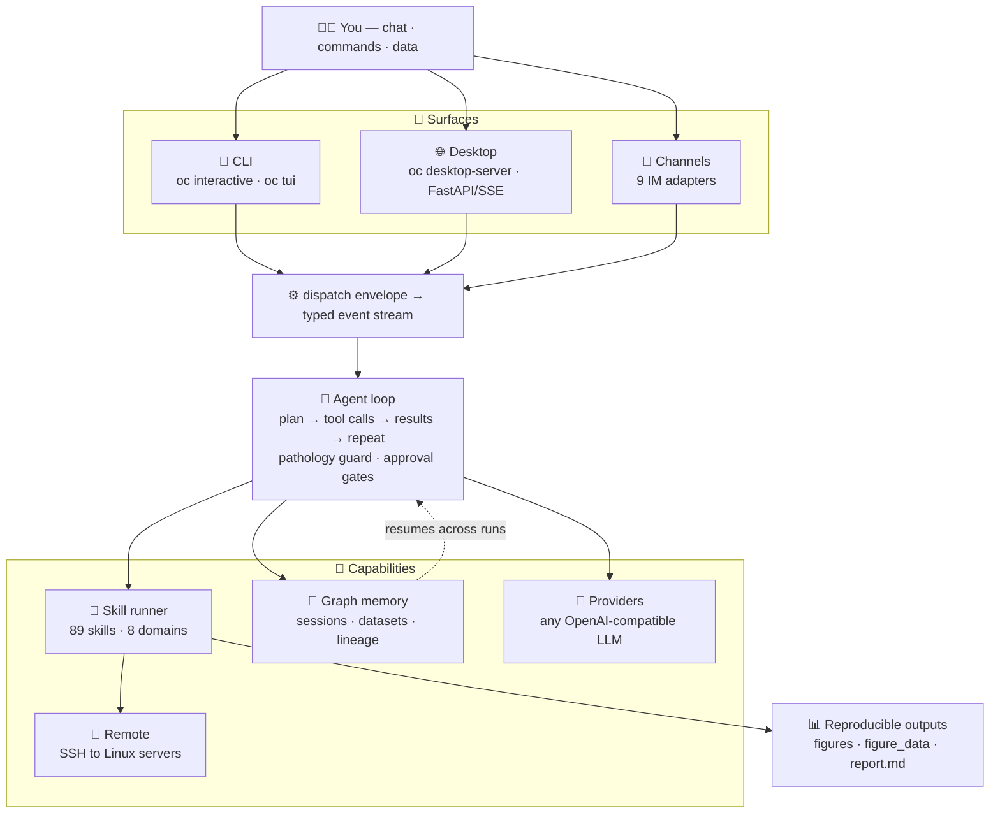

<a id="top"></a>

<div align="center">

<a href="https://github.com/TianGzlab/OmicsClaw">
  
</a>

<h3>Local-first AI research partner for multi-omics analysis</h3>

<p>Chat with your workflows · run reproducible skills · keep data local · resume with memory</p>

<p>
  <b>English</b> ·
  <a href="README_zh-CN.md"><b>简体中文</b></a> ·
  <a href="#-whats-new"><b>What's New</b></a> ·
  <a href="#-quick-start"><b>Quick Start</b></a> ·
  <a href="#-architecture"><b>Architecture</b></a> ·
  <a href="#-domains"><b>Domains</b></a> ·
  <a href="https://TianGzlab.github.io/OmicsClaw/"><b>Docs Site</b></a>
</p>

[](https://www.python.org/downloads/)
[](https://opensource.org/licenses/Apache-2.0)
[](https://github.com/psf/black)
[](https://github.com/TianGzlab/OmicsClaw/actions/workflows/pr-ci.yml)
[](https://TianGzlab.github.io/OmicsClaw/)
[](https://github.com/TianGzlab/OmicsClaw/releases/latest)
[](https://github.com/TianGzlab/OmicsClaw/releases)
[](https://github.com/TianGzlab/OmicsClaw/releases/latest)

</div>

> **OmicsClaw turns local multi-omics tools into AI-callable skills.** The LLM plans and operates; Python, R, and CLI tools process your data in a local or remote runtime — raw matrices never leave your machine. One agent loop powers a terminal CLI, a desktop app, and nine chat platforms, all backed by graph memory so your analyses resume instead of restarting.

## 📢 What's New

- **🤝 Consensus runtime** — multi-method consensus is now a declarative workflow runtime. Fan out N spatial-clustering or single-cell methods, then merge them with verified typed operators or an exploratory LLM synthesis. Triggered by the `consensus-domains` and `sc-consensus-clustering` skills.
- **🧠 Autonomous Analysis Path** — an Analysis Router can parameterize an exact skill from your data, or run a generated-code analysis with approval-gated workspace writes and bounded LLM repair.
- **⚡ Prompt-prefix caching** — automatic provider cache hits across turns to cut latency and token spend.
- **🖥️ Desktop upgrades** — a live to-do task list with planning guidance, an interactive `ask_user` choice tool, and LLM-generated session titles.

<details>
<summary><b>Earlier highlights</b></summary>

- **Providers** — live Ollama model discovery with tool-capability tagging, plus `qwen3.7-max` on DashScope.
- **Surfaces umbrella** — CLI, Desktop, and Channels unified behind one dispatch + typed event stream.
- **Loop health** — ping-pong / repeated-failure pathology detection with soft self-correction.

</details>

## 🖥️ App Workspace

<p align="center">
  
</p>

<p align="center">
  <b>One workspace for chat, datasets, skills, execution, memory, and analysis outputs.</b>
</p>

<p align="center">
  <a href="https://github.com/TianGzlab/OmicsClaw/releases/latest"><b>📥 Download the OmicsClaw Desktop App</b></a>
  &nbsp;·&nbsp;
  <a href="https://github.com/TianGzlab/OmicsClaw/releases"><b>All releases</b></a>
  &nbsp;·&nbsp;
  <a href="https://github.com/TianGzlab/OmicsClaw/releases/latest/download/SHA256SUMS.txt"><b>SHA256SUMS</b></a>
</p>

The **[Releases](https://github.com/TianGzlab/OmicsClaw/releases)** tab hosts the prebuilt desktop installers — the same `oc desktop-server` the CLI ships, wrapped in a chat-ready Electron UI. Pick the asset for your platform:

| Platform | Installer |
|---|---|
| <picture><source media="(prefers-color-scheme: dark)" srcset="https://api.iconify.design/simple-icons:apple.svg?color=%23ffffff"></picture> **macOS — Apple Silicon** (M1 / M2 / M3 / M4) | [`OmicsClaw-<ver>-arm64.dmg`](https://github.com/TianGzlab/OmicsClaw/releases/latest) |
| <picture><source media="(prefers-color-scheme: dark)" srcset="https://api.iconify.design/simple-icons:apple.svg?color=%23ffffff"></picture> **macOS — Intel** | [`OmicsClaw-<ver>-x64.dmg`](https://github.com/TianGzlab/OmicsClaw/releases/latest) |
| <picture><source media="(prefers-color-scheme: dark)" srcset="https://api.iconify.design/simple-icons:windows.svg?color=%23ffffff"></picture> **Windows — x64 / ARM64** | [`OmicsClaw.Setup.<ver>-x64.exe`](https://github.com/TianGzlab/OmicsClaw/releases/latest) · [`OmicsClaw.Setup.<ver>-arm64.exe`](https://github.com/TianGzlab/OmicsClaw/releases/latest) |
| <picture><source media="(prefers-color-scheme: dark)" srcset="https://api.iconify.design/simple-icons:linux.svg?color=%23ffffff"></picture> **Linux — x64** | [`.AppImage`](https://github.com/TianGzlab/OmicsClaw/releases/latest) · [`.deb`](https://github.com/TianGzlab/OmicsClaw/releases/latest) · [`.rpm`](https://github.com/TianGzlab/OmicsClaw/releases/latest) |
| <picture><source media="(prefers-color-scheme: dark)" srcset="https://api.iconify.design/simple-icons:linux.svg?color=%23ffffff"></picture> **Linux — ARM64** | [`.AppImage`](https://github.com/TianGzlab/OmicsClaw/releases/latest) |

> Verify each download against `SHA256SUMS.txt` published alongside the installers. The desktop client and the CLI talk to the same backend — analyses, memory, and remote runtimes stay portable across both.

## 💡 Why OmicsClaw?

| Common pain | OmicsClaw answer |
|---|---|
| Analyses restart from zero | Persistent workspace, sessions, and graph memory |
| Python, R, and CLI tools are scattered | Unified skill runner plus natural-language routing |
| Large data lives on servers | Local UI with remote Linux execution over SSH |
| Reports, artifacts, and parameters drift | Standard skill output contracts and reproducible demos |

## ✨ Capabilities

| | | | |
|---|---|---|---|
| 🧠 **Memory**<br/>Sessions, preferences, lineage | 🔒 **Local-first**<br/>Raw data stays in your runtime | 🧰 **89 skills**<br/>Generated catalog + demos | 🧭 **Smart routing**<br/>Natural language to tools |
| 💬 **CLI Surface**<br/>`oc interactive`, `oc tui` | 🌐 **Desktop Surface**<br/>FastAPI for desktop/web | 📨 **Channel Surface**<br/>9 IM adapters (Telegram, Feishu, …) | 📡 **Remote mode**<br/>SSH tunnel to Linux servers |
| 🤝 **Consensus**<br/>Multi-method merge | 🤖 **Autonomous path**<br/>Router + assisted params | 🔌 **Any LLM**<br/>OpenAI-compatible providers | 📊 **Reproducible**<br/>Figures + data + report |

<details>
<summary><b>Autonomous Analysis Path — how routing modes work</b></summary>

OmicsClaw prefers a matching built-in skill, but ships a first-class autonomous path for everything else. Behavior is controlled by `OMICSCLAW_ANALYSIS_ROUTER_MODE=off|assist|auto` (default `assist`):

- **`assist`** — an exact skill match gets **data-grounded assisted parameterization**: the skill choice stays deterministic while the outer LLM recommends the method and parameters *within* it — grounded in the matched `SKILL.md` method menu and an `inspect_data` schema — asking a focused question only on consequential ambiguity.
- **`auto`** — the **run-as-typed** literal path: it submits exact / no / partial analysis routes through the existing tool policy, approval, transcript, and completion-result pipeline (no outer LLM) and honors a method explicitly named in the request.
- **`off`** — disables the router entirely.

The legacy `OMICSCLAW_ANALYSIS_ROUTER_ENABLED=true` flag is still accepted as `auto`. Generated-code analysis runs in an independent `omicsclaw/autonomous/` runner with approval-gated workspace writes, bounded LLM repair, and skill-like manifest/completion outputs.

</details>

## 🏗️ Architecture

Three Surfaces, **one agent loop**. Every entry point builds a `MessageEnvelope` and dispatches it into the same typed event stream — so a fault in one surface never leaks into another, and skills, memory, and remote runtimes are shared by all.



Beyond the single chat turn, two independent subsystems run longer jobs: a **multi-agent research pipeline** (`omicsclaw/agents/`, intake → plan → research → execute → analyze → write → review) and an **AutoAgent** experiment/optimization loop. Full breakdown in [`docs/architecture/`](docs/architecture/).

## ⚡ Quick Start

```bash
git clone https://github.com/TianGzlab/OmicsClaw.git
cd OmicsClaw
bash 0_setup_env.sh
conda activate OmicsClaw
oc list
oc run spatial-preprocess --demo --output /tmp/omicsclaw_demo
```

Configure chat and runtime settings:

```bash
oc onboard
oc interactive
```

If `oc` is not on `PATH`, use `python omicsclaw.py <command>`.

<p align="center">
  
</p>

## 🧭 Interfaces

Pick the entry point that fits your workflow — they all reach the same backend.

| Surface | Entry point | Use it for |
|---|---|---|
| 💬 **CLI Surface** | `oc interactive` / `oc tui` | Natural-language workflows in the terminal (REPL + full-screen TUI) |
| 🌐 **Desktop Surface** | `oc desktop-server` | FastAPI backend consumed by OmicsClaw-App and browser frontends |
| 📨 **Channel Surface** | `python -m omicsclaw.surfaces.channels --channels <names>` | Telegram, Feishu, Slack, Discord, WeChat (incl. WeCom), DingTalk, iMessage, Email, QQ |
| 🧪 Skill runner (non-Surface) | `oc run <skill> --demo` | Reproducible one-shot analysis |
| 🔌 MCP (non-Surface) | `oc mcp add ...` | External tool integration |
| 📡 Remote mode | `oc desktop-server` over SSH | Server-side data and jobs |

Remote mode uses `127.0.0.1`, SSH tunneling, and `OMICSCLAW_REMOTE_AUTH_TOKEN`. See [remote execution](docs/engineering/remote-execution.mdx) and the [legacy remote guide](docs/_legacy/remote-connection-guide.md).

## 📦 Installation

| Path | Best for | Command |
|---|---|---|
| 🥇 **Full conda** | Real analysis with Python + R + bioinformatics CLIs | `bash 0_setup_env.sh` |
| 🪶 **Lightweight venv** | Chat, routing, dev, Python-only skills | `pip install -e ".[interactive]"` |
| 🖥️ **Desktop/web backend** | OmicsClaw-App or browser frontends | `oc desktop-server --host 127.0.0.1 --port 8765` |
| 🧠 **Memory API** | Inspect graph memory over HTTP | `pip install -e ".[memory]"` then `oc memory-server` |

📖 Details: [installation guide](docs/_legacy/INSTALLATION.md), [quickstart](docs/introduction/quickstart.mdx). Dependencies live in [`pyproject.toml`](pyproject.toml), [`environment.yml`](environment.yml), and [`0_setup_env.sh`](0_setup_env.sh).

## 🧬 Domains

`oc list` and `skills/catalog.json` currently agree on **89 registered skills** across **8 domains**.

| Domain | Skills | Examples | Docs |
|---|---|---|---|
| 🧫 Spatial transcriptomics | 17 | QC, domains, annotation, deconvolution, CNV, trajectory | [spatial](docs/domains/spatial.mdx) |
| 🔬 Single-cell omics | 30 | QC, clustering, annotation, doublets, velocity, GRN | [singlecell](docs/domains/singlecell.mdx) |
| 🧬 Genomics | 10 | QC, alignment, variants, CNV, assembly, epigenomics | [genomics](docs/domains/genomics.mdx) |
| 🧪 Proteomics | 8 | DIA/DDA, PTM, networks, biomarkers | [proteomics](docs/domains/proteomics.mdx) |
| ⚗️ Metabolomics | 8 | Peaks, normalization, annotation, pathways | [metabolomics](docs/domains/metabolomics.mdx) |
| 📈 Bulk RNA-seq | 13 | DE, enrichment, co-expression, deconvolution, survival | [bulkrna](docs/domains/bulkrna.mdx) |
| 🧠 Orchestration | 2 | Routing, planning, literature support | [orchestrator](docs/domains/orchestrator.mdx) |
| 📚 Literature | 1 | PDF/DOI/PubMed/GEO parsing and dataset handoff | — |

Run `oc list` for the current CLI catalog.

## 🧠 Memory

Graph-backed memory at `omicsclaw/memory/` carries your sessions, datasets, analyses, preferences, and insights across runs — chat history and lineage come back when you reopen any surface. Each surface stays isolated so state never leaks across users or workspaces.

| Surface | Memory scope |
|---|---|
| CLI / TUI | Per workspace path |
| Desktop app | Per launch (or per signed-in user) |
| Telegram / Feishu bot | Per platform user |

A reserved `__shared__` pool (core agent identity, knowledge handbook guards, glossary) is the one thing every surface reads back automatically. Full vocabulary and architecture in [`docs/CONTEXT.md`](docs/CONTEXT.md).

## 📚 Documentation

| Topic | Where |
|---|---|
| 🚀 Quickstart & onboarding | [introduction/quickstart](docs/introduction/quickstart.mdx) |
| 🏗️ Architecture | [`docs/architecture/`](docs/architecture/) |
| 🧬 Domain guides | [spatial](docs/domains/spatial.mdx) · [singlecell](docs/domains/singlecell.mdx) · [genomics](docs/domains/genomics.mdx) · [proteomics](docs/domains/proteomics.mdx) · [metabolomics](docs/domains/metabolomics.mdx) · [bulkrna](docs/domains/bulkrna.mdx) |
| 🧠 Domain language & memory | [`docs/CONTEXT.md`](docs/CONTEXT.md) |
| 📡 Remote execution | [engineering/remote-execution](docs/engineering/remote-execution.mdx) |
| 🔒 Safety & data privacy | [data privacy](docs/safety/data-privacy.mdx) · [rules & disclaimer](docs/safety/rules-and-disclaimer.mdx) |
| 🛠️ Building skills | [CONTRIBUTING.md](CONTRIBUTING.md) · [`templates/skill/`](templates/skill/) |
| 🤖 Repo / agent contracts | [AGENTS.md](AGENTS.md) |

Hosted docs site: **<https://TianGzlab.github.io/OmicsClaw/>**

## ❓ FAQ

<details>
<summary><b>Does OmicsClaw upload my raw data?</b></summary>

No. Skills run in the configured local or remote runtime; LLM calls should receive context and tool results, not raw omics matrices.

</details>

<details>
<summary><b>Which installation path should I use?</b></summary>

Use `bash 0_setup_env.sh` for real analysis. Use the lightweight venv only for chat, routing, development, or Python-only skills.

</details>

<details>
<summary><b>Can the desktop App run jobs on a server?</b></summary>

Yes. Run `oc desktop-server` on the remote Linux host, keep it bound to `127.0.0.1`, and connect through the App's SSH tunnel runtime.

</details>

## ⚠️ Safety

| Rule | Meaning |
|---|---|
| 🔒 Local-first | Raw data processing happens in your local or remote runtime |
| 🧪 Research use only | Not a medical device; no clinical diagnosis |
| 👩‍🔬 Expert review | Validate scientific outputs before decisions |
| 🔐 Remote caution | Use localhost binding, SSH tunnels, and tokens |

> OmicsClaw is a research and educational tool for multi-omics analysis. It is not a medical device and does not provide clinical diagnoses. Consult a domain expert before making decisions based on these results.

See [data privacy](docs/safety/data-privacy.mdx) and [rules/disclaimer](docs/safety/rules-and-disclaimer.mdx).

## 👥 Community

Maintainers: Luyi Tian (Principal Investigator), Weige Zhou (Lead Developer), Liying Chen (Developer), and Pengfei Yin (Developer).

🐛 [Issues](https://github.com/TianGzlab/OmicsClaw/issues) · 💬 [Discussions](https://github.com/TianGzlab/OmicsClaw/discussions) · 📖 [Docs](https://TianGzlab.github.io/OmicsClaw/)

<table>
  <tr>
    <td align="center" width="30%">
      
      <br/>
      <b>WeChat group</b>
      <br/>
      <sub>Scan to join</sub>
    </td>
    <td valign="middle" width="70%">
      Scan to join our WeChat group to share analysis tips, report issues, and discuss multi-omics AI workflows.
    </td>
  </tr>
</table>

<a href="https://github.com/TianGzlab/OmicsClaw/graphs/contributors">
  
</a>

## 🙏 Acknowledgments

Architecture, skill design, and local-first philosophy are inspired by **[ClawBio](https://github.com/ClawBio/ClawBio)**, an early bioinformatics-native AI agent skill library. Memory and session-continuity patterns are inspired by [Nocturne Memory](https://github.com/Dataojitori/nocturne_memory).

## 🛠️ Contributing

- **New skills**: see [CONTRIBUTING.md](CONTRIBUTING.md) and the v2 scaffold under [`templates/skill/`](templates/skill/).
- **Repository / agent work**: see [AGENTS.md](AGENTS.md) — covers contract tests, provider contracts, skill runner, and architecture references.

## 📜 License

Apache-2.0. See [LICENSE](LICENSE).

## 📝 Citation

```bibtex
@software{omicsclaw2026,
  title = {OmicsClaw: A Memory-Enabled AI Agent for Multi-Omics Analysis},
  author = {Zhou, Weige and Chen, Liying and Yin, Pengfei and Tian, Luyi},
  year = {2026},
  url = {https://github.com/TianGzlab/OmicsClaw}
}
```

[⬆ Back to top](#top)
