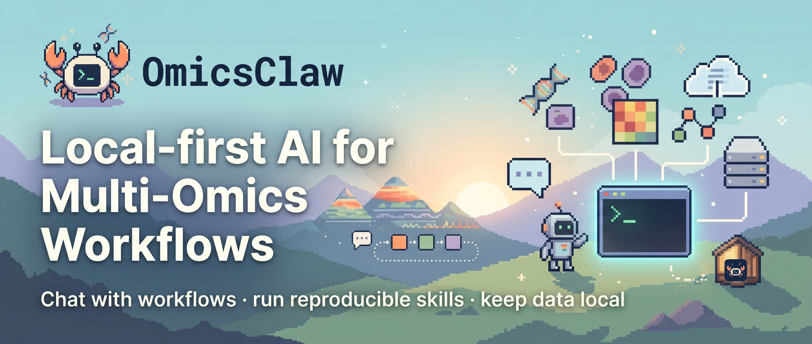
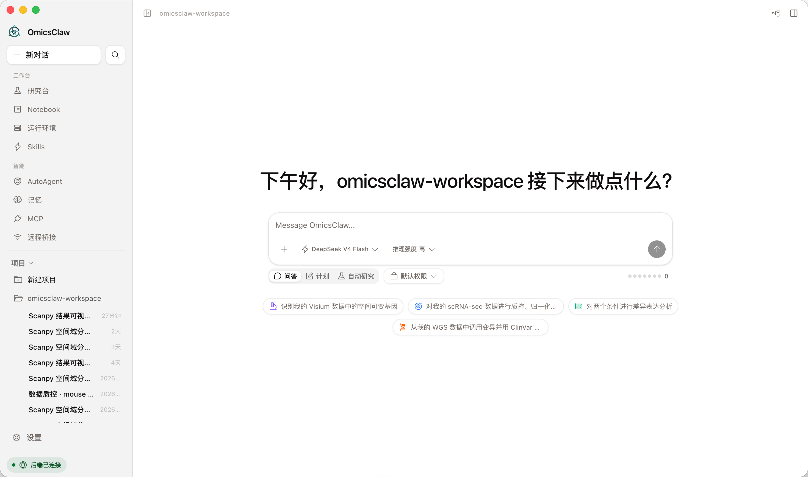
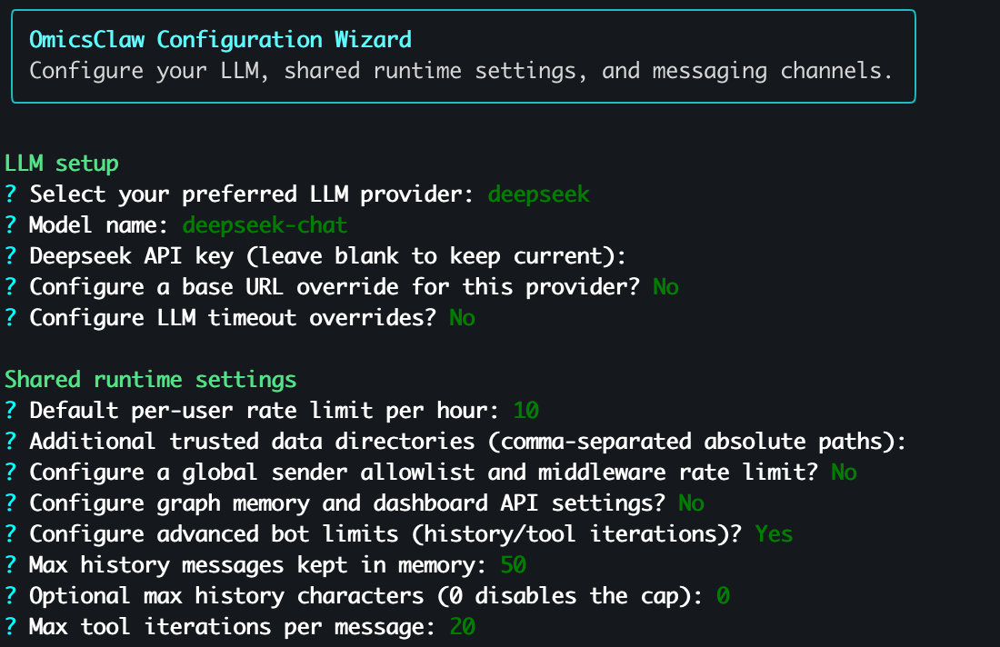

<a id="top"></a>

<div align="center">

<a href="https://github.com/TianGzlab/OmicsClaw">
  
</a>

<h3>Local-first AI research partner for multi-omics analysis</h3>

<p>Chat with your workflows · run reproducible skills · keep data local · resume with memory</p>

<p>
  <b>English</b> ·
  <a href="README_zh-CN.md"><b>简体中文</b></a> ·
  <a href="#-whats-new"><b>What's New</b></a> ·
  <a href="#-quick-start"><b>Quick Start</b></a> ·
  <a href="#npm-desktop"><b>npm + Desktop</b></a> ·
  <a href="#-domains"><b>Domains</b></a> ·
  <a href="https://TianGzlab.github.io/OmicsClaw/"><b>Docs Site</b></a>
</p>

[](https://www.python.org/downloads/)
[](https://opensource.org/licenses/Apache-2.0)
[](https://github.com/psf/black)
[](https://github.com/TianGzlab/OmicsClaw/actions/workflows/pr-ci.yml)
[](https://TianGzlab.github.io/OmicsClaw/)
[](https://github.com/TianGzlab/OmicsClaw/releases/latest)
[](https://github.com/TianGzlab/OmicsClaw/releases)
[](https://github.com/TianGzlab/OmicsClaw/releases/latest)

</div>

> **OmicsClaw turns local multi-omics tools into AI-callable skills.** The LLM plans and operates; Python, R, and CLI tools process your data in a local or remote runtime — raw matrices never leave your machine. One agent loop serves the terminal, the desktop app, and chat platforms.

## 📢 What's New

- **🧪 Fast-by-default test tiers** — `pytest` / `make test` now run the deterministic regression suite without Skill demo, slow optional-stack, or real-LLM eval cases. `make test-slow` runs the retained Skill demo and slow scientific integration coverage with bounded concurrency; `make test-all` runs every non-eval tier. Repeated assertions over one Demo output share a single execution instead of relaunching the scientific subprocess.
- **🟢 Golden Agent Run + Replay slice** — in the CLI REPL, single-shot mode, and Desktop text chat, an explicit natural-language request such as `run genomics-vcf-operations demo` becomes one deterministic planned `omicsclaw` call and executes through the Backend-owned canonical `RunRuntime`. It bypasses LLM tool discovery, fails closed without a legacy-runner fallback, and closes the Agent Turn from the verified Receipt, fresh Run ID, output directory, README, and Skill Replay Capsule. Standard Skill Runs no longer synthesize source-code notebooks. `oc replay <output>/reproducibility/replay.json` creates a new Run and compares Skill revision, input/parameter evidence, environment identity, result semantics, and declared scientific artifacts; the original Run remains immutable. Exact `/run <canonical-skill> --demo` single-shot commands use the same path. Root CLI also accepts the fixed forms `--demo --project <32-lower-hex-id>` and `--demo --no-project`. This first slice remains deliberately narrow: the Skill must be explicitly named and resource-ready; non-demo, preflight, Candidate-plan, partial, and no-Skill requests keep their existing routes.
- **🟢 Golden Skill lifecycle slice** — the Agent's `create_omics_skill` path now publishes a passed candidate as non-routable `draft/smoke-only`, runs its declared demo Evaluation Protocol against the published exact revision, and submits a combined `skill_activation` proposal. The Agent cannot approve it. A human-reviewed governance CAS atomically changes `draft/smoke-only → mvp/demo-validated`, evaluates the newly activated manifest revision so its Experience View remains `current`, refreshes routing, and the next explicit Agent demo executes through canonical `RunRuntime`. Failed or incomplete evaluation leaves the draft inactive.
- **🧪 Evidence-bound Skill lifecycle** — a partial-coverage three-suite pilot now binds OmicBench A02/A03, scAgentBench PAGA, and a deterministic BiomniBench-DA 12-2 preflight to exact Skill revisions, content, environments, grader metrics, and locally retained content-addressed evidence. Coverage is OmicBench **2/44**, scAgentBench main **1/50**, and BiomniBench-DA public tasks **1/50**; Biomni has no official LLM-judge score. These are Skill conformance results. The deterministic no-Skill creation-to-execution Golden Slice is now wired, but the broader MUSE-style no-Skill/curated/self-created Agent Campaign has not run, and the offline Campaign analyzer explicitly stops at matrix integrity until typed causal provenance is wired. See the [three-suite report](docs/evaluation/muse-three-suite-skill-lifecycle-benchmark.md).
- **🤝 Consensus runtime** — multi-method consensus is now a declarative workflow runtime. Fan out N spatial-clustering or single-cell methods, then merge them with verified typed operators or an exploratory LLM synthesis. Triggered by the `consensus-domains` and `sc-consensus-clustering` skills.
- **🧠 Autonomous Analysis Path** — an Analysis Router can parameterize an exact skill from your data, or run a generated-code analysis with approval-gated workspace writes and bounded LLM repair.
- **⚡ Prompt-prefix caching** — automatic provider cache hits across turns to cut latency and token spend.
- **🖥️ Desktop upgrades** — a live to-do task list with planning guidance, an interactive `ask_user` choice tool, and request-bound session titles generated once from the first visible user message by the exact runtime that served the turn.

<details>
<summary><b>Earlier highlights</b></summary>

- **Providers** — live Ollama model discovery with tool-capability tagging, plus `qwen3.7-max` on DashScope.
- **Surfaces umbrella** — CLI, Desktop, and Channels unified behind one dispatch + typed event stream.
- **Loop health** — ping-pong / repeated-failure pathology detection with soft self-correction.

</details>

## 🖥️ App Workspace

<p align="center">
  
</p>

<p align="center">
  <b>One workspace for chat, datasets, skills, execution, memory, and analysis outputs.</b>
</p>

<p align="center">
  <a href="https://github.com/TianGzlab/OmicsClaw/releases/latest"><b>📥 Download the OmicsClaw Desktop App</b></a>
  &nbsp;·&nbsp;
  <a href="https://github.com/TianGzlab/OmicsClaw/releases"><b>All releases</b></a>
  &nbsp;·&nbsp;
  <a href="https://github.com/TianGzlab/OmicsClaw/releases/latest/download/SHA256SUMS.txt"><b>SHA256SUMS</b></a>
</p>

The **[Releases](https://github.com/TianGzlab/OmicsClaw/releases)** tab hosts the prebuilt desktop installers — the same `oc desktop-server` the CLI ships, wrapped in a chat-ready Electron UI. Pick the asset for your platform:

| Platform | Installer |
|---|---|
| **macOS — Apple Silicon** (M1 / M2 / M3 / M4) | [`OmicsClaw-<ver>-arm64.dmg`](https://github.com/TianGzlab/OmicsClaw/releases/latest) |
| **macOS — Intel** | [`OmicsClaw-<ver>-x64.dmg`](https://github.com/TianGzlab/OmicsClaw/releases/latest) |
| **Windows — x64 / ARM64** | [`OmicsClaw.Setup.<ver>-x64.exe`](https://github.com/TianGzlab/OmicsClaw/releases/latest) · [`OmicsClaw.Setup.<ver>-arm64.exe`](https://github.com/TianGzlab/OmicsClaw/releases/latest) |
| **Linux — x64** | [`.AppImage`](https://github.com/TianGzlab/OmicsClaw/releases/latest) · [`.deb`](https://github.com/TianGzlab/OmicsClaw/releases/latest) · [`.rpm`](https://github.com/TianGzlab/OmicsClaw/releases/latest) |
| **Linux — ARM64** | [`.AppImage`](https://github.com/TianGzlab/OmicsClaw/releases/latest) |

> Verify each download against `SHA256SUMS.txt` published alongside the installers. The desktop client and the CLI talk to the same backend — analyses, memory, and remote runtimes stay portable across both.

## 💡 Why OmicsClaw?

| Common pain | OmicsClaw answer |
|---|---|
| Analyses restart from zero | Persistent workspace, sessions, and graph memory |
| Python, R, and CLI tools are scattered | Unified skill runner plus natural-language routing |
| Large data lives on servers | Local UI with remote Linux execution over SSH |
| Reports, artifacts, and parameters drift | Standard skill output contracts and reproducible demos |

## ✨ Capabilities

| | | | |
|---|---|---|---|
| 🧠 **Memory**<br/>Sessions, preferences, lineage | 🔒 **Local-first**<br/>Raw data stays in your runtime | 🧰 **96 skills**<br/>Generated catalog + demos | 🧭 **Smart routing**<br/>Natural language to tools |
| 💬 **CLI Surface**<br/>`oc interactive`, `oc tui` | 🌐 **Desktop Surface**<br/>FastAPI for desktop/web | 📨 **Channel Surface**<br/>Telegram text + photo, Feishu text; others gated | 📡 **Remote mode**<br/>SSH tunnel to Linux servers |
| 🤝 **Consensus**<br/>Multi-method merge | 🤖 **Autonomous path**<br/>Router + assisted params | 🔌 **Any LLM**<br/>OpenAI-compatible providers | 📊 **Reproducible**<br/>Figures + data + report |

The Skill lifecycle now has a production-backed vertical slice: a real No-Skill
transcriptomics request produced Autonomous Run `7787182985b2435997433fa94a7b7096`,
which was promoted by opaque `run_id`, evaluated twice through the shared
runner, approved through Desktop governance, and rerun by the Agent through
canonical RunRuntime as `bulkrna-cosinor-rhythm`. Its current Experience View
is `demo-validated/current` with non-empty stability evidence. Run-derived
publications now live under `skills/<domain>/run-derived/<skill>` and are
reported as `collection: run-derived` by the Registry, generated Catalog, and
Desktop Skill API; collection is navigation metadata, while provenance and
trust remain governed by `skill.yaml` plus current evaluation evidence.
The current published revision was exercised again through Desktop Agent Run
`f86b027da8a229aa00225a59a15d7435` and fresh Replay Run
`4cba549f6a4b846903aa5d11f7bb0898`; both are canonical Receipts, and their
semantic summary matches the source Run and the two current shared-runner
evaluations (`38d5863c9eec41d68bdee07b7d9229c2`) exactly.

For the cut-over text paths, terminal ordering is `terminal candidate -> Receipt + Transcript ref -> promotion -> Event`. This production slice 不代表 ADR 0042–0068 全量完成；non-cut-over Surfaces remain explicitly outside the claim.

<details>
<summary><b>Autonomous Analysis Path — how routing works</b></summary>

OmicsClaw prefers a matching built-in skill, but ships a first-class autonomous path for everything else. Routing is **always on and assistive** — there is no mode switch:

- **Exact skill match** gets **data-grounded assisted parameterization**: the skill choice stays deterministic while the outer LLM recommends the method and parameters *within* it — grounded in the matched `SKILL.md` method menu and an `inspect_data` schema — asking a focused question only on consequential ambiguity.
- **Partial / No skill match** is delegated to the autonomous code path.

Generated-code analysis runs in the single autonomous engine — the **Autonomous Code Mini-Agent** (`omicsclaw/autonomous/`): a bounded Jupyter-kernel agent under tiered isolation (bubblewrap when available, in-kernel guard otherwise) that drives vetted skills through a curated `oc` handle and gates acceptance on a replay rerun. See [ADR 0032](docs/adr/0032-autonomous-code-mini-agent.md).

</details>

## ⚡ Quick Start

```bash
git clone https://github.com/TianGzlab/OmicsClaw.git
cd OmicsClaw
bash 0_setup_env.sh
conda activate OmicsClaw
oc list
oc run spatial-preprocess --demo
```

Configure chat and runtime settings:

```bash
oc onboard
oc interactive
```

If `oc` is not on `PATH`, use `python omicsclaw.py <command>`.

<p align="center">
  
</p>

## 🧭 Interfaces

Pick the entry point that fits your workflow — they all reach the same backend.

| Surface | Entry point | Use it for |
|---|---|---|
| 💬 **CLI Surface** | `oc interactive` / `oc tui` | Natural-language workflows in the terminal (REPL + full-screen TUI) |
| 🌐 **Desktop Surface** | `oc desktop-server` | FastAPI backend; authoritative text plus bounded `/v1/turns` multipart image ingress |
| 📨 **Channel Surface** | `python -m omicsclaw.surfaces.channels --channels telegram`<br/>`python -m omicsclaw.surfaces.channels --channels feishu` | Owner-only Telegram text + one photo/caption and Feishu text-only; other media and adapters fail closed |
| 🧪 Skill runner (non-Surface) | `oc run <skill> --demo` | Reproducible one-shot analysis |
| ♻️ Skill replay (non-Surface) | `oc replay <replay.json>` | Create a fresh Run and verify it against frozen evidence |
| 🔌 MCP (non-Surface) | `oc mcp add ...` | External tool integration |
| 📡 Remote mode | `oc desktop-server` over SSH | Server-side data and jobs |

Remote mode uses `127.0.0.1`, SSH tunneling, and `OMICSCLAW_REMOTE_AUTH_TOKEN`. See [remote execution](docs/engineering/remote-execution.mdx) and the [legacy remote guide](docs/_legacy/remote-connection-guide.md).

The production Channel scope is the shared runner plus `ControlRuntime`:
Owner-only Telegram text and one ordinary photo with an optional caption, and
Owner-only Feishu text-only. `FEISHU_ALLOWED_SENDERS` and `FEISHU_BOT_OPEN_ID`
are mandatory; the latter proves a group message mentioned this Bot. Other
Channel Adapters remain gated. Outbound media is incomplete and fail-closed.
This is not full ADR completion.

## 📦 Installation

| Path | Best for | Command |
|---|---|---|
| 🥇 **Full conda** | Real analysis with Python + R + bioinformatics CLIs | `bash 0_setup_env.sh` |
| 🪶 **Lightweight venv** | Chat, routing, dev, Python-only skills | `pip install -e ".[interactive]"` |
| 📨 **Telegram + Feishu Channels** | Production Owner-only Channel inputs | `pip install -e ".[channels]"` |
| 🖥️ **Desktop/web backend** | OmicsClaw-App or browser frontends | `oc desktop-server --host 127.0.0.1 --port 8765` |
| 🧠 **Memory API** | Inspect graph memory over HTTP | `pip install -e ".[memory]"` then `oc memory-server` |

📖 Details: [installation guide](docs/_legacy/INSTALLATION.md), [quickstart](docs/introduction/quickstart.mdx). Dependencies live in [`pyproject.toml`](pyproject.toml), [`environment.yml`](environment.yml), and [`0_setup_env.sh`](0_setup_env.sh).

<a id="npm-desktop"></a>

## 🚀 npm install & Desktop pairing

One `npm install -g omicsclaw` gives you the CLI **and** a self-contained CPython runtime — no conda, no venv, no system Python. That same runtime is the interpreter the [Desktop App](https://github.com/TianGzlab/OmicsClaw/releases/latest) can be pointed at, so a single install serves both the terminal and the App.

> **Status** — the wrapper and its four platform runtimes are built by [`npm-release.yml`](.github/workflows/npm-release.yml); publishing is a manual, reviewer-gated dispatch that has not run yet, so `npm install -g omicsclaw` still 404s on the registry. Until it lands, install the backend through the conda or pip paths above.

```bash
npm install -g omicsclaw   # CLI + the one runtime matching your platform
omicsclaw --version        # `oc` is the short alias for the same binary
oc list                    # 96 skills, by domain
```

Node.js 18+ is the only prerequisite. The wrapper carries no runtime: it declares one `@omicsclaw/runtime-<platform>` per host in `optionalDependencies`, and npm's `os` / `cpu` filtering lands exactly one on disk — the pattern esbuild and biome use. The postinstall hook records that interpreter in `~/.omicsclaw/runtime.json` and renames any pip-installed `omicsclaw` / `oc` shim to `<name>-legacy`, so the npm command wins `PATH` without deleting the old one.

| Host | Runtime |
|---|---|
| Linux x64 · Linux arm64 · macOS Apple Silicon · Windows x64 | ✅ prebuilt, ships with the package |
| macOS Intel · Windows arm64 | ❌ no `llvmlite` wheels / no CI runner — clone the repo and run `0_setup_env.sh` |

The runtime carries the agent and the desktop server, **not** the scientific stack (`scanpy`, `torch`, R, bioconda CLIs — roughly 1.5 GiB). Skills that need those tell you what to install into the same interpreter; for the full supported stack, use the Linux conda path.

### Pairing with OmicsClaw-App

The desktop installer contains no Python, and never downloads, creates, repairs, or auto-selects an interpreter. You pick one explicitly; the App commits it only after a preflight, a provisional launch, and a strict `/health` check, and restores the previous runtime if any of that fails.

| Mode | Backend runs on | What you do in the App |
|---|---|---|
| **Local** | This machine | **Runtimes → Local Python** (or the first-run wizard). **Detect existing environments** lists the npm runtime — read from `~/.omicsclaw/runtime.json` — alongside conda envs; click **Use …**, or **Choose Python** and select the interpreter yourself. Detection runs only when clicked and never selects for you. |
| **Remote** | A Linux server | Start `oc desktop-server --host 127.0.0.1 --port 8765` there, then **Runtimes → New Runtime** with a direct URL or an SSH alias (plus the bearer token if the backend requires one), **Run Ping**, then **Make Active**. The desktop host needs no Python at all. |

Print the exact interpreter path when the App asks for one:

```bash
# npm runtime
python -c "import json, os; print(json.load(open(os.path.expanduser('~/.omicsclaw/runtime.json')))['pythonPath'])"
# conda env
conda run -n OmicsClaw python -c "import sys; print(sys.executable)"
```

The backend binds `127.0.0.1:8765` (`OMICSCLAW_APP_HOST` / `OMICSCLAW_APP_PORT`); remote profiles authenticate with `OMICSCLAW_REMOTE_AUTH_TOKEN`. Configure the LLM provider in the App's setup wizard or in the backend's `.env`. Chat-triggered runs are written to `<project directory>/output`, which is what the App dashboard lists.

For automatic chat titles, a successful Desktop turn publishes one in-memory,
five-minute ticket keyed by `source_request_id`. The ticket retains the exact
client, provider, model, endpoint, and reasoning policy used by that turn and is
consumed once by the versioned `/chat/title` request. The title call receives
only the first user-visible text, has no tools or conversation history, never
falls through to another provider, and returns only stable redacted errors.
Title failure never changes the completed chat response.

<details>
<summary><b>Troubleshooting & upgrades</b></summary>

| Symptom | Fix |
|---|---|
| `command not found: omicsclaw` | npm's global bin is not on `PATH`: `export PATH="$(npm prefix -g)/bin:$PATH"` |
| `EACCES` during install | Do not use `sudo`. `npm config set prefix ~/.npm-global`, add `~/.npm-global/bin` to `PATH`, reinstall |
| No platform runtime installed | Requires npm ≥ 7 and no `--no-optional` flag |
| Port 8765 already in use | `lsof -ti:8765 \| xargs kill -9` (macOS / Linux) |
| App reports the backend offline | `<selected python> -c "import omicsclaw; print(omicsclaw.__version__)"`, fix that environment, then retry activation in the App |
| Upgrading | `npm install -g omicsclaw@latest` — the interpreter path is stable, so the App keeps working after a restart |

</details>

📖 Distribution internals — wrapper layout, platform packages, and the `~/.omicsclaw/runtime.json` contract — are documented in [`npm/AGENTS.md`](npm/AGENTS.md) and [`npm/omicsclaw/README.md`](npm/omicsclaw/README.md).

## 🧬 Domains

`oc list` and `skills/catalog.json` currently agree on **96 registered skills** across **8 domains**.

| Domain | Skills | Examples | Docs |
|---|---|---|---|
| 🧫 Spatial transcriptomics | 19 | QC, domains, annotation, deconvolution, CNV, trajectory | [spatial](docs/domains/spatial.mdx) |
| 🔬 Single-cell omics | 34 | QC, clustering, annotation, doublets, velocity, GRN | [singlecell](docs/domains/singlecell.mdx) |
| 🧬 Genomics | 10 | QC, alignment, variants, CNV, assembly, epigenomics | [genomics](docs/domains/genomics.mdx) |
| 🧪 Proteomics | 8 | DIA/DDA, PTM, networks, biomarkers | [proteomics](docs/domains/proteomics.mdx) |
| ⚗️ Metabolomics | 8 | Peaks, normalization, annotation, pathways | [metabolomics](docs/domains/metabolomics.mdx) |
| 📈 Bulk RNA-seq | 14 | DE, enrichment, co-expression, deconvolution, survival, cosinor rhythms | [bulkrna](docs/domains/bulkrna.mdx) |
| 🧠 Orchestration | 2 | Routing, planning, literature support | [orchestrator](docs/domains/orchestrator.mdx) |
| 📚 Literature | 1 | PDF/DOI/PubMed/GEO parsing and dataset handoff | — |

Run `oc list` for the current CLI catalog.

## 🧠 Memory

Graph-backed memory at `omicsclaw/memory/` carries your sessions, datasets, analyses, preferences, and insights across runs — chat history and lineage come back when you reopen any surface. Each surface stays isolated so state never leaks across users or workspaces.

| Surface | Memory scope |
|---|---|
| CLI / TUI | Per workspace path |
| Desktop app | Per launch (or per signed-in user) |
| Telegram / Feishu bot | Per platform user |

A reserved `__shared__` pool (core agent identity, knowledge handbook guards, glossary) is the one thing every surface reads back automatically. Full vocabulary and architecture in [`docs/CONTEXT.md`](docs/CONTEXT.md).

## 📚 Documentation

| Topic | Where |
|---|---|
| 🚀 Quickstart & onboarding | [introduction/quickstart](docs/introduction/quickstart.mdx) |
| 🏗️ Architecture | [`docs/ARCHITECTURE.md`](docs/ARCHITECTURE.md) (canonical ledger) · [`docs/architecture/`](docs/architecture/) |
| 📈 Engineering progress log | [`docs/PROGRESS.md`](docs/PROGRESS.md) |
| 🧬 Domain guides | [spatial](docs/domains/spatial.mdx) · [singlecell](docs/domains/singlecell.mdx) · [genomics](docs/domains/genomics.mdx) · [proteomics](docs/domains/proteomics.mdx) · [metabolomics](docs/domains/metabolomics.mdx) · [bulkrna](docs/domains/bulkrna.mdx) |
| 🧠 Domain language & memory | [`docs/CONTEXT.md`](docs/CONTEXT.md) |
| 📡 Remote execution | [engineering/remote-execution](docs/engineering/remote-execution.mdx) |
| 🔒 Safety & data privacy | [data privacy](docs/safety/data-privacy.mdx) · [rules & disclaimer](docs/safety/rules-and-disclaimer.mdx) |
| 🛠️ Building skills | [CONTRIBUTING.md](CONTRIBUTING.md) · [`templates/skill/`](templates/skill/) |
| 🧪 Skill lifecycle evaluation | [MUSE-aligned three-suite pilot](docs/evaluation/muse-three-suite-skill-lifecycle-benchmark.md) · [OmicBench baseline](docs/evaluation/omicbench-skill-lifecycle-baseline.md) · [Skill system blueprint](docs/design/skill-system-blueprint.md) |
| 🤖 Repo / agent contracts | [AGENTS.md](AGENTS.md) |

Hosted docs site: **<https://TianGzlab.github.io/OmicsClaw/>**

## ❓ FAQ

<details>
<summary><b>Does OmicsClaw upload my raw data?</b></summary>

No. Skills run in the configured local or remote runtime; LLM calls should receive context and tool results, not raw omics matrices.

</details>

<details>
<summary><b>Which installation path should I use?</b></summary>

Use `bash 0_setup_env.sh` for real analysis. Use the lightweight venv only for chat, routing, development, or Python-only skills.

</details>

<details>
<summary><b>Can the desktop App run jobs on a server?</b></summary>

Yes. Run `oc desktop-server` on the remote Linux host, keep it bound to `127.0.0.1`, and connect through the App's SSH tunnel runtime.

</details>

## ⚠️ Safety

| Rule | Meaning |
|---|---|
| 🔒 Local-first | Raw data processing happens in your local or remote runtime |
| 🧪 Research use only | Not a medical device; no clinical diagnosis |
| 👩‍🔬 Expert review | Validate scientific outputs before decisions |
| 🔐 Remote caution | Use localhost binding, SSH tunnels, and tokens |

> OmicsClaw is a research and educational tool for multi-omics analysis. It is not a medical device and does not provide clinical diagnoses. Consult a domain expert before making decisions based on these results.

See [data privacy](docs/safety/data-privacy.mdx) and [rules/disclaimer](docs/safety/rules-and-disclaimer.mdx).

## 👥 Community

Maintainers: Luyi Tian (Principal Investigator), Weige Zhou (Lead Developer), Liying Chen (Developer), and Pengfei Yin (Developer).

🐛 [Issues](https://github.com/TianGzlab/OmicsClaw/issues) · 💬 [Discussions](https://github.com/TianGzlab/OmicsClaw/discussions) · 📖 [Docs](https://TianGzlab.github.io/OmicsClaw/)

<table>
  <tr>
    <td align="center" width="30%">
      
      <br/>
      <b>WeChat group</b>
      <br/>
      <sub>Scan to join</sub>
    </td>
    <td valign="middle" width="70%">
      Scan to join our WeChat group to share analysis tips, report issues, and discuss multi-omics AI workflows.
    </td>
  </tr>
</table>

<a href="https://github.com/TianGzlab/OmicsClaw/graphs/contributors">
  
</a>

## 🙏 Acknowledgments

Architecture, skill design, and local-first philosophy are inspired by **[ClawBio](https://github.com/ClawBio/ClawBio)**, an early bioinformatics-native AI agent skill library. Memory and session-continuity patterns are inspired by [Nocturne Memory](https://github.com/Dataojitori/nocturne_memory).

## 🛠️ Contributing

- **New skills**: see [CONTRIBUTING.md](CONTRIBUTING.md) and the v2 scaffold under [`templates/skill/`](templates/skill/).
- **Repository / agent work**: see [AGENTS.md](AGENTS.md) — covers contract tests, provider contracts, skill runner, and architecture references.

## 📜 License

Apache-2.0. See [LICENSE](LICENSE).

## 📝 Citation

```bibtex
@software{omicsclaw2026,
  title = {OmicsClaw: A Memory-Enabled AI Agent for Multi-Omics Analysis},
  author = {Zhou, Weige and Chen, Liying and Yin, Pengfei and Tian, Luyi},
  year = {2026},
  url = {https://github.com/TianGzlab/OmicsClaw}
}
```

[⬆ Back to top](#top)
