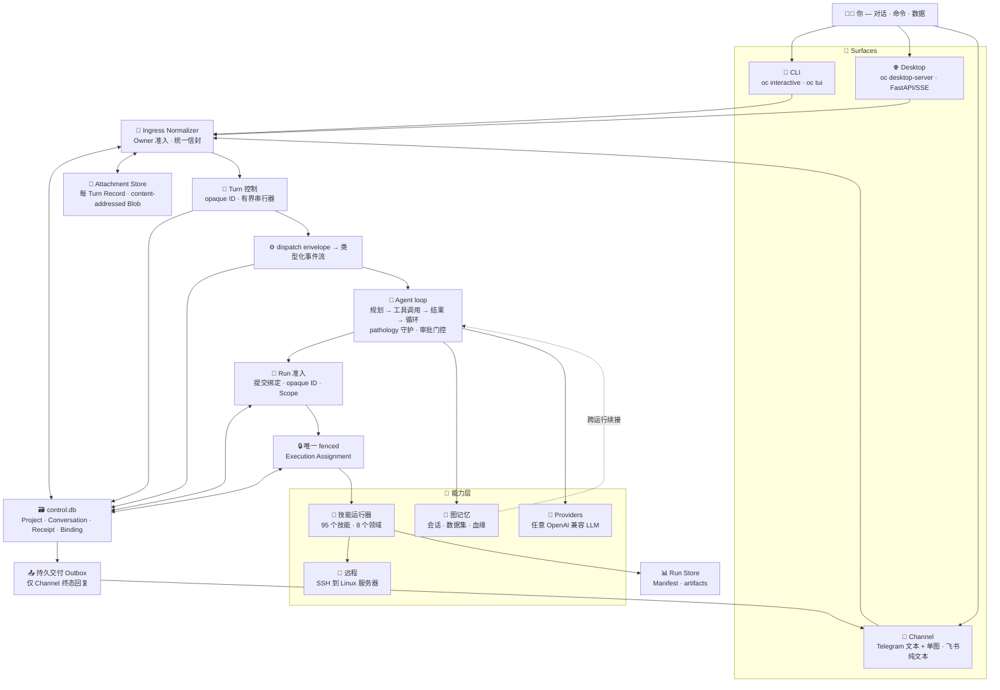

<a id="top"></a>

<div align="center">

<a href="https://github.com/TianGzlab/OmicsClaw">
  
</a>

<h3>面向多组学分析的本地优先 AI 研究助手</h3>

<p>用对话驱动工作流 · 运行可复现技能 · 数据留在本地 · 用记忆延续上下文</p>

<p>
  <a href="README.md"><b>English</b></a> ·
  <b>简体中文</b> ·
  <a href="#-最新动态"><b>最新动态</b></a> ·
  <a href="#-快速开始"><b>快速开始</b></a> ·
  <a href="#-架构"><b>架构</b></a> ·
  <a href="#-领域"><b>领域</b></a> ·
  <a href="https://TianGzlab.github.io/OmicsClaw/"><b>文档站</b></a>
</p>

[](https://www.python.org/downloads/)
[](https://opensource.org/licenses/Apache-2.0)
[](https://github.com/psf/black)
[](https://github.com/TianGzlab/OmicsClaw/actions/workflows/pr-ci.yml)
[](https://TianGzlab.github.io/OmicsClaw/)
[](https://github.com/TianGzlab/OmicsClaw/releases/latest)
[](https://github.com/TianGzlab/OmicsClaw/releases)
[](https://github.com/TianGzlab/OmicsClaw/releases/latest)

</div>

> **OmicsClaw 把本地多组学工具变成 AI 可调用的技能。** LLM 负责规划与编排；Python、R、CLI 工具在你的本地或远程运行时里实际处理数据 —— 原始矩阵永不离开你的机器。一个 agent loop 同时驱动终端 CLI、桌面 App、Telegram 文本/单图与飞书纯文本通道，并由图记忆托底，让分析得以续接而非重来。

## 📢 最新动态

- **🤝 共识运行时** — 多方法共识现在是一个声明式工作流运行时。并行 fan-out N 个空间聚类或单细胞方法，再用经过验证的类型化算子或探索性 LLM 综合来合并。由 `consensus-domains` 与 `sc-consensus-clustering` 两个技能触发。
- **🧠 自主分析路径** — Analysis Router 可以基于你的数据为精确匹配的技能补全参数，或运行生成式代码分析，并对工作区写入做审批门控、对 LLM 修复做有界约束。
- **⚡ Prompt 前缀缓存** — 跨轮自动命中 provider 缓存，降低延迟与 token 开销。
- **🖥️ 桌面端升级** — 带规划引导的实时待办列表、交互式 `ask_user` 选择工具，以及 LLM 生成的会话标题。

<details>
<summary><b>更早的更新</b></summary>

- **Provider** — 实时发现 Ollama 模型并标注工具能力，新增 DashScope 上的 `qwen3.7-max`。
- **Surfaces 雨伞** — CLI、Desktop、Channels 统一到同一 dispatch + 类型化事件流。
- **循环健康** — ping-pong / 重复失败的 pathology 检测 + 软自纠。

</details>

## 🖥️ App 工作区

<p align="center">
  
</p>

<p align="center">
  <b>一个工作区统一对话、数据集、技能、执行、记忆与分析产出。</b>
</p>

<p align="center">
  <a href="https://github.com/TianGzlab/OmicsClaw/releases/latest"><b>📥 下载 OmicsClaw 桌面应用</b></a>
  &nbsp;·&nbsp;
  <a href="https://github.com/TianGzlab/OmicsClaw/releases"><b>所有版本</b></a>
  &nbsp;·&nbsp;
  <a href="https://github.com/TianGzlab/OmicsClaw/releases/latest/download/SHA256SUMS.txt"><b>SHA256SUMS</b></a>
</p>

**[Releases](https://github.com/TianGzlab/OmicsClaw/releases)** 页提供预编译的桌面安装包——内置与 CLI 同源的 `oc desktop-server`，外层是开箱即用的 Electron 对话界面。按平台直接下载：

| 平台 | 安装包 |
|---|---|
| <picture><source media="(prefers-color-scheme: dark)" srcset="https://api.iconify.design/simple-icons:apple.svg?color=%23ffffff"></picture> **macOS — Apple Silicon** (M1 / M2 / M3 / M4) | [`OmicsClaw-<ver>-arm64.dmg`](https://github.com/TianGzlab/OmicsClaw/releases/latest) |
| <picture><source media="(prefers-color-scheme: dark)" srcset="https://api.iconify.design/simple-icons:apple.svg?color=%23ffffff"></picture> **macOS — Intel** | [`OmicsClaw-<ver>-x64.dmg`](https://github.com/TianGzlab/OmicsClaw/releases/latest) |
| <picture><source media="(prefers-color-scheme: dark)" srcset="https://api.iconify.design/simple-icons:windows.svg?color=%23ffffff"></picture> **Windows — x64 / ARM64** | [`OmicsClaw.Setup.<ver>-x64.exe`](https://github.com/TianGzlab/OmicsClaw/releases/latest) · [`OmicsClaw.Setup.<ver>-arm64.exe`](https://github.com/TianGzlab/OmicsClaw/releases/latest) |
| <picture><source media="(prefers-color-scheme: dark)" srcset="https://api.iconify.design/simple-icons:linux.svg?color=%23ffffff"></picture> **Linux — x64** | [`.AppImage`](https://github.com/TianGzlab/OmicsClaw/releases/latest) · [`.deb`](https://github.com/TianGzlab/OmicsClaw/releases/latest) · [`.rpm`](https://github.com/TianGzlab/OmicsClaw/releases/latest) |
| <picture><source media="(prefers-color-scheme: dark)" srcset="https://api.iconify.design/simple-icons:linux.svg?color=%23ffffff"></picture> **Linux — ARM64** | [`.AppImage`](https://github.com/TianGzlab/OmicsClaw/releases/latest) |

> 下载后用同 release 里的 `SHA256SUMS.txt` 校验完整性。桌面端与 CLI 共用同一后端，分析、记忆、远程运行时在两端之间无缝迁移。

## 💡 为什么选择 OmicsClaw？

| 常见痛点 | OmicsClaw 的回应 |
|---|---|
| 分析每次都从零开始 | 持久化的工作区、会话与图记忆 |
| Python、R、CLI 工具散落各处 | 统一的技能运行器 + 自然语言路由 |
| 大数据放在服务器上 | 本地 UI + 通过 SSH 远程在 Linux 上执行 |
| 报告、产物、参数互相漂移 | 标准化技能输出契约 + 可复现 demo |

## ✨ 能力

| | | | |
|---|---|---|---|
| 🧠 **记忆**<br/>会话、偏好、血缘 | 🔒 **本地优先**<br/>原始数据留在你的运行时 | 🧰 **95 个分析技能**<br/>自动生成目录 + demo | 🧭 **智能路由**<br/>自然语言映射到工具 |
| 💬 **CLI Surface**<br/>`oc interactive`、`oc tui` | 🌐 **Desktop Surface**<br/>给桌面/Web 前端用的 FastAPI | 📨 **Channel Surface**<br/>Telegram 文本 + 单图、飞书纯文本；其余适配器关闭待迁移 | 📡 **远程模式**<br/>SSH 隧道到 Linux 服务器 |
| 🤝 **共识**<br/>多方法合并 | 🤖 **自主路径**<br/>Router + 参数辅助 | 🔌 **任意 LLM**<br/>OpenAI 兼容 provider | 📊 **可复现**<br/>图 + 数据 + 报告 |

<details>
<summary><b>自主分析路径 —— 路由模式怎么工作</b></summary>

OmicsClaw 优先使用匹配的内置技能，但为其余情况内置了一等的自主路径。行为由 `OMICSCLAW_ANALYSIS_ROUTER_MODE=off|assist|auto` 控制（缺省 `assist`）：

- **`assist`** —— 精确匹配的技能获得**数据驱动的参数辅助**：技能选择保持确定性，由外层 LLM 在该技能*内部*推荐方法与参数 —— 以匹配技能的 `SKILL.md` 方法菜单和 `inspect_data` schema 为依据 —— 仅在关键歧义处问一个聚焦问题。
- **`auto`** —— **照写即跑**的字面路径：把 exact / no / partial 分析路由提交进既有的工具策略、审批、transcript 与完成结果流水线（无外层 LLM），并尊重请求中显式指定的方法。
- **`off`** —— 完全关闭 router。

旧的 `OMICSCLAW_ANALYSIS_ROUTER_ENABLED=true` 仍被当作 `auto` 接受。生成式代码分析由唯一的 autonomous 引擎 —— **Autonomous Code Mini-Agent**（`omicsclaw/autonomous/`）执行：一个分层隔离的常驻 Jupyter kernel 战术 agent，经受控 `oc` 句柄调用 vetted skill，并以 replay 重放作为验收闸门。

设计说明：[ADR 0032](docs/adr/0032-autonomous-code-mini-agent.md) 定义了该 fallback 路径的架构：有界 autonomous code mini-agent、受控技能句柄、**分层隔离**的常驻 Jupyter kernel（有 bwrap 走 OS envelope、无 bwrap 走进程内 guard）与 replay validation。自 2026-06-22 单引擎合并起，它是**唯一**的 autonomous 引擎 —— 永远开、无 flag、无 legacy 一次性 runner。

</details>

## 🏗️ 架构

三个 Surface，**一个 agent loop**。Prompt-toolkit/single-shot CLI 的对话输入、Desktop 文本、Owner-only Telegram 文本/单图与 Owner-only 飞书纯文本现在都通过生产 `ControlRuntime`：统一规范化为 `RawInboundV1`，将可重试提交绑定到唯一 Turn，按 Conversation 串行执行完整 Turn，并以 Backend 独占的 `control.db` 作为 Conversation、Turn、入站幂等与 Delivery 生命周期权威。独立 `transcripts.db` 保存规范 Transcript；独立 `attachments.db` 与 content-addressed Blob 树保存每 Turn 不可变 Attachment Record。Telegram 单张普通图片可带 caption；重复判断先于惰性下载，控制事务只提交 Store identity、batch commitment 与结构化 Attachment Reference。飞书只接收已配置 Owner 的文本，群聊还必须精确提及已配置的 Bot。Transcript 永不持久化 Base64/provider handle/临时路径；每次模型调用前才在总图片数和总字节预算内临时解析并校验图片。Telegram 相册、文档和音视频、飞书附件/rich post/card、所有出站媒体、Desktop/CLI 附件与 File Reference、Textual TUI、其他 Channel Adapter、工具/Run 附件消费和迁移/清除仍显式关闭。更广的 Project、Run Dispatcher 与 Memory projector 目标尚未完整实现。

Prompt-toolkit REPL 的精确 `/run <canonical-skill> --demo` 与根 exact-demo 命令族是两个独立 typed non-chat Run Adapter。根只接受三种固定顺序 wire：省略 Scope、`--demo --project <32位小写十六进制ID>`、`--demo --no-project`。省略时，legacy current-Project pointer 只作为有界、零写入的导航提示，并由 Control 验证 active Project；显式 Project 直接冻结 `ProjectScope`，missing/archived 必须拒绝且不得降级；显式 `--no-project` 直接冻结 `UnassignedScope`，完全不读取 current pointer。每次命令只生成一个新的 Submission ID，冻结 Backend Registry 资源合同并经同一 `RunRuntime` 执行；一旦进入 canonical 边界，alias、冲突、重复、倒序、缩写、attached-value、执行失败和关闭失败都绝不回落 legacy runner。根 non-demo/其他带选项形态、Control-backed Project 生命周期命令、Textual TUI、`/interpret`、其他 prompt-toolkit Run 与 broader Remote 仍属后续迁移。

Channel 的终态交付也与 Turn 执行分离：Turn 的终态事务创建唯一持久 Outbound Delivery，其有序 Items 只引用已持久化的 Transcript/科学产物内容；单进程 Delivery Pump 只重试 provider 交付。入站重复投递、交付失败和显式 resend 都不能重跑 Turn，Desktop/CLI 仍通过观察既有状态恢复，而不是消费 Outbox。

Run 排队与计算资源准入同样分离：Desktop `POST /v1/runs`、精确 prompt-toolkit demo、三种 root exact-demo Scope wire 与 Remote exact-demo `POST /jobs` 现在进入同一个 canonical Simple Skill Runtime 和唯一有界、进程内、严格 FIFO 的 Run Dispatcher；Dispatcher 在提交该 Run 唯一的 Execution Assignment 前，先取得首个执行单元的资源容量。共享 Execution Resource Scheduler 为该 Runtime 与 Candidate plan 原子核算进程槽、CPU、内存、GPU、线程和临时磁盘。Assignment 在启动前原子绑定 write-once Linux user-systemd scope；parent-death launcher 与 bubblewrap PID/cgroup namespace 约束完整进程树，恢复只在 unit 消失或 cgroup `populated=0` 后收口 Receipt。无法确认 owner 或完成证据时保留非终态 Receipt 并隔离 novel admission。Dispatcher 与 Scheduler 都不持久化可执行载荷，也不能授权重启重放；Resource Lease 只表示容量，不表示 Run 所有权。Workflow、Candidate-plan 顶层调度、Autonomous、root non-demo/其他 option-bearing 形态、Textual TUI、其他 prompt-toolkit Run、Agent/Bench 与 broader Remote 尚未收敛到同一组 Interface。

Run 完整性证据也已从瞬态日志收口为持久控制事实：Migration 9 新增 append-only、content-free ledger，记录 Assignment fence 违规、冲突终态报告、Manifest/Receipt 漂移、无法确认的执行 owner 与恢复终态提交失败。相同事实按只含闭合生命周期字段的版本化摘要幂等去重；原始异常、路径、参数、日志、凭据、Manifest 内容和 Execution Reference 均不得进入记录或摘要。`GET /v1/run-integrity-incidents` 在恢复隔离期间仍可做有界纯观察，但不能读取 Run Store 内容、入队、申请 Lease、Assignment、重放或修复 Run；启动时对已终态且已 Assignment 的 tracer Run 只审计、不改写 Receipt 或 Manifest。



在单次对话之外，还有两个独立子系统跑长任务：**多 agent 研究流水线**（`omicsclaw/agents/`，intake → plan → research → execute → analyze → write → review）与 **AutoAgent** 实验/优化循环。完整拆解见 [`docs/architecture/`](docs/architecture/)。

## ⚡ 快速开始

```bash
git clone https://github.com/TianGzlab/OmicsClaw.git
cd OmicsClaw
bash 0_setup_env.sh
conda activate OmicsClaw
oc list
oc run spatial-preprocess --demo --output /tmp/omicsclaw_demo
```

配置对话与运行时：

```bash
oc onboard
oc interactive
```

如果 `oc` 不在 `PATH` 中，用 `python omicsclaw.py <command>` 替代。

<p align="center">
  
</p>

## 🧭 接入方式

选择适合你工作流的入口 —— 它们最终都到达同一后端。

| Surface | 命令 | 用途 |
|---|---|---|
| 💬 **CLI Surface** | `oc interactive` / `oc tui` | 终端里的自然语言工作流（REPL + 全屏 TUI） |
| 🌐 **Desktop Surface** | `oc desktop-server` | 给 OmicsClaw-App 与浏览器前端用的 FastAPI 后端 |
| 📨 **Channel Surface** | `python -m omicsclaw.surfaces.channels --channels telegram`<br/>`python -m omicsclaw.surfaces.channels --channels feishu` | 仅 Owner 可用的 Telegram 文本 + 单图/caption 与飞书纯文本；其他媒体及适配器显式关闭 |
| 🧪 技能运行器（非 Surface） | `oc run <skill> --demo` | 一次性可复现分析 |
| 🔌 MCP（非 Surface） | `oc mcp add ...` | 外部工具接入 |
| 📡 远程模式 | SSH 上跑 `oc desktop-server` | 服务端数据与任务 |

远程模式使用 `127.0.0.1` + SSH 隧道 + `OMICSCLAW_REMOTE_AUTH_TOKEN`。详见 [remote execution](docs/engineering/remote-execution.mdx) 与 [legacy remote guide](docs/_legacy/remote-connection-guide.md)。

生产 Channel 范围由 shared runner 与 `ControlRuntime` 共同承载：仅 Owner
可用的 Telegram 文本与单张普通图片，以及仅 Owner 可用的飞书纯文本。
使用 `pip install -e ".[channels]"` 安装两个权威 SDK。飞书必须配置
`FEISHU_ALLOWED_SENDERS` 与 `FEISHU_BOT_OPEN_ID`，后者用于证明群消息确实
@ 了当前 Bot。其他 Channel Adapter 仍保持 gated。出站媒体仍未完成并保持
fail-closed；本里程碑不代表 ADR 或媒体能力已全部完成。

## 📦 安装

| 路径 | 适用 | 命令 |
|---|---|---|
| 🥇 **完整 conda** | 用 Python + R + 生信 CLI 的真实分析 | `bash 0_setup_env.sh` |
| 🪶 **轻量 venv** | 对话、路由、开发、纯 Python 技能 | `pip install -e ".[interactive]"` |
| 📨 **Telegram + 飞书 Channel** | 生产 Owner-only Channel 输入 | `pip install -e ".[channels]"` |
| 🖥️ **桌面/Web 后端** | OmicsClaw-App 或浏览器前端 | `oc desktop-server --host 127.0.0.1 --port 8765` |
| 🧠 **记忆 API** | 通过 HTTP 检视图记忆 | `pip install -e ".[memory]"` 然后 `oc memory-server` |

📖 详细见 [安装指南](docs/_legacy/INSTALLATION.md) 与 [快速上手](docs/introduction/quickstart.mdx)。依赖分别由 [`pyproject.toml`](pyproject.toml)、[`environment.yml`](environment.yml)、[`0_setup_env.sh`](0_setup_env.sh) 管理。

## 🧬 领域

`oc list` 与 `skills/catalog.json` 是全部 95 个技能的机器可读注册表，分布在 **8 个领域**。

| 领域 | 技能数 | 示例技能 | 文档 |
|---|---|---|---|
| 🧫 空间转录组 | 19 | QC、domain、注释、解卷积、CNV、轨迹 | [spatial](docs/domains/spatial.mdx) |
| 🔬 单细胞组学 | 33 | QC、聚类、注释、doublet、velocity、GRN | [singlecell](docs/domains/singlecell.mdx) |
| 🧬 基因组学 | 10 | QC、比对、变异、CNV、组装、表观 | [genomics](docs/domains/genomics.mdx) |
| 🧪 蛋白组学 | 8 | DIA/DDA、PTM、网络、biomarker | [proteomics](docs/domains/proteomics.mdx) |
| ⚗️ 代谢组学 | 8 | 峰、归一化、注释、通路 | [metabolomics](docs/domains/metabolomics.mdx) |
| 📈 Bulk RNA-seq | 13 | DE、富集、共表达、解卷积、生存 | [bulkrna](docs/domains/bulkrna.mdx) |
| 🧠 编排 | 2 | 路由、规划、文献支持 | [orchestrator](docs/domains/orchestrator.mdx) |
| 📚 文献 | 1 | PDF/DOI/PubMed/GEO 解析与数据集交接 | — |

完整 CLI 技能列表运行 `oc list` 查看。

## 🧠 记忆

`omicsclaw/memory/` 下的图记忆把会话、数据集、分析、偏好、洞察跨运行串起来 —— 重开任意入口都能找回对话历史与血缘。每个入口相互隔离，状态不会在用户或工作区之间泄漏。

| 入口 | 记忆作用域 |
|---|---|
| CLI / TUI | 按工作区路径 |
| 桌面 App | 按启动（或登录用户） |
| Telegram / 飞书 Bot | 按平台用户 |

保留的 `__shared__` 池（核心 agent 身份、术语表）是所有入口都会自动回读的部分。完整术语与架构详见 [`docs/CONTEXT.md`](docs/CONTEXT.md)。

## 📚 文档

| 主题 | 位置 |
|---|---|
| 🚀 快速上手与配置 | [introduction/quickstart](docs/introduction/quickstart.mdx) |
| 🏗️ 架构 | [`docs/architecture/`](docs/architecture/) |
| 🧬 领域指南 | [spatial](docs/domains/spatial.mdx) · [singlecell](docs/domains/singlecell.mdx) · [genomics](docs/domains/genomics.mdx) · [proteomics](docs/domains/proteomics.mdx) · [metabolomics](docs/domains/metabolomics.mdx) · [bulkrna](docs/domains/bulkrna.mdx) |
| 🧠 领域语言与记忆 | [`docs/CONTEXT.md`](docs/CONTEXT.md) |
| 📡 远程执行 | [engineering/remote-execution](docs/engineering/remote-execution.mdx) |
| 🔒 安全与数据隐私 | [数据隐私](docs/safety/data-privacy.mdx) · [规则与免责声明](docs/safety/rules-and-disclaimer.mdx) |
| 🛠️ 构建技能 | [CONTRIBUTING.md](CONTRIBUTING.md) · [`templates/skill/`](templates/skill/) |
| 🤖 仓库 / agent 契约 | [AGENTS.md](AGENTS.md) |

托管文档站：**<https://TianGzlab.github.io/OmicsClaw/>**

## ❓ FAQ

<details>
<summary><b>OmicsClaw 会上传我的原始数据吗？</b></summary>

不会。技能在你配置的本地或远程运行时里执行；LLM 调用收到的是上下文和工具结果，不包含原始组学矩阵。

</details>

<details>
<summary><b>我应该选哪种安装方式？</b></summary>

真实分析用 `bash 0_setup_env.sh`。轻量 venv 仅用于对话、路由、开发、纯 Python 技能。

</details>

<details>
<summary><b>桌面 App 能在服务器上跑任务吗？</b></summary>

可以。在远程 Linux 上运行 `oc desktop-server`，绑定 `127.0.0.1`，再通过 App 的 SSH 隧道运行时连接过来。

</details>

## ⚠️ 安全

| 规则 | 含义 |
|---|---|
| 🔒 本地优先 | 原始数据处理发生在你的本地或远程运行时 |
| 🧪 仅供研究 | 不是医疗器械，不提供临床诊断 |
| 👩‍🔬 专家复核 | 在做决策前由领域专家验证科学产出 |
| 🔐 远程谨慎 | 使用 localhost 绑定、SSH 隧道与 token |

> OmicsClaw 是一个用于多组学分析的研究与教育工具。它不是医疗器械，也不提供临床诊断。在基于这些结果做决策前，请咨询领域专家。

详见 [数据隐私](docs/safety/data-privacy.mdx) 与 [使用规则与免责声明](docs/safety/rules-and-disclaimer.mdx)。

## 👥 社区

维护者：Luyi Tian（首席研究员）、Weige Zhou（主导开发）、Liying Chen（开发）、Pengfei Yin（开发）。

🐛 [Issues](https://github.com/TianGzlab/OmicsClaw/issues) · 💬 [Discussions](https://github.com/TianGzlab/OmicsClaw/discussions) · 📖 [文档站](https://TianGzlab.github.io/OmicsClaw/)

<table>
  <tr>
    <td align="center" width="30%">
      
      <br/>
      <b>微信交流群</b>
      <br/>
      <sub>扫码加入</sub>
    </td>
    <td valign="middle" width="70%">
      欢迎扫码加入微信群，分享分析经验、反馈问题、与社区交流多组学 AI 工作流。
    </td>
  </tr>
</table>

<a href="https://github.com/TianGzlab/OmicsClaw/graphs/contributors">
  
</a>

## 🙏 致谢

OmicsClaw 的架构、技能设计和本地优先理念深受 **[ClawBio](https://github.com/ClawBio/ClawBio)**（生物信息学场景下较早的原生 AI agent 技能库）启发。记忆与会话续接模式参考了 [Nocturne Memory](https://github.com/Dataojitori/nocturne_memory)。

## 🛠️ 贡献

- **新增技能**：参考 [CONTRIBUTING.md](CONTRIBUTING.md) 与 [`templates/skill/`](templates/skill/) 的 v2 脚手架。
- **仓库 / agent 开发**：参考 [AGENTS.md](AGENTS.md) —— 包含 contract 测试、provider 契约、技能运行器、架构文档索引。

## 📜 许可证

Apache-2.0，详见 [LICENSE](LICENSE)。

## 📝 引用

```bibtex
@software{omicsclaw2026,
  title = {OmicsClaw: A Memory-Enabled AI Agent for Multi-Omics Analysis},
  author = {Zhou, Weige and Chen, Liying and Yin, Pengfei and Tian, Luyi},
  year = {2026},
  url = {https://github.com/TianGzlab/OmicsClaw}
}
```

[⬆ 返回顶部](#top)
