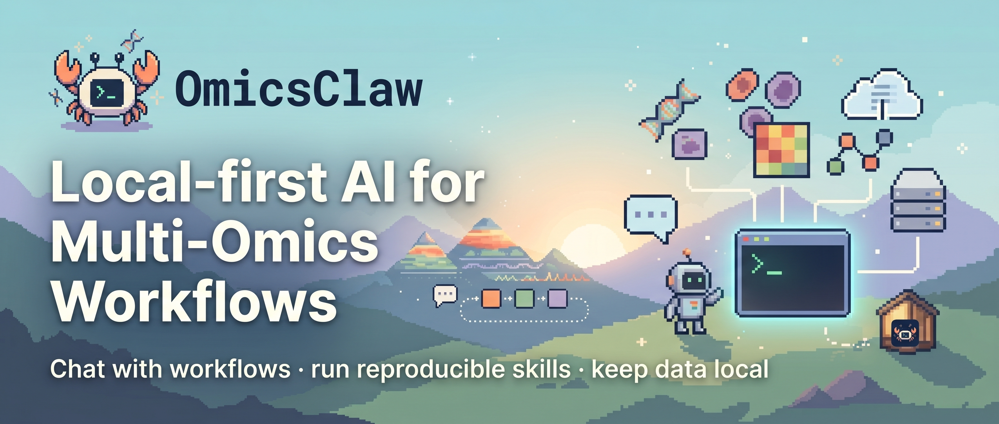
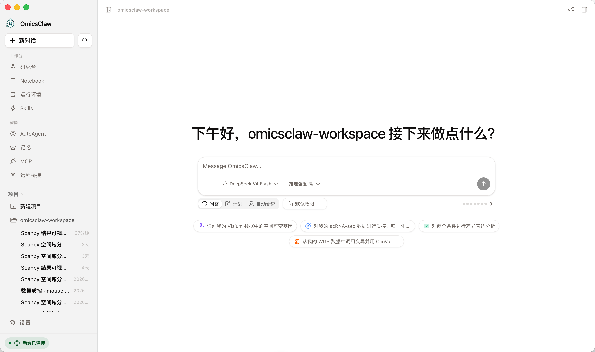

<a id="top"></a>

<div align="center">

<a href="https://github.com/TianGzlab/OmicsClaw">
  
</a>

<h3>面向多组学分析的本地优先 AI 研究助手</h3>

<p>
  <a href="README.md">English</a> ·
  <b>简体中文</b> ·
  <a href="#快速开始">快速开始</a> ·
  <a href="#桌面-app">桌面 App</a> ·
  <a href="#领域">领域</a> ·
  <a href="https://TianGzlab.github.io/OmicsClaw/">文档站</a>
</p>

[](https://www.python.org/downloads/)
[](https://opensource.org/licenses/Apache-2.0)
[](https://TianGzlab.github.io/OmicsClaw/)
[](https://github.com/TianGzlab/OmicsClaw/releases/latest)
[](https://github.com/TianGzlab/OmicsClaw/releases)
[](https://github.com/TianGzlab/OmicsClaw/releases/latest)

</div>

OmicsClaw 是一个做多组学分析的 AI agent。你用自然语言说明要做的分析，模型挑选合适的
skill，读它的说明，再在你自己的环境里（本机或服务器）运行其中的 Python、R 或命令行工具。
仓库自带 7 个领域共 90 个 skill；终端、桌面 App 和聊天平台背后是同一个 agent。

## 最新动态

- agent 框架已经重写，入口改为 `oc cli`、`oc desktop` 和 `oc channel` 三个，`oc interactive`、`oc tui`、`oc onboard`、`oc run` 等旧命令已移除（[重写进展](docs/FRAMEWORK-REBUILD.md)）。
- 桌面 App 已能连接重写后的后端，支持经 SSH 的远程模式，也能在 App 里配置模型（[0064](docs/plans/0064-desktop-app-alignment.md)、[0065](docs/plans/0065-desktop-management-pages-and-retirement.md)、[0066](docs/plans/0066-desktop-remote-mode.md)）。
- agent 会告诉你当前环境缺哪些 skill 需要的包；设置 `OMICSCLAW_SKILL_ENV=install` 后，它可以在你批准后把这些包装进独立的 overlay 环境，基础环境保持不变（[0061](docs/plans/0061-adaptive-env-provisioning.md)）。
- `run_skill` 把一个 skill 的多种方法作为并行、带打分的试验来运行，并针对每个数据集调参，目前支持的是 `spatial-domains`（[0056](docs/plans/0056-ensemble-foundation.md)、[0057](docs/plans/0057-ensemble-tuning.md)）。
- `oc channel` 支持 Telegram、飞书、Slack、Discord、钉钉、QQ 和 Email；WeChat/WeCom 适配器因为不校验收到的消息，已经下线。

更早的记录见 [CHANGELOG.md](CHANGELOG.md)（英文）。

## 快速开始

```bash
git clone https://github.com/TianGzlab/OmicsClaw.git
cd OmicsClaw
bash 0_setup_env.sh        # 创建名为 OmicsClaw 的 conda 环境
conda activate OmicsClaw
oc cli --configure         # 选择模型服务商并填入 API key
oc cli                     # 在终端里开始对话
```

`oc cli --configure` 会把答案写进 `.env` 文件。它依次询问服务商（共 13 个预设，包括
DeepSeek、OpenAI、Anthropic、Gemini、DashScope 上的 Qwen、Ollama 以及任意 OpenAI
兼容接口）、API key、模型、可选的 base URL，以及允许 agent 读写的工作目录。agent 从
`<workspace>/skills` 读取 skill，所以工作目录不是仓库检出目录时，还要在 `.env` 里设置
`OMICSCLAW_SKILLS_DIR=<检出目录>/skills`。`oc cli --prompt "..."` 只回答一个问题就退出。
如果 `oc` 不在 `PATH` 里，用 `python omicsclaw.py cli`。

skill 本身就是普通脚本，也可以不经过 agent 直接运行：

```bash
make list    # 按领域列出全部 skill
python skills/spatial/spatial-preprocess/spatial_preprocess.py --demo --output /tmp/omicsclaw_demo
```

## 使用方式

| 场景 | 启动方式 | 用途 |
|---|---|---|
| 终端 | `oc cli` | 和 agent 对话。`/resume` 打开之前的对话，`/skills` 列出 skill，`/help` 列出其他命令 |
| 桌面 App | 由 App 启动 `oc desktop` | 在桌面窗口里对话、处理审批、查看文件（见[下文](#桌面-app)） |
| 远程服务器 | 在服务器上运行 `oc desktop` | App 通过自己的 SSH 隧道连过去，数据留在服务器上（[远程模式](docs/engineering/remote-execution.mdx)） |
| 聊天平台 | `oc channel --channels telegram` | 仅限 owner 的文本对话，支持 Telegram、飞书、Slack、Discord、钉钉、QQ、Email。`oc channel --list` 列出这些平台。需要先在 `.env` 里设置 `OMICSCLAW_APPROVAL_TIMEOUT_S`，否则无法启动 |
| 直接跑 skill 脚本 | `python <skill 目录>/<script>.py` | 不经过 agent 跑一次分析。每个 skill 的 `SKILL.md` 写明了参数 |

对话记录和 agent 的长期笔记存在 `<workspace>/.omicsclaw/memory.db`。`<workspace>/.mcp.json`
里列出的 MCP 服务器会在启动时连接，它们的工具也会交给 agent 使用。

agent 在运行 shell 命令、写入或修改文件、访问网络、调用 MCP 工具之前会先问你。在终端里可以只允许这一次、
在本次对话里允许这个工具，或者永远允许这条完全相同的调用；`/auto` 会停止对普通操作的询问。
危险命令以及对 `.omicsclaw/`、`.env` 的改动仍然每次都问。危险命令检查靠的是一份模式清单，
刻意构造的命令可以绕过它。所以如果让 agent 无人值守地工作，请设置 `OMICSCLAW_SANDBOX=docker`
和 `OMICSCLAW_SANDBOX_IMAGE`，让它的命令在没有网络的容器里运行（见 [`.env.example`](.env.example)）。

## 桌面 App

<p align="center">
  
</p>

安装包在 [Releases](https://github.com/TianGzlab/OmicsClaw/releases/latest) 页面。下载后请用同一页发布的
[`SHA256SUMS.txt`](https://github.com/TianGzlab/OmicsClaw/releases/latest/download/SHA256SUMS.txt)
核对校验和。

| 平台 | 安装包 |
|---|---|
| macOS，Apple Silicon | `OmicsClaw-<ver>-arm64.dmg` |
| macOS，Intel | `OmicsClaw-<ver>-x64.dmg` |
| Windows，x64 或 ARM64 | `OmicsClaw.Setup.<ver>-x64.exe`、`OmicsClaw.Setup.<ver>-arm64.exe` |
| Linux，x64 | `.AppImage`、`.deb`、`.rpm` |
| Linux，ARM64 | `.AppImage` |

安装包里不带 Python。App 会让你指定一个装好了 OmicsClaw 的解释器，一般就是快速开始里建的
conda 环境：

```bash
conda run -n OmicsClaw python -c "import sys; print(sys.executable)"
```

之后 App 会为你打开的项目启动 `oc desktop`，一个后端对应一个项目。模型配置来自后端的 `.env`，
可以在 App 的 Providers 页面修改，后端重启后生效。排障见 [App 指南](docs/ecosystem/omicsclaw-app.mdx)，
HTTP 接口约定见 [`docs/core-features/surfaces.md`](docs/core-features/surfaces.md) 第 8 节。

## 安装

| 方式 | 命令 | 覆盖范围 |
|---|---|---|
| conda（推荐） | `bash 0_setup_env.sh` | skill 需要的 Python、R 和命令行工具，以及桌面后端 |
| pip | `pip install -e .` | 只够终端对话。多数 skill 需要的包由 conda 环境提供，桌面后端依赖的 FastAPI 和 uvicorn 也来自 conda |

聊天平台各自需要 SDK：Telegram 和飞书用 `pip install -e ".[channels]"`，Slack 用
`pip install slack-sdk aiohttp`，Discord 用 `pip install discord.py`，钉钉用
`pip install httpx websockets`，QQ 用 `pip install qq-botpy`；Email 只用标准库。依赖清单见
[`environment.yml`](environment.yml) 和 [`pyproject.toml`](pyproject.toml)。

## 领域

7 个领域共 90 个 skill，`make list` 可以打印当前索引。

| 领域 | skill 数 | 示例 | 指南 |
|---|---|---|---|
| 空间转录组 | 19 | QC、空间域、注释、解卷积、CNV、轨迹 | [spatial](docs/domains/spatial.mdx) |
| 单细胞组学 | 34 | QC、聚类、注释、双细胞、RNA velocity、GRN | [singlecell](docs/domains/singlecell.mdx) |
| 基因组学 | 10 | QC、比对、变异、CNV、组装、表观基因组 | [genomics](docs/domains/genomics.mdx) |
| 蛋白质组学 | 8 | DIA/DDA、PTM、网络、生物标志物 | [proteomics](docs/domains/proteomics.mdx) |
| 代谢组学 | 8 | 峰检测、标准化、注释、通路 | [metabolomics](docs/domains/metabolomics.mdx) |
| Bulk RNA-seq | 14 | 差异表达、富集、共表达、解卷积、生存分析、cosinor 节律 | [bulkrna](docs/domains/bulkrna.mdx) |
| 文献 | 1 | 解析 PDF、DOI、PubMed、GEO，并交接数据集 | |

## 文档

| 主题 | 位置 |
|---|---|
| 快速上手 | [introduction/quickstart](docs/introduction/quickstart.mdx) |
| 桌面 App | [ecosystem/omicsclaw-app](docs/ecosystem/omicsclaw-app.mdx) |
| 远程模式 | [engineering/remote-execution](docs/engineering/remote-execution.mdx) |
| 领域指南 | [spatial](docs/domains/spatial.mdx) · [singlecell](docs/domains/singlecell.mdx) · [genomics](docs/domains/genomics.mdx) · [proteomics](docs/domains/proteomics.mdx) · [metabolomics](docs/domains/metabolomics.mdx) · [bulkrna](docs/domains/bulkrna.mdx) |
| 安全与数据隐私 | [数据隐私](docs/safety/data-privacy.mdx) · [规则与免责声明](docs/safety/rules-and-disclaimer.mdx) |
| 编写 skill | [CONTRIBUTING.md](CONTRIBUTING.md) · [`templates/skill/`](templates/skill/) |
| 框架设计 | [`docs/FRAMEWORK-REBUILD.md`](docs/FRAMEWORK-REBUILD.md)（英文） |
| 更新记录 | [CHANGELOG.md](CHANGELOG.md)（英文） |

在线文档站：<https://TianGzlab.github.io/OmicsClaw/>

## 安全与数据

skill 在你自己的运行环境里（本地或远程）读取和处理数据，模型收到的是对话内容和工具返回的结果。
OmicsClaw 是科研工具，不是医疗器械，不提供临床诊断；依据结果做决定前，请让领域专家核实。
在服务器上运行时，让 `oc desktop` 只监听 localhost，通过 SSH 访问；绑定到非回环地址时必须设置
`OMICSCLAW_REMOTE_AUTH_TOKEN`。详见[数据隐私](docs/safety/data-privacy.mdx)和[规则与免责声明](docs/safety/rules-and-disclaimer.mdx)。

## 社区

维护者：Luyi Tian（首席研究员）、Weige Zhou（主导开发）、Liying Chen（开发）、Pengfei Yin（开发）。

[Issues](https://github.com/TianGzlab/OmicsClaw/issues) · [Discussions](https://github.com/TianGzlab/OmicsClaw/discussions) · [文档站](https://TianGzlab.github.io/OmicsClaw/)

<table>
  <tr>
    <td align="center" width="30%">
      
      <br/>
      微信交流群
    </td>
    <td valign="middle" width="70%">
      扫码加入微信群，交流分析经验，遇到问题也可以在群里求助。
    </td>
  </tr>
</table>

<a href="https://github.com/TianGzlab/OmicsClaw/graphs/contributors">
  
</a>

## 致谢

OmicsClaw 的架构、skill 设计和本地优先的思路受到 [ClawBio](https://github.com/ClawBio/ClawBio)
的启发，它是较早面向生物信息学的 AI agent skill 库。记忆与会话延续的做法参考了
[Nocturne Memory](https://github.com/Dataojitori/nocturne_memory)。

## 贡献

新增 skill 请看 [CONTRIBUTING.md](CONTRIBUTING.md) 和 [`templates/skill/`](templates/skill/) 下的脚手架。
参与框架本身的开发，从 [AGENTS.md](AGENTS.md) 开始。

## 许可证

Apache-2.0，详见 [LICENSE](LICENSE)。

## 引用

```bibtex
@software{omicsclaw2026,
  title = {OmicsClaw: A Memory-Enabled AI Agent for Multi-Omics Analysis},
  author = {Zhou, Weige and Chen, Liying and Yin, Pengfei and Tian, Luyi},
  year = {2026},
  url = {https://github.com/TianGzlab/OmicsClaw}
}
```

[返回顶部](#top)
