# OmicsClaw Architecture Ledger

> **Canonical architecture ledger.** This file separates three kinds of truth:
> **as-built** behavior verified in code/tests, **accepted target** behavior
> selected by ADRs but not yet implemented, and explicit **architecture drift**.
> An accepted target is not a current implementation claim.
>
> Last verified: 2026-07-19. ADR 0072 is represented below as a local
> implementation candidate whose final gates and mandatory independent review
> remain pending; it is not a `SHIP` claim. Known uncertainties are called out
> rather than filled with assumptions.

## Purpose and document hierarchy

This document answers **what exists now**, **what has been accepted next**, and
**where they differ**, while identifying ownership among major Modules.

- `CONTEXT-MAP.md` and the linked `CONTEXT.md` files define domain language and
  relationships.
- `docs/adr/` preserves why consequential decisions were made over time.
- `docs/design/` describes detailed designs that may evolve beneath an accepted
  architecture decision.
- `docs/plans/`, `docs/proposals/`, and `docs/reviews/` contain future work,
  unaccepted proposals, and review evidence.
- `docs/architecture/*.mdx` is the public-facing projection of this baseline and
  may simplify it, but must not contradict it.
- Dated architecture documents are historical snapshots, not current truth.

Proposed architecture stays in proposals. Accepted target architecture may
appear here before implementation only when labelled **accepted target** and
paired with its as-built/drift statement. It becomes **as-built** only after the
relevant implementation and verification evidence land.

## Accepted target at a glance

The diagram below is the accepted control-plane target, not a claim that every
edge is current runtime. The as-built system already has three user-facing
**Surfaces**, one in-process `dispatch()` path, the agent runtime, and the Skill
system. Stage 1–2b provide the strict `ControlStateRepository`, Backend-owned
text/control-command normalization, durable Turn acceptance, whole-Turn FIFO
execution leases, failure quarantine, cooperative cancellation and
non-replayable startup reconciliation. Scheme 1 adds an independent canonical
Transcript Store bound to Control by opaque Store identity, the terminal
candidate -> Receipt+ref -> promotion -> Event protocol, and a bounded
process-local Event Hub with observer-only Response Sinks. Prompt-toolkit and
single-shot CLI, the Desktop text/multipart-image paths, and Owner-only Telegram text/single-photo input now use
those slices through `ControlRuntime`. Scheme 2 adds the persistent text
Delivery Outbox, target-local sequencing, restart-resilient Delivery Pump and
single-call Telegram Adapter. Scheme 3 adds the independent Attachment Store,
content-free Control commitments, startup reconciliation, structured durable
References and per-call-bounded ephemeral image rendering. Scheme 4 adds the
strict Desktop multipart Adapter, non-blocking durable submission Interface and
versioned receipt/Event/cancel routes. Its transport is byte/depth/time/concurrency
bounded and proves complete multipart ownership before accepting; the Runtime
compensates live-port or runner-wake failure into one canonical failed Receipt
rather than leaving an accepted Turn queued. Textual TUI and all other Channel Adapters remain
uncut and are gated off rather than started through their legacy entry-point
`MessageEnvelope` paths. Outbound media, CLI attachment input, every File
Reference path, Desktop JSON/options/App adoption, tool/Run attachment
consumption, Surface-wide Run Dispatcher convergence and the Memory projector
remain unimplemented. The canonical Simple Skill Runtime now has four
submission Adapters: Desktop `POST /v1/runs`, the prompt-toolkit REPL's exact
`/run <canonical-skill> --demo`, the root exact-demo Scope command family, and
the Remote compatibility exact-demo `POST /jobs`; broader Run convergence
remains incomplete.

ADR 0072 adds a later local-candidate Desktop closure across the two
repositories. OmicsClaw-App binds each independently observed Job, Chat, or
AutoAgent resource to immutable non-secret routing evidence; AutoAgent also
binds to the Backend database's immutable `control_authority_id`. Novel
AutoAgent creation is receipt-bound, reservation is novel-only, and the same
SQLite transaction installs a 12-second pending cancellation guard behind a
10-second response-header deadline. Backend `control.db` remains the session
and lifecycle authority, while Linux execution requires a user-systemd plus
bubblewrap owner and publishes terminal evidence only after exact tree-stop
proof. Strict terminal shapes and bounded request, IPC, SSE, and proxy readers
prevent transport state from becoming lifecycle state. This candidate does not
converge all Skill-audit, Run, Workflow, Autonomous, or cross-platform paths;
final gates and mandatory independent review remain open.

```mermaid
flowchart LR
  subgraph S["Surfaces"]
    CLI["CLI Surface"]
    DESK["Desktop Surface"]
    CHAN["Channel Surface"]
  end

  CLI -- "conversational input" --> RAW["Raw Inbound"]
  DESK --> RAW
  CHAN --> RAW
  RAW --> NORM["Ingress Normalizer"]
  CONTROL["Backend control.db<br/>identity · receipts · bindings · projection fences"] <--> NORM
  NORM <--> ATTACH["Attachment Store<br/>Records · content-addressed Blobs"]
  NORM --> ENV["Inbound Envelope"]
  ATTACH -. "Attachment References" .-> ENV
  ENV --> SEQ["Per-Conversation Turn Sequencer"]
  SEQ --> CONTROL
  SEQ --> DISPATCH["dispatch → typed Event stream"]
  CTX["Dispatch Context"] --> DISPATCH
  DISPATCH --> EVENTS["Bounded live Turn Event buffer"]
  EVENTS --> SINK["Response Sink observer"]
  DISPATCH --> TERM["Terminal Transcript + Delivery plan"]
  TERM <--> CONTROL
  CONTROL --> PUMP["Persistent Outbound Delivery Outbox<br/>in-process Delivery Pump"]
  PUMP --> DADAPTER["Single-attempt Delivery Adapter"]
  DADAPTER --> CHAN
  DISPATCH --> LOOP["Agent loop"]
  LOOP --> TOOLS["Tool runtime and policy"]
  TOOLS --> ADMIT["Run admission<br/>submission binding · opaque ID · Scope"]
  ADMIT <--> CONTROL
  ADMIT --> RDISPATCH["Bounded Run Dispatcher<br/>strict FIFO · active-Run slots"]
  RDISPATCH --> RSCHED["Execution Resource Scheduler<br/>process · CPU · memory · GPU · disk"]
  RSCHED --> ASSIGN["One fenced<br/>Execution Assignment"]
  ASSIGN <--> CONTROL
  ASSIGN --> EXEC["Run Executor facade"]
  EXEC -. "fixed: per-process Lease<br/>dynamic: governed envelope" .-> RSCHED
  EXEC --> RUN["Run Store<br/>Manifest · artifacts"]

  CLI -- "REPL exact demo / root fixed Scope wires" --> DIRECT["Explicit non-chat Run Request"]
  DESK -. "hosts strict /jobs exact demo" .-> RJOB["Remote Job compatibility Adapter"]
  RJOB --> DIRECT
  DIRECT --> ADMIT

  LOOP <--> MEMORY["Memory and transcript state"]
  EXEC --> REMOTE["Optional remote execution"]
```

Today all three production Surfaces' enabled **conversational inputs** converge
on `dispatch()`, but their cutover boundaries differ. Prompt-toolkit/single-shot
CLI conversational input and Desktop text/multipart-image reach it through Raw
Inbound → Ingress Normalizer → Inbound Envelope → Turn
Sequencer → Agent Worker Adapter; that Adapter alone constructs the temporary
legacy `MessageEnvelope`. Structured CLI `/new` control Turns update the stable
`slot=main` active Conversation binding without entering the Agent. Desktop
requires an explicit Source Request ID for compatibility text and an
`Idempotency-Key` for strict multipart images, advertises both wire contracts,
and separates durable submission from Turn receipt, Event observation and
explicit cancel routes; disconnect only detaches its observer. Telegram derives a stable ingress key,
admits only configured Owner subjects, accepts either text or one ordinary
photo with an optional caption, and persists each terminal text reply as one
canonical Delivery. Separately, the prompt-toolkit REPL's exact
`/run <canonical-skill> --demo` is a typed non-chat `UnassignedScope` Run
Request submitted directly to `RunRuntime`; it creates no Conversation, Turn or
Transcript. The root exact-demo Scope command family uses the same boundary and
accepts only omitted Scope, fixed-order `--demo --project <32-lower-hex-id>`, or
`--demo --no-project`. Only omission may read the legacy current-Project
navigation hint. Explicit Project/Unassigned bypass navigation, and novel
explicit Project admission never downgrades a missing or archived Project. All
other root demo-shaped forms fail closed before legacy Project/output
resolution. The Remote compatibility `POST /jobs` exact-demo Adapter is the
same kind of direct Run Request: it requires explicit Unassigned Scope, a
canonical Skill, empty parameters, complete simple resources and one 32-hex
Submission ID, and exposes the resulting Run as `run-<run_id>`. It belongs to
the Desktop-hosted HTTP compatibility boundary, not a fourth Surface. Root
non-demo/option-bearing forms, Textual TUI `/run`, `/interpret`, non-demo and
option-bearing prompt-toolkit Run forms remain legacy. Textual TUI and disabled
legacy Channel Adapters still construct the incomplete legacy envelope at
their entry points. Canonical
Transcript and bounded Event Hub integration are active on the cut-over paths.
Desktop Attachments/File Selections, conversational `/chat/stream` legacy
`job_id` binding and per-Turn provider credentials are rejected before durable
acceptance. Telegram media groups,
documents, audio/video and outbound media fail closed; other Channel Adapters
fail closed at startup. A profile-driven one-shot importer covers legacy Backend
`transcripts.db` through read-only plan, manifest-bound apply, verification,
consistent backup, isolated staging and atomic cutover; runtime never falls
back to that legacy store. CLI `sessions.db`, Desktop App exports, the remaining
Run callers and the rest of the migration inventory remain future work. The
accepted target's
concrete schemas, transactions, recovery rules and migration contract are
defined in
[`docs/design/conversational-control-plane.md`](design/conversational-control-plane.md).

## Module ownership ledger

### Surfaces

`omicsclaw/surfaces/` owns user and transport interaction:

- **CLI Surface** — interactive REPL, TUI, commands, and local workspace input.
- **Desktop Surface** — FastAPI/SSE backend used by the desktop application;
  Bench is a page within this Surface, not a fourth Surface.
- **Channel Surface** — lifecycle and per-platform Channel Adapters for
  Telegram, Feishu, Slack, Discord, WeChat, WeCom, DingTalk, iMessage, Email,
  and QQ.

The prompt-toolkit/single-shot CLI conversational paths, Desktop
text/multipart-image paths and Telegram text/single-photo path now submit
`RawInboundV1` and render typed Events observed through a process-local
Response Sink. They do not choose canonical Turn or Conversation IDs, and
cancellation targets the accepted Turn ID. Desktop retries with the same Source
Request ID attach to the original Turn, while observer disconnect has no
lifecycle effect. Telegram retries with the same provider message identity bind
to the original Turn, while terminal publication leaves through the persistent
Delivery Outbox rather than a Response Sink. Textual TUI and disabled legacy
Channel Adapters still construct a `MessageEnvelope` at their entry points.
Outside conversational ingress, exact prompt-toolkit
`/run <canonical-skill> --demo` and the three root exact-demo Scope wires submit
typed non-chat Run Requests with fresh Submission IDs to `RunRuntime`. The REPL
uses explicit `UnassignedScope`; root omitted Scope uses a Control-validated
active opaque current Project or Unassigned, while its two explicit selectors
bypass current navigation. Neither enters the Ingress Normalizer; root non-demo
and unsupported option-bearing forms, Textual TUI and all other CLI Run shapes
remain outside these Adapters.
The Desktop-hosted Remote compatibility
`POST /jobs` exact-demo Adapter also enters that boundary directly. It does not
create a Conversation, Turn, Transcript or new Surface, and it cannot infer a
Project from Session, Workspace or legacy Job data.
For Desktop operation binding and AutoAgent, this repository remains the
Backend authority for Control identity, lifecycle, execution, persistence,
provider resolution, result verification and scientific mutation. The separate
OmicsClaw-App repository owns Electron/Next routing, private creation-receipt
retention, bounded retry scheduling, thin proxying and UI projection; it does
not duplicate Backend governance or scientific state.
Under ADR 0046 those remaining paths will instead verify
transport authenticity, decode input into Raw Inbound, and render typed Events;
they will not own Owner admission, Conversation or Project resolution,
attachment staging, file-reference normalization, or final envelope
construction.

### Ingress

The accepted Ingress Normalizer is one in-process control-plane Module shared
by CLI, Desktop, and Channel. It applies Owner admission before durable side
effects, validates the authoritative Project Record when applicable, resolves
the opaque Conversation and immutable optional Project binding, normalizes
content, coordinates accepted attachment publication, validates File
References, records Source Attribution and Reply Target, and emits one
immutable, versioned, JSON-compatible Inbound Envelope.

After Owner admission, every retryable conversational submission is identified
by `(Surface, Source Namespace, Source Request ID)`. The control plane checks a
durable unique Ingress Idempotency Binding from that key to Turn ID plus a
versioned request fingerprint before attachment staging, Conversation
resolution or other durable side effects. The same key and fingerprint returns
the original Turn in any lifecycle state; a fingerprint conflict is rejected;
equal content under another key is a new Owner submission. Accepted bindings
are retained with their Turn Receipts rather than expiring as Adapter TTL
caches.

Raw Inbound describes each declared upload through an ordered, side-effect-free
Source Attachment Descriptor. Descriptors are part of the request fingerprint
but contain no credentials, expiring URLs, local paths, or bytes. A matching
duplicate therefore returns the original Turn and Attachment Records before
the Backend downloads, copies, or republishes content.

For novel accepted intent, the specialized Backend-owned **Attachment Store**
stages the entire batch, validates count, size, media metadata and full SHA-256,
then publishes immutable content-addressed Attachment Blobs and provisional
per-Turn Attachment Records. The control plane commits the Turn Receipt and
Ingress Idempotency Binding only after every Record is readable; the batch is
all-or-nothing. A post-commit finalization marks the Records accepted.
Publish-before-control reconciliation collects old provisional orphans when no
Turn Receipt was committed and promotes Records when the Turn exists. Missing
or corrupt bytes for an accepted Record are an integrity incident and never
cause automatic Turn replay.

Each accepted attachment occurrence has one opaque Attachment ID and belongs
to exactly one Turn and Conversation. Two novel submissions containing equal
bytes remain distinct Attachment Records but may share one Blob. Inbound
Envelope, Transcript, prompts and tools exchange ordered structured Attachment
References rather than Base64, provider handles, signed URLs, temporary paths,
Workspace paths, or a mutable latest-Session file registry. Prompt inlining is
an ephemeral rendering step; every accepted attachment retains its Blob.
File References remain a separate contract for authorized pre-existing
Workspace files.

The current Schemes 3–4 exercise this contract through Telegram single-photo
and Desktop multipart-image ingress, Envelope/Transcript persistence and
provider rendering. Tools do not yet consume Attachment References, File
References are not wired, and no Run Manifest or purge path participates in
Blob retention. The separate OmicsClaw-App has not yet adopted the Backend's
multipart Interface.

Accepted Attachment Records are immutable and have no ordinary individual
delete operation in v1. `/new`, Turn cancellation, observer disconnect,
compaction, Conversation switching and Project Archive retain them. Blob
garbage collection is reference-aware across Attachment Records, Run inputs
and other durable references. A Run Manifest records the Attachment ID and
verified digest of every consumed attachment input. Permanent erasure remains
part of a future governed purge workflow.

Conversation resolution uses a restart-resilient
`(Surface, Reply Target) -> active Conversation ID` binding. An explicit
same-address Conversation ID selects and activates that Conversation;
otherwise ingress follows the existing pointer or creates and installs a new
opaque Conversation.
Each Reply Target has at most one active pointer while retaining historical
Conversations. `/new` replaces the pointer atomically. Selecting a different
Project creates a new Project-bound Conversation and replaces the pointer;
selecting the first Project for an unbound Conversation binds it once in place.
Owner Identity and Project ID never enter the active-binding key.

Project, Conversation, Active Conversation Binding, Turn Receipt, Run Receipt,
Ingress Idempotency Binding, Run Submission Binding, Execution Assignment and
Outbound Delivery identity/lifecycle facts plus content-free Project Projection
Intents belong exclusively to **Control Plane State**. A `project://` Memory
subtree carries Project knowledge, while
`project_meta.json` carries the output subsystem's Project-to-directory
projection; neither can establish that a Project exists or override its current
display metadata or lifecycle. ADR 0054 selects one Backend-exclusive local
SQLite **Control Database** named `control.db` as the physical store for those
facts. The `omicsclaw/control/` Module implements this repository foundation and
its lifetime lock and is mandatory during prompt-toolkit/single-shot CLI and
Desktop text/multipart-image startup. Conversational paths bind one independent
canonical Transcript Store by opaque identity; the exact prompt-toolkit demo
Run Adapter instead shares that Control Repository directly with `RunRuntime`.
Other Surfaces and non-conversational owners remain cutover work.

Project lifecycle is deliberately limited to `active` and `archived`. Archive
is reversible and retains the same Project ID, immutable Conversation bindings,
Active Conversation Bindings, Transcripts, Memory, Runs and files. It closes the
Project to new Conversation bindings, novel Turns, new Runs and Project-scoped
scientific mutation until restore returns that same aggregate to `active`.
One frozen digest-bound Project Projection Intent created while active may
finish exactly its accepted cross-store Memory projection after archive; it
cannot authorize derived or broadened work.
Archive never means permanent data deletion; cross-store purge is outside v1
and requires a separate governed workflow.

Scientific Memory ownership is explicit in the accepted target: Owner
preferences/persona use Owner scope; Project hypotheses, insights, analysis
lineage and Dataset References use Project scope; observations of authorized
pre-existing local files use Workspace scope; uploaded bytes retain Attachment
identity. Owner Identity and legacy Memory Namespace select none of these.

Every Run receives an immutable admission-time **Run Scope**:
`ProjectScope(project_id)` or `UnassignedScope`. A Project scope requires an
existing active Project and its opaque control-generated ID; Unassigned has no
Project ID. The literal `<output root>/default/` remains the non-Project
**Unassigned Run Grouping** for compatibility and is never a Project Record.
Session, Chat, Conversation, directory, slug and display-name identifiers cannot
substitute for Project ID. Completed Runs cannot be moved, retagged, copied or
symlinked into another scope; future cross-Project reuse requires a separate
Project-to-Run reference without rewriting original provenance.

After Owner admission, duplicate ingress lookup precedes the Project lifecycle
gate: an existing key/fingerprint still returns its original Turn even if the
Project was later archived. A novel request targeting an archived Project is
rejected as `project_archived` before Conversation/binding mutation or Turn
acceptance. Archive/restore and Project-aware Turn/Run admission share a
Project-scoped gate; archive returns `project_busy` rather than implicitly
canceling accepted non-terminal work.

Only the Backend control-state Repository opens `control.db`. It uses explicit
small transactions, WAL, full synchronous durability, foreign keys and a
lifetime operating-system lock that permits exactly one control-plane process.
Surfaces, the Desktop App, Memory, Transcript storage, Run storage and local or
remote compute Workers use typed Interfaces instead of opening the file.
`control.db` stores minimal Turn/Run Receipts, Run Submission Bindings, narrow
Execution Assignment fencing facts and Outbound Delivery/Item/Attempt control
metadata plus content-free Project Projection Intents, but not executable Run
Requests, parameters, scientific Memory content, reply bodies, media bytes,
logs, Manifests or artifacts. Transcript, Memory, App, Event, Attachment
Record, Attachment Blob and scientific Run content remain in their separate
stores. A Legacy Identity
Map supports explicit auditable import; after cutover
there is no runtime fallback that reconstructs a missing control record from a
legacy store or projection.

The key is also the Conversation's immutable logical **Conversation Address**.
An explicit Conversation ID is valid only when its stored Surface and Reply
Target match the current address. Continuing at another Reply Target creates a
new Conversation, normally under the same Project; Transcript state is never
moved or merged. Reply Target is stable serializable data in Inbound Envelope.
The live SSE writer, terminal renderer, Channel progress renderer, or equivalent
**Response Sink** is a process-local observer attachment. It may detach and be
replaced during the same live Turn without changing Conversation, Turn status
or cancellation state. A canonical terminal Channel reply is instead an
Outbound Delivery to this same immutable Reply Target.

For each accepted Channel Turn, deterministic terminalization first commits and
verifies the terminal Transcript entry plus durable outbound artifact
references. One `control.db` transaction then marks the Turn Receipt terminal
and inserts at most one canonical `(turn_id, purpose=terminal)` Outbound
Delivery with an ordered immutable Delivery Item plan. Only after that durable
intent exists does the terminal Event publish and the Conversation sequencer
release; provider network completion is not awaited and cannot alter the Turn.
The same transaction allocates a monotonic target-local sequence; resends take
the next sequence rather than jumping ahead.

Typing, streaming, progress placeholders and live approvals remain ephemeral
Response Sink behavior. The canonical terminal reply never relies on editing a
placeholder. Desktop and CLI recover through Transcript, Receipt and Event
observation and do not consume the Outbound Delivery Outbox.

The bounded persistent Outbox is processed by an in-process Delivery Pump in
the one Backend control-plane process. A Delivery Adapter performs exactly one
provider request for one Item and classifies it as confirmed accepted, known
not accepted and retryable, permanently rejected, or acceptance unknown. Safe
retry never enters `dispatch()`, Agent, tool or Run execution. Unknown outcomes
are not blindly retried unless provider idempotency or reconciliation proves
that safe; explicit Owner resend creates a new linked Delivery ID without a new
Turn. At most one provider call is active per Reply Target while other targets
remain concurrent. A failed/unknown Item atomically suppresses the unattempted
suffix before the next target sequence proceeds. Channel ingress accounts for bounded outstanding delivery capacity before
accepting novel work, while duplicate ingress still resolves to the original
Turn first.

Channel provider/webhook authenticity remains an Adapter concern; whether the
authenticated subject is a configured Owner Identity is centralized ingress
policy. Local CLI and Desktop sources resolve to the same Owner under the
deployment boundary. Invalid and non-Owner Raw Inbound never reaches dispatch.

### Dispatch and agent runtime

`omicsclaw/runtime/agent/` owns one normalized chat turn's execution contract:

- In the accepted target, Inbound Envelope is the only conversational request
  data accepted by the dispatcher. The control plane pairs it with a fresh,
  process-local Dispatch Context for each invocation.
- Inbound Envelope holds normalized facts and requested options only. Dispatch
  Context holds cancellation, approval, usage, effective policy, tracing, and
  the live Response Sink plus other runtime capabilities; it is never
  serialized or persisted.
- The current `MessageEnvelope` remains an internal Agent Worker Adapter DTO on
  prompt-toolkit/single-shot CLI, Desktop text/multipart-image and Telegram text/single-photo paths; Textual
  TUI and disabled legacy Channel Adapters still construct it at ingress and
  must migrate behind normalization before they can be enabled.
- A bounded process-local Turn Sequencer admits at most one active whole Turn
  per Conversation in FIFO order. Different Conversations may dispatch
  concurrently.
- Waiting Turns have no Transcript, prompt-state, Agent, tool, or Run side
  effect. Dispatch Context is created when a Turn becomes active; a full FIFO
  returns explicit backpressure.
- Every accepted Turn has a control-plane-generated opaque Turn ID in Inbound
  Envelope and a minimal durable Turn Receipt. The live Turn Execution remains
  process-local in the sequencer and Dispatch Context.
- Turn Receipt persists only identity, lifecycle timestamps/status, an optional
  status-specific code from a closed non-secret vocabulary and optional retry
  provenance. Schema migration and SQLite write triggers enforce the same
  vocabulary for both Turn and Run Receipts. It contains no Envelope content,
  executable payload, approval, cancellation token or Response Sink.
- On the cut-over paths, startup first binds and validates the independent
  canonical Transcript Store, reconciles terminal candidates/references, then
  terminalizes prior `queued` and `running` receipts as `interrupted` without
  reconstructing or replaying their FIFO entries. A missing Store or terminal
  Receipt/ref mismatch fails closed. Terminal retry creates a new Source Request
  ID and Turn ID.
- Typed Events and chat-triggered Runs correlate to Turn ID. Transcript
  attribution is storage-side metadata and cannot change provider request
  bytes.
- Turn Execution publishes Events with a monotonic per-Turn sequence into the
  bounded process-local `TurnEventHub`. Response Sink observers may reconnect
  by Turn ID plus their last Event sequence; an evicted cursor gets an explicit
  gap, a slow observer is detached, and the buffer is not a durable EventBus or
  replayable chat queue.
- Desktop Turn submission and SSE observation are separate Interfaces. A
  submission retry reuses its client Source Request ID and returns the existing
  Turn ID; SSE reconnection never submits an Inbound Envelope.
- Response Sink loss only detaches the observer. The Turn retains its
  Conversation lease until terminal Transcript state is committed, any required
  canonical Channel Outbound Delivery is atomically accepted, and its terminal
  Event is published; only explicit cancellation by Turn ID stops it.
- A Channel terminal reply is not sent directly by the dispatch observer. The
  persistent Delivery Pump transmits its frozen Delivery Items independently;
  provider failure never changes or reruns the terminal Turn.
- `dispatch()` adapts callback-driven loop output into a typed Event stream.
- `llm_tool_loop` and the engine loop route a turn into context assembly,
  provider calls, tool execution, approval, pathology detection, and terminal
  response handling.

Dispatch and the accepted Turn Sequencer are in-process. The sequencer is
bounded but not persistent or restart-resilient; it is a Conversation-local
single-writer gate, not a global inbound chat queue. There is no cross-process
EventBus or separate chat Worker. The current backend-process model is a
local-first, single-process control plane for exactly one human Owner. It may
hold multiple Conversations and Projects for that Owner. In the accepted
target, committed control state is restart-resilient in `control.db`; a second
process fails its lifetime ownership lock. Cross-process control ownership is
not authorized and requires a future ADR.

### Context, state, and policy

The runtime separates several kinds of state:

- `runtime/context/` assembles prompt layers and derives the token budget.
- `runtime/storage/` owns transcripts, tool-result blobs, and other durable or
  rehydratable execution state.
- The production Attachment Store owns immutable per-Turn Attachment Records,
  content-addressed Blobs, staging, integrity checks, expired-orphan collection
  and an opaque Store identity bound to Control. Accepted-record purge and
  cross-Run reference-aware collection remain future work.
- Authoritative Control Plane State owns Project Records, Conversation Records,
  Active Conversation Bindings, content-free Turn Receipts and Ingress
  Idempotency Bindings, Run control records, content-free Project Projection
  Intents, Outbound Delivery lifecycle, the immutable singleton
  `control_authority_id`, and durable AutoAgent session/receipt/owner facts.
  ADR 0054 fixes its physical implementation as the Backend-exclusive local
  SQLite `control.db`; the Repository and migrations are production-wired for
  canonical CLI/Desktop text Conversation and Turn control. The ADR 0072 local
  candidate additionally uses it for AutoAgent acceptance, cancellation,
  capacity and restart reconciliation without storing provider credentials or
  executable replay payloads; broader Project/Run/Delivery integration remains
  target work.
- `memory/` owns graph-backed durable Memory and its legacy Namespace
  partitioning, including Project knowledge associated with canonical Project
  IDs; it is not an identity or lifecycle registry.
- `ScopedMemory` is workspace-local filesystem memory and has not been folded
  into the graph Memory system.
- `runtime/policy/` owns tool policy and approval decisions.

The Control Database and canonical Transcript Store share the same opaque
Conversation identity on cut-over CLI/Desktop text/multipart-image paths. Textual TUI,
legacy Memory Sessions and upload registries do not yet share that model, so
the distinction among Owner admission, Conversation identity, Reply Target and
Project remains a gap outside those paths.

The accepted domain semantics are nevertheless explicit. The backend serves
one Owner; all non-system state belongs to that Owner, and OmicsClaw has no
multi-user membership, role, ACL, or tenant-isolation model. The Owner may have
multiple explicitly configured Owner Identities across Surfaces. These
identities authorize ingress for the same person; they do not represent Users
that need linking or automatic merging.

Owner Identity stops at the ingress boundary. It may be retained as non-secret
Source Attribution together with Surface, Adapter, and provider-message
metadata, but it never partitions Memory, Transcript, attachments, Outbound
Deliveries, Projects, Workspaces, Runs, prompt state, or tool-result storage. Rotating an Owner
Identity therefore cannot move or orphan domain state. Current Channel
Namespaces derived from `platform/user_id` and Session keys derived from
`platform:user_id:chat_id` are implementation drift, not target identities.

Durable state uses the identity of the domain object that owns it: Owner-wide
preferences use the singleton Owner scope; Transcript and Conversation prompt
state use opaque Conversation ID; Attachment Records use opaque Attachment ID
and explicitly carry their owning Turn and Conversation; research continuity
uses Project ID; filesystem-local state uses Workspace identity; execution
state uses Run ID and explicit Run Scope; Channel terminal delivery uses opaque
Delivery ID with explicit Turn, Conversation, Surface and Reply Target facts;
installation seeds use an explicit system scope. OmicsClaw does not add a
synthetic constant Owner ID to every record.

The Channel Surface accepts only messages authenticated as the Owner. Messages
from other senders are ignored before Conversation or Project resolution: they
do not create a Conversation, enter the Transcript, persist attachments,
invoke the Agent, or receive a reply. A group or thread may still be a Reply
Target, and platform members may see the resulting reply according to platform
visibility rules. Missing or invalid Owner Identity configuration fails closed
for external Channel ingress.

A Conversation may start without a Project, but its first Project binding is
immutable; selecting another Project creates another Conversation, even when
the Reply Target stays the same. A Project may contain multiple Conversations
from multiple Surfaces and provides cross-Surface research continuity. A
Conversation itself has exactly one immutable `(Surface, Reply Target)`
Conversation Address; Transcripts are not moved or merged across Conversations,
while the Owner's Memory may be reused. Every Conversation has a
control-plane-generated opaque Conversation ID; Surface
origin, Reply Target, platform thread id, Owner Identity, and Project binding
are explicit attributes and are never inferred from that ID. A per-turn
Response Sink may change without changing the address. The current
implementation does not enforce this consistently yet.

### Skills, Workflows, and Runs

`omicsclaw/skill/` owns Skill discovery, declarative representation, validation,
and execution through the shared runner contract. A **Workflow** is pre-written
in-process orchestration over Skills; it is not an LLM-generated plan.

As built, `omicsclaw.skill.execution_contract` is the post-subprocess
verification Module at the shared runner completion Seam. For v2 Skills, exit
code zero becomes success only after the standard result envelope, declared
top-level result keys, unconditional Semantic artifacts, and the matching
Method-scoped file/artifact guarantees pass. Full `outputs.files` is an
inventory rather than an always-written list. Enforced paths must remain under
the output root after symlink resolution. A failure is typed
`contract_failure`, preserves raw diagnostic outputs, and withholds
runner-owned success projections. AnnData field/value verification is not yet
implemented.

Skill security metadata is also represented honestly: an absent block is
unreviewed; an explicit complete block is reported as a reviewed declarative
capability statement in registry, catalog, and Desktop responses. This is not
OS network or filesystem confinement and currently does not gate execution.

A **Run** is one top-level Skill, Workflow or Autonomous Analysis execution
accepted through the Run Executor facade. Nested Workflow or Autonomous Skill
calls are Run Steps recorded in the parent Run rather than extra top-level
Runs. A Run is not a queued chat task, chat-stream Job or generic background
operation.

Before acceptance, the authenticated caller generates one opaque Run Submission
ID for the logical action and reuses it only for delivery retries. Control Plane
State durably maps that value to the canonical Run ID and a versioned Run
Request Fingerprint. Matching duplicates return the original Run in any state;
conflicting reuse fails, while equal requests with different Submission IDs are
distinct Owner intent.

Novel admission first reserves bounded process-local Run-buffer capacity. One
transaction then validates Project lifecycle, resolves immutable Run Scope,
generates a globally unique opaque Run ID and commits both the minimal `queued`
Run Receipt and Run Submission Binding. Only after commit is the executable
request placed in process memory. A Project-scoped Run is written under that
Project's output directory; an Unassigned Run is written under the compatibility
`default/` grouping without fabricating a Project.

Before novel acceptance, complete static resource semantics are also validated
against the configured hard budget: one request for a simple Skill, an
immutable per-Step plan for a Workflow or confirmed Candidate plan, or a fixed
aggregate governed envelope for an Autonomous Run. The ordinary request uses
the five integer `resources.compute` dimensions with one implicit process slot;
execution timeout is policy rather than capacity. Missing or impossible requirements
fail before Run creation; temporary resource contention waits. Static resource
semantics or their versioned digest are part of the Run Fingerprint and
Manifest, while current availability, wait duration, physical GPU assignment
and actual scheduling order are runtime facts.

Every accepted top-level Run enters one bounded process-local **Run
Dispatcher**. It preserves strict FIFO admission order, limits active Run
orchestrators, handles queued cancellation and coordinates the sole Assignment
transition. It never persists or reconstructs executable work and does not own
compute capacity. Queue position and wait reason are live projections rather
than Run lifecycle states.

One shared process-local **Execution Resource Scheduler** is the global
capacity authority for every scientific process across Skill, Workflow,
Candidate-plan and Autonomous paths. It atomically accounts process slots, CPU,
memory, GPU devices, threads and temporary disk in strict FIFO request order.
A bounded per-Run ready-Step window may prevent one orchestration from flooding
the FIFO, but is not a second global process limit. The scheduler provides
admission accounting and governed environment values, not OS quota enforcement
or distributed scheduling. Separately, the canonical Linux Simple Skill
Adapter binds each Assignment to a write-once user-systemd scope and launches
inside a bubblewrap PID/cgroup namespace. Parent-death binding closes the
pre-publication crash window; terminal stop evidence requires an absent unit or
`cgroup.events populated=0`. Unsupported hosts fail novel tracer admission.

The Receipt in `control.db` owns accepted identity, Run Scope and operational
lifecycle. Run storage owns the scientific Manifest, completion evidence and
artifacts. Directory leaves, process-local counters, Remote Job UUIDs, PIDs,
SSH/Slurm IDs and Worker assignments are storage names or Execution References,
not Run ID. The Run index, `analysis://` Memory and Desktop `run_meta` are
rebuildable projections over Receipt and Manifest facts.

All Run kinds use `queued`, `running`, `cancel_requested`, `succeeded`,
`failed`, `canceled` and `interrupted`. `succeeded` requires verified durable
Manifest/completion evidence and required artifacts; exit code zero is not
sufficient. Cancellation remains `cancel_requested` until the executor confirms
termination. On Backend restart, verified immutable completion evidence may
terminalize a previously running Run; otherwise lost process ownership becomes
`interrupted`.

Each Run may receive at most one process-bound Execution Assignment. When an
active-Run slot is available, the Dispatcher first obtains a provisional
Resource Lease for the Run's first fixed-plan unit or complete dynamic governed
envelope. Only then may the
atomic `queued + no assignment -> running + Assignment ID` transition grant
the sole executor start; if queued cancellation wins, the Lease is released
and no executor starts. Scientific side effects cannot begin before Assignment
commits. Every executor lifecycle report carries Run ID plus Assignment ID, so
a stale or duplicate claimant cannot rewrite canonical state. An assigned Run
stays `cancel_requested` until stop is confirmed.

Later fixed-plan Steps obtain their own Resource Leases immediately before
process startup. A dynamic Run instead suballocates its globally leased
aggregate to the live kernel and children and may never submit a nested global
ticket. Capacity releases only after every covered process stops; approval,
input and dependency waits hold no Lease only when no process remains alive.
`cancel_requested` alone never releases capacity still in use. Resource Lease
is accounting, not Run execution authority or callback fencing.

Restart never automatically replays or reassigns a Run. Explicit retry is an
idempotent new submission with a new Submission ID and Run ID linked to the
immutable original. v1 has no renewable Execution Lease, heartbeat stealing or
timeout-based second Assignment. Run dispatch and resource requests both use
strict FIFO with no Surface/Project/Run-kind priority, bypass, aging,
preemption or deadlines. The single-Owner v1 deliberately accepts possible
head-of-line underutilization for deterministic starvation-free behavior.
Observing status, logs or SSE never admits, leases, assigns or resumes work.

For the canonical Remote exact-demo slice, `run-<run_id>` is only an HTTP Job
projection over the canonical Receipt. Detail and SQL-keyset list reads are
bounded pure observation; SSE emits a current snapshot before waiting on the
next Receipt revision, and disconnect only releases the observer. Cancel
targets the canonical Run and preserves stop-proof semantics, while canonical
retry cannot clone a payload. Canonical artifact reads verify the Receipt,
Assignment, completed Manifest and full immutable inventory through typed
Runtime/Run Store Interfaces, then stream from the same verified file
descriptor. They never derive authority by concatenating a Job ID with a path.
Historical terminal Job JSON remains read-only; historical active scientific
Jobs close as `interrupted/legacy_execution_unrecoverable` at startup and are
never replayed.

One existing absolute Active Workspace is frozen with the Backend's sole
`ControlRuntime` and `RunRuntime` for the entire lifespan. Every Remote
compatibility Adapter that requires Workspace state—including Jobs, Artifacts,
Datasets and Env—reads only that binding; client claims, later environment
mutation, legacy Job files and Session IDs cannot select or retarget it.
Bearer-policy-gated `GET /workspace` reports the active root, a same-root `PUT`
authenticates before reading its bounded strict JSON command and is a pure
idempotent confirmation, while every different absolute root returns
`workspace_change_requires_backend_restart` without mutating process or
persistent configuration. The binding anchors compatibility-state storage and
Runtime composition rather than providing filesystem confinement. The old
Session-resume route is a fixed `resumed=false` compatibility response that
intentionally has zero Workspace, Job-store or Runtime access. Scientific
reconnect means observing a known Run ID, never discovering or resuming
execution by Session. New legacy Chat Job submission/binding is rejected and
historical active Chat rows are read-only interrupted projections. Remote Linux
compatibility-state writers hold no-follow directory handles through commit or
isolation/removal and fail closed when those primitives are unavailable;
explicit imported Dataset sources may still be outside the Workspace.

`omicsclaw/remote/` currently owns these authenticated HTTP compatibility
Adapters. It does not itself constitute an independently deployed Worker or a
distributed execution protocol; optional remote execution remains behind the
Run Executor Seam without changing the meaning of Skill, Workflow, Project or
Run.

An explicitly non-conversational deterministic action may submit a typed Run
Request directly to the Run Executor facade. The control plane first resolves
and freezes its explicit Project or Unassigned scope. It creates no
Conversation, Transcript, or chat reply. Natural-language chat always follows
normalized ingress and the Agent/tool-policy path; any resulting Run derives
scope from the Conversation's immutable Project binding.

ADR 0044 assigns Runs to an extensible execution plane. Local subprocess and
remote execution paths already exist, but the accepted target of one
replaceable Run Executor Seam is only partially implemented. A future
independent Worker or durable scheduler may implement that Seam without moving
chat dispatch out of the single-process control plane, but it first requires a
separate protocol decision for payload durability, authentication, fencing,
heartbeat and safe same-Assignment reattachment.

### Desktop operation binding and AutoAgent

ADR 0072's local candidate gives independently addressed Desktop resources a
bounded App-side routing binding. Job and Chat bindings retain their exact
Backend process epoch. AutoAgent binds both process epoch and the exact
64-lowercase-hex `control_authority_id` created by `control.db`; only an
authenticated Backend over the same Control database may re-attest a changed
process epoch. A legacy AutoAgent binding without that identity is quarantined
content-free as `legacy_control_authority_unavailable` and cannot status,
abort, reconcile, or retarget through the active profile.

Before a novel start, OmicsClaw-App generates the Session ID and private
creation receipt, then inserts an immutable `reserved` binding and untouched
pending cancellation guard in one SQLite `IMMEDIATE` transaction. Duplicate
resource keys conflict without changing the old binding or dispatching
`/start`. The start deadline covers response headers for 10 seconds and clears
once headers arrive; the guard is first due at 12 seconds. Only exact normal
receipt-confirmed acceptance can clear an untouched zero-attempt guard.
Explicit Stop, unknown outcome, reconciler claim, or App death retains durable
cancellation intent. Its cancellation reconciler sends only bounded
`health -> abort-receipt` attempts to the immutable target; separate
accepted/reserved non-pending status recovery may use `/reconcile`.

Terminal state is Backend evidence, not transport inference. The App accepts
only exact matching SSE `done {session_id,status}` or
`error {session_id,status,error_code}` receipts, or an exact matching
`{error,result,session_id,status}` terminal status envelope. `/results` never
terminalizes a binding, even when it contains a status-like field. EOF,
HTTP/transport failure, malformed or oversized frames and nonterminal stream
completion likewise do not. Backend keeps a worker outcome provisional until
it validates result identity, proves the exact user-systemd/bubblewrap process
tree absent, persists stop evidence, commits the durable terminal, and emits a
compact receipt. Restart and shutdown reconcile owner state and never
reconstruct or replay an executable payload.

The receipt-confirmed AutoAgent SSE is a detachable observer, not an execution
owner. Closing or cancelling that iterator, reaching EOF, or rejecting an
oversized observer frame does not write cancellation intent or signal the
governed process. Lifecycle cancellation is available only through the
explicit session- or receipt-bound abort Interfaces.

After owner-stop proof, a transient terminal-commit fault keeps one bounded
terminal intent inside the same worker task. The Backend emits one
content-free transport notice, advertises zero governed capacity, and rejects
novel AutoAgent starts while a capped exponential-backoff commit loop remains
pending. Status, receipt cancellation and shutdown may wake that loop. Only a
successful database commit publishes the compact terminal and closes the
stream; shutdown may instead durably reconcile the stopped owner as
interrupted, without payload replay.

The transport is deliberately closed and bounded: Backend start input is at
most 1 MiB with a 60-second whole-body deadline and strict finite JSON bounded
to depth 12, 21,000 nodes and 128 decimal integer digits; App control inputs
are 1 MiB for start and 64 KiB for smaller commands with a 10-second default
read deadline; worker progress is 256 KiB per event, at most 8192 events and
16 MiB aggregate; Backend SSE is 256 KiB per datum and 17 MiB aggregate. App
forwarding uses zero high-water-mark demand, a 64 KiB terminal observer with
delimiter resynchronization, and a 4 MiB + 256 KiB status/result body ceiling.
Provider credentials cross only nonce-bound, peer-credential-checked worker
IPC, not the database, argv, environment, logs, result, or App.

This candidate is Linux-only for governed AutoAgent execution. User-systemd
scope absence proves ownership termination but is not a calibrated CPU/memory
quota, and bubblewrap plus `SO_PEERCRED` does not isolate a malicious same-UID
process. Unsupported hosts advertise zero governed capacity and fail before
acceptance. Manual promotion and save remain Backend mutations with workers
forced to `auto_promote=false`.

### Bench

Bench is a research-continuity workspace within the Desktop Surface. One Bench
investigation thread presents one **Project** and moves through the Read,
Ideate, Analyze, and Write stages. Its Project Record comes from Control Plane
State; `project://` Memory and Project output directories are associated content
and projections. Bench invokes existing Skills and Workflows through the shared
runtime rather than owning a second agent engine.

## Verified current constraints

- The three Surfaces' enabled conversational paths share the same in-process
  dispatcher and agent loop.
- Typed Events are the shared outbound execution Interface.
- Chat turns are not submitted through a persistent cross-process queue.
- One backend control-plane process serves exactly one Owner and may hold
  multiple Conversations and Projects for that Owner.
- Transcript persistence is restart-resilient within the current single-process
  ownership model.
- Run execution may be local or remote; convergence behind one replaceable Run
  Executor Seam is accepted but not yet fully implemented.
- The canonical Simple Skill Runtime separates Run dispatch from scientific
  resource admission for Desktop `POST /v1/runs`, exact prompt-toolkit
  `/run <canonical-skill> --demo`, the three root exact-demo Scope wires, and
  Remote compatibility exact-demo
  `POST /jobs`: one bounded Run Dispatcher feeds the shared multidimensional
  Resource Scheduler used by Candidate plans and those four submission
  Adapters. Its Control Repository also owns an append-only,
  content-free Run Integrity Incident Ledger; Desktop Receipt/incident reads
  and CLI/Remote Receipt, terminal-result, SSE and artifact reads are pure
  observation. Workflow, Autonomous and remaining legacy Run paths have not
  converged yet.
- Project is the grouping axis for Bench continuity and Run outputs.
- Skills remain independently declared and executable; Workflows compose them.
- Public documentation and historical ADRs are not themselves current-state
  authority.

## Known architecture drift and unresolved ownership

The re-baselining audit has already confirmed these issues:

1. **Ingress normalization is production-wired but not Surface-wide.**
   Prompt-toolkit/single-shot CLI, Desktop text/multipart-image and Owner-only Telegram text/single-photo input call
   one Backend-owned Normalizer through `ControlRuntime`; Textual TUI and every
   other Channel Adapter do not. The official Channel runner gates those legacy
   Adapters off. Desktop `/chat/stream` rejects legacy JSON files, while the
   versioned multipart Adapter accepts only digest-declared images; File
   References, conversational `/chat/stream` legacy `job_id` binding, per-Turn
   provider credentials and unsupported options/provider switching remain
   rejected before durable acceptance.
   Telegram accepts exactly one ordinary photo with an optional
   caption; media groups, documents, audio/video and outbound media fail before
   their unsupported seams. Several source shapes therefore remain unsupported.
2. **The Control Database is production authority for cut-over Conversation and
   Turn paths, while Project authority remains fragmented elsewhere.**
   `omicsclaw/control/` provides a
   Backend-exclusive `control.db`, migrations, lifetime lock, typed Repository
   and authoritative-record schema. Prompt-toolkit/single-shot CLI, Desktop text/multipart-image
   and the explicit Backend Transcript migration use it. Bench thread IDs,
   `project://` Memory,
   `project_meta.json`, request `thread_id` values and output indexes can still
   appear to establish Project identity or display metadata. Legacy Bench
   deletion still
   writes `ThreadMemory.is_deleted`, hides the record and provides no restore or
   Project-aware Turn/Run gate, contrary to ADR 0055's authoritative reversible
   archive semantics.
   The legacy Run resolver also treats `"default"` as a `project_id`, writes
   `project_meta.json` into the fallback bucket, exposes it through
   Project-shaped listing paths, and permits CLI slugs, Session or Chat-derived
   values to masquerade as Project IDs. The canonical Desktop Simple Skill
   tracer now has typed immutable `ProjectScope | UnassignedScope`; exact
   prompt-toolkit `/run <canonical-skill> --demo` uses explicit
   `UnassignedScope` through the same admission owner. Root omitted Scope uses a
   Control-validated active opaque current Project or Unassigned; exact
   `--demo --project <id>` and `--demo --no-project` bypass navigation and freeze
   their typed Scope, while all other root forms remain legacy or fail closed.
   Textual TUI, other prompt-toolkit Run forms, Agent-tool, Bench, Workflow and
   Autonomous paths have not converged and do not consistently choose the same
   Unassigned layout. Remote arbitrary-input/parameter, Project-scoped and
   non-demo shapes remain outside the exact-demo Adapter.
3. **Conversation keys are inconsistent outside the cut-over paths.** Canonical
   CLI/Desktop/Telegram text, multipart-image and single-photo Conversations now use opaque IDs, immutable
   addresses and durable Active Conversation Bindings, while Textual TUI,
   disabled legacy Channel Adapters, legacy Memory Session rows and
   uploaded-file lookup still use composite or
   Surface-specific keys. Those remaining paths do not consistently separate
   Owner Identity, Conversation, Reply Target, Project and live Response Sink.
4. **Conversation Turn ordering is enforced only on cut-over production paths.**
   `ControlRuntime` owns one active lease through canonical Transcript terminal
   promotion and terminal Event publication for prompt-toolkit/single-shot CLI,
   Desktop text/multipart-image and Telegram text/single-photo Turns. Same-Conversation FIFO and cross-Conversation
   concurrency therefore hold there. Textual TUI and disabled legacy Channel
   Adapters can still start concurrent legacy dispatches if called outside the
   guarded production runner, so ADR 0050 is not yet a Surface-wide guarantee.
5. **Turn identity, lifecycle and terminal Transcript attribution are wired but
   not a full cross-Store barrier.** Cut-over paths persist opaque Receipts,
   enforce closed terminal codes, stage Turn-attributed immutable terminal
   candidates, atomically commit Receipt plus Transcript ref, promote before
   Event publication, and fail startup closed on a missing/mismatched canonical
   Store or terminal ref. Startup also reconciles prior local nonterminal Turns
   without replay. Telegram additionally persists terminal Delivery intent and
   conservatively changes recovered open provider attempts to `unknown`.
   Attachment Store identity/commitment recovery now runs first and fails closed
   on missing/corrupt accepted bytes. Run Store recovery is implemented only for
   the canonical Simple Skill tracer; broader Run-kind and Projection Store
   recovery remains absent, and Textual TUI/disabled Channel Adapters do not
   carry canonical Turn authority.
6. **Desktop and Telegram ingress idempotency are implemented; only Desktop has
   resumable live observation.** Desktop requires one 32-hex `source_request_id`,
   reports `authoritative_ingress=true` and
   `durable_ingress_idempotency=true`, and matching live or terminal retries
   attach to the original Turn without re-execution. Multipart uses a separate
   `Idempotency-Key` and returns after durable acceptance; matching retries do
   not open the upload source. `/v1/turns/{turn_id}` plus the retained unversioned
   aliases expose receipt,
   retained Event replay/gap and explicit cancellation; disconnect only detaches
   the observer. The Event Hub is process-local rather than restart-durable.
   Telegram binds `chat_id:message_id` to one durable Turn and duplicate lookup
   precedes Delivery capacity admission; its provider delivery lifecycle is
   restart-resilient but has no live Event replay API. Disabled Channel Adapters
   retain inconsistent legacy redelivery protection, and CLI has no external
   transport retry that persists a Source Request ID across process loss.
7. **Transport identity still partitions state.** Channel Memory Namespace and
   Session paths currently incorporate `platform/user_id`; this fragments one
   Owner across Surfaces and conflicts with ADR 0045.
8. **ADR 0059 is implemented as two narrow production slices, not Surface-wide.**
   The independent Attachment Store, immutable per-Turn Records, shared
   content-addressed Blobs, all-or-nothing publication, content-free Control
   commitments, startup reconciliation and structured Transcript References are
   active for Owner-only Telegram single-photo and Desktop multipart-image input.
   CLI still rejects attachment input; every File Reference path, Desktop JSON
   uploads/options/App adoption, Telegram media groups/documents and every
   disabled Channel Adapter remain uncut. Legacy `.uploads`, latest-file
   registries, temporary paths and incompatible multimodal shapes still exist
   only behind those uncut paths. Tool/Run consumption, migration, accepted-data
   purge and outbound media are not implemented.
9. **Production Owner admission is consistent only on enabled cut-over paths.**
   The Normalizer binds an Owner identity to adapter/account/subject kind and
   Source Namespace. Telegram commands and text/attachment handlers perform the
   same configured-Owner gate before submitting, and its novel accepted Turns
   reserve durable Delivery capacity. Disabled Channel Adapters retain
   distributed allow-list paths, some optional/default-open, so the production
   runner and `ChannelManager` keep them fail closed pending equivalent cutover.
10. **Documentation has implementation drift.** Several context and public docs
   still describe pre-dispatch paths, old package locations, or obsolete
   capability counts.
11. **ADR state is ambiguous.** The historical record mixes decisions, detailed
   designs, implementation plans, amendments, test evidence, and open work.
12. **Run admission, identity and lifecycle are only partially converged.**
   Desktop `POST /v1/runs`, exact prompt-toolkit
   `/run <canonical-skill> --demo`, the three root exact-demo Scope wires, and
   Remote compatibility exact-demo
   `POST /jobs` are the first four canonical Simple Skill Adapters. All use the same
   duplicate-first Submission Binding, control-generated Run ID, immutable
   typed Scope, minimal Receipt, opaque Run Manifest reference, one fenced
   Assignment with a durable process-tree owner, verified completion evidence,
   explicit cancel and no-replay startup reconciliation. The CLI Adapter creates
   one fresh Submission ID per explicit command, freezes `UnassignedScope` and
   Backend-resolved resources, and observes a bounded typed terminal result
   without reading the Control Database, Manifest or Run Store directly. The
   root Adapter owns every demo-shaped root request before argparse/legacy
   resolution, submits only the three exact fixed-order forms, reads current
   navigation only for omitted Scope, rejects missing/archived explicit Projects
   without downgrade, and cancels/observes/closes in owner order on Ctrl-C. The
   Remote Adapter accepts only canonical demo + empty params + explicit
   Unassigned Scope + complete resources, uses the 32-hex `Idempotency-Key` as
   Submission ID, and projects the result as `run-<run_id>` without adding
   identity or execution authority. Its detail/list/SSE/artifact Interfaces are
   bounded pure observation; cancel delegates to `RunRuntime`, canonical retry
   fails closed, and legacy active scientific Jobs are interrupted without
   replay at startup. Every Remote compatibility path that requires Workspace
   state consumes the single lifespan-frozen Active Workspace rather than
   re-resolving environment state; legacy Session resume intentionally requires
   none and is a zero-authority tombstone rather than a Run discovery or recovery
   path. Live Workspace changes fail closed as restart-required.
   Recovery verifies the
   owner is empty and prefers exact Manifest terminal evidence; uncertainty
   preserves nonterminal evidence and quarantines novel admission.
   Assignment/report fencing conflicts, Manifest/Receipt drift, owner
   uncertainty and recovery terminal-commit failure now produce idempotent,
   content-free durable incidents. Already-terminal assigned tracer Runs are
   audited at startup without repair or replay, and
   `GET /v1/run-integrity-incidents` is bounded pure observation even during
   quarantine. Ordinary legacy Skill execution still derives identity from
   output-directory leaves and usually indexes only
   success; Autonomous execution has both a short workspace ID and a full
   directory-derived ID; historical terminal Remote Jobs retain independent
   legacy UUIDs; Desktop log streaming calls process-local counters `run_id`.
   Status is inferred from incompatible enums, missing `result.json` and
   directory mtimes outside the tracer. Those remaining direct submissions
   have no durable Run Submission ID/Binding or Assignment-ID-fenced reports.
   The tracer's
   guarantees do not yet cover root non-demo/unsupported-option forms, Textual TUI,
   other prompt-toolkit Run forms, Agent tool, Bench, Workflow, Autonomous or
   broader Remote callers.
13. **Terminal Channel delivery is canonical only for the enabled Telegram
   text slice.** Owner-only Telegram text and single-photo Turns now commit one
   canonical terminal text Delivery with the Turn; the bounded in-process
   Delivery Pump consumes the persistent Outbox, serializes provider calls per
   Reply Target, records provider evidence, and preserves acceptance-unknown
   outcomes across restart without replaying the Turn. Outbound media,
   explicit resend/repair, and every non-Telegram Adapter remain outside this
   production slice; disabled legacy handlers retain divergent direct-send
   behavior, and process-global `pending_media` plus local paths is not durable
   outbound authority. Desktop `outbox.py` executes KG HandoffPackets and is a
   scientific handoff queue, not this Outbound Delivery Outbox.
14. **Run dispatch and resource admission are not yet Surface-wide.** The
   multidimensional FIFO Resource Scheduler is shared by Candidate plans and
   the canonical Simple Skill Runtime reached by Desktop, exact prompt-toolkit
   demo, root exact-demo and Remote exact-demo Adapters; ordinary legacy Skill,
   Workflow and Autonomous paths can still bypass it, as can root non-demo or
   unsupported option-bearing forms and broader Remote shapes outside the exact-demo
   contract.
   Candidate `max_concurrency` is still expressed as a separate execution
   semaphore rather than a clearly bounded ready-Step window. The new bounded
   Run Dispatcher owns top-level FIFO, active-Run pressure and the resource-ready
   transition into Assignment for that Runtime only. Its Linux executor also
   persists one immutable scope reference, contains nested scope/session escape,
   and refuses to release safety authority when stop cannot be proved. Remote
   canonical Job JSON is no longer executable authority, retry cannot clone it,
   and SSE cannot start work. Only 6/95 Skills currently declare a
   complete static reservation, and Autonomous execution has neither the
   aggregate governed envelope nor nested-acquisition fence from ADR 0062.
15. **Scientific Memory ownership is still encoded through legacy Namespace.**
   Dataset capture can fork by Channel sender or Desktop launch, there is no
   Workspace observation/Project Dataset Reference model, and no Memory
   projector uses the Repository's new durable Project Projection Intent to
   fence delayed accepted-work projection across an archive race.
16. **ADR 0072 is a local candidate, not a completed system verdict.** Its
   Desktop operation binding, persistent Control identity, receipt-bound
   AutoAgent creation, strict terminal evidence, bounded transports and
   Linux governed owner have not yet passed the final local gates and mandatory
   independent review. Native packaged macOS/Windows owner lifecycle and
   evolved-config safety still need platform smoke where enabled; the scope is
   ownership proof rather than a resource quota and same-UID isolation is not
   claimed. The slice also does not complete representation, acquisition,
   retrieval, validation, promotion/demotion or whole-catalog scientific
   calibration for the Skill audit system.

These are implementation findings. Items with accepted ADR/design resolutions
remain drift until code and verification land; unresolved hard-to-reverse
findings still require the governed ADR process rather than inference from this
ledger.

## Update rule

Any change that alters a Module's ownership, a cross-Module Interface, a durable
identity, or a hard-to-reverse technology choice must:

1. use the domain terms from the relevant `CONTEXT.md`;
2. create or supersede an ADR when the decision meets the ADR threshold;
3. update this file when the implemented current architecture changes;
4. update the public projection when user-facing architecture changes;
5. add verification that prevents the implementation from silently drifting.
