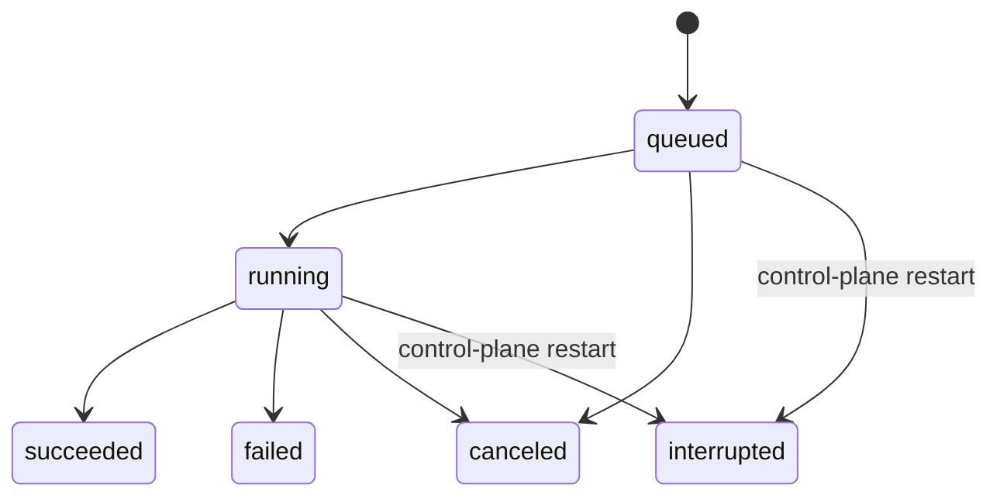

# Give each accepted Turn an opaque ID and a durable non-replayable receipt

## Status

Accepted (2026-07-14).

Refines
[ADR 0009](0009-wire-cancel-event-through-dispatch.md),
[ADR 0040](0040-restart-resilient-transcript-persistence.md),
[ADR 0047](0047-separate-inbound-envelope-from-dispatch-context.md), and
[ADR 0050](0050-serialize-turns-per-conversation-with-bounded-fifo.md).

**Ingress-idempotency and observation refinement (2026-07-14):**
[ADR 0052](0052-bind-retried-ingress-to-one-turn-and-resume-observation.md)
maps Surface retry identities to the control-plane-generated Turn ID and makes
Response Sink delivery independent of terminal Turn status. Turn identity,
content-free receipts and non-replayable restart behavior remain unchanged.

**Run-receipt refinement (2026-07-14):**
[ADR 0057](0057-persist-minimal-run-lifecycle-receipts-in-control-plane-state.md)
adds a distinct minimal Run Receipt for scientific execution. One Turn may
produce zero, one or several Runs; a chat-triggered Run stores
`parent_turn_id`, while Run cancellation and retry use Run ID rather than
overloading Turn identity.

**Outbound-delivery refinement (2026-07-14):**
[ADR 0060](0060-deliver-terminal-channel-replies-through-a-persistent-outbox.md)
atomically creates a Channel Turn's canonical Outbound Delivery when its Turn
Receipt becomes terminal. Provider delivery state remains independent and can
never reopen or replay that Turn Receipt.

## Implementation

Partially implemented across the cut-over production paths. The Repository persists
opaque Turn Receipts and enforces terminal closure; Stage 2a plans Backend-owned
proposed IDs, reserves bounded queue capacity first, commits the same IDs, and
places them in `InboundEnvelopeV1`. Stage 2b adds an explicit startup admission
barrier: in one transaction, prior-process local `queued|running` Receipts
become `interrupted/control_plane_restarted`; terminal Receipts remain unchanged,
the FIFO is not rebuilt, and no Worker is called. Repeated reconciliation is
idempotent. The cut-over Telegram path now creates the canonical interruption
Delivery for a prior nonterminal Channel Receipt; a non-cut-over Channel cannot
enter this runtime.
Turn and Run terminal codes are typed, status-specific closed vocabularies, not
free-form diagnostic strings. Schema migration 2 audits pre-existing rows before
installing INSERT/UPDATE triggers that enforce the same allowlists inside
SQLite; migration fails closed if an old row contains an unknown or
status-incompatible value. Repository commands validate before SQL, and Stage
2b maps arbitrary Worker-returned codes to trusted generic outcomes. Provider
text, credentials and arbitrary exception detail therefore cannot enter a
Receipt through either the lifecycle API or direct SQL.

The migration-2 policy is an immutable literal snapshot, not an alias of the
live runtime vocabulary. Its SQL and migration 1 are pinned by historical
SHA-256 regressions. Any future vocabulary change requires a new migration that
audits existing rows before transactionally replacing all four policy triggers;
historical snapshots and checksums never move.

For production prompt-toolkit/single-shot CLI and Desktop text/multipart-image execution, the
opaque Turn ID and durable Receipt are authoritative. `ControlRuntime` waits on
that Receipt, cancellation targets the accepted Turn ID, and the bounded Event
Hub keys sequenced frames and observers by Turn. The canonical Transcript Store
retains storage-side Turn attribution without adding correlation fields to
provider-visible payloads. Every terminal path stages an immutable terminal
candidate, commits its entry ID/digest atomically with the Receipt, promotes the
candidate, and only then publishes the terminal Event. Startup binds the Store
by opaque identity, promotes or abandons candidates according to Control,
verifies every terminal Receipt reference, and fails closed on mismatch rather
than recreating content or replaying work. Attachment-bearing Turns additionally
bind one content-free Store commitment to the same Receipt; Attachment
reconciliation runs before interrupted-Turn reconciliation and never grants
replay authority. The temporary `MessageEnvelope` inside the Agent Worker
Adapter remains a compatibility detail and its raw Agent events do not become
durable receipts. Full coordination with Run and Projection Stores, plus
Textual TUI and non-Telegram Channel cutover, remains target work.

The Desktop V1 observation subset is now closed through a Backend-owned
`ControlRuntime` Interface. A Repository observation command joins the minimal
Turn Receipt, the Conversation's current Project reference and the optional
terminal Transcript reference in one Control Database read; it does not add
`project_id` to the durable Turn Receipt. `ControlRuntime` then verifies every
terminal reference against the canonical Transcript Store before the Desktop
Adapter may expose it. Receipt and cancel responses are versioned, every SSE
connection begins with an unnumbered durable snapshot, and a terminal cursor
therefore never produces an empty response. The Event observer is registered
before that snapshot read, is bounded per Turn, and is closed on every ASGI
exit; observation failure never changes the Receipt. Interaction resolution,
Event Hub byte accounting, and the remaining Surface cutovers are still target
work.

## Context

ADR 0050 makes a Turn the single-writer execution unit inside a Conversation,
but a queue position or `asyncio.Task` is not a stable identity. Cancellation,
typed Events, Transcript mutations, tool activity and child Runs need to refer
to the same accepted Turn without overloading Conversation ID, Run ID, Reply
Target or a transport-specific message ID.

A purely process-local Turn ID would fix live task lookup but disappear on
restart, leaving no honest explanation for a partially written Transcript or a
Turn accepted just before process failure. Persisting the complete Envelope and
execution capabilities would go too far: it would create replay authority and
move OmicsClaw toward a persistent chat task queue rejected by ADR 0050.

The architecture therefore separates a minimal durable **Turn Receipt** from
the process-local **Turn Execution** that can actually run or cancel work.

## Decision

### Opaque Turn ID

Every accepted Turn receives a control-plane-generated opaque **Turn ID**. It
contains no Conversation, Surface, Reply Target, Project, Owner Identity,
transport message or Run semantics and is never derived by concatenating those
values.

Owner admission and Conversation resolution happen first. Turn Sequencer
capacity must then be reserved before the accepted Envelope is finalized with a
Turn ID and its queued Turn Receipt is committed. If the FIFO is full or the
receipt write fails, ingress releases any reservation and returns backpressure;
the input is not an accepted Turn and has no durable Turn Receipt.

Turn ID is immutable data in Inbound Envelope. External Surface callers may
provide a separate retry or source-message key, but they do not choose the
canonical Turn ID.

### Durable Turn Receipt

The control-plane state store persists one minimal Turn Receipt under its
Conversation. The receipt contains only:

- Turn ID and Conversation ID;
- lifecycle status;
- created, started and finished timestamps where applicable;
- an optional status-specific code from the closed non-secret terminal
  vocabulary;
- an optional `retry_of_turn_id` provenance link.

It does not contain prompt or response content, a serialized Inbound Envelope,
attachments, credentials, raw exception text, approval results, Response Sink,
cancellation token, coroutine, SDK object or executable payload. Transcript
remains the durable conversational content; the receipt is a lifecycle record,
not another message store.

### Lifecycle state machine

The only Turn statuses are:

- `queued` means admission and receipt commit succeeded but no Transcript access
  or Agent execution has started.
- `running` begins when the Turn obtains the Conversation's single-writer lease,
  before its first Transcript access.
- `succeeded` means verified terminal Transcript content exists and the Turn
  Receipt has committed its terminal state. The terminal Event is then
  published to the live event boundary; delivery to any particular Response
  Sink is not a success precondition. A later transport-level acknowledgement
  failure does not rewrite scientific execution as failed.
- `failed` means an Agent, policy or execution error was terminalized in the
  active control-plane process.
- `canceled` means an explicit cancellation terminalized the queued or running
  Turn; it never means the Conversation was deleted.
- `interrupted` means startup reconciliation found a receipt left `queued` or
  `running` by the previous process.

Terminal statuses are immutable. Retry or explicit replay creates a new Turn
ID and may point `retry_of_turn_id` at the prior receipt; it never moves a
terminal receipt back to `queued` or `running`.

On control-plane startup, every non-terminal receipt from the previous process
is atomically reconciled to `interrupted`. It is never re-enqueued or replayed.
This persists an honest outcome without changing ADR 0050's non-durable FIFO
and non-recoverable in-flight execution boundary.

### Process-local Turn Execution

Turn Execution contains the live FIFO slot, task, cancellation token, approval
port, usage sink, effective policy and Response Sink. It is keyed by Turn ID but
exists only inside the Turn Sequencer and Dispatch Context. None of it is
serialized into the Turn Receipt or reconstructed after restart.

Core cancellation targets Turn ID. A Surface convenience action may resolve
the currently active Turn of a Conversation and then cancel that Turn ID, but
Conversation ID is not itself a cancellation identity.

### Correlation without changing provider bytes

All typed Events emitted for a Turn are correlated with its Turn ID. Every
chat-triggered Run records `parent_turn_id`; an explicit non-conversational Run
Request has no fabricated parent Turn.

Transcript persistence must make mutations attributable to Turn ID through
storage-side metadata or an equivalent side table. That metadata is not added
to the provider-visible message dictionaries and must not change ADR 0040's
byte-identical request serialization or Stable prefix invariant.

Turn ID is not an idempotency key. Mapping a transport Source Message ID or
Desktop retry key to an existing Turn is a separate ingress decision; this ADR
does not treat two equal payloads as the same Turn.

## Consequences

- Queueing, cancellation, Events, Transcript provenance and child Runs share
  one stable correlation identity.
- Restart recovery can distinguish interrupted Turns from explicit failure or
  cancellation without replaying scientific work.
- Durable Turn state remains small and content-free; Transcript and Run stores
  keep their existing ownership roles.
- Desktop `/chat/abort` and future Channel `/stop` behavior must resolve a Turn
  ID instead of mutating a `session_id -> latest task` registry.
- Typed Event and Transcript persistence Interfaces require Turn correlation
  fields or wrappers while preserving provider request bytes.
- A later idempotency decision can map source retries to Turn IDs without
  redefining Turn identity.

## Rejected alternatives

- **Keep Turn identity only in process memory.** Rejected because cancellation
  correlation and interrupted-state explanation disappear on restart.
- **Persist the complete Inbound Envelope and automatically replay it.**
  Rejected because prior approvals, file assumptions and tool side effects must
  not become implicit replay authority.
- **Use Conversation ID as Turn ID.** Rejected because one Conversation contains
  many sequential Turns and may have one running plus several waiting.
- **Use Run ID as Turn ID.** Rejected because a Turn may produce zero, one or
  several Runs, while direct non-chat Runs have no Turn.
- **Use transport Message ID as Turn ID.** Rejected because its presence,
  namespace, trust and retry semantics differ across Surfaces.
- **Persist live execution handles in Turn Receipt.** Rejected because tasks,
  cancellation Events, approval ports and Response Sinks are process
  capabilities, not durable facts.
