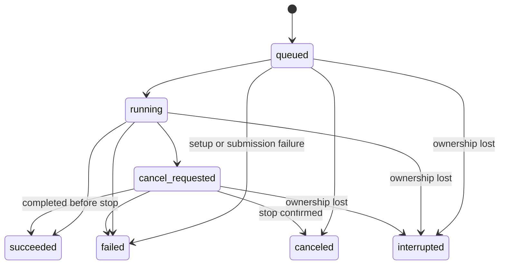

# Persist minimal Run lifecycle receipts in Control Plane State

## Status

Accepted (2026-07-14).

Refines
[ADR 0035](0035-project-scoped-output-directories.md),
[ADR 0043](0043-local-first-control-plane-extensible-run-execution.md),
[ADR 0051](0051-opaque-turn-id-and-durable-non-replayable-turn-receipt.md),
[ADR 0054](0054-persist-authoritative-control-state-in-backend-exclusive-sqlite.md),
[ADR 0055](0055-model-project-lifecycle-as-reversible-archive-and-restore.md), and
[ADR 0056](0056-keep-unassigned-runs-outside-project-lifecycle-and-freeze-run-scope.md).

**Run-submission and assignment refinement (2026-07-14):**
[ADR 0058](0058-bind-retried-run-submissions-to-one-fenced-execution-assignment.md)
resolves this ADR's deferred idempotency and execution-ownership protocol. A
durable Run Submission Binding maps retries to one Run, and that Run receives
at most one Assignment-ID-fenced, process-bound Execution Assignment. v1 adds
no renewable Execution Lease, heartbeat reassignment or automatic replay.

This ADR sharpens the previously overloaded phrase **Run record** into two
separate records: Control Plane State owns a minimal **Run Receipt** for
identity, accepted scope and operational lifecycle; Run storage owns the
scientific **Run Manifest** and artifacts. It does not introduce a persistent
executable queue or move scientific content into `control.db`.

## Implementation

Repository foundation implemented (2026-07-15); Canonical Simple Skill tracer
and four submission Adapters integrated (2026-07-17): Desktop
`POST /v1/runs`, prompt-toolkit exact demo, root `oc run` exact demo, and
Remote compatibility `POST /jobs` exact demo.
`omicsclaw/control/` persists minimal typed Run Receipts with
immutable Scope, lifecycle, parent/retry references, and Manifest reference;
the Receipt's optional terminal code is constrained by the same typed,
status-specific closed vocabulary at model, Repository, migration-audit and
SQLite-trigger boundaries. The Desktop `/v1/runs` path now writes a verified
Run Manifest header before atomic Receipt acceptance, executes one real
resource-ready Skill through the shared runner, verifies result/artifact
completion evidence, then applies the Assignment-fenced terminal Receipt.
Startup and shutdown never reconstruct a payload or FIFO. An inherited queued
Run without Assignment becomes `interrupted`; an assigned tracer Run first
stops and proves its persisted Process Tree Owner empty, then applies exact
verified Manifest completion or writes a fenced
`interrupted/control_plane_restarted` stop record. Missing/unsupported owner,
non-empty or unobservable cgroup, invalid Manifest evidence, or a terminal
Control transaction that cannot commit leaves the Receipt nonterminal and
quarantines novel scientific admission.

The exact prompt-toolkit `/run <canonical-skill> --demo` Adapter now submits an
explicit non-conversational `UnassignedScope` Run through the same Runtime and
waits through a bounded typed terminal-result Interface. Successful projection
deep-verifies Receipt, Assignment, Manifest completion and artifact inventory;
failure, cancellation and interruption expose only the Receipt's closed
terminal code. The CLI does not read `control.db`, Run Store internals or the
Manifest, and canceling a waiter never cancels the Run.

The root exact-demo Adapter uses the same typed terminal projection and fresh
Submission identity. Its raw-token classifier owns every demo-shaped root
request before argparse or legacy Project/output resolution; only omitted
Scope, fixed-order `--demo --project <32-lower-hex-id>`, or
`--demo --no-project` submits. Explicit Project/Unassigned are frozen typed
Scopes before Runtime open and never consult current navigation; only omitted
Scope asks the typed `RunRuntime` navigation Interface to validate a pointer.
Novel explicit Project missing/archive rejection is not a fallback. Run closes
before Control, and unconfirmed process-owner stop keeps Control ownership and
prevents a successful or ordinary-interrupt projection.

The Remote compatibility Adapter now accepts only one versioned canonical
shape: a canonical Skill, `inputs.demo=true`, empty `params`, explicit
`UnassignedScope`, a complete simple resource request, and exactly one 32-hex
`Idempotency-Key` used as the Run Submission ID. It delegates to the same
Backend-owned `RunRuntime`; novel admission returns `202`, a matching durable
Binding returns the original Run with `200`, and conflicting key reuse returns
`409`. `run-<run_id>` is only an additive Job-shaped HTTP projection of the
canonical Run ID. A canonical submission creates no executable `job.json`,
independent Job identity, replay payload or second execution owner.

Remote detail and bounded SQL-backed list reads project Run Receipts only. Its
SSE stream is snapshot-first and revision-based; opening, resuming or
disconnecting an observer cannot enqueue, lease, assign, recover, replay or
cancel a Run. Canonical cancel delegates only to `RunRuntime.cancel()` and
keeps `cancel_requested` until stop proof; canonical retry fails closed instead
of cloning a payload. Canonical artifact list/download pass through the typed
Runtime and verify Receipt, Assignment, completed Manifest and the entire
declared inventory. Downloads stream from the same verified `O_NOFOLLOW` file
descriptor with identity, link-count, size and SHA-256 rechecks, including
single-Range handling, rather than reopening a path after verification.

Historical terminal scientific Job records remain bounded read-only
compatibility data. At Backend startup, old scientific `queued`, `running` or
`cancel_requested` Jobs are durably closed as
`interrupted/legacy_execution_unrecoverable`; their stored payload is never
replayed or imported as a guessed canonical Run. New `chat_stream` Job
submission and binding are retired; historical active Chat rows are exposed
only as read-only `interrupted/legacy_chat_job_retired` projections and are not
Runs. Migration 10 adds the indexes used by the bounded
`UnassignedScope + skill` Receipt observation page.

The legacy Remote `POST /sessions/{session_id}/resume` route is retained only
as a fixed compatibility tombstone. It returns `resumed=false`,
`reason=legacy_session_resume_retired` and no active Job IDs; it resolves no
Workspace, reads no `job.json` and never calls `RunRuntime`. Scientific
reconnection is explicit Receipt/SSE observation by a known canonical Run ID.
A legacy Session key cannot discover, reattach, replay, cancel or otherwise
resume execution.

Persistent Run integrity observation integrated (2026-07-17). Migration 9
adds an append-only, content-free `run_integrity_incidents` ledger. It stores
only closed incident/reason codes, opaque Run and Assignment IDs, the observed
Receipt revision, evidence schema version, SHA-256 evidence digest and Backend
timestamp. Manifest/Receipt identity or terminal drift is recorded without
repairing either store; startup also audits already-terminal assigned tracer
Runs without replay. Exception text, paths, parameters, logs, credentials,
Manifest content and Execution References cannot enter the table or its digest.
The bounded Desktop `GET /v1/run-integrity-incidents` Adapter is pure
observation and remains available while novel admission is quarantined.

Other production Run paths do not submit through this Interface yet. Root
non-demo and unsupported option-bearing forms, Textual TUI, non-demo and option-bearing
prompt-toolkit `/run`, Agent, Bench, Workflow and Autonomous callers remain
outside it. The Remote slice is limited to exact demo, empty parameters and
explicit Unassigned Scope; arbitrary datasets/parameters, Remote Project Scope,
explicit canonical retry, live stdout, Conversation UX continuity, dynamic
Runs, distributed Workers and App UI adoption remain outside it. Execution
resume by legacy Session identity is not future Run functionality; it is
explicitly retired. Legacy Skill execution normally
treats the output-directory leaf as Run ID and records successful finalization
only. Autonomous execution also creates a separate short ID inside a directory
whose full leaf may later be indexed as another Run ID, while Desktop log
streaming labels process-local counters as `run_id`.

Lifecycle state remains split across manifest strings, missing `result.json`
heuristics, directory modification times and autonomous-specific enums on
those uncut paths, and failed ordinary Skill executions may have no indexed Run
record. The canonical Desktop, prompt-toolkit demo, root exact-demo and Remote
exact-demo Adapters answer cancellation and restart reconciliation through the
same Runtime; Project `project_busy` applies only where an in-scope Adapter
supplies `ProjectScope`. Remaining legacy callers stay outside those
guarantees.

## Context

ADR 0043 deliberately keeps one local-first single-process control plane while
allowing expensive execution to move behind a replaceable local or remote Run
Executor. ADR 0055 then requires Project archive to be serialized with Run
admission and to fail while Project-scoped work is active. ADR 0056 freezes Run
Scope at admission. Those invariants cannot be enforced from a Run Manifest
alone because a Manifest may not exist while a Run is queued, may be only
partially written during execution, and belongs to a different physical store.

The control plane therefore needs durable evidence that it accepted a Run
before an executor starts it. At the same time, storing prompts, parameters,
logs and artifacts in the Control Database would turn a narrow coordination
boundary into a second scientific Run store. The design must preserve both
facts: operational identity and lifecycle are control concerns; scientific
provenance and outputs remain Run-storage concerns.

## Decision

### One accepted top-level execution is one Run

A **Run** is one top-level Skill, Workflow or Autonomous Analysis execution
accepted through the Run Executor facade. It has one immutable Run ID, Run
Scope and Run Kind:

```text
RunKind = skill | workflow | autonomous
RunScope = ProjectScope(project_id) | UnassignedScope
```

A Turn may produce zero, one or several Runs. A chat-triggered Run records its
`parent_turn_id`; an explicit non-conversational Run Request has no fabricated
Turn. Turn ID and Run ID remain distinct because conversational execution and
scientific execution have different cardinality and lifecycle.

Internal calls made as part of one admitted Workflow or Autonomous Run are
**Run Steps**, not additional top-level Runs. They keep step-level method,
status, lineage and artifact provenance in the parent Run's scientific records.
If the Agent explicitly admits several independent Skill executions, each is a
separate Run rather than a Run Step.

Chat streaming, transcript persistence, indexing, memory review and other
generic background work are not Runs merely because they execute
asynchronously. A remote transport's generic Job is a Run only when it is the
execution representation of an admitted scientific Run.

### The control plane generates an opaque Run ID at admission

After deterministic request validation and Project lifecycle/Run Scope
resolution succeed, the control plane generates one globally unique opaque Run
ID. The caller, Worker, output resolver, remote scheduler and filesystem do not
choose or derive it. The ID contains no Project, Turn, Surface, Skill, dataset,
path, timestamp, executor or retry semantics.

The control plane atomically commits a `queued` Run Receipt before handing the
typed Run Request to an executor. Receipt commit is the acceptance boundary. A
request rejected before that commit is not a Run. If executor submission fails
after acceptance, the same receipt becomes terminal `failed` with a normalized
setup/submission code; the system does not erase the accepted identity.

Run ID is not a request idempotency key. How repeated direct Run submissions
bind to one accepted Run is a separate admission decision. Equal parameters or
equal input paths never identify the same Run by themselves.

### `control.db` stores one minimal Run Receipt

Control Plane State persists one **Run Receipt** containing only:

- `run_id`;
- immutable `scope_kind` and nullable `project_id`;
- immutable `run_kind`;
- optional `parent_turn_id`;
- optional `retry_of_run_id`;
- lifecycle status;
- created, started and finished timestamps where applicable;
- optional status-specific code from the closed non-secret terminal vocabulary;
- optional executor kind and opaque Execution Reference;
- optional stable Run-store artifact reference.

The receipt contains no input data, scientific parameters, prompt, serialized
Run Request, credentials, environment snapshot, logs, raw exception, artifact
list, executable payload, process handle, cancellation token, coroutine,
scheduler client or approval capability. It is not sufficient to replay a Run.

Run Receipt is stored in the Backend-exclusive `control.db` selected by ADR
0054. Only the control-state Repository may mutate it. Local and remote Workers
report lifecycle evidence through a typed control-plane Interface and never
open the database.

### Run storage retains the Run Manifest and artifacts

The **Run Manifest** remains the durable scientific provenance record. It owns
resolved inputs, parameters, methods, software/environment evidence, Run Step
lineage, artifact inventory, completion evidence and other reproducibility
facts. Artifacts remain in Run storage.

The Manifest records the canonical Run ID and a copy of the immutable Run
Scope. The Receipt is authoritative for acceptance, operational lifecycle and
Project-busy queries; the Manifest is authoritative for scientific provenance
and artifact meaning. A disagreement is an observable integrity fault to
reconcile, never permission for one store to silently invent or rewrite the
other.

The Run directory leaf is a human-readable storage name, not Run identity. It
may include a collision-resistant display token derived from the opaque Run ID,
but APIs, cancellation, retries, links and indexes use the full canonical Run
ID. The Receipt's artifact reference and rebuildable Run index resolve that ID
to a location; code must not construct a path by concatenating the Run ID.

The ownership split is:

| Fact | Authority |
|---|---|
| Run acceptance, ID, Scope and operational lifecycle | Run Receipt in Control Plane State |
| Scientific inputs, parameters, methods, environment and artifact meaning | Run Manifest in Run storage |
| Files and scientific outputs | Run artifacts in Run storage |
| Fast listing, search, Memory and Desktop display | Rebuildable projections |
| PID, subprocess token, remote Job UUID, Slurm/SSH identifier | Execution Reference only |

### One conservative lifecycle state machine

All top-level Run kinds use the same statuses:



- `queued` means the Receipt committed but execution has not been confirmed as
  started.
- `running` means execution ownership has been assigned and the executor may
  begin scientific side effects. An executor must not begin them until the
  control plane acknowledges this transition.
- `cancel_requested` means the Owner asked to stop a running Run but termination
  is not yet confirmed.
- `succeeded` means required Manifest/completion evidence and required artifacts
  were durably verified; process exit code zero by itself is insufficient.
- `failed` means execution or completion commit ended unsuccessfully with known
  terminal evidence.
- `canceled` means stop was confirmed, or a queued Run was canceled before an
  executor started it.
- `interrupted` means execution continuity was lost after the canonical local
  owner has been proved stopped. It is not evidence that the scientific method
  failed. If owner stop itself cannot be proved, the current tracer preserves
  the prior nonterminal state and quarantines admission instead of publishing a
  false terminal fact.

Terminal statuses are `succeeded`, `failed`, `canceled` and `interrupted` and
are immutable. Spellings such as `completed`, `success` and `cancelled` are
compatibility inputs only. `timed_out`, `validation_failed`, `spawn_failed`,
`submission_failed`, `completion_commit_failed` and similar values are
normalized terminal codes, not peer lifecycle states.

The control plane alone commits status transitions. Executor callbacks are
evidence for a transition, not authority to create a Run or rewrite terminal
history. A stale or duplicate callback is ignored or recorded diagnostically;
it never moves a terminal Receipt back to a non-terminal state.

### Success is committed only after scientific completion evidence

The executor first durably finalizes and verifies the Run Manifest, completion
evidence and required artifacts. It then reports success to the control plane,
which transitions the Receipt to `succeeded`. A crash between these stores may
leave a non-terminal `running` or `cancel_requested` Receipt alongside durable
terminal evidence. Before marking ownership lost, startup reconciliation may
apply a terminal transition only when the Run Store can verify immutable
completion evidence: full success proof permits `succeeded`, and explicit
failure or stop proof permits `failed` or `canceled`. Missing, unreachable,
partial or conflicting evidence produces `interrupted` only after execution
ownership is proved empty. Otherwise the nonterminal Receipt remains visible
under global admission quarantine. A terminal Receipt is never rewritten later.

The reverse is forbidden: the Receipt cannot become `succeeded` merely because
a process exited zero, a directory exists, a UI received a final Event, or a
projection says `completed`. Missing completion proof is failure or
interruption according to the evidence, never inferred success.

### Restart does not replay and retry creates a new Run

v1 does not automatically resume, resubmit or replay a non-terminal Run after
a control-plane restart. During startup, a local/process-owned `queued` Receipt
becomes `interrupted`; `running` or `cancel_requested` may first terminalize
from the verified completion evidence defined above and otherwise becomes
`interrupted` only after its persisted owner is proved stopped, all before new
admission. Unconfirmed ownership blocks new admission without replay. A future durable external executor may
support explicit reattachment only through a separately accepted capability
and ownership protocol; the presence of an Execution Reference alone is not
proof that reattachment is safe.

Retry always creates a new Run ID and may record `retry_of_run_id`. The original
terminal Receipt, Manifest and artifacts remain unchanged. A retry preserves
the original Run Scope and revalidates that a Project-scoped Project is still
active. Executing equivalent work under a different Project is a new explicit
Run, not a retry, because Run Scope is provenance.

### Cancellation targets Run ID and waits for confirmation

Core Run cancellation targets canonical Run ID. Canceling an active parent Turn
requests cancellation of any non-terminal child Runs created by that Turn, but
does not claim they are `canceled` until their executors confirm termination.
A Run may complete or fail while cancellation is in flight, so
`cancel_requested -> succeeded | failed` remains valid.

Conversation ID, Turn ID, directory name, PID and remote Job ID are never Run
cancellation identities. A Surface may offer contextual controls that resolve
one of those views to a Run ID before invoking the core cancellation command.

### Execution Reference is executor state fenced by ADR 0058

Subprocess PID/token, remote Job UUID, Slurm job ID, SSH command ID, Worker ID
and similar values are ordinary **Execution References**. They may help observe,
reattach to or cancel one concrete execution assignment, but they never replace
Run ID and are not exposed as scientific identity. ADR 0058 refines this rule:
the canonical local executor's Process Tree Owner is a typed, unique, write-once
Execution Reference committed atomically with the Run's sole Assignment before
launch. Other executor kinds may define a different typed reference contract,
but every lifecycle mutation remains fenced by both Run ID and Assignment ID.

The initial queued receipt may have no Execution Reference. In v1 one Run
receives at most one process-bound Execution Assignment; there is no renewable
Execution Lease, heartbeat reassignment, timeout requeue or automatic replay.
A future reattachment capability must prove ownership of that same Assignment
and cannot manufacture a second start grant. An Execution Reference alone is
never proof of safe reattachment or authority to invoke another executor.

### Legacy Runs receive canonical identities without moving artifacts

ADR 0054's explicit migration inventory is extended for Runs:

- each provable historical top-level Run receives a new opaque canonical Run
  ID and a Legacy Identity Map entry for its old directory/manifest/App/remote
  identifiers;
- the existing directory is not renamed or moved; its readable leaf remains a
  legacy storage name, and compatibility deep links resolve through the map;
- a migrated Manifest records the canonical Run ID and preserves the old value
  as legacy evidence instead of silently overwriting provenance;
- autonomous short IDs and full directory-derived IDs are inventoried as two
  aliases of one Run only when workspace and completion evidence prove that
  relationship;
- a scientific remote Job imports as a Run only when its request and output
  evidence prove that boundary; generic `chat_stream` or UI jobs remain Turn
  observation/projection state;
- legacy `completed`/`success` maps to `succeeded` only after completion and
  required-artifact verification; `cancelled` maps to `canceled`; `timed_out`
  maps to `failed` plus terminal code `timed_out`; legacy `queued`, `running`,
  stale or indeterminate work maps conservatively to `interrupted`;
- missing manifests, conflicting identities and unverifiable success are
  reported for Owner reconciliation and never repaired by path or timestamp
  guessing.

Migration is auditable and idempotent. Ordinary runtime never scans legacy
stores to invent a missing Run Receipt after cutover.

## Consequences

- Project archive can atomically query accepted non-terminal Project Runs from
  the same control-state transaction that closes admission.
- Every Surface and executor shares one Run identity while local subprocess,
  remote SSH, Slurm or a future Worker queue remain replaceable.
- Restart, cancellation, retry and UI status gain honest semantics without
  authorizing automatic scientific replay.
- Failed and interrupted executions remain visible even when no successful
  Manifest or output index was produced.
- `control.db` gains a compact Run Receipt table and guarded lifecycle
  operations, but not scientific payloads, logs or artifacts.
- Run storage and projection code must stop treating directory leaves, remote
  Job IDs or process-local counters as canonical Run IDs.
- Existing Run IDs, status enums, output links and autonomous/remote records
  require an explicit migration with legacy aliases.
- The next Run-execution design must decide submission idempotency and guarded
  assignment/lease semantics without weakening this identity boundary.

## Rejected alternatives

- **Use Run directories and Manifests as the only lifecycle record.** Rejected
  because they do not exist at queued admission and cannot atomically enforce
  Project archive or cancellation state.
- **Store the entire Run request, logs and artifacts in `control.db`.** Rejected
  because it duplicates Run storage, enlarges the control failure domain and
  implicitly creates replay material.
- **Keep the directory leaf as canonical Run ID.** Rejected because path naming
  is storage policy, currently differs across execution paths, and cannot be
  committed before all output layout decisions.
- **Reuse remote Job ID, PID or Worker ID as Run ID.** Rejected because executor
  assignments are replaceable and may not exist at admission.
- **Let Workers generate Run IDs or persist lifecycle directly.** Rejected
  because Project admission and lifecycle authority belong to the single
  control plane.
- **Reset a terminal Run to queued on retry.** Rejected because it destroys
  historical outcome and makes artifacts from different attempts ambiguous.
- **Mark a running Run canceled when a cancel signal is sent.** Rejected because
  signal delivery is not proof that the tool stopped and may race with success
  or failure.
- **Treat Backend restart as ordinary failure.** Rejected because losing
  execution ownership is not evidence that the scientific method failed.
- **Represent every nested Skill call as a top-level Run.** Rejected because it
  double-counts one admitted Workflow/Autonomous execution and obscures its
  step lineage.
- **Automatically replay non-terminal Runs after restart.** Rejected because
  scientific tools may have non-idempotent side effects and the Receipt
  deliberately contains no executable authority.

## Forward refinement (2026-07-14)

[ADR 0061](0061-separate-run-dispatch-from-process-local-resource-scheduling.md)
places every accepted top-level Run in one bounded process-local Run Dispatcher
and explicitly forbids rebuilding executable work from queued Receipts. It also
requires first-unit Resource Lease readiness before the one Assignment
transition, without adding another durable Run status.
