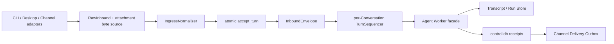
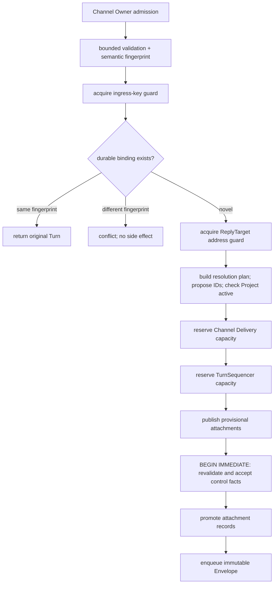

# Conversational Control Plane — Implementation Design

> **Status:** implementation-ready design, reclosed after the 2026-07-15 audit,
> for the retained execution principle of ADR 0043 and authoritative
> ADR 0044–0064 decisions
> **Scope:** local single-Owner control plane, conversational ingress, Run dispatch,
> attachments, transcript persistence, and Channel delivery
> **Authority:** this document refines accepted ADRs; where it conflicts with an
> accepted ADR, the ADR wins and this document must be corrected
> **Implementation state:** Stage 1 repository foundation, Stage 2a ingress and
> Stage 2b whole-Turn execution are implemented in `omicsclaw/control/`.
> Scheme 1 (2026-07-16) connects prompt-toolkit/single-shot CLI and the Desktop
> text path through the deep `ControlRuntime` Module. It composes Backend-owned
> normalization, duplicate-first durable acceptance, a bounded
> per-Conversation FIFO, cooperative Turn-ID cancellation, an independent
> canonical `transcripts.db`, and a bounded process-local `TurnEventHub`.
> Provider-visible messages are immutable, active order is replaceable, and
> terminal publication is ordered as terminal candidate -> terminal Receipt
> plus immutable Transcript ref -> candidate promotion -> Event. Startup binds
> Control to the Transcript Store's opaque identity, reconciles candidates and
> nonterminal Turns without replay, and fails closed on a missing Store or
> terminal ref mismatch. Response Sinks are observers: renderer failure,
> backpressure or disconnect may detach observation but cannot cancel or fail a
> Turn. Desktop now requires explicit `source_request_id`, advertises
> `authoritative_ingress=true` and `durable_ingress_idempotency=true`, and
> exposes unversioned compatibility routes for Turn receipt, retained Event
> replay/gap and explicit cancellation. Attachments/files, remote `job_id`,
> per-Turn provider credentials and unsupported provider switching are rejected
> before durable Desktop acceptance. A profile-driven one-shot importer covers
> legacy Backend `transcripts.db` with `plan/apply/verify`, consistent SQLite
> backup, isolated staging, immutable import baseline and atomic cutover; the
> runtime has no legacy Transcript fallback. Scheme 2 (2026-07-16) adds the
> text Outbound Delivery Module and cuts Telegram text ingress over to the
> same ControlRuntime. Terminal Turn + Transcript ref + target-sequenced
> Delivery Items commit atomically; the Pump verifies committed Transcript
> ranges/digests before a single Adapter call, serializes each Reply Target,
> allows cross-target concurrency, applies bounded safe retry and recovers
> uncertain sends as `unknown` without Worker replay. Scheme 3 (2026-07-16)
> implements ADR 0059's first production attachment slice: an independent
> `attachments.db` and content-addressed Blob tree bound to Control by opaque
> Store identity; duplicate-first async admission; publish-before-control Turn
> commitments and startup reconciliation; structured Attachment References in
> Envelopes/Transcripts; and Backend-owned ephemeral image rendering before
> every model call. Configured-Owner Telegram accepts one ordinary photo with an
> optional caption. Scheme 4 (2026-07-17) adds a second real Attachment Adapter:
> strict Desktop multipart images at `POST /v1/turns`, a durable-acceptance
> `ControlRuntime.submit()` Interface, bounded spooling behind the configured
> conditional bearer gate,
> and versioned receipt/Event/cancel aliases. A follow-on Desktop observation
> closure now reads the Receipt, Conversation Project and terminal ref in one
> Control Database statement, verifies terminal content through `ControlRuntime`, and
> exposes snapshot-first one-based typed SSE with atomic replay/gap-to-live plus
> one versioned cancel result across both route spellings. Media groups, documents,
> audio/video, outbound media and the official runner's non-cut-over Adapters
> remain fail-closed. Textual TUI, CLI attachment input, every File Reference,
> Desktop JSON/options/Project-command submission and App adoption, explicit resend, other
> Channel Adapters, tool/Run attachment consumption, migration, Surface-wide Run
> Dispatcher convergence, dynamic governed envelopes, Memory projector,
> Interaction resolution, strict retained-Event
> byte accounting, CLI `sessions.db`, Desktop App export,
> non-Simple Run kinds and the broader migration inventory remain unimplemented.
> The canonical Desktop Simple Skill tracer now implements the first deep
> RunRuntime/Dispatcher/shared-Scheduler path. This is a
> verified vertical slice, not a claim that ADR 0042–0070 are all implemented.

## 1. Purpose

This document closes the gap between the accepted architecture decisions and
code. It defines concrete schemas, repository boundaries, transaction order,
runtime interfaces, recovery rules, Surface protocols, and legacy migration.
These details may evolve without a new ADR as long as the ownership and
deployment decisions remain unchanged.

The target is one coherent path:



This design deliberately does **not** add:

- multiple Owners, account login, tenant partitions, or cross-Owner sharing;
- a durable Turn queue, automatic Turn replay, or distributed control plane;
- a distributed Run broker, renewable execution lease, or Run reassignment;
- a unified scientific-content database;
- mutable Conversation addresses or Project rebinding;
- direct Channel sending from the Worker;
- restart-resilient live event replay.

## 2. Normative language and accepted invariants

`MUST`, `MUST NOT`, `SHOULD`, and `MAY` are normative in this document.

1. One backend instance serves one configured Owner. No table contains an
   `owner_id` partition column.
2. A Channel adapter MUST verify provider authenticity and extract the external
   subject. The Backend-owned Ingress Normalizer MUST reject a non-Owner subject
   before any durable write, attachment download, queue reservation, or
   response. A Surface cannot supply the Owner-admission policy.
3. Conversation identity, address, and optional Project binding are immutable.
   An unbound Conversation MAY bind once; a bound Conversation cannot rebind.
4. A Conversation belongs to exactly one Surface. Project, not Conversation,
   carries continuity across Surfaces.
5. Control-generated Conversation, Turn, Run, Assignment, Attachment, Delivery,
   and Delivery Item IDs are opaque random identifiers. V1 generates 128 random
   bits and renders them as 32 lowercase hexadecimal characters. Consumers MUST
   treat them as uninterpreted strings.
6. At most one Turn runs per Conversation; different Conversations may run
   concurrently. Waiting Turns cause no Transcript, Agent, tool, or Run effects.
7. Process restart interrupts nonterminal Turns and Runs. It never re-executes
   them automatically.
8. `control.db` is the sole authority for Project, Conversation, Turn, Run
   receipt, idempotency binding, execution assignment, and Delivery lifecycle
   facts. It is not the authority for scientific content.
9. `default/` is Unassigned storage, not a Project. A Run's Project or
   Unassigned scope is immutable.
10. Accepted attachment occurrences are immutable, ordered, and belong to one
    Turn and Conversation. Equal bytes may share a Blob but never collapse
    occurrence identity.
11. A terminal Channel reply is delivered only through the persistent Outbox.
    Desktop and CLI do not create Delivery records.
12. Process-local queues and buffers are bounded. Duplicate lookup precedes all
    lifecycle and capacity gates.

The design is founded on
[ADR 0043](../adr/0043-local-first-control-plane-extensible-run-execution.md)
and governed by ADRs
[0044](../adr/0044-single-owner-control-plane-and-owner-only-channel-ingress.md)–[0064](../adr/0064-scope-scientific-memory-and-fence-project-projections.md).

## 3. Runtime topology and ownership

### 3.1 One control runtime

The backend process owns one canonical `asyncio` event loop, called the
**Control Runtime**. It owns:

- `IngressNormalizer` and process-local keyed admission guards;
- `TurnSequencer` and all active Turn tasks;
- the per-Turn Event Hub;
- `RunDispatcher` and `ExecutionResourceScheduler`;
- the Delivery Pump;
- process-local approval interactions and cancellation tokens.

Adapters whose SDK invokes callbacks on another thread or event loop MUST use a
thread-safe bridge into the Control Runtime. They MUST NOT own independent Turn,
Run, deduplication, or delivery scheduling state. This replaces the current
adapter-specific loops and caches with one concurrency domain.

`ControlStateRepository` performs only short SQLite operations. Its connection
and transactions are serialized by a process-wide lock; filesystem I/O,
attachment transfer, Transcript writes, provider calls, and scientific work
MUST occur outside that lock.

### 3.2 Physical state roots

Under the resolved backend state root:

```text
<state_root>/
  control.db
  control.lock
  transcripts.db
  attachments/
    attachments.db
    blobs/sha256/ab/cd/<full-digest>
    staging/<batch-id>/<ordinal>.part
  runs/
    ... Run Store layout ...
```

`control.lock` is held for the entire backend lifetime using an OS advisory
lock. Failure to obtain it is a startup error, not a signal to open a second
writer. All SQLite databases use WAL, `synchronous=FULL`, foreign keys, a
bounded busy timeout, and explicit transactions. Authority does not move when a
projection or cache exists elsewhere.

The state root, databases, WAL files, lock, backups, attachment bytes, and
migration reports are created owner-private (`0700` directories and `0600`
files, or the platform equivalent). Startup rejects ownership/permission drift
that would expose Owner content and does not follow a state-root symlink outside
the configured root.

## 4. Ingress contracts

The schemas below are the **target V1 contracts**. All schema objects reject
unknown fields, have an integer `schema_version`, use
UTF-8 strings, and are JSON-compatible unless explicitly described as a
process-local port. Timestamps are UTC Unix milliseconds. Limits are deployment
configuration and are checked before durable acceptance.

The original isolated Stage 2a admission validator implements the subset it can honor
safely for an already constructed, recursively frozen `RawInboundV1`: exact
Surface/ReplyTarget/subject shapes, strict schema version, bounded source/text/
total JSON sizes, exact Project commands and scalar allow-lists for requested
options and transport facts. The production async path additionally accepts a
strict ordered `SourceAttachmentDescriptorV1` batch only when a Backend-owned
Attachment Store and process-local source are enabled; the first Adapter is
Owner-only Telegram single-photo input. A bounded generic decoder that can
safely construct this object directly from an arbitrary untrusted wire payload
is not implemented yet. File References and every uncut attachment shape fail
closed instead of being partially accepted.

### 4.1 `RawInboundV1`

`RawInbound` is the transport-shaped, side-effect-free description produced by
a Surface adapter. Constructing it is not durable acceptance.

```text
RawInboundV1
  schema_version: 1
  surface: "cli" | "desktop" | "channel"
  source_namespace: NonEmptyString
  source_request_id: NonEmptyString
  external_subject: ExternalSubjectV1 | null
  reply_target: ReplyTargetV1
  explicit_conversation_id: OpaqueId | null
  project_command: ProjectCommandV1 | null
  content: [RawContentBlockV1]
  attachments: [SourceAttachmentDescriptorV1]
  file_selections: [RawFileSelectionV1]
  requested_options: RequestedTurnOptionsV1
  retry_of_turn_id: OpaqueId | null
  transport_facts: map<string, JsonScalar>
```

Rules:

- `source_namespace` identifies the adapter installation or client profile that
  assigns `source_request_id`; it is not an Owner partition.
- Every Surface supplies a stable request ID. Desktop uses a client-generated
  idempotency key, Channel uses the provider event/message ID in its namespace,
  and CLI generates a fresh random ID for each explicit submission.
- `external_subject` is Source Attribution used for Channel Owner admission. It
  never participates in storage partitioning or Conversation addressing.
- `content` contains only ordered text facts; `project_command` is the only V1
  control-command input. Provider SDK objects,
  callbacks, signed URLs, credentials, open files, temporary paths, and live
  connections are forbidden.
- `transport_facts` is a bounded diagnostic allow-list such as provider event
  kind or client version. Arrival time, retry count, trace ID, and connection ID
  do not participate in the semantic fingerprint.

```text
ExternalSubjectV1
  kind: "telegram_user" | "feishu_open_id" | ...
  value: NonEmptyString

RawContentBlockV1
  kind: "text"
  text: String

SourceAttachmentDescriptorV1
  ordinal: UInt32
  source_attachment_id: NonEmptyString
  display_name: String
  declared_media_type: String | null
  declared_size: UInt64 | null
  declared_sha256: LowerHex64 | null

RawFileSelectionV1
  ordinal: UInt32
  workspace_id: NonEmptyString
  relative_path: NormalizedRelativePath
  observed_size: UInt64
  observed_mtime_ns: UInt64
  observed_sha256: LowerHex64 | null

ProjectCommandV1 =
  { kind: "bind", project_id: OpaqueId }
  | { kind: "new_conversation", project_id: OpaqueId | null }

RequestedTurnOptionsV1
  mode: String | null
  output_style: String | null
  model_override: String | null
  max_tokens: UInt32 | null
  system_prompt_append: String | null
  provider_options: map<string, JsonScalar>
```

Only an explicit, validated product surface may expose model or provider
options. Credentials and server policy never come from this object.

### 4.2 Process-local attachment byte source

The only Surface-provided process-local capability travels beside, never
inside, `RawInbound`:

```python
class InboundAttachmentSource(Protocol):
    async def open(self, source_attachment_id: str) -> BoundedAsyncByteStream: ...
```

`InboundAttachmentSource.open(source_attachment_id)` returns a bounded async
byte stream for the matching descriptor. The map may hold an HTTP upload,
provider download handle, or CLI local file handle, but cannot survive restart
and is never serialized. It exposes bytes only; it cannot select Workspace,
Owner, Project, Conversation, policy, or limits.

`WorkspaceResolver`, `OwnerIdentityAuthenticator`, limits, clocks, stores, and
repositories are Backend-owned dependencies constructed with the
`IngressNormalizer` implementation. `WorkspaceResolver` validates a
`RawFileSelection` against a registered root without accepting an arbitrary
absolute path. `OwnerIdentityAuthenticator` compares Channel Source Attribution
with the Backend's configured Owner identity map. A Surface cannot provide,
replace, or parameterize either dependency for a request.

The Normalizer's external Interface is therefore conceptually
`accept(raw_inbound, attachment_source)`. Its policy and authority seams remain
internal to the Module rather than becoming a shallow bag of caller-selected
ports.

The synchronous Stage 2a Interface remains `accept(raw_inbound)` and rejects any
non-empty attachment or file-selection collection. The production
`accept_async(raw_inbound, attachment_source=...)` Interface now performs
duplicate lookup and address serialization before opening the process-local
source, then coordinates the enabled Attachment Store slice. Supplying a source
without descriptors, descriptors without an enabled Store/source, or any File
Reference still fails before durable acceptance.

### 4.3 Reply targets and source namespaces

`ReplyTarget` is an immutable logical destination, not a live response stream.
It is canonical-JSON encoded; `reply_target_key` is the lowercase SHA-256 digest
of that encoding.

```text
DesktopReplyTargetV1
  kind: "desktop"
  installation_id: NonEmptyString
  profile_id: NonEmptyString
  slot: NonEmptyString                 # normally "main"

CliReplyTargetV1
  kind: "cli"
  installation_id: NonEmptyString
  profile_id: NonEmptyString
  slot: NonEmptyString

ChannelReplyTargetV1
  kind: "channel"
  adapter: "telegram" | "feishu" | "wechat" | ...
  account_namespace: NonEmptyString
  destination_id: NonEmptyString
  thread_id: NonEmptyString | null
```

Connection IDs, websocket IDs, SSE subscriptions, provider SDK clients, and
reply callbacks are forbidden. A Channel's provider account belongs in both
`account_namespace` and `source_namespace`; the latter also includes the
adapter name and schema version, for example
`channel/telegram/v1/<account-namespace>`.

Desktop and CLI namespace examples are
`desktop/v1/<installation>/<profile>` and
`cli/v1/<installation>/<profile>`. Namespace changes are explicit migrations;
they must not silently change after an application upgrade.

### 4.4 Semantic fingerprint

The V1 ingress fingerprint is:

```text
sha256(canonical_json({
  fingerprint_version: 1,
  surface,
  source_namespace,
  reply_target,
  explicit_conversation_id,
  project_command,
  content,
  attachments: SourceAttachmentDescriptorV1[],
  file_selections,
  requested_options,
  retry_of_turn_id
}))
```

`source_request_id`, arrival metadata, live ports, trace data, policy resolution,
and downloaded bytes are excluded. A supplied attachment digest or size is
part of the descriptor and therefore part of the fingerprint. The store later
verifies actual bytes; a mismatch rejects the entire batch.

### 4.5 `InboundEnvelopeV1`

An Envelope exists only after the control transaction commits. It is immutable
accepted input handed to the Worker facade; V1 keeps it in memory rather than
persisting it as a second source of truth.

```text
InboundEnvelopeV1
  schema_version: 1
  turn_id: OpaqueId
  turn_kind: "agent" | "control_command"
  conversation_id: OpaqueId
  surface: "cli" | "desktop" | "channel"
  project_id: OpaqueId | null
  workspace: WorkspaceRefV1
  content: [InboundContentBlockV1]
  attachment_refs: [AttachmentRefV1]
  file_refs: [FileReferenceV1]
  source_attribution: SourceAttributionV1
  reply_target: ReplyTargetV1
  requested_options: RequestedTurnOptionsV1
  retry_of_turn_id: OpaqueId | null
  accepted_at_ms: UInt64
```

```text
InboundContentBlockV1 =
  { kind: "text", text: String }
  | { kind: "attachment", attachment_id: OpaqueId }
  | { kind: "file", file_reference_id: OpaqueId }
  | { kind: "control_command", command: ProjectCommandV1, result: JsonObject }

AttachmentRefV1
  attachment_id: OpaqueId
  ordinal: UInt32
  content_sha256: LowerHex64
  byte_size: UInt64
  display_name: String
  media_type: String

FileReferenceV1
  file_reference_id: OpaqueId
  ordinal: UInt32
  workspace_id: NonEmptyString
  relative_path: NormalizedRelativePath
  accepted_size: UInt64
  accepted_mtime_ns: UInt64
  accepted_sha256: LowerHex64 | null

SourceAttributionV1
  surface: String
  source_namespace: NonEmptyString
  source_request_id: NonEmptyString
  external_subject: ExternalSubjectV1 | null

WorkspaceRefV1
  workspace_id: NonEmptyString
```

An Attachment Reference is immutable accepted content. A File Reference points
to mutable workspace content and is revalidated before use. Neither contains an
absolute path, Base64 payload, provider handle, or executable locator.

The Stage 2a in-memory object recursively detaches and freezes its JSON-shaped
containers. Its serialized `attachment_refs` and `file_refs` are always empty,
and its internal `workspace_id` projects to the target `WorkspaceRefV1`; those
fields must not be interpreted as implemented Attachment/File support.

### 4.6 `DispatchContext`

A fresh `DispatchContext` is created when a queued Turn becomes active, not
when it is accepted. It contains process-local capabilities and effective
policy, never user facts:

```python
@dataclass(frozen=True)
class DispatchContext:
    cancellation: CancellationToken
    approval: ApprovalPort
    usage: UsageSink
    response_sink: ResponseSink
    effective_policy: EffectiveToolPolicy
    workspace_resolver: WorkspaceResolver
    attachment_resolver: AttachmentResolver
    file_resolver: FileReferenceResolver
    run_submitter: RunSubmitter
    trace: TraceContext
```

The Worker entry point is:

```python
async def dispatch(
    envelope: InboundEnvelopeV1,
    context: DispatchContext,
) -> TurnResult: ...
```

`ResponseSink.publish(event)` publishes into the Turn Event Hub. Surface
observers attach to that hub; detaching an observer does not cancel dispatch.
`ApprovalPort` creates process-local Interaction IDs. An unresolved approval is
lost on restart and the Turn becomes `interrupted`; a later resolution request
returns `interaction_gone` rather than resuming execution.

### 4.7 Event frames

Existing event payload types remain payloads. Correlation is added once in a
wrapper:

```text
EventFrameV1
  schema_version: 1
  turn_id: OpaqueId
  sequence: UInt64                 # starts at 1, strictly increasing per Turn
  emitted_at_ms: UInt64
  event: ProgressStart | ProgressUpdate | ToolCall | ToolResult |
         StreamContent | StreamReasoning | ContextCompacted |
         PathologyDetected | Interaction | Final | Error
```

**Implementation note (2026-07-17).** The current Worker union includes
`PathologyDetected`, which the Desktop V1 Adapter maps explicitly rather than
deriving a wire name from a Python class. `Interaction` remains the accepted
future Event/snapshot type for the separate approval-resolution slice.

The Event Hub retains a bounded frame-and-byte ring per active/recent Turn.
When an observer's requested sequence has been evicted, it receives an
`event_gap` frame and must refresh the durable Turn snapshot. Buffers vanish on
restart. Terminal truth always comes from the Turn Receipt and Transcript, not
from the event buffer.

## 5. Durable storage design

### 5.1 Ownership matrix

| Fact or content | Authority | Notes |
|---|---|---|
| Project identity/lifecycle | `control.db` | Bench Memory and `project_meta.json` are projections |
| Conversation identity/address/Project binding | `control.db` | Surface stores only canonical references |
| Turn receipt and ingress idempotency | `control.db` | no persisted execution queue or Envelope |
| Run receipt/submission binding/assignment | `control.db` | no mutable scientific parameters here |
| Delivery plan and provider-attempt lifecycle | `control.db` | item content is referenced, never copied |
| Project Projection Intent and application state | `control.db` | content-free fence for accepted-work projection |
| Provider-visible conversational content | Transcript Store | immutable content entries plus replaceable active view |
| Accepted attachment occurrence and bytes | Attachment Store | structured references appear in Transcript |
| Scientific Run inputs, parameters, manifest, artifacts | Run Store | completion evidence reconciles into the Run Receipt |
| Owner preferences/persona | Memory Store, Owner scope | never partitioned by Surface identity |
| Project hypotheses, insights, lineage and dataset references | Memory Store, Project scope | novel mutation requires active Project or frozen Projection Intent |
| Authorized local-file dataset observations | Memory Store, Workspace scope | keyed by Workspace/path/content version, not display name |
| Active binding caches, current Project selectors | Surface projection | rebuildable and never authoritative |
| Live events, queues, cancellation, approvals | process memory | intentionally lost on restart |

There are no cross-database foreign keys. Cross-store references are validated
by repositories and startup reconciliation. A projection failure never grants
it authority.

### 5.2 `control.db` schema

The following DDL is normative in shape. Migration code may add constraint
names or split indexes, but must preserve the columns, uniqueness, and
immutability described here.

```sql
CREATE TABLE schema_migrations (
    version             INTEGER PRIMARY KEY,
    name                TEXT NOT NULL UNIQUE,
    checksum_sha256     TEXT NOT NULL,
    applied_at_ms       INTEGER NOT NULL
) STRICT;

CREATE TABLE projects (
    project_id          TEXT PRIMARY KEY,
    display_name        TEXT NOT NULL,
    lifecycle           TEXT NOT NULL CHECK (lifecycle IN ('active','archived')),
    revision            INTEGER NOT NULL CHECK (revision >= 1),
    created_at_ms       INTEGER NOT NULL,
    updated_at_ms       INTEGER NOT NULL,
    lifecycle_at_ms     INTEGER NOT NULL
) STRICT;

CREATE TABLE conversations (
    conversation_id     TEXT PRIMARY KEY,
    surface             TEXT NOT NULL CHECK (surface IN ('cli','desktop','channel')),
    reply_target_version INTEGER NOT NULL,
    reply_target_key    TEXT NOT NULL,
    reply_target_json   TEXT NOT NULL,
    project_id          TEXT NULL REFERENCES projects(project_id) ON DELETE RESTRICT,
    revision            INTEGER NOT NULL CHECK (revision >= 1),
    created_at_ms       INTEGER NOT NULL,
    updated_at_ms       INTEGER NOT NULL,
    UNIQUE (surface, reply_target_key, conversation_id)
) STRICT;

CREATE TABLE active_conversation_bindings (
    surface             TEXT NOT NULL CHECK (surface IN ('cli','desktop','channel')),
    reply_target_key    TEXT NOT NULL,
    reply_target_version INTEGER NOT NULL,
    reply_target_json   TEXT NOT NULL,
    conversation_id     TEXT NOT NULL UNIQUE
                            REFERENCES conversations(conversation_id) ON DELETE RESTRICT,
    revision            INTEGER NOT NULL CHECK (revision >= 1),
    updated_at_ms       INTEGER NOT NULL,
    PRIMARY KEY (surface, reply_target_key)
) STRICT;

CREATE TABLE turns (
    turn_id              TEXT PRIMARY KEY,
    conversation_id      TEXT NOT NULL
                             REFERENCES conversations(conversation_id) ON DELETE RESTRICT,
    turn_kind            TEXT NOT NULL CHECK (turn_kind IN ('agent','control_command')),
    status               TEXT NOT NULL CHECK (status IN
                            ('queued','running','succeeded','failed','canceled','interrupted')),
    retry_of_turn_id     TEXT NULL REFERENCES turns(turn_id) ON DELETE RESTRICT,
    terminal_code        TEXT NULL,
    created_at_ms        INTEGER NOT NULL,
    started_at_ms        INTEGER NULL,
    finished_at_ms       INTEGER NULL,
    revision             INTEGER NOT NULL CHECK (revision >= 1)
) STRICT;

CREATE INDEX turns_conversation_status_idx
    ON turns(conversation_id, status, created_at_ms);

CREATE TABLE ingress_bindings (
    surface              TEXT NOT NULL CHECK (surface IN ('cli','desktop','channel')),
    source_namespace     TEXT NOT NULL,
    source_request_id    TEXT NOT NULL,
    fingerprint_version  INTEGER NOT NULL,
    fingerprint_sha256   TEXT NOT NULL,
    turn_id              TEXT NOT NULL UNIQUE
                             REFERENCES turns(turn_id) ON DELETE RESTRICT,
    created_at_ms        INTEGER NOT NULL,
    PRIMARY KEY (surface, source_namespace, source_request_id)
) STRICT;

CREATE TABLE runs (
    run_id               TEXT PRIMARY KEY,
    scope_kind           TEXT NOT NULL CHECK (scope_kind IN ('project','unassigned')),
    project_id           TEXT NULL REFERENCES projects(project_id) ON DELETE RESTRICT,
    run_kind             TEXT NOT NULL,
    parent_turn_id       TEXT NULL REFERENCES turns(turn_id) ON DELETE RESTRICT,
    retry_of_run_id      TEXT NULL REFERENCES runs(run_id) ON DELETE RESTRICT,
    status               TEXT NOT NULL CHECK (status IN
                            ('queued','running','cancel_requested','succeeded',
                             'failed','canceled','interrupted')),
    terminal_code        TEXT NULL,
    manifest_ref         TEXT NOT NULL,
    created_at_ms        INTEGER NOT NULL,
    started_at_ms        INTEGER NULL,
    finished_at_ms       INTEGER NULL,
    revision             INTEGER NOT NULL CHECK (revision >= 1),
    CHECK ((scope_kind = 'project' AND project_id IS NOT NULL) OR
           (scope_kind = 'unassigned' AND project_id IS NULL))
) STRICT;

CREATE INDEX runs_project_status_idx ON runs(project_id, status, created_at_ms);
CREATE INDEX runs_parent_turn_idx ON runs(parent_turn_id, created_at_ms);

-- The initial schema remains checksum-stable. Migration 2 first rejects any
-- legacy Turn/Run terminal_code outside the status-specific closed vocabulary,
-- then installs INSERT and UPDATE triggers that enforce that vocabulary at the
-- SQLite authority boundary. Application models and Repository commands use
-- the same typed sets. Migration 2 renders from immutable literal V2 snapshots,
-- never the live runtime maps, and migrations 1/2 have pinned SHA-256 values.
-- Adding or reclassifying a code requires migration 3 to audit existing rows
-- before transactionally dropping/recreating all four policy triggers; V2 is
-- historical data and must never be edited.

CREATE TABLE run_submission_bindings (
    run_submission_id   TEXT PRIMARY KEY,
    fingerprint_version INTEGER NOT NULL,
    fingerprint_sha256  TEXT NOT NULL,
    run_id               TEXT NOT NULL UNIQUE
                              REFERENCES runs(run_id) ON DELETE RESTRICT,
    created_at_ms        INTEGER NOT NULL
) STRICT;

CREATE TABLE run_execution_assignments (
    run_id               TEXT PRIMARY KEY
                              REFERENCES runs(run_id) ON DELETE RESTRICT,
    assignment_id        TEXT NOT NULL UNIQUE,
    executor_kind        TEXT NOT NULL,
    execution_reference_type TEXT NULL,
    execution_reference TEXT NULL,
    assigned_at_ms       INTEGER NOT NULL,
    CHECK ((execution_reference_type IS NULL AND execution_reference IS NULL) OR
           (execution_reference_type IS NOT NULL AND execution_reference IS NOT NULL))
) STRICT;

CREATE TABLE deliveries (
    delivery_id          TEXT PRIMARY KEY,
    turn_id               TEXT NOT NULL REFERENCES turns(turn_id) ON DELETE RESTRICT,
    conversation_id       TEXT NOT NULL
                              REFERENCES conversations(conversation_id) ON DELETE RESTRICT,
    purpose              TEXT NOT NULL CHECK (purpose IN ('terminal','resend')),
    terminal_kind        TEXT NOT NULL CHECK (terminal_kind IN
                             ('succeeded','failed','canceled','interrupted')),
    surface              TEXT NOT NULL CHECK (surface = 'channel'),
    reply_target_version INTEGER NOT NULL,
    reply_target_key     TEXT NOT NULL,
    reply_target_json    TEXT NOT NULL,
    target_sequence      INTEGER NOT NULL CHECK (target_sequence >= 1),
    resend_of_delivery_id TEXT NULL
                               REFERENCES deliveries(delivery_id) ON DELETE RESTRICT,
    created_at_ms        INTEGER NOT NULL,
    CHECK ((purpose = 'terminal' AND resend_of_delivery_id IS NULL) OR
           (purpose = 'resend' AND resend_of_delivery_id IS NOT NULL))
) STRICT;

CREATE UNIQUE INDEX deliveries_one_terminal_per_turn
    ON deliveries(turn_id) WHERE purpose = 'terminal';

CREATE UNIQUE INDEX deliveries_target_sequence
    ON deliveries(surface, reply_target_key, target_sequence);

CREATE TABLE delivery_items (
    item_id              TEXT PRIMARY KEY,
    delivery_id          TEXT NOT NULL
                              REFERENCES deliveries(delivery_id) ON DELETE RESTRICT,
    ordinal              INTEGER NOT NULL CHECK (ordinal >= 0),
    item_kind            TEXT NOT NULL CHECK (item_kind IN ('text','media')),
    content_store        TEXT NOT NULL CHECK (content_store IN
                             ('transcript','run_artifact','tool_result')),
    content_ref          TEXT NOT NULL,
    content_sha256       TEXT NOT NULL,
    content_range_json   TEXT NULL,
    render_version       INTEGER NOT NULL,
    media_type           TEXT NULL,
    caption_ref          TEXT NULL,
    caption_sha256       TEXT NULL,
    state                TEXT NOT NULL CHECK (state IN
                             ('queued','sending','delivered','retry_wait','failed',
                              'unknown','suppressed')),
    attempt_count        INTEGER NOT NULL DEFAULT 0 CHECK (attempt_count >= 0),
    next_attempt_at_ms   INTEGER NULL,
    last_error_code      TEXT NULL,
    provider_evidence_json TEXT NULL,
    blocked_by_item_id    TEXT NULL
                              REFERENCES delivery_items(item_id) ON DELETE RESTRICT,
    delivered_at_ms     INTEGER NULL,
    updated_at_ms       INTEGER NOT NULL,
    UNIQUE (delivery_id, ordinal),
    CHECK ((caption_ref IS NULL AND caption_sha256 IS NULL) OR
           (caption_ref IS NOT NULL AND caption_sha256 IS NOT NULL)),
    CHECK ((state = 'suppressed' AND blocked_by_item_id IS NOT NULL) OR
           (state != 'suppressed' AND blocked_by_item_id IS NULL))
) STRICT;

CREATE INDEX delivery_outbox_idx
    ON delivery_items(state, next_attempt_at_ms, updated_at_ms);

CREATE TABLE delivery_attempts (
    attempt_id           TEXT PRIMARY KEY,
    item_id              TEXT NOT NULL
                              REFERENCES delivery_items(item_id) ON DELETE RESTRICT,
    attempt_no           INTEGER NOT NULL CHECK (attempt_no >= 1),
    started_at_ms        INTEGER NOT NULL,
    finished_at_ms       INTEGER NULL,
    outcome              TEXT NULL CHECK (outcome IS NULL OR outcome IN
                             ('accepted','not_accepted_retryable',
                              'rejected_permanent','acceptance_unknown')),
    error_code           TEXT NULL,
    provider_evidence_json TEXT NULL,
    UNIQUE (item_id, attempt_no)
) STRICT;

CREATE TABLE project_projection_intents (
    projection_intent_id TEXT PRIMARY KEY,
    project_id           TEXT NOT NULL
                              REFERENCES projects(project_id) ON DELETE RESTRICT,
    origin_kind          TEXT NOT NULL CHECK (origin_kind IN ('turn','run')),
    origin_id            TEXT NOT NULL,
    projection_kind      TEXT NOT NULL,
    projection_schema_version INTEGER NOT NULL CHECK (projection_schema_version >= 1),
    source_store         TEXT NOT NULL CHECK (source_store IN
                              ('transcript','run','attachment','tool_result')),
    source_ref           TEXT NOT NULL,
    content_sha256       TEXT NOT NULL,
    state                TEXT NOT NULL CHECK (state IN ('pending','applied','failed')),
    last_error_code      TEXT NULL,
    created_at_ms        INTEGER NOT NULL,
    updated_at_ms        INTEGER NOT NULL,
    applied_at_ms        INTEGER NULL,
    UNIQUE (project_id, origin_kind, origin_id, projection_kind,
            source_store, source_ref, content_sha256),
    CHECK ((state = 'applied' AND applied_at_ms IS NOT NULL) OR
           (state != 'applied' AND applied_at_ms IS NULL))
) STRICT;

CREATE TABLE legacy_import_runs (
    import_run_id        TEXT PRIMARY KEY,
    source_manifest_sha256 TEXT NOT NULL,
    state                TEXT NOT NULL CHECK (state IN
                             ('planned','validated','committed','failed')),
    started_at_ms        INTEGER NOT NULL,
    finished_at_ms       INTEGER NULL,
    cutover_at_ms        INTEGER NULL,
    report_ref           TEXT NOT NULL
) STRICT;

CREATE TABLE legacy_identity_map (
    import_run_id        TEXT NOT NULL
                              REFERENCES legacy_import_runs(import_run_id) ON DELETE RESTRICT,
    source_system        TEXT NOT NULL,
    legacy_kind          TEXT NOT NULL,
    legacy_key           TEXT NOT NULL,
    canonical_kind       TEXT NOT NULL,
    canonical_id         TEXT NULL,
    evidence_json        TEXT NOT NULL,
    status               TEXT NOT NULL CHECK (status IN ('mapped','skipped','conflict')),
    PRIMARY KEY (source_system, legacy_kind, legacy_key),
    CHECK ((status = 'mapped' AND canonical_id IS NOT NULL) OR status != 'mapped')
) STRICT;

CREATE TABLE legacy_import_conflicts (
    conflict_id          TEXT PRIMARY KEY,
    import_run_id        TEXT NOT NULL
                              REFERENCES legacy_import_runs(import_run_id) ON DELETE RESTRICT,
    source_system        TEXT NOT NULL,
    legacy_kind          TEXT NOT NULL,
    legacy_key           TEXT NOT NULL,
    reason_code          TEXT NOT NULL,
    evidence_json        TEXT NOT NULL,
    resolution           TEXT NULL,
    created_at_ms        INTEGER NOT NULL
) STRICT;
```

The repository additionally installs defensive triggers and conditional-update
guards:

- Conversation `surface`, ReplyTarget, and non-null `project_id` cannot change.
  The only Project transition is `NULL -> project_id`.
- A binding's address is immutable; switching active Conversation replaces only
  `conversation_id` and increments `revision`, after validating that the target
  Conversation has the same address.
- Turn identity, Conversation, and retry ancestry are immutable. Terminal Turn
  states cannot reopen.
- Run scope, kind, parent, retry ancestry, and manifest reference are immutable.
  Terminal Run states cannot reopen. Assignment identity, executor kind, and
  assignment time cannot change. A matching Assignment callback MAY add or
  guardedly replace its optional Execution Reference; the Assignment row itself
  cannot be replaced.
- Ingress and Run Submission Bindings are insert-only.
- Delivery target, target sequence, item ordering, content references, digests,
  and rendering version are immutable. Only item attempt lifecycle fields may
  change; suffix suppression atomically records the first blocking Item.
- A Project Projection Intent's Project, origin, projection kind, source
  reference, schema version, and digest are immutable. Only its application
  lifecycle may change.

Delivery-level status is a repository-derived summary of ordered Item states;
it is not stored independently and therefore cannot drift. When one Item
becomes `failed` or `unknown`, the repository atomically marks every higher
nonterminal ordinal `suppressed`. The durable Outbox query is the target-local
barrier head among Items in `queued`, due `retry_wait`, or recovery-required
`sending` state. `unknown` requires reconciliation or Owner action and is never
blindly retried.

The Stage 1 implementation of this schema and repository seam lives in
`omicsclaw/control/`. Its migrations, checksum/integrity validation, lifetime
lock, typed commands and fault checkpoints are executable; the rest of this
document remains the integration contract for later vertical slices.

### 5.3 Control transactions

All authority-changing methods use `BEGIN IMMEDIATE` and return typed outcomes,
not booleans. The minimum repository surface is:

```python
class ControlStateRepository(Protocol):
    def inspect_ingress(key, fingerprint) -> Duplicate | Novel | Conflict: ...
    def accept_turn(intent) -> AcceptedTurn | Duplicate | Conflict | Rejected: ...
    def start_turn(turn_id) -> Started | AlreadyTerminal | StateConflict: ...
    def terminalize_turn(intent) -> Terminalized: ...
    def request_turn_cancel(turn_id) -> CancelOutcome: ...
    def archive_project(project_id, expected_revision=None) -> ProjectResult: ...
    def restore_project(project_id, expected_revision=None) -> ProjectResult: ...
    def inspect_run_submission(id, fingerprint) -> Duplicate | Novel | Conflict: ...
    def accept_run(intent) -> AcceptedRun | Duplicate | Conflict | Rejected: ...
    def assign_run(run_id, assignment, expected_status="queued") -> AssignResult: ...
    def apply_run_report(report) -> ReportResult: ...
    def record_project_projection_intent(intent) -> ProjectionIntentResult: ...
    def finish_project_projection(intent_id, outcome) -> ProjectionIntentResult: ...
    def begin_delivery_attempt(item_id) -> AttemptLease | NotSendable: ...
    def finish_delivery_attempt(attempt_id, outcome, evidence) -> ItemState: ...
```

`accept_turn` resolves or creates the Conversation, applies the optional
one-time Project binding, updates the Active Conversation Binding, inserts the
Turn Receipt, and inserts the Ingress Binding in one transaction. The final
unique constraint remains authoritative even when process-local guards are
present.

Project archive uses one transaction to confirm that no nonterminal Turn joins
through a Conversation bound to the Project and no nonterminal Project-scoped
Run exists, then changes lifecycle and revision. Novel Turn and Run acceptance
rechecks `active` in its own write transaction, so an archive that wins during
attachment staging causes clean admission rejection and provisional cleanup.
Pending Project Projection Intents do not make a Project busy: each is frozen
authorization for exact work already accepted while active. Archive and novel
Intent creation race through the same Project lifecycle transaction; once
archive wins, only a pre-existing matching Intent may mutate Project Memory.

### 5.4 Attachment Store

Attachment metadata uses a separate `attachments.db`; Blob bytes use the
content-addressed filesystem. Its core schema is:

```sql
CREATE TABLE attachment_store_identity (
    singleton           INTEGER PRIMARY KEY CHECK (singleton = 1),
    store_id            TEXT NOT NULL UNIQUE
) STRICT;

CREATE TABLE attachment_blobs (
    content_sha256       TEXT PRIMARY KEY,
    byte_size            INTEGER NOT NULL,
    relative_path        TEXT NOT NULL UNIQUE,
    created_at_ms        INTEGER NOT NULL,
    verified_at_ms       INTEGER NOT NULL
) STRICT;

CREATE TABLE attachment_batches (
    batch_id             TEXT PRIMARY KEY,
    proposed_turn_id     TEXT NOT NULL UNIQUE,
    proposed_conversation_id TEXT NOT NULL,
    records_sha256       TEXT NULL,
    record_count         INTEGER NULL,
    state                TEXT NOT NULL CHECK (state IN
                             ('staging','published','accepted','abandoned')),
    created_at_ms        INTEGER NOT NULL,
    expires_at_ms        INTEGER NOT NULL,
    updated_at_ms        INTEGER NOT NULL
) STRICT;

CREATE TABLE attachment_records (
    attachment_id        TEXT PRIMARY KEY,
    batch_id             TEXT NOT NULL
                              REFERENCES attachment_batches(batch_id) ON DELETE RESTRICT,
    turn_id              TEXT NOT NULL,
    conversation_id      TEXT NOT NULL,
    ordinal              INTEGER NOT NULL CHECK (ordinal >= 0),
    content_sha256       TEXT NOT NULL
                              REFERENCES attachment_blobs(content_sha256) ON DELETE RESTRICT,
    byte_size            INTEGER NOT NULL,
    display_name         TEXT NOT NULL,
    declared_media_type  TEXT NULL,
    detected_media_type  TEXT NOT NULL,
    source_descriptor_json TEXT NOT NULL,
    source_descriptor_sha256 TEXT NOT NULL,
    state                TEXT NOT NULL CHECK (state IN
                             ('provisional','accepted','orphaned','integrity_failed')),
    created_at_ms        INTEGER NOT NULL,
    accepted_at_ms       INTEGER NULL,
    integrity_code       TEXT NULL,
    UNIQUE (turn_id, ordinal)
) STRICT;
```

Blob publication is `stage -> fsync file -> verify digest and size -> fsync
staging directory -> atomic no-overwrite link into digest path -> fsync destination
directory -> insert-or-verify Blob row`. Existing equal-digest content is
reused only after size and readability verification. A batch is published only
after every item succeeds; any validation failure abandons the full batch.

The Attachment Store has no normal accepted-record delete API in V1.
Provisional records whose Turn does not exist after the grace interval are
orphaned and garbage-collected. A provisional record whose Turn exists with the
same Conversation is promoted idempotently. Blob collection is permitted only
when no accepted or unexpired provisional record references it.

**Implementation note (Scheme 3, 2026-07-16).** The schema is checksum-pinned
and protected by a lifetime `attachments.lock`. `control.db` stores only one
immutable Store binding and a content-free per-Turn commitment
`(store_id, batch_id, record_count, records_sha256)` in the same acceptance
transaction as the Turn Receipt and ingress binding. Current production input
is limited to JPEG/PNG/GIF/WebP, with configured per-item, per-batch and
per-model-call image limits. Only expired uncommitted provisional state is
collected; accepted-record purge, Run reference integration and legacy import
remain future work.

**Implementation note (Scheme 4, 2026-07-17).** Desktop now supplies the same
Store through a strict multipart `InboundAttachmentSource` Adapter. The local
runtime enables attachment input only at the Desktop composition root and uses
the same canonical terminal compensation as Channel when control acceptance
committed but attachment finalization fails. `ControlRuntime.submit()` returns
the durable Receipt without waiting for execution, allowing `POST /v1/turns`
to separate acceptance from receipt/Event observation. CLI attachment input
remains disabled by default; File References and legacy Desktop upload
registries are not fallbacks.

### 5.5 Transcript Store

The current provider-message JSON must remain stable, but storing only a
replaceable array would make Delivery references dangle after compaction. V1
therefore separates immutable content from the active prompt view:

```sql
CREATE TABLE transcript_conversations (
    conversation_id      TEXT PRIMARY KEY,
    view_revision        INTEGER NOT NULL CHECK (view_revision >= 0),
    updated_at_ms        INTEGER NOT NULL
) STRICT;

CREATE TABLE transcript_entries (
    entry_id              TEXT PRIMARY KEY,
    conversation_id       TEXT NOT NULL
                               REFERENCES transcript_conversations(conversation_id)
                               ON DELETE RESTRICT,
    turn_id               TEXT NULL,
    entry_kind            TEXT NOT NULL,
    payload_json          TEXT NOT NULL,
    content_sha256        TEXT NOT NULL,
    commit_state          TEXT NOT NULL CHECK (commit_state IN
                               ('committed','terminal_candidate','abandoned')),
    created_at_ms         INTEGER NOT NULL
) STRICT;

CREATE INDEX transcript_entries_turn_idx
    ON transcript_entries(conversation_id, turn_id, created_at_ms);

CREATE TABLE transcript_active_order (
    conversation_id       TEXT NOT NULL
                               REFERENCES transcript_conversations(conversation_id)
                               ON DELETE RESTRICT,
    seq                   INTEGER NOT NULL CHECK (seq >= 0),
    entry_id              TEXT NOT NULL UNIQUE
                               REFERENCES transcript_entries(entry_id) ON DELETE RESTRICT,
    PRIMARY KEY (conversation_id, seq)
) STRICT;
```

`payload_json` and `content_sha256` never change. `turn_id` is storage metadata,
not injected into provider-visible payloads. Imported historical entries may
have `turn_id = NULL`; new entries must not.

Ordinary messages are appended as committed entries and inserted into the
active order. Context compaction creates a new immutable summary entry and
atomically replaces the active order; old entries remain addressable for audit
and Delivery. A terminal assistant entry is first written as
`terminal_candidate`, verified, and referenced by the control transaction. It
is promoted and inserted into active order after the Turn Receipt commits.
Startup promotes a candidate backed by a terminal Turn, and abandons one backed
by an interrupted/nonexistent Turn. This is a cross-store recovery protocol,
not a second Turn authority.

Attachment blocks in Transcript content remain structured Attachment
References. Prompt assembly resolves them into provider-specific text/image
blocks ephemerally. It never rewrites the durable Transcript with absolute
paths, Base64, or signed URLs.

### 5.6 Run Store

The Run Store keeps one immutable Run root and versioned manifest under the
already project-scoped output layout. `default/` maps only to Unassigned scope.

```text
RunManifestV1
  schema_version: 1
  run_id: OpaqueId
  scope: { kind: "project", project_id: OpaqueId }
       | { kind: "unassigned" }
  run_kind: NonEmptyString
  parent_turn_id: OpaqueId | null
  submission_fingerprint_sha256: LowerHex64
  inputs: JsonObject
  parameters: JsonObject
  resource_contract: ResourceContractV1
  created_at_ms: UInt64
  artifacts: [ArtifactManifestEntryV1]
  completion_evidence: CompletionEvidenceV1 | null
```

The immutable header (`run_id`, scope, kind, ancestry, submission fingerprint,
inputs, parameters, resource contract) cannot change. Artifact and completion
sections are committed through atomic manifest-version replacement. The
Control Plane trusts only validated, digest-matching completion evidence and
records the resulting lifecycle in the Run Receipt. A manifest status is
evidence, not a competing authority.

`manifest_ref` is an opaque Run Store reference resolved by the Run Store; it
is not an arbitrary filesystem path. Artifact entries use relative paths,
sizes, media types, and cryptographic digests. The Run Store verifies required
artifacts before emitting terminal completion evidence.

## 6. Conversational acceptance and execution

### 6.1 Read-only resolution plan

Before durable writes, the normalizer constructs a `ConversationResolutionPlan`
under a short-lived process-local lock keyed by `(surface, reply_target_key)`:

1. An explicit Conversation must exist and have exactly the same immutable
   Surface and ReplyTarget; it becomes active.
2. Without an explicit selection, use the active binding if present.
3. Without a binding, propose a new Conversation and binding.
4. If Project selection targets an unbound Conversation, propose its one-time
   binding. If it targets the already-bound Project, keep it. If it targets a
   different Project, propose a new Conversation at the same address.
5. `/new` always proposes a new Conversation, optionally Project-bound, and an
   active-pointer replacement.

The plan is read-only. Proposed IDs have no authority until `accept_turn`
commits them. Holding the address lock through staging and commit prevents two
same-process requests from staging attachments against different speculative
Conversation resolutions. SQLite uniqueness and transactional revalidation
remain the final authority.

Stage 2a calls this object `TurnAcceptancePlan` and uses one conservative
Normalizer-local admission lock instead of the target keyed guards. Because
more than one Normalizer instance can still share the Repository in tests,
`accept_turn` also compares the transaction-time Conversation with the planned
Conversation before mutation; a stale plan releases capacity and is replanned
under a bounded retry count. This closes the isolated acceptance race without
claiming the target keyed-lock scalability.

`/new`, Project selection, and equivalent UI actions are represented as
`turn_kind = control_command`. They still receive a Turn ID and Ingress Binding,
so provider redelivery cannot repeat the command. Conversation/binding effects
commit inside `accept_turn`; on activation, the local command responder only
records and renders the deterministic result. It does not call the model or
scientific tools.

### 6.2 Novel acceptance order

The exact order for one input is:



Detailed rules:

1. Non-Channel Surfaces skip Owner identity comparison but still validate their
   local installation/profile namespace. Owner admission never consults
   `control.db` as a tenant store.
2. Parsing is bounded and side-effect-free. Acquire a bounded per-key guard,
   then run durable duplicate lookup. Duplicate and conflict paths do not enter
   any later gate and do not download attachments.
3. Under the address guard, build the resolution plan and reject an archived or
   unknown selected Project before any Conversation mutation.
4. For Channel, reserve one future terminal-Delivery slot. Durable utilization
   is `nonterminal Channel Turns without a terminal Delivery + nonterminal
   Delivery summaries`; the process-local reservation closes the race between
   checking and committing. Each Delivery is separately bounded by maximum
   items and rendered bytes.
5. Reserve a TurnSequencer entry for the resolved/proposed Conversation and one
   global waiting-entry unit. Failure returns backpressure and releases all
   earlier reservations.
6. Generate Attachment and batch IDs. The read-only plan has already proposed
   the Turn and any required Conversation ID. Stage the whole attachment batch
   using only the Surface-provided
   `InboundAttachmentSource`; Backend-owned limits and policy verify declared
   values, full digests, detected types, and readability, then publish
   provisional records. File References are separately revalidated by the
   Backend-owned Workspace resolver and never copied into the Attachment Store.
7. In one `BEGIN IMMEDIATE` transaction, repeat duplicate lookup, Project and
   address validation, apply the Conversation resolution plan, insert the
   queued Turn Receipt, and insert the Ingress Binding. A duplicate found here
   wins and the just-published batch becomes an orphan.
8. Promote attachment records idempotently using the committed Turn and
   Conversation. Construct the immutable Envelope from committed facts and
   enqueue it into the reserved FIFO entry.
9. Convert Delivery and FIFO reservations into durable/in-memory occupancy,
   release guards, and return `TurnAccepted`.

If attachment promotion temporarily fails after the control commit, the Turn
remains accepted but is not dispatched. A bounded repair task retries promotion
and then enqueues. If repair cannot establish readable accepted references, it
terminalizes the Turn as `failed/attachment_finalize_failed`; it never creates
another Turn. A process crash instead follows startup interruption rules.

### 6.3 `TurnSequencer`

```python
class TurnSequencer(Protocol):
    def reserve(self, conversation_id: str) -> TurnQueueReservation: ...
    def commit(self, reservation, envelope: InboundEnvelopeV1) -> None: ...
    def release(self, reservation) -> None: ...
    def cancel_waiting(self, turn_id: str) -> CancelOutcome: ...

class TurnQueueReservation(Protocol):
    conversation_id: str
    def commit(self, envelope: InboundEnvelopeV1) -> None: ...
    def release(self) -> None: ...
```

Stage 2b implements this boundary as a concrete process-local `TurnSequencer`
plus `TurnExecutionCoordinator`. The Sequencer counts reserved, waiting and
active entries until durable terminal commit and optional terminal callback
completion; owns the only active lease for a Conversation; creates fresh Worker
context only after `queued -> running`; normalizes Worker failure/cancellation;
maps Worker-returned terminal codes to the closed status-specific vocabulary;
and activates the next FIFO entry only after exact release. The Coordinator
wakes only for a novel `accepted` result and drains different Conversations in
independent tasks. Duplicate/conflict/rejected ingress never wakes execution.

All Normalizer instances serialize the short plan-to-Envelope admission command
through the shared Sequencer, preventing database acceptance and FIFO append
from observing different orders. A local post-commit enqueue exception is first
compensated durably as `failed/dispatch_enqueue_failed` and only then releases
capacity. If that terminal compensation also fails, the Conversation is
quarantined and its capacity deliberately retained until restart rather than
allowing a successor to bypass an ownerless queued Receipt.

The direct `TurnExecutionCoordinator` seam remains independently testable with
injected Worker and terminal callbacks;
`TurnExecutionResult.event_published=false` records a failed or absent optional
callback at that low-level seam. The production `ControlRuntime` composition
adds the canonical Transcript Adapter, bounded process-local Event Hub and the
cut-over CLI/Desktop Surface routes described above. Event frames are not a
durable audit log: only retained in-process replay/gap signaling exists, while
restart recovery uses the Receipt plus verified canonical terminal Transcript.

One Conversation has one active slot plus a configurable waiting capacity; a
separate global cap bounds all waiting entries and keyed structures. The FIFO
order is reservation-commit order. Entries are immutable Envelopes plus minimal
process handles. No waiting entry reads or writes Transcript, assembles a
prompt, creates an approval, calls a model/tool, or submits a Run.

Activation performs:

1. CAS the Turn Receipt from `queued` to `running`.
2. Create a fresh cancellation token, effective policy, approval port, usage
   sink, resolver ports, trace, and Event Hub publisher.
3. Append the accepted user/control-command content to Transcript with its Turn
   attribution.
4. Route `agent` to the Worker facade or `control_command` to the deterministic
   command responder.
5. On every exit path, execute terminalization below; publish the terminal
   Event; then release the Conversation lease and activate the next entry.

An in-process enqueue failure after acceptance attempts immediate repair. If it
cannot commit the Envelope into the reserved entry, it terminalizes the Turn as
`failed/dispatch_enqueue_failed`. It never leaves a silently queued durable
receipt waiting for a queue that does not exist.

### 6.4 Cancellation and approval

Cancellation is `cancel(turn_id)`, never “cancel the current session.”

- A waiting Turn is removed from its FIFO, receives a sanitized terminal
  Transcript candidate, and is terminalized `canceled` without Agent effects.
- An active Turn's process-local token is set. The receipt remains `running`
  until the Worker unwinds and terminalizes it `canceled`. There is no durable
  `cancel_requested` conversational state in V1.
- A terminal Turn returns its existing receipt unchanged.
- If no active execution exists after restart, startup has already changed the
  nonterminal receipt to `interrupted`; cancel cannot reopen it.

Approval waits retain the Conversation execution lease. Approval decisions are
correlated by both Turn ID and opaque Interaction ID, and are accepted only by
the active Turn's `ApprovalPort`. Repeated decisions are idempotent; a different
answer after resolution is a conflict. Interactions are not persisted and
cannot resume after restart.

### 6.5 Terminalization

Terminalization is the only path from a nonterminal Turn to a terminal receipt:

1. Sanitize incomplete tool-call history and produce the terminal assistant or
   standardized failure/cancel/interruption content.
2. Write and verify an immutable Transcript `terminal_candidate` entry. Verify
   every referenced artifact or attachment.
3. For Channel, deterministically render the candidate into a bounded ordered
   Delivery Item plan. Text chunk boundaries, captions, media ordering, content
   ranges, digests, and render version are frozen here.
4. Freeze any Project-scoped scientific Memory projections as content-free
   Intent records referencing the verified terminal candidate/artifacts.
5. In one control transaction, CAS the Turn to its terminal status, insert all
   Project Projection Intents, and, for Channel, insert exactly one canonical
   terminal Delivery with its target sequence and all Items.
6. Promote the Transcript candidate into the active view.
7. Publish the terminal EventFrame to the Event Hub, then release the FIFO.
8. Wake the Project projector and, for Channel, the Delivery Pump.

Desktop and CLI omit step 3 and Delivery insertion but otherwise use the same
path. A crash before step 4 leaves no terminal receipt or Delivery and the
candidate is later abandoned. A crash after step 4 is reconciled by promoting
the candidate and pumping the already-accepted Delivery; the Turn never runs
again.

## 7. Run acceptance and execution

### 7.1 Run submission contract

```text
RunSubmissionV1
  schema_version: 1
  run_submission_id: NonEmptyString
  run_kind: NonEmptyString
  scope: ProjectScopeV1 | UnassignedScopeV1
  parent_turn_id: OpaqueId | null
  retry_of_run_id: OpaqueId | null
  inputs: JsonObject
  parameters: JsonObject
  resource_contract: ResourceContractV1

ExecutionResourceRequestV1
  cpu_cores: UInt32
  memory_mib: UInt64
  gpu_devices: UInt32
  threads: UInt32
  temporary_disk_mib: UInt64

ExecutionResourceBudgetV1
  max_processes: UInt32
  cpu_cores: UInt32
  memory_mib: UInt64
  gpu_devices: UInt32
  threads: UInt32
  temporary_disk_mib: UInt64

ResourceContractV1 =
  { kind: "simple", request: ExecutionResourceRequestV1 }
  | { kind: "workflow",
      steps: [{ step_id, depends_on, request: ExecutionResourceRequestV1 }],
      ready_step_window: UInt32 }
  | { kind: "governed",
      aggregate: ExecutionResourceBudgetV1,
      per_step_max: ExecutionResourceRequestV1,
      max_parallel_steps: UInt32,
      ready_step_window: UInt32 }
```

Every execution-capable Run kind declares complete static resource semantics.
A simple Skill supplies one request; a fixed Workflow supplies an immutable
per-Step dependency/resource plan; an Autonomous or dynamically expanded Run
supplies the fixed governed aggregate envelope from ADR 0062. One ordinary
Execution Resource Request consumes one process slot implicitly; only the
aggregate budget declares `max_processes`. CPU, memory, and threads are
positive; GPU and temporary disk may be zero only when the execution kind
explicitly does not consume them. Execution timeout belongs to execution
policy, not this capacity contract.

Missing, unknown, negative, non-integral, or deployment-unsupported contracts
reject novel submissions before receipt creation. No optimistic default is
inferred for an uncalibrated Skill. Current availability, physical GPU IDs,
wait time, and executor identity are excluded. The fingerprint covers the
normalized kind, immutable scope, ancestry, inputs, parameters, and complete
resource contract.

An explicit retry requires a terminal `retry_of_run_id`, preserves that Run's
immutable scope, uses a fresh Run Submission ID, and rechecks an active Project.
Equivalent work under another scope is an ordinary new Run, not a retry.

For a chat-triggered Run, `RunSubmitter` derives scope from the causing Turn's
Conversation: a Project-bound Conversation yields that active Project scope;
an unbound Conversation yields Unassigned. The Agent/tool cannot independently
select another Project. A non-conversational Run request must explicitly choose
a validated active Project or Unassigned.

### 7.2 Run acceptance order

1. Validate and fingerprint bounded syntax; acquire a per-submission-ID guard.
2. Look up the durable Run Submission Binding. Same fingerprint returns the
   original Run; different fingerprint conflicts. Observation stops here and
   never starts execution.
3. Validate resource semantics and active Project lifecycle for a novel Run.
4. Reserve one bounded `RunDispatcher` buffer slot.
5. Write the immutable Run Manifest header and verify its reference.
6. In one `BEGIN IMMEDIATE` transaction, repeat duplicate and Project checks,
   insert the queued Run Receipt, and insert the Run Submission Binding.
7. Enqueue the in-memory dispatch payload and release the reservation.

Failure before step 6 leaves no accepted Run; provisional Run Store content is
garbage-collected. Failure after step 6 never retries acceptance under a new Run
ID. A live enqueue failure terminalizes `failed/submission_failed`; a
process crash causes startup to mark the queued Run `interrupted`.

### 7.3 Dispatcher and resource scheduler

```python
class RunDispatcher(Protocol):
    def reserve(self) -> RunBufferReservation: ...
    def enqueue(self, reservation, accepted_run: AcceptedRun) -> None: ...
    def cancel_queued(self, run_id: str) -> CancelOutcome: ...

class ExecutionResourceScheduler(Protocol):
    async def acquire(self, ticket: ResourceTicket) -> ResourceLease: ...
    def release(self, lease: ResourceLease) -> None: ...
```

`RunDispatcher` is strict FIFO with a bounded waiting buffer and configurable
maximum active Runs. It does not rebuild from `queued` receipts after restart.

The shared `ExecutionResourceScheduler` is also strict FIFO. It accounts for
CPU, memory, GPU devices, worker threads, temporary disk, and process slots.
The head ticket waits until its entire requested unit fits; head-of-line
blocking is intentional. A Resource Lease is process-local accounting, not
filesystem or executor ownership. The canonical Linux Simple Skill Adapter
separately owns one persisted user-systemd scope plus a bubblewrap PID/cgroup
namespace. Its parent-death chain prevents late scope publication after a
Backend crash; stop is accepted only when the unit is absent or its
`cgroup.events` reports `populated 0`.

Before an executor may start anything, the dispatch path:

1. acquires the first execution-unit Resource Lease;
2. pre-generates a typed opaque Process Tree Owner reference;
3. CAS-inserts the one immutable Assignment, its write-once Owner reference,
   and changes `queued -> running` in one Control transaction;
4. releases the Lease without starting if assignment loses a race or
   cancellation already terminalized the Run;
5. starts the executor with `(run_id, assignment_id, manifest_ref,
   execution_reference)` and requires the launcher to use that exact durable
   reference. The canonical local Adapter never invents a second scope after
   Assignment.

Every progress, artifact, and completion report contains both IDs. A report
with no Assignment or a different Assignment ID is fenced and recorded as an
integrity incident; it cannot change the receipt.

The implemented incident Interface is a separate append-only Control ledger,
not an open-ended exception log. Its v1 rows contain only a closed incident
type and reason, opaque Run/Assignment IDs, the Receipt revision observed in
the same Repository transaction, evidence schema version, canonical SHA-256
digest and Backend timestamp. Terminal-report conflicts are inserted inside
the rejecting `BEGIN IMMEDIATE` transaction and raised only after commit.
Cross-Store Manifest/Receipt drift, missing or unprovable Process Tree Owner,
and failed recovery terminal transactions append through the same typed
Interface. Their digest is built only from closed lifecycle facts; raw
exceptions, paths, Manifest/Execution Reference values, inputs, parameters,
logs and credentials are excluded even before hashing. Repeated detection of
the same Receipt revision/fact returns the original Incident ID.

`GET /v1/run-integrity-incidents` is a bounded newest-first Desktop observation
with an opaque cursor and optional Run filter. It reads only `control.db` and
is available in recovery quarantine; it cannot inspect the Run Store, stop an
owner, enqueue work, acquire a Lease, assign, replay or repair a Run. Startup
separately audits terminal assigned canonical tracer Runs so later
Manifest/Receipt drift becomes durable evidence without mutating either store.

A simple Skill and every fixed-plan Step request and release their own global
Lease. Their orchestrator holds no parent Lease while waiting. A per-Run
ready-step window bounds queued tickets but does not reserve global capacity.

A governed dynamic Run instead acquires one global Lease for its immutable
aggregate envelope before Assignment, then uses a Run-local allocator for the
kernel and child Steps. It MUST NOT submit a nested global ticket while any part
of that envelope is held. The aggregate includes the kernel and all simultaneous
children; GPU identifiers assigned globally are suballocated only inside that
set. The whole Lease is released only after every process has stopped. A fully
stopped executor may later reacquire the same envelope through the global FIFO
under the same Assignment; a paused live kernel cannot release it.

No executor may create a process before the applicable global Lease and local
allocation are granted, or release accounted capacity before that process is
confirmed dead.

### 7.4 Run cancellation and completion

- A queued Run can be removed from the in-memory buffer and terminalized
  `canceled` without Assignment.
- A running Run changes durably to `cancel_requested` and signals the assigned
  executor. Only a matching Assignment report may complete it as `canceled`,
  `failed`, or, if cancellation lost the race, `succeeded` with evidence.
- Repeated cancellation is idempotent. A terminal Run never reopens.
- Local or remote completion first commits and verifies Run Store evidence,
  freezes any Project-scoped scientific Memory projection references/digests,
  then in one control transaction conditionally terminalizes the Receipt and
  inserts their Project Projection Intents using Run and Assignment IDs.
- After restart, a nonterminal Run with validated immutable completion evidence
  is reconciled to that terminal result. Without terminal evidence it becomes
  `interrupted` only after its durable Process Tree Owner is proved empty.
  Missing/unsupported ownership or unverified completion keeps the Receipt
  nonterminal and quarantines global scientific admission. V1 never renews,
  reassigns, or replays its Assignment.

## 8. Channel Delivery Outbox

### 8.1 Deterministic plan

Every terminal Channel Turn has exactly one canonical `purpose=terminal`
Delivery. Its target is copied from the immutable Conversation address at
terminalization. The same transaction allocates the next monotonic
`target_sequence` for `(surface, reply_target_key)`; an explicit resend also
receives the next sequence and cannot jump the queue. Items are exact
provider-call units:

- text items reference immutable Transcript entry plus byte/character range;
- media items reference a verified Run artifact or tool-result object;
- captions are frozen as content ranges or immutable content references;
- every item has a digest and render version;
- no item contains the full reply, Blob bytes, signed URL, or arbitrary path.

Progress updates may be sent ephemerally by a live Channel observer, but are
never Delivery authority. Failure to send progress has no effect on Turn state
or canonical terminal Delivery.

### 8.2 Delivery Pump

The single-process Delivery Pump permits at most one active provider call per
Reply Target while allowing different targets to progress concurrently under
bounded per-adapter concurrency and provider rate limits. For one target it
selects only the lowest `target_sequence` without a terminal Delivery summary.
Within that Delivery, ordinal `n` is eligible only after every lower ordinal is
`delivered`. For each provider call:

1. move a due `retry_wait -> queued`, then transactionally insert an Attempt
   and change `queued -> sending`;
2. call the provider outside the database transaction, using `item_id` as the
   provider idempotency key when supported;
3. transactionally classify the Attempt and update the Item:
   - `accepted -> delivered`;
   - `not_accepted_retryable -> retry_wait` with bounded exponential backoff
     and jitter;
   - `rejected_permanent -> failed`, then atomically suppress every higher
     nonterminal ordinal with this Item as `blocked_by_item_id`;
   - `acceptance_unknown -> unknown`, with the same atomic suffix suppression.

A provider exception is not automatically “not accepted.” The adapter must
return evidence sufficient for classification; otherwise it is
`acceptance_unknown`. On startup, `sending` becomes `unknown` unless the
provider's durable idempotency or reconciliation API proves either acceptance
or safe non-acceptance. `unknown` is never blindly retried. `suppressed` means
the provider call was intentionally not attempted because an ordered prefix
could not be established; it is terminal and has no Delivery Attempt.

A Delivery summary becomes `delivered` when all Items are delivered, or takes
the first non-delivered terminal Item's `failed`/`unknown` outcome after its
suffix is suppressed. Only then may the next target sequence proceed. An
unknown earlier acceptance can still make provider-visible order ambiguous,
but the control plane never deliberately starts later same-target work
concurrently or out of sequence.

A safe retry reuses the same Delivery, Item, frozen content, and provider
idempotency key. An explicit Owner “resend” creates a new `purpose=resend`
Delivery linked to the canonical or prior resend; it never reopens the Turn or
reruns tools. Multiple resends are allowed, while the partial unique index
permits only one canonical terminal Delivery per Turn. Sequence allocation and
Delivery insertion are one transaction; timestamps and opaque IDs are not
ordering authority.

### 8.3 Capacity

Before a novel Channel Turn is accepted, `DeliveryCapacityManager` reserves one
future terminal slot. After commit, the nonterminal Channel Turn itself is the
durable reservation until its Delivery exists. Terminalization cannot fail
merely because other delivery work arrived later.

Configuration bounds:

- total outstanding future/actual Deliveries;
- outstanding Deliveries per adapter/account namespace;
- items per Delivery, text bytes per item, and media items per Delivery;
- active provider calls and retry horizon.

Outstanding capacity counts `queued`, `sending`, and `retry_wait` Items.
`delivered`, `failed`, `unknown`, and `suppressed` are terminal for capacity
accounting while their audit records remain retained.

If deterministic terminal rendering exceeds per-Delivery limits, it produces a
bounded fallback terminal message and an artifact reference rather than an
unbounded plan. Duplicate ingress bypasses the capacity gate and returns the
original Turn.

**Implementation note (Scheme 2, 2026-07-16).** The Telegram text slice now
implements the durable future/actual Delivery capacity gate, deterministic
codepoint-range rendering, committed-Transcript content verification,
target-local claim barrier, cross-target bounded Pump, single-call Adapter,
provider-hint plus bounded exponential retry with jitter, retry exhaustion, startup
`sending -> unknown`, Adapter-account isolation, cancellation-resistant timeout
quarantine, and atomic failed/unknown suffix suppression.

**Operator lifecycle update (2026-07-20).** The over-limit renderer no longer
fails closed: it freezes one bounded fallback Item that keeps the reply's start
plus a deterministic truncation notice (anchored to the immutable Transcript
prefix and digest). Explicit Owner `retry_delivery` (expedite a `retry_wait`
backoff) and `resend_delivery` (a capacity-gated `purpose=resend` Delivery that
reuses frozen content and reruns no Turn/tool) are implemented, together with
`describe_delivery`/`list_deliveries` operator reads. Outbound media Items — and
therefore attaching the full over-limit reply as a durable artifact reference —
remain required follow-up work. No other Channel Adapter is enabled by the
official runner.

## 9. Surface protocols

### 9.1 Shared acceptance result

In the target contract, every Surface receives the same logical result:

```text
TurnAcceptedV1
  schema_version: 1
  turn_id: OpaqueId
  conversation_id: OpaqueId
  status: queued | running | succeeded | failed | canceled | interrupted
  duplicate: Boolean
  receipt_revision: UInt64
  accepted_at_ms: UInt64
```

A duplicate response reports the original Turn and Conversation, even if the
current Active Conversation Binding or Project lifecycle has since changed.
The result never contains the in-memory Envelope or provider credentials.

The implemented Control Runtime returns acceptance status (`accepted`,
`duplicate`, `conflict`, or `rejected`), canonical IDs and the authoritative
Receipt. Matching duplicates attach an observer to the existing Turn or replay
its retained/terminal state; they never enter the Worker again. The exact
`TurnAcceptedV1` HTTP projection below remains target API cleanup.

Common typed rejection codes are:

| Code | Meaning | HTTP mapping |
|---|---|---|
| `invalid_inbound` | bounded schema/content validation failed | 422 |
| `owner_denied` | Channel sender is not configured Owner | no visible Channel response |
| `idempotency_conflict` | same ingress key, different fingerprint | 409 |
| `conversation_address_mismatch` | explicit Conversation has another address | 409 |
| `project_not_found` | explicit Project does not exist | 404 |
| `project_archived` | novel work targets archived Project | 409 |
| `turn_backpressure` | Conversation/global Turn capacity unavailable | 429 |
| `delivery_backpressure` | future Channel delivery capacity unavailable | 503 |
| `attachment_rejected` | batch limit, digest, type, or readability failure | 422 |
| `interaction_gone` | approval is resolved, expired, or lost on restart | 410 |
| `turn_terminal` | requested mutation cannot change a terminal Turn | 409 |

### 9.2 Desktop HTTP submission

**Implementation note (updated 2026-07-17).** The existing `POST /chat/stream`
compatibility route now delegates text submissions to `ControlRuntime` rather
than bypassing it. `source_request_id` is mandatory and participates in the
durable fingerprint; the health wire contract advertises
`authoritative_ingress=true`, `durable_ingress_idempotency=true`,
`source_request_id_required=true`, and `attachments_supported=false`. A retry
with the same ID and complete semantics attaches to the original Turn; changed
content or execution options conflict. Files/attachments, remote `job_id`,
per-Turn provider credentials, unsupported provider changes and workspace
authority changes are rejected before staging or other novel-side effects.

The versioned `POST /v1/turns` now implements the first multipart-image subset
of the target shape below. It requires a 32-hex `Idempotency-Key`, one strict
`request` JSON part, and one exactly matched file part for each of 1–8 ordered
descriptors. Desktop descriptors require a full SHA-256, positive size, safe
display name and JPEG/PNG/GIF/WebP media type. Unknown JSON fields, nonempty
File References, requested options, Project commands, missing/extra/duplicate
parts, legacy JSON `files` and non-image input fail closed. JSON submission and
those target fields remain future work.

The configured conditional bearer gate runs before manual multipart parsing;
default loopback single-Owner mode may intentionally have no token. A counted
ASGI stream bounds both Content-Length and chunked bodies to an aggregate 50 MiB
batch + 2 MiB request-document budget plus a 64 KiB transport-overhead allowance
(not an independent framing-byte quota); two pessimistic
process-local slots and a 60-second body-read deadline bound concurrent
temporary spools. The JSON request part must be strict UTF-8 and stays below a
fixed nesting depth. Multipart success requires a terminal boundary and exact
equality between parser-created spools and visible file parts, so a valid prefix
plus incomplete hidden part cannot pass. Multipart filename/media headers are
ignored. Every path closes every provisional spool, and the Adapter never
invokes `.uploads`, `received_files`, absolute-path or Base64 helpers. The HTTP
framework may receive/spool retry bytes, but durable duplicate/conflict lookup
completes before `UploadFile.open/read` or Attachment Store publication. Its
OpenAPI operation declares the required multipart body and Idempotency-Key plus
the actual 200/202 and typed rejection statuses.

Desktop replaces the combined `/chat/stream` execution route with:

```http
POST /v1/turns
Idempotency-Key: <client_request_id>
Content-Type: multipart/form-data
```

The request document is:

```text
DesktopTurnSubmissionV1
  schema_version: 1
  conversation_id: OpaqueId | null
  project_command: ProjectCommandV1 | null
  content: [RawContentBlockV1]
  attachment_descriptors: [SourceAttachmentDescriptorV1]
  file_selections: [RawFileSelectionV1]
  requested_options: RequestedTurnOptionsV1
  retry_of_turn_id: OpaqueId | null
```

For multipart requests, one `request` part contains that JSON and one file part
exists for each `source_attachment_id`. The HTTP framework may temporarily
spool request bytes, but that spool is only an
`InboundAttachmentSource` implementation;
it is removed after duplicate/rejection/acceptance handling and is never a
durable Attachment Record. The server performs no Attachment Store write until
after duplicate lookup.

The implemented subset derives and validates Desktop `source_namespace` and ReplyTarget
from the local installation/profile configuration; the request cannot choose
an arbitrary namespace. Novel acceptance returns `202`; a matching duplicate
returns `200` with `duplicate=true`; both return `TurnAcceptedV1`. Losing the
response is safe because the Desktop reuses the same `Idempotency-Key`.

The first submission may omit `conversation_id`; the resolver creates or uses
the active Conversation and returns its ID. New Conversation and Project switch
buttons are still target work: the current multipart subset rejects a non-null
`project_command` and nonempty `requested_options`. OmicsClaw-App adoption is a
separate cross-repository milestone and the Backend does not infer UI state.

### 9.3 Turn receipt, events, cancellation, and approvals

**Implementation note (updated 2026-07-17).** Desktop exposes the first three
operations under `/v1/turns/{turn_id}` and retains `GET /turns/{turn_id}`,
`GET /turns/{turn_id}/events`, and `POST /turns/{turn_id}/cancel` as compatibility
aliases over the same Backend-owned Interface. The receipt is a versioned flat
projection of the minimal Turn Receipt plus the Conversation's current nullable
`project_id`, verified terminal Transcript ref and explicit nullable
process-local Interaction snapshot; `project_id` is not added to the durable
Turn Receipt. Event observation always starts with an unnumbered `snapshot`,
uses one-based `EventFrameV1` IDs and stable snake-case typed event names, and
closes after flushing a terminal frame. The Event observation is registered
before the durable snapshot read so terminal commit/publication cannot fall
between them unseen. An evicted cursor emits `gap` with the
inclusive retained range and current Receipt, skips the incomplete retained
suffix, and follows frames published after the atomically opened live boundary.
A future cursor is rejected. If restart removed the process-local buffer, a
terminal Receipt produces snapshot-only closure without a fabricated gap or
Event. Cancel uses one versioned `{schema_version, turn_id, changed, code,
receipt}` projection for both changed and idempotent outcomes. Disconnect
or response-send failure detaches only the observer. The producer loop owns the
Hub, live observers and their queues are bounded per Turn, concurrent close
wakes a blocked read, and Event JSON redacts credential-shaped keys without
arbitrary object stringification. Interaction resolution and strict byte
accounting for retained frames remain target work.

```http
GET  /v1/turns/{turn_id}
GET  /v1/turns/{turn_id}/events
POST /v1/turns/{turn_id}/cancel
POST /v1/turns/{turn_id}/interactions/{interaction_id}/resolve
```

The receipt response includes the durable Turn Receipt, Conversation and
Project references, and, when available, immutable terminal Transcript entry
reference. It may include a separately marked process-local current Interaction
snapshot; absence of that snapshot does not alter durable status.

The events endpoint is SSE:

- it first sends an unnumbered `snapshot` event containing the current receipt
  and Interaction snapshot;
- each `EventFrame` is rendered with `id: <sequence>` and typed `event:` name;
- `Last-Event-ID` replays retained frames after that sequence and then follows
  live frames;
- an evicted cursor emits `event: gap` with the retained range and current
  receipt, then follows live frames;
- after restart no frame buffer exists; the durable receipt is already terminal
  (normally `interrupted`), so the endpoint sends the snapshot and closes;
- a terminal frame closes the stream after flush.

Opening this endpoint never calls the normalizer, creates an Envelope, enters a
FIFO, or starts a Run. Disconnect only removes the observer. Cancellation is a
separate explicit POST and is idempotent by Turn state.

Approval resolution bodies contain only the chosen structured decision and an
optional comment. The server obtains policy and callback capability from the
active `ApprovalPort`; the client cannot submit a function, policy object, or
credential.

### 9.4 Desktop conversation reads

Read-only navigation APIs MAY expose:

```http
GET /v1/conversations
GET /v1/conversations/{conversation_id}
GET /v1/conversations/{conversation_id}/transcript
GET /v1/conversation-bindings/active
```

They read Control Plane identity and Transcript content by canonical
Conversation ID. Any select/new/bind mutation is submitted as a control-command
Turn so retries receive the same durable idempotency behavior as messages.

### 9.5 Channel adapter contract

Each Channel adapter implements four narrow ports:

```python
class ChannelInboundAdapter(Protocol):
    def to_raw_inbound(
        self, provider_event
    ) -> tuple[RawInboundV1, InboundAttachmentSource]: ...
    def acknowledge_ignored(self, provider_event) -> None: ...

class ChannelDeliveryAdapter(Protocol):
    async def deliver(self, item: FrozenDeliveryItem) -> DeliveryAttemptResult: ...
    async def reconcile(self, attempt: UncertainAttempt) -> ReconciliationResult: ...
```

The Adapter verifies provider/webhook authenticity and extracts Source
Attribution, but it does not own the Owner allow-list. The Backend-owned
Normalizer runs Owner admission before duplicate lookup using its configured
identity map. A non-Owner event is transport-acknowledged when required and
otherwise ignored: no reply, download, Transcript, binding, receipt, queue
reservation, audit content copy, or model call. Group/channel membership does
not make other participants Owners.

Adapter-local TTL deduplication MAY remain as a performance hint, but it cannot
return acceptance and cannot replace `ingress_bindings`. Adapter `send()` calls
are forbidden from Worker terminal paths. A Channel's live observer may render
ephemeral progress; terminal output always comes from `ChannelDeliveryAdapter`
through the Pump.

Stage 2a validates the Backend-scoped
`channel/<adapter>/<account>/<subject-kind>` Owner configuration and requires
the Source Namespace to match the Reply Target's adapter/account. Even a valid
Owner event then returns `channel_delivery_not_supported` before acceptance,
because no terminal-Delivery capacity reservation or Pump is wired yet.

On an idempotency conflict, the adapter acknowledges the provider event,
records bounded operational metadata, and produces no conversational reply.
On a matching duplicate, it returns the original receipt internally and sends
no second reply. An Outbox failure is repaired or explicitly resent through the
original Delivery, never by replaying inbound dispatch.

### 9.6 Target CLI contract

CLI uses the same `RawInbound -> accept_turn -> Envelope -> TurnSequencer`
path in-process. Its stable installation/profile and `slot` form ReplyTarget;
the old short `session_id` is only a migration alias. A fresh source request ID
is generated at the moment the Owner submits input and is not derived from
content.

The CLI Response Sink observes EventFrames and renders them synchronously. A
terminal closing or renderer failure detaches it without changing Turn state.
`Ctrl-C` while the CLI remains connected is an explicit cancel of the displayed
Turn ID; exiting the backend process causes ordinary startup interruption on
the next launch. CLI persistence reads canonical Conversation/Transcript state,
not a second copy of the message array in `sessions.db`.

## 10. Project operations and Unassigned Runs

Project creation inserts only identity, display metadata, lifecycle, and
revision into `control.db`. Bench scientific Memory initializes separately and
projects back to that ID. If Memory initialization fails, the Project remains a
valid identity with a repairable projection failure; Memory must not silently
create a replacement ID.

Scientific Memory resolves explicit domain ownership before writing:

- Owner scope holds preferences and persona;
- Project scope holds hypotheses, insights, analysis lineage, and Dataset
  References used by that Project;
- Workspace scope holds observations of authorized pre-existing local files;
- Attachment identity remains the canonical owner for accepted upload bytes.

No Owner Identity, Source Namespace, Channel sender, or Desktop launch chooses
one of those scopes. A Workspace dataset observation is versioned by
`(workspace_id, normalized_relative_path, observed_content_sha256)`. Without a
digest, size and mtime form only a provisional observation and cannot prove
equality or merge paths. A Project cites a Workspace observation or Attachment
through a Project-scoped Dataset Reference; the source identity is not copied
or retagged.

Novel Project-scoped scientific Memory mutation requires `active`. Before an
accepted Project-bound Turn or Run can cause such a cross-store effect, the
control plane records a content-free Project Projection Intent with its origin,
projection kind/schema, authoritative source reference, and content digest.
The projector is idempotent by Intent ID and may apply exactly that frozen
effect after archive; it cannot derive new scientific content or broaden the
scope. A source/digest mismatch fails visibly. Pending Intents do not make
archive busy, while creating a new Intent races archive through the same
lifecycle transaction and is rejected after archive commits.

Archive is an idempotent `active -> archived` transition. In one write
transaction it rejects if either of these queries finds a row:

```sql
SELECT 1
FROM turns t JOIN conversations c USING (conversation_id)
WHERE c.project_id = ?
  AND t.status IN ('queued','running')
LIMIT 1;

SELECT 1 FROM runs
WHERE project_id = ?
  AND status IN ('queued','running','cancel_requested')
LIMIT 1;
```

An already archived Project returns success with the existing revision. Restore
is the symmetric idempotent `archived -> active` transition and does not move
Conversations, Runs, Memory, or directories. Optional `expected_revision`
provides optimistic UI conflict detection; the backend remains the single
writer.

V1 has no Project delete operation. Data purge is a future explicit retention
workflow, not an alias for archive. Archive preserves active Conversation
bindings; matching ingress duplicates remain observable, while novel Turn/Run
acceptance and novel Project Memory mutation fail until restore. Application of
a pre-existing frozen Project Projection Intent is completion of accepted work,
not novel mutation.

Unassigned is represented by `runs.scope_kind='unassigned'` and the physical
`default/` projection. It has no Project row, cannot be archived/restored, and
must never be shown as a synthetic Project. Reclassifying an existing Run is
forbidden; an intentional repeat under another scope creates a new Run and may
link `retry_of_run_id`.

## 11. Target startup coordination and recovery

Schemes 1–3 implement the Control + canonical Transcript + Attachment + text Delivery
portion of the startup
barrier for cut-over CLI/Desktop text paths. Before ingress opens, runtime
acquires the Control lifetime lock, opens the independent Transcript Store,
binds/verifies its opaque Store identity, rejects an incomplete
`planned|validated` cutover, reconciles terminal candidates against immutable
terminal Receipt refs, verifies every terminal ref resolves to the exact
committed Turn/Conversation entry, and terminalizes prior local nonterminal
Turns as `interrupted/control_plane_restarted` through the same
candidate -> Receipt+ref -> promotion primitive. It never rebuilds a FIFO or
calls a Worker. Missing/corrupt Store identity, terminal content or reference
fails closed, and repeating recovery is idempotent. For the cut-over Telegram
text path, a prior nonterminal Channel Turn is terminalized as interrupted with
its canonical Delivery in the same control transaction, the Transcript
candidate is promoted, and the Pump starts without reconstructing a Worker.
Open provider Attempts become acceptance-unknown before new sends. A
nonterminal Channel Turn belonging to a runtime without a Delivery Pump still
fails closed. Before Transcript candidate or nonterminal-Turn reconciliation,
the runtime verifies the bound Attachment Store identity, promotes every exact
committed batch, rejects accepted batches without a Control commitment, expires
only old uncommitted provisional batches, and fails closed on missing/corrupt
bytes. Run and Projection coordination in the full ordered sequence below
remains the production target.

The backend does not accept ingress until the following ordered startup barrier
completes:

1. Resolve state roots, acquire the lifetime `control.lock`, open `control.db`,
   set PRAGMAs, run schema checks/migrations, and fail closed on integrity error.
2. Open Transcript, Attachment, and Run Stores and validate their schemas and
   roots. A missing authoritative store is fatal; a missing rebuildable
   projection is not.
3. Reconcile Attachment batches. Promote provisional records backed by a
   matching committed Turn/Conversation; expire only uncommitted batches older
   than the grace period; quarantine digest/readability failures.
4. Reconcile Transcript terminal candidates. Promote those referenced by a
   terminal receipt/Delivery; abandon candidates whose Turn is nonexistent or
   will be interrupted. Sanitize incomplete tool bundles in active views.
5. Reconcile nonterminal Runs against immutable Run Store completion evidence
   using Assignment fencing. An unassigned queued Run becomes `interrupted`.
   For an assigned Run, first stop and prove the persisted Process Tree Owner
   empty; then apply proven terminal evidence or commit a fenced
   `interrupted/control_plane_restarted` stop record. Missing owner references,
   non-empty/unobservable cgroups, invalid Manifest evidence or an unapplied
   terminal transaction leave the Receipt nonterminal and quarantine new
   scientific admission. Never enqueue or reassign it.
6. Reconcile every nonterminal Turn. For a running Turn, preserve and sanitize
   its partial Transcript; for a queued Turn, note that its in-memory Envelope
   and possibly its user content were never persisted. Write a standardized
   interruption terminal candidate, then terminalize `interrupted`; for Channel
   atomically create its already-reserved canonical Delivery. Promote the
   candidate. Do not rebuild the Turn FIFO.
7. Reconcile Outbox Items. Resolve `sending` through provider evidence where
   possible; otherwise mark `unknown` and suppress the unattempted suffix.
   Validate target sequences, recompute durable delivery utilization and due
   retries, and preserve the per-ReplyTarget causal barrier.
8. Reconcile Project Projection Intents. Apply only a pending Intent whose
   immutable source reference and digest verify; idempotently recognize an
   already-applied Memory write; mark a mismatch failed. Archived lifecycle
   does not invalidate an Intent created while active, and no new Intent is
   inferred from content.
9. Rebuild only caches/projections: active-binding read cache, Project listings,
   Run indexes, and Surface navigation snapshots. Never infer new canonical
   identities from these projections.
10. Start the Event Hub, Delivery Pump, empty Run Dispatcher, resource scheduler,
    and empty TurnSequencers. Only then expose ingress and observation routes.

Recovery is idempotent. A crash during recovery repeats the same conditional
updates and unique inserts. Startup interruption uses the same terminalization
primitive as live execution, except that it publishes no historical live
EventFrame.

### 11.1 Ingress and Turn crash matrix

| Last durable point before crash | Restart outcome |
|---|---|
| before durable duplicate lookup | no effect; retry may be novel |
| capacity reserved only | reservation vanished; no receipt/binding |
| attachment staging/publishing, before control commit | provisional batch expires as orphan |
| Turn + Ingress Binding committed, before attachment promotion | attachments promote; queued Turn becomes interrupted; duplicate returns it |
| attachments promoted, before FIFO enqueue | queued Turn becomes interrupted; never executes |
| FIFO enqueue, before activation | FIFO vanished; queued Turn becomes interrupted |
| `running`, before/after partial Transcript/tool activity | partial history sanitized; Turn becomes interrupted; no replay |
| terminal Transcript candidate, before control terminal transaction | candidate abandoned; Turn becomes interrupted |
| terminal receipt/Delivery/Projection Intents committed, before Transcript promotion | candidate promoted; Intents applied; Delivery pumped; Turn stays terminal |
| terminal Event published, before FIFO release | durable terminal state wins; restart has no FIFO to release |

An external tool may have changed state before a running Turn crashed. The Turn
still becomes `interrupted`; transport retry returns it and does not rerun it.
Only an explicit new Owner retry can create another Turn, and tool-level
idempotency remains a separate contract.

### 11.2 Run crash matrix

| Last durable point before crash | Restart outcome |
|---|---|
| manifest header only | provisional Run Store root is collectible; no Run |
| queued Run + submission binding, before memory enqueue | Run becomes interrupted; duplicate returns it |
| Resource Lease acquired, before Assignment | process-local Lease vanishes; Run becomes interrupted |
| Assignment + Owner ref committed, before executor start | startup proves the pre-generated Owner absent, then Run becomes interrupted; Assignment is never reused |
| executor changed state, no valid completion evidence | startup proves the persisted Owner empty, then Run becomes interrupted; no automatic replay |
| Owner or cgroup occupancy cannot be confirmed | Receipt and recovery evidence remain nonterminal; global scientific admission is quarantined |
| valid completion evidence committed, before receipt/Intent update | startup verifies evidence, terminalizes the same Run, and creates only its frozen projection Intents |
| terminal receipt updated | terminal state remains; observation is read-only |

### 11.3 Delivery crash matrix

| Last durable point before crash | Restart outcome |
|---|---|
| Item queued, no Attempt | safe to attempt later |
| Attempt `sending`, before provider call | conservatively unknown unless safe non-acceptance can be proven |
| provider accepted, before Attempt outcome commit | unknown, then provider reconciliation/idempotency proof |
| provider proved not accepted | `retry_wait`; same Item may retry |
| provider accepted and outcome committed | delivered; never resend automatically |
| `unknown` | no blind retry; Owner/reconciler must resolve or explicitly resend |

### 11.4 Project projection crash matrix

| Last durable point before crash | Restart outcome |
|---|---|
| scientific source candidate/evidence only, before terminal control commit | origin remains nonterminal/interrupted; no Intent is inferred from content |
| terminal receipt and Intent committed, before Memory write | startup verifies source/digest and applies the same Intent, even if Project is now archived |
| Memory write committed, before Intent state update | idempotency by Intent ID recognizes the existing exact projection and marks it applied |
| source missing or digest mismatch | Intent becomes failed; no Namespace fallback or broadened repair write |

## 12. Legacy migration and cutover

Migration is an explicit, versioned, offline import. It is not runtime fallback,
timestamp-based merging, or opportunistic identity inference.

**Implementation note (Scheme 1, 2026-07-16).** The first importer intentionally
covers only the Backend legacy `transcripts.db` subset of M1/M3/M6/M7. `plan`
is read-only and inventories every legacy stream; an Owner-reviewed versioned
profile must map each stream to an explicit Surface, Reply Target and active
selection before conflicts close. `apply` requires the exact cutover-manifest
SHA-256, holds the Control lifetime lock, rechecks source/profile evidence,
takes a consistent SQLite backup, builds a mapped snapshot and canonical
Transcript in an isolated staging root, and verifies exact payload JSON,
digests, active order, Conversation aliases and Store/cutover identities before
atomic publication and committed cutover. The imported Conversation/entry map
and its baseline digest are immutable. `verify` repeats deep Transcript and
Control checks without changing authority. After commit, runtime reads only the
canonical Store and fails closed rather than falling back or dual-writing.
CLI `sessions.db`, Desktop App export, Projects/Memory, Channel state,
attachments, Runs/remote Jobs and other inventory items below are not imported
by this vertical slice.

### 12.1 Inventory and backups

With the old backend in maintenance mode, a dry run inventories and checksums:

- Bench `project://` records and all `project_meta.json` projections;
- Backend `transcripts.db` chat keys and payload rows;
- CLI `~/.config/omicsclaw/sessions.db` sessions, metadata, workspace, and
  transcript snapshots;
- Desktop conversation/session metadata supplied through a versioned App export
  Interface—the Backend MUST NOT open the App's SQLite file directly;
- legacy Channel composite Session keys and any durable adapter configuration;
- Run directories, indexes, manifests, completion reports, Desktop run sidecars,
  autonomous IDs, and remote scientific Job exports;
- Workspace `.uploads`, `received_files` evidence captured before shutdown,
  Transcript path annotations, and surviving Surface temporary files.

The dry-run report contains every source URI/path, source checksum, legacy key,
proposed canonical kind/ID, evidence, proposed status, conflict, and required
Owner choice. It writes no authority. Before apply, create consistent SQLite
backups and an immutable manifest of filesystem content used as evidence.

An apply run inserts `legacy_import_runs` first. Every import step uses
`legacy_identity_map` as its idempotency boundary: rerunning with the same
source identity must return or verify the same canonical ID, never generate a
second one. Checksum drift after dry run aborts apply.

### 12.2 Ordered import stages

#### M1 — initialize new stores

Create and validate `control.db`, the new Transcript schema, Attachment Store,
and Run Store metadata. Do not expose new runtime routes. Store the dry-run
report reference and source-manifest digest.

#### M2 — Projects

- Preserve an existing valid, nonconflicting opaque Bench Project ID so Memory
  and explicit Run references do not require rewriting.
- Import lifecycle from explicit Bench deletion/archive evidence using the
  accepted reversible lifecycle; do not infer it from a missing directory.
- Copy only display metadata into `projects`. Scientific Memory stays in its
  own store.
- Compare `project://` and `project_meta.json`. Orphans, duplicate IDs,
  mismatched short IDs, and conflicting names/identity are reportable conflicts,
  not merge signals.
- Never create a Project row for `default`, `default/`, an output folder name,
  display name, or Workspace.
- Re-scope provable Project hypotheses, insights, analysis lineage, and Dataset
  References to the imported opaque Project ID. Owner-identity or Surface
  Namespace alone is not Project evidence.
- Map a legacy `dataset://` record to a Workspace observation only when the
  registered Workspace, normalized relative path, and content-version evidence
  are explicit. A surviving accepted upload remains attachment evidence.
  Ambiguous sender/launch Namespace rows remain read-only migration evidence;
  they are not merged by filename.
- Historical Memory rows receive no fabricated Project Projection Intent.
  Intents begin with newly accepted Turn/Run work after cutover.

#### M3 — Conversations and Transcript

- Every provable legacy Desktop, CLI, or Channel Session stream receives a new
  control-generated Conversation ID. Preserve the old Session/chat/composite
  key only as a Legacy Identity Map alias.
- Construct the immutable address from the configured migration profile and
  provable transport destination. Owner/user identity is retained as evidence
  but removed from the address. If provider account, destination, thread, or
  local installation/profile cannot be proven, record a conflict.
- Import a Project binding only from an explicit legacy `thread_id`/Project
  reference that resolves to an imported Project. Never infer Project from
  display name, Workspace path, output directory, or timestamps.
- For each stream, prefer its exact Backend Transcript rows. If none exist,
  import one explicitly selected CLI/Desktop presentation snapshot. Never merge
  two histories by timestamps. Copy provider payload JSON without adding
  correlation fields; create committed Transcript entries and active order.
- Historical messages have `turn_id = NULL`. Do not fabricate Turn Receipts,
  Ingress Bindings, terminal Deliveries, or event sequences.
- Install an Active Conversation Binding only when an explicit selected
  Conversation is exported or exactly one valid candidate exists for the
  address. Multiple historical Conversations without explicit selection leave
  the binding unset; the next novel input creates a new Conversation.
- Desktop UI rows remain UI identities and store the returned canonical
  Conversation ID as a reference. Their messages may remain an offline cache
  but cannot establish backend identity.

Legacy session-scoped Memory that is not part of Transcript is not silently
renamed into Project or Conversation state. A domain-specific Memory importer
may use the Legacy Identity Map when provenance is explicit; otherwise it stays
read-only evidence and appears in the migration report.

#### M4 — Runs and remote Jobs

- Give every provable historical top-level scientific Run a new canonical Run
  ID and one or more Legacy Identity Map aliases for directory, manifest, App,
  autonomous, and remote Job identifiers only when evidence proves they are the
  same Run.
- Do not move or rename existing artifact directories. Add the canonical ID and
  legacy evidence through a versioned Manifest update; point `manifest_ref` to
  that existing Run Store root.
- Map an explicit valid Project reference to Project scope. Map proven
  `default/` output to Unassigned. Unknown pseudo-Projects and conflicting scope
  evidence are conflicts, not inferred Projects.
- Import `completed/success` as `succeeded` only after manifest, completion, and
  required-artifact verification; `cancelled` as `canceled`; `timed_out` as
  `failed/ timed_out`; and queued, running, stale, or indeterminate work as
  `interrupted`.
- Import a remote Job only when versioned request and output evidence prove a
  top-level scientific Run. Generic `chat_stream`, UI observation, and log jobs
  remain presentation state.
- Historical Runs receive neither fabricated Run Submission Bindings nor
  Assignments. A legacy Job ID may be an alias or historical Execution
  Reference, never a Run Submission ID, Run ID, or Assignment ID.

After cutover, compatibility `/jobs` routes delegate to canonical Run submit,
read, observe, and cancel Interfaces. A GET/SSE route cannot call a legacy
`_ensure_*` helper or start queued JSON work.

#### M5 — Attachments

Hash and import an attachment only when a surviving immutable file is
unambiguously associated with both a canonical Conversation and a canonical
Turn. Because M3 deliberately does not fabricate historical Turn IDs, ordinary
pre-control-plane uploads will normally **not** qualify. Only data from a
verified dual-write/cutover Turn or other explicit Turn evidence can become an
accepted Attachment Record.

Everything else—`.uploads`, `received_files`, “latest file” entries, path text,
missing `/tmp` files, and unreferenced directories—remains migration evidence or
display metadata. It is never attached to a guessed Turn. The report tells the
Owner which surviving files may be explicitly reattached in a new Turn.

#### M6 — cutover

Run cross-store validation, mark the import `validated`, then atomically record
the cutover marker in `legacy_import_runs`. Start only the new runtime and send
all new writes through the new owners. The Ingress Binding and Outbox start
empty because legacy TTL caches, message content, reply history, and timestamps
do not prove request or delivery identity.

Legacy databases and exports become read-only backups. Ordinary lookup MUST NOT
fall back from a missing canonical record to `sessions.db`, Desktop UI storage,
Bench Memory, `project_meta.json`, a legacy Job JSON file, Channel dedup cache,
`received_files`, or a transport composite key.

#### M7 — post-cutover verification

Verify row counts against the report, foreign keys, address uniqueness, Project
scope, Transcript digests/order, Run artifact evidence, and every Legacy
Identity Map deep link. Rebuild projections from canonical stores, exercise one
new Turn and Run in a test Conversation/Unassigned scope, then mark the import
`committed`. Compatibility code is removed only after a defined soak period and
another backup.

### 12.3 Rollback boundary

Before M6, rollback restores the consistent backups and old binary; no new
canonical writes have been accepted. After M6, switching authority back to old
stores is forbidden because it would discard new canonical IDs and lifecycle
facts. Recovery is roll-forward, or a full coordinated restore/export of all
new authoritative stores. A “temporary” dual-write or dual-read fallback is not
a rollback mechanism.

## 13. Current-code replacement map

This table is implementation guidance, not a claim that the target already
exists.

| Current behavior | Target replacement |
|---|---|
| `runtime/agent/envelope.py::MessageEnvelope` mixes facts, callbacks, policy, and cancellation | `RawInboundV1`, `InboundEnvelopeV1`, and fresh `DispatchContext` |
| Surface allow-lists/default-open sender policy | provider authenticity in Adapter; Backend-owned Owner admission in `IngressNormalizer` |
| `SessionManager` derives `platform:user_id:chat_id` | opaque Conversation plus Active Conversation Binding |
| Transcript keyed by arbitrary `chat_key` and replaced as one message list | canonical Conversation ID, immutable entries, replaceable active view |
| Desktop `/chat/stream` submits, observes, and cancels on disconnect | `POST /v1/turns` plus independent receipt/SSE/cancel routes |
| `_active_sessions` and `_active_envelopes` keyed by legacy Session ID | Turn Registry keyed by Turn ID plus per-Conversation Sequencer |
| Legacy Desktop Base64 uploads, `.uploads`, and global `received_files` behind uncut compatibility helpers | implemented `/v1/turns` multipart Source Descriptors, Attachment Store, structured references; the new Adapter/control path has no legacy fallback, while disabled compatibility scanners remain future cleanup |
| Channel TTL caches and adapter-specific `_seen` sets | durable Ingress Binding; cache only an optional hint |
| Worker/adapter direct terminal `send()` and `pending_media` | deterministic Delivery plan and persistent Outbox |
| Project existence inferred from Bench Memory or `project_meta.json` | `projects` authority plus rebuildable projections |
| dataset Memory partitioned by sender/launch Namespace | explicit Workspace observation or Attachment identity plus Project Dataset Reference |
| `default` treated like a project directory | Unassigned Run scope with no Project row |
| Remote Job JSON and observation-driven `_ensure_*` start | canonical Run admission, receipt, Assignment, Dispatcher, read-only observation |
| process creation governed by local semaphores in separate subsystems | shared `ExecutionResourceScheduler`; per-process Leases for fixed plans and one governed aggregate envelope for dynamic Runs |

## 14. Verification requirements

Implementation is not complete until automated tests cover at least:

1. **Schema and invariants:** migration checksums; foreign keys; Project,
   Conversation, binding, Turn, Run, Assignment, and Delivery immutability;
   terminal states cannot reopen.
2. **Ingress idempotency:** concurrent same-key/same-fingerprint acceptance,
   same-key conflict, duplicate after archive, duplicate with attachments before
   download, and retry after pre-commit failure.
3. **Conversation resolution:** explicit address mismatch, first message race,
   `/new`, unbound-to-bound transition, Project switch creating a new
   Conversation, and immutable historical Transcripts.
4. **Sequencing:** one active Turn per Conversation, FIFO order, cross-
   Conversation concurrency, per-Conversation/global backpressure, waiting
   cancellation, and no pre-activation effects.
5. **Attachments:** all-or-nothing batch, equal-byte distinct Records/shared
   Blob, declared digest mismatch, publish-before-control crash points,
   reconciliation, and provisional GC safety.
6. **Transcript:** Turn attribution outside payload, deterministic compaction,
   immutable Delivery references after compaction, terminal-candidate recovery,
   and interrupted tool-history sanitization.
7. **Desktop/SSE:** network retry returns one Turn, SSE reconnect replays only
   buffered events, gap/reset behavior, disconnect does not cancel, explicit
   cancel does, and observation never submits.
8. **Runs:** submission idempotency, buffer backpressure, Project archive race,
   immutable Unassigned/Project scope, first-Lease-before-Assignment ordering,
   Assignment fencing, queued cancel race, ready-step bound, governed-envelope
   reacquisition, and no restart replay.
9. **Resources:** strict FIFO including head-of-line blocking, multidimensional
   capacity, no process before Lease, release after death, cancellation,
   governed aggregate conservation, nested-global-acquisition rejection,
   Run-local GPU/process suballocation, and unsupported-contract rejection.
10. **Outbox:** canonical one-Delivery constraint, frozen ordering/ranges,
    target-sequence allocation, one active call per ReplyTarget, cross-target
    concurrency, retry-safe provider failure, crash-to-unknown, atomic suffix
    suppression, no blind unknown retry, multiple ordered explicit resends, and
    Channel capacity reservation.
11. **Recovery:** every crash-matrix row, repeated recovery idempotence, startup
    barrier ordering, corrupted control store fail-closed, frozen Project
    Projection Intent application/digest failure, and projection rebuild
    without identity inference.
12. **Migration:** dry-run/apply repeatability, source drift abort, ambiguous
    mappings, exact Transcript precedence, no fabricated historical Turns or
    bindings, `default -> unassigned`, Run evidence validation, attachment
    non-import without Turn, and no post-cutover legacy fallback.

Fault-injection tests MUST be able to terminate the process immediately before
and after each durable commit named in sections 6–8. In-memory unit tests alone
cannot validate the accepted recovery contract.

## 15. Decision traceability and completion gate

| Decision | Design sections |
|---|---|
| ADR 0043 local-first control plane/extensible execution | 3, 7, 11 |
| ADR 0044 single Owner and Owner-only Channel ingress | 2, 4, 9.5 |
| ADR 0045 Owner Identity is not a partition | 2, 4.1–4.3, 5.2 |
| ADR 0046 normalized conversational ingress | 1, 4, 6 |
| ADR 0047 Envelope/DispatchContext split | 4.5–4.7 |
| ADR 0048 active ReplyTarget binding | 4.3, 5.2, 6.1 |
| ADR 0049 immutable address/ephemeral sink | 4.3, 4.6–4.7, 9 |
| ADR 0050 bounded per-Conversation FIFO | 6.2–6.4 |
| ADR 0051 opaque Turn/non-replayable receipt | 2, 5.2, 11 |
| ADR 0052 ingress idempotency/SSE observation | 4.4, 6.2, 9.1–9.3 |
| ADR 0053 control-state authority | 5.1–5.3, 10 |
| ADR 0054 backend-exclusive SQLite/migration | 3.2, 5.2, 11–12 |
| ADR 0055 Project archive/restore | 5.3, 6.2, 10 |
| ADR 0056 immutable Run scope/Unassigned | 5.2, 5.6, 7, 10 |
| ADR 0057 Run Receipt/Manifest lifecycle | 5.2, 5.6, 7, 11.2 |
| ADR 0058 Run idempotency/Assignment fencing | 5.2, 7 |
| ADR 0059 Attachment Store | 4.1–4.5, 5.4, 6.2, 12.2 M5 |
| ADR 0060 persistent Delivery Outbox | 5.2, 6.5, 8, 11.3 |
| ADR 0061 Run dispatch/resource scheduling | 7.1–7.4 |
| ADR 0062 governed dynamic-Run resource envelope | 7.1, 7.3–7.4 |
| ADR 0063 ReplyTarget Delivery serialization | 5.2, 8, 11.3 |
| ADR 0064 scientific Memory scope/projection fence | 5.1–5.3, 10–12 |

The second-stage design is complete when:

- every accepted ADR invariant has one concrete schema, transaction, runtime
  interface, or protocol location in this document;
- no unresolved choice can change identity, authority, deployment, replay, or
  ownership semantics;
- every cross-store commit has an explicit crash outcome;
- every legacy source has import, conflict, or intentional non-import rules;
- Phase 3 implementation can be divided into vertical slices without inventing
  a second architecture.

Capacity numbers, HTTP route spelling, provider-specific delivery evidence,
and internal class/module names remain configuration or implementation details.
Changing their values does not require another ADR unless it changes an
accepted guarantee above.
